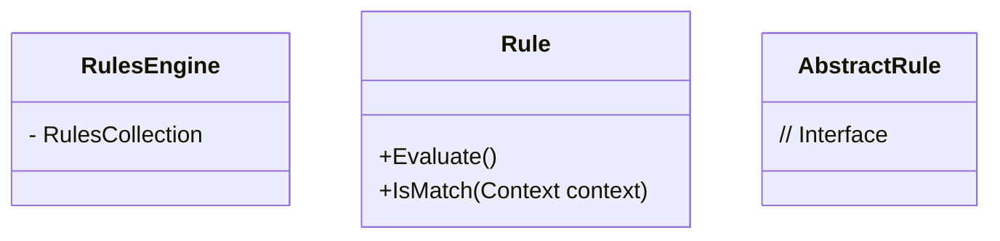

# Rules Engine Pattern

## Overview

The Rules Engine Pattern is a behavioral design pattern that allows developers to define and manage complex business rules outside of the main application code. It encapsulates the logic for evaluating rules and applying them to data, making it easier to modify and maintain rules without affecting the underlying code.

## Key Components

- **Rules Engine**: Processes a set of rules and applies them to generate a result
- **Rules**: Describe conditions and may calculate values
- **Input**: The data to which rules are applied

## Benefits

1. Improved maintainability
2. Increased flexibility
3. Enhanced reusability
4. Clearer separation of concerns
5. Centralized management of business logic

## Example Scenario

An online shopping system with multiple discount rules:
- 25% off books in the Technology category
- 20% off books from Publisher A
- 15% off books released this month
- 30% off for newsletter subscribers
- Free shipping with discount code FREESHIP

## Class Structure

## Refactoring Guidance

1. Extract individual `if` conditions into methods
2. Convert methods into rules
3. Create a Rules Engine to evaluate rules
4. Replace old `if` stack with a Rules Engine call

## Guidance for Creating Rules

- Follow Single Responsibility Principle
- Keep rules simple
- Rules can be ordered, filtered, or aggregated
- Rules engine determines rule processing logic

## Related Patterns

- [Specification Pattern](specification.md)
- [Chain of Responsibility](chain-of-responsibility.md)
- [Strategy Pattern](strategy.md)
- Command Pattern
- [Mediator Pattern](mediator.md)
- [Observer Pattern](observer.md)

## Frequently Asked Questions

**Q: Is it violating Open Closed principle if the rule returns a value with extra information?**
A: No, this is generally acceptable. If the engine becomes too complex, consider creating types representing