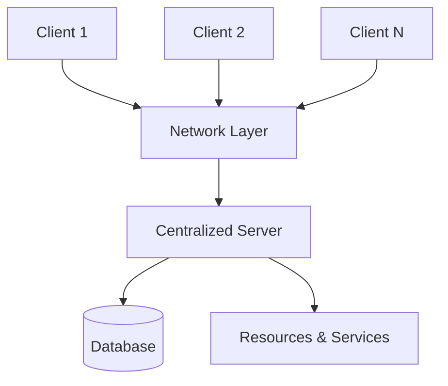
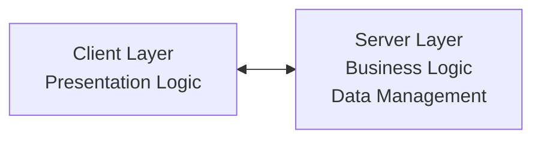
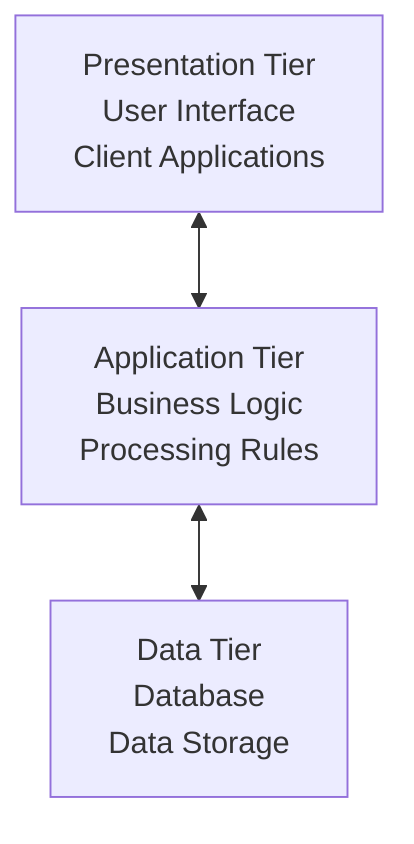
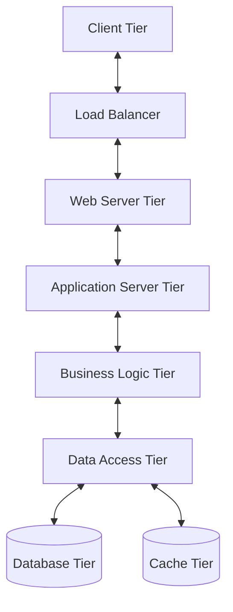

# Client-Server Architecture

## Overview

**Client-server architecture is a computing model in which multiple clients (users or devices) interact with a centralized server to access data, resources, or services.** This fundamental architectural pattern forms the backbone of most modern distributed systems, from web applications to enterprise software.

## Core Concepts

### Key Components



#### 1. Client
- **Definition**: Device, application, or process that initiates requests for services
- **Characteristics**: Lightweight, user-facing, request initiator
- **Examples**: Web browsers, mobile apps, desktop applications

#### 2. Server
- **Definition**: Powerful computer that processes requests and manages resources
- **Characteristics**: High-performance, centralized, resource provider
- **Examples**: Web servers, database servers, application servers

#### 3. Network
- **Definition**: Communication medium enabling client-server interaction
- **Protocols**: HTTP/HTTPS, TCP/IP, WebSocket, gRPC

### Request-Response Mechanism

```javascript
// Client-side request example
class ApiClient {
  async getUserData(userId) {
    try {
      const response = await fetch(`/api/users/${userId}`, {
        method: 'GET',
        headers: {
          'Authorization': 'Bearer ' + this.token,
          'Content-Type': 'application/json'
        }
      });
      
      if (!response.ok) {
        throw new Error(`HTTP error! status: ${response.status}`);
      }
      
      return await response.json();
    } catch (error) {
      console.error('Request failed:', error);
      throw error;
    }
  }
}

// Server-side handler example
class UserController {
  async getUserData(req, res) {
    try {
      const { userId } = req.params;
      
      // Validate request
      if (!userId) {
        return res.status(400).json({ error: 'User ID required' });
      }
      
      // Process request
      const user = await this.userService.findById(userId);
      
      if (!user) {
        return res.status(404).json({ error: 'User not found' });
      }
      
      // Send response
      res.status(200).json({
        data: user,
        timestamp: new Date().toISOString()
      });
    } catch (error) {
      res.status(500).json({ error: 'Internal server error' });
    }
  }
}
```

## Types of Client-Server Architectures

### 1. Two-Tier Architecture



#### Characteristics
- Direct client-server interaction
- Server handles both application logic and data management
- Simple deployment and maintenance

#### Implementation Example

```javascript
// Two-tier architecture example
class DatabaseClient {
  constructor(connectionString) {
    this.db = new Database(connectionString);
  }
  
  async executeQuery(sql, params) {
    // Direct database interaction from client
    return await this.db.query(sql, params);
  }
  
  async getCustomers() {
    return await this.executeQuery(
      'SELECT * FROM customers WHERE active = ?', 
      [true]
    );
  }
}

// Client directly handles business logic
class CustomerApp {
  constructor() {
    this.dbClient = new DatabaseClient(DB_CONNECTION);
  }
  
  async calculateCustomerTotal(customerId) {
    const orders = await this.dbClient.executeQuery(
      'SELECT * FROM orders WHERE customer_id = ?', 
      [customerId]
    );
    
    // Business logic in client
    return orders.reduce((total, order) => total + order.amount, 0);
  }
}
```

#### Use Cases
- Small-scale applications
- Desktop database applications
- Simple web applications with limited users

### 2. Three-Tier Architecture



#### Characteristics
- Separates presentation, business logic, and data layers
- Improved scalability and maintainability
- Enhanced security through layer isolation

#### Implementation Example

```javascript
// Presentation Layer (Client)
class CustomerUI {
  constructor(apiService) {
    this.api = apiService;
  }
  
  async displayCustomers() {
    try {
      const customers = await this.api.getCustomers();
      this.renderCustomerList(customers);
    } catch (error) {
      this.showErrorMessage(error.message);
    }
  }
}

// Application Layer (Business Logic)
class CustomerService {
  constructor(repository) {
    this.repository = repository;
  }
  
  async getActiveCustomers() {
    const customers = await this.repository.findAll();
    
    // Business logic
    return customers
      .filter(customer => customer.isActive)
      .map(customer => this.enrichCustomerData(customer));
  }
  
  enrichCustomerData(customer) {
    return {
      ...customer,
      displayName: `${customer.firstName} ${customer.lastName}`,
      membershipLevel: this.calculateMembershipLevel(customer),
      lastOrderDate: this.formatDate(customer.lastOrder)
    };
  }
  
  calculateMembershipLevel(customer) {
    if (customer.totalSpent > 10000) return 'Platinum';
    if (customer.totalSpent > 5000) return 'Gold';
    if (customer.totalSpent > 1000) return 'Silver';
    return 'Bronze';
  }
}

// Data Layer (Repository)
class CustomerRepository {
  constructor(database) {
    this.db = database;
  }
  
  async findAll() {
    return await this.db.query('SELECT * FROM customers');
  }
  
  async findById(id) {
    const result = await this.db.query(
      'SELECT * FROM customers WHERE id = ?', 
      [id]
    );
    return result[0];
  }
  
  async save(customer) {
    if (customer.id) {
      return await this.update(customer);
    } else {
      return await this.create(customer);
    }
  }
}
```

### 3. N-Tier Architecture



#### Implementation Example

```javascript
// Load Balancer Tier
class LoadBalancer {
  constructor(servers) {
    this.servers = servers;
    this.currentIndex = 0;
  }
  
  getNextServer() {
    const server = this.servers[this.currentIndex];
    this.currentIndex = (this.currentIndex + 1) % this.servers.length;
    return server;
  }
  
  async forwardRequest(request) {
    const server = this.getNextServer();
    return await server.handleRequest(request);
  }
}

// Caching Tier
class CacheService {
  constructor(redisClient) {
    this.redis = redisClient;
    this.defaultTTL = 3600; // 1 hour
  }
  
  async get(key) {
    const value = await this.redis.get(key);
    return value ? JSON.parse(value) : null;
  }
  
  async set(key, value, ttl = this.defaultTTL) {
    await this.redis.setex(key, ttl, JSON.stringify(value));
  }
  
  async invalidate(pattern) {
    const keys = await this.redis.keys(pattern);
    if (keys.length > 0) {
      await this.redis.del(...keys);
    }
  }
}

// Business Logic Tier
class OrderProcessingService {
  constructor(orderRepo, inventoryService, paymentService, notificationService) {
    this.orderRepo = orderRepo;
    this.inventoryService = inventoryService;
    this.paymentService = paymentService;
    this.notificationService = notificationService;
  }
  
  async processOrder(orderData) {
    try {
      // Validate inventory
      const inventoryCheck = await this.inventoryService.checkAvailability(
        orderData.items
      );
      
      if (!inventoryCheck.available) {
        throw new Error('Insufficient inventory');
      }
      
      // Process payment
      const payment = await this.paymentService.processPayment({
        amount: orderData.total,
        paymentMethod: orderData.paymentMethod
      });
      
      // Create order
      const order = await this.orderRepo.create({
        ...orderData,
        paymentId: payment.id,
        status: 'confirmed'
      });
      
      // Update inventory
      await this.inventoryService.reserveItems(orderData.items);
      
      // Send notifications
      await this.notificationService.sendOrderConfirmation(order);
      
      return order;
    } catch (error) {
      // Rollback operations
      await this.rollbackOrder(orderData);
      throw error;
    }
  }
}
```

## Benefits and Advantages

### 1. Centralized Resource Management

```javascript
// Centralized configuration management
class ConfigurationServer {
  constructor() {
    this.configs = new Map();
    this.subscribers = new Set();
  }
  
  setConfig(key, value) {
    this.configs.set(key, value);
    
    // Notify all clients of configuration change
    this.notifySubscribers(key, value);
  }
  
  getConfig(key) {
    return this.configs.get(key);
  }
  
  subscribe(client) {
    this.subscribers.add(client);
  }
  
  notifySubscribers(key, value) {
    this.subscribers.forEach(client => {
      client.onConfigUpdate(key, value);
    });
  }
}
```

### 2. Enhanced Scalability

```javascript
// Horizontal scaling implementation
class ScalableServer {
  constructor() {
    this.instances = [];
    this.loadBalancer = new LoadBalancer();
  }
  
  addInstance(serverInstance) {
    this.instances.push(serverInstance);
    this.loadBalancer.addServer(serverInstance);
  }
  
  removeInstance(serverInstance) {
    const index = this.instances.indexOf(serverInstance);
    if (index > -1) {
      this.instances.splice(index, 1);
      this.loadBalancer.removeServer(serverInstance);
    }
  }
  
  async autoScale() {
    const metrics = await this.getPerformanceMetrics();
    
    if (metrics.cpuUsage > 80 && metrics.responseTime > 1000) {
      await this.scaleUp();
    } else if (metrics.cpuUsage < 20 && this.instances.length > 1) {
      await this.scaleDown();
    }
  }
}
```

### 3. Improved Security

```javascript
// Centralized authentication and authorization
class SecurityService {
  constructor() {
    this.tokenStore = new TokenStore();
    this.permissions = new PermissionManager();
  }
  
  async authenticate(credentials) {
    const user = await this.validateCredentials(credentials);
    
    if (!user) {
      throw new Error('Invalid credentials');
    }
    
    const token = this.generateJWT(user);
    await this.tokenStore.store(token, user.id);
    
    return { token, user };
  }
  
  async authorize(token, resource, action) {
    const userId = await this.validateToken(token);
    
    if (!userId) {
      throw new Error('Invalid token');
    }
    
    const hasPermission = await this.permissions.check(
      userId, 
      resource, 
      action
    );
    
    if (!hasPermission) {
      throw new Error('Insufficient permissions');
    }
    
    return true;
  }
}
```

## Challenges and Solutions

### 1. Single Point of Failure

```javascript
// High availability solution with failover
class HighAvailabilityCluster {
  constructor() {
    this.primaryServer = null;
    this.secondaryServers = [];
    this.healthChecker = new HealthChecker();
  }
  
  async setupFailover() {
    setInterval(async () => {
      const isHealthy = await this.healthChecker.check(this.primaryServer);
      
      if (!isHealthy) {
        await this.failover();
      }
    }, 5000); // Check every 5 seconds
  }
  
  async failover() {
    // Promote secondary to primary
    const newPrimary = this.secondaryServers.shift();
    
    if (newPrimary) {
      this.primaryServer = newPrimary;
      await this.updateDNS(newPrimary.ip);
      
      // Start replication to remaining secondaries
      await this.startReplication();
    }
  }
}
```

### 2. Performance Bottlenecks

```javascript
// Connection pooling and caching
class ConnectionPool {
  constructor(maxConnections = 100) {
    this.maxConnections = maxConnections;
    this.availableConnections = [];
    this.activeConnections = new Set();
  }
  
  async getConnection() {
    if (this.availableConnections.length > 0) {
      const connection = this.availableConnections.pop();
      this.activeConnections.add(connection);
      return connection;
    }
    
    if (this.activeConnections.size < this.maxConnections) {
      const connection = await this.createConnection();
      this.activeConnections.add(connection);
      return connection;
    }
    
    // Wait for available connection
    return await this.waitForConnection();
  }
  
  releaseConnection(connection) {
    this.activeConnections.delete(connection);
    this.availableConnections.push(connection);
  }
}

// Request caching
class RequestCache {
  constructor() {
    this.cache = new Map();
    this.ttl = 300000; // 5 minutes
  }
  
  async get(key) {
    const entry = this.cache.get(key);
    
    if (entry && Date.now() - entry.timestamp < this.ttl) {
      return entry.data;
    }
    
    this.cache.delete(key);
    return null;
  }
  
  set(key, data) {
    this.cache.set(key, {
      data,
      timestamp: Date.now()
    });
  }
}
```

### 3. Network Latency Optimization

```javascript
// Connection optimization strategies
class OptimizedClient {
  constructor() {
    this.connection = null;
    this.requestQueue = [];
    this.isConnected = false;
  }
  
  async connect() {
    this.connection = new WebSocket('wss://api.example.com');
    
    this.connection.onopen = () => {
      this.isConnected = true;
      this.processQueuedRequests();
    };
    
    this.connection.onclose = () => {
      this.isConnected = false;
      setTimeout(() => this.reconnect(), 1000);
    };
  }
  
  async sendRequest(data) {
    if (!this.isConnected) {
      this.requestQueue.push(data);
      return;
    }
    
    // Batch multiple requests
    const batch = [data, ...this.requestQueue.splice(0, 9)]; // Max 10 per batch
    this.connection.send(JSON.stringify({ batch }));
  }
  
  processQueuedRequests() {
    while (this.requestQueue.length > 0) {
      const request = this.requestQueue.shift();
      this.sendRequest(request);
    }
  }
}
```

## Security Considerations

### Authentication and Authorization

```javascript
// OAuth 2.0 implementation
class OAuth2Server {
  constructor() {
    this.clients = new Map();
    this.tokens = new Map();
  }
  
  async authorizeClient(clientId, redirectUri, scope) {
    const client = this.clients.get(clientId);
    
    if (!client || !client.redirectUris.includes(redirectUri)) {
      throw new Error('Invalid client or redirect URI');
    }
    
    const authCode = this.generateAuthCode();
    
    return {
      authCode,
      redirectUri: `${redirectUri}?code=${authCode}&state=${Date.now()}`
    };
  }
  
  async exchangeToken(authCode, clientId, clientSecret) {
    if (!this.validateClient(clientId, clientSecret)) {
      throw new Error('Invalid client credentials');
    }
    
    const accessToken = this.generateAccessToken();
    const refreshToken = this.generateRefreshToken();
    
    this.tokens.set(accessToken, {
      clientId,
      scope: 'read write',
      expiresAt: Date.now() + 3600000 // 1 hour
    });
    
    return {
      accessToken,
      refreshToken,
      tokenType: 'Bearer',
      expiresIn: 3600
    };
  }
}
```

### Data Encryption

```javascript
// End-to-end encryption
class EncryptionService {
  constructor() {
    this.algorithm = 'aes-256-gcm';
  }
  
  encrypt(data, key) {
    const iv = crypto.randomBytes(16);
    const cipher = crypto.createCipher(this.algorithm, key, iv);
    
    let encrypted = cipher.update(data, 'utf8', 'hex');
    encrypted += cipher.final('hex');
    
    const authTag = cipher.getAuthTag();
    
    return {
      encrypted,
      iv: iv.toString('hex'),
      authTag: authTag.toString('hex')
    };
  }
  
  decrypt(encryptedData, key) {
    const decipher = crypto.createDecipher(
      this.algorithm, 
      key, 
      Buffer.from(encryptedData.iv, 'hex')
    );
    
    decipher.setAuthTag(Buffer.from(encryptedData.authTag, 'hex'));
    
    let decrypted = decipher.update(encryptedData.encrypted, 'hex', 'utf8');
    decrypted += decipher.final('utf8');
    
    return decrypted;
  }
}
```

## Real-World Implementation Examples

### Web Application Architecture

```javascript
// Modern web application with microservices
class WebApplicationServer {
  constructor() {
    this.express = express();
    this.services = {
      user: new UserService(),
      order: new OrderService(),
      inventory: new InventoryService(),
      notification: new NotificationService()
    };
    
    this.setupMiddleware();
    this.setupRoutes();
  }
  
  setupMiddleware() {
    this.express.use(helmet()); // Security headers
    this.express.use(cors()); // Cross-origin requests
    this.express.use(express.json()); // JSON parsing
    this.express.use(rateLimiter); // Rate limiting
    this.express.use(authMiddleware); // Authentication
  }
  
  setupRoutes() {
    // User routes
    this.express.get('/api/users/:id', async (req, res) => {
      try {
        const user = await this.services.user.getById(req.params.id);
        res.json({ data: user });
      } catch (error) {
        res.status(500).json({ error: error.message });
      }
    });
    
    // Order routes
    this.express.post('/api/orders', async (req, res) => {
      try {
        const order = await this.services.order.create(req.body);
        res.status(201).json({ data: order });
      } catch (error) {
        res.status(400).json({ error: error.message });
      }
    });
  }
}
```

### Database Server Architecture

```javascript
// Database connection and query optimization
class DatabaseServer {
  constructor() {
    this.connectionPool = new ConnectionPool();
    this.queryCache = new QueryCache();
    this.replicationManager = new ReplicationManager();
  }
  
  async executeQuery(sql, params, options = {}) {
    const cacheKey = this.generateCacheKey(sql, params);
    
    // Check cache first
    if (!options.skipCache) {
      const cachedResult = await this.queryCache.get(cacheKey);
      if (cachedResult) {
        return cachedResult;
      }
    }
    
    // Get connection from pool
    const connection = await this.connectionPool.getConnection();
    
    try {
      const result = await connection.query(sql, params);
      
      // Cache SELECT queries
      if (sql.trim().toLowerCase().startsWith('select')) {
        await this.queryCache.set(cacheKey, result, 300); // 5 min cache
      }
      
      // Replicate write operations
      if (this.isWriteOperation(sql)) {
        await this.replicationManager.replicate(sql, params);
      }
      
      return result;
    } finally {
      this.connectionPool.releaseConnection(connection);
    }
  }
}
```

## Performance Optimization Strategies

### 1. Load Balancing

```javascript
// Advanced load balancing algorithms
class LoadBalancer {
  constructor() {
    this.servers = [];
    this.algorithm = 'roundRobin';
    this.healthCheck = new HealthChecker();
  }
  
  addServer(server) {
    this.servers.push({
      ...server,
      weight: server.weight || 1,
      connections: 0,
      responseTime: 0
    });
  }
  
  async selectServer(request) {
    const healthyServers = await this.getHealthyServers();
    
    switch (this.algorithm) {
      case 'roundRobin':
        return this.roundRobinSelection(healthyServers);
      
      case 'leastConnections':
        return this.leastConnectionsSelection(healthyServers);
      
      case 'weightedRoundRobin':
        return this.weightedRoundRobinSelection(healthyServers);
      
      case 'responseTime':
        return this.responseTimeSelection(healthyServers);
      
      default:
        return healthyServers[0];
    }
  }
  
  leastConnectionsSelection(servers) {
    return servers.reduce((min, server) => 
      server.connections < min.connections ? server : min
    );
  }
  
  responseTimeSelection(servers) {
    return servers.reduce((fastest, server) => 
      server.responseTime < fastest.responseTime ? server : fastest
    );
  }
}
```

### 2. Caching Strategies

```javascript
// Multi-level caching implementation
class MultiLevelCache {
  constructor() {
    this.l1Cache = new MemoryCache(1000); // 1000 items max
    this.l2Cache = new RedisCache();
    this.l3Cache = new DatabaseCache();
  }
  
  async get(key) {
    // L1 Cache (Memory)
    let value = await this.l1Cache.get(key);
    if (value) return value;
    
    // L2 Cache (Redis)
    value = await this.l2Cache.get(key);
    if (value) {
      await this.l1Cache.set(key, value);
      return value;
    }
    
    // L3 Cache (Database)
    value = await this.l3Cache.get(key);
    if (value) {
      await this.l1Cache.set(key, value);
      await this.l2Cache.set(key, value);
      return value;
    }
    
    return null;
  }
  
  async set(key, value, ttl) {
    await Promise.all([
      this.l1Cache.set(key, value, ttl),
      this.l2Cache.set(key, value, ttl),
      this.l3Cache.set(key, value, ttl)
    ]);
  }
}
```

## Best Practices

### 1. API Design

```javascript
// RESTful API implementation
class RESTfulAPI {
  constructor() {
    this.router = express.Router();
    this.setupRoutes();
  }
  
  setupRoutes() {
    // Resource-based URLs
    this.router.get('/users', this.getUsers.bind(this));
    this.router.get('/users/:id', this.getUser.bind(this));
    this.router.post('/users', this.createUser.bind(this));
    this.router.put('/users/:id', this.updateUser.bind(this));
    this.router.delete('/users/:id', this.deleteUser.bind(this));
  }
  
  async getUsers(req, res) {
    try {
      const { page = 1, limit = 10, sort = 'createdAt' } = req.query;
      
      const users = await this.userService.getUsers({
        page: parseInt(page),
        limit: parseInt(limit),
        sort
      });
      
      res.json({
        data: users.items,
        pagination: {
          page: users.page,
          limit: users.limit,
          total: users.total,
          pages: Math.ceil(users.total / users.limit)
        }
      });
    } catch (error) {
      this.handleError(res, error);
    }
  }
  
  handleError(res, error) {
    if (error.name === 'ValidationError') {
      return res.status(400).json({ error: error.message });
    }
    
    if (error.name === 'NotFoundError') {
      return res.status(404).json({ error: 'Resource not found' });
    }
    
    res.status(500).json({ error: 'Internal server error' });
  }
}
```

### 2. Error Handling and Resilience

```javascript
// Circuit breaker pattern
class CircuitBreaker {
  constructor(options = {}) {
    this.failureThreshold = options.failureThreshold || 5;
    this.timeout = options.timeout || 60000;
    this.monitoringPeriod = options.monitoringPeriod || 10000;
    
    this.state = 'CLOSED'; // CLOSED, OPEN, HALF_OPEN
    this.failureCount = 0;
    this.lastFailureTime = null;
  }
  
  async execute(operation) {
    if (this.state === 'OPEN') {
      if (Date.now() - this.lastFailureTime >= this.timeout) {
        this.state = 'HALF_OPEN';
      } else {
        throw new Error('Circuit breaker is OPEN');
      }
    }
    
    try {
      const result = await operation();
      this.onSuccess();
      return result;
    } catch (error) {
      this.onFailure();
      throw error;
    }
  }
  
  onSuccess() {
    this.failureCount = 0;
    this.state = 'CLOSED';
  }
  
  onFailure() {
    this.failureCount++;
    this.lastFailureTime = Date.now();
    
    if (this.failureCount >= this.failureThreshold) {
      this.state = 'OPEN';
    }
  }
}
```

## When to Use Client-Server Architecture

### Ideal Scenarios

1. **Centralized Data Management**
   - Applications requiring consistent data access
   - Systems with complex business rules
   - Multi-user environments with shared resources

2. **Security-Critical Applications**
   - Financial systems
   - Healthcare applications
   - Government systems

3. **High Availability Requirements**
   - E-commerce platforms
   - Social media applications
   - Enterprise software

### Implementation Decision Matrix

```javascript
const architectureDecision = {
  evaluateClientServer: (requirements) => {
    const factors = {
      dataConsistency: requirements.needsStrongConsistency,
      userCount: requirements.expectedUsers > 100,
      security: requirements.securityLevel === 'high',
      scalability: requirements.needsHorizontalScaling,
      maintenance: requirements.prefersCentralizedUpdates
    };
    
    const score = Object.values(factors).filter(Boolean).length;
    
    return {
      recommended: score >= 3,
      score,
      factors,
      alternatives: score < 3 ? ['peer-to-peer', 'serverless'] : []
    };
  }
};
```

## Key Takeaways

1. **Foundation of Modern Computing**: Client-server architecture forms the backbone of most distributed systems
2. **Scalability Through Tiers**: Multi-tier architectures enable better scalability and maintainability
3. **Centralized Control**: Provides better security, consistency, and resource management
4. **Performance Considerations**: Requires careful attention to bottlenecks and single points of failure
5. **Evolution Ready**: Can evolve into microservices or other modern patterns while maintaining core principles

Client-server architecture remains a fundamental and versatile pattern that continues to power the majority of modern applications, from simple web services to complex enterprise systems.