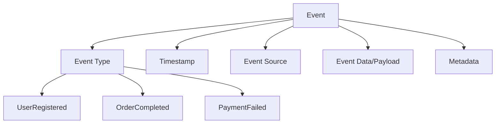

# Event-Driven Architecture

## Overview

**Event-driven architecture (EDA) is a software design pattern where components communicate through the production and consumption of events.** In this paradigm, events represent significant changes in state or important occurrences within a system, and components react to these events asynchronously rather than through direct synchronous calls.

## Core Concepts

### What is an Event?



An event is a notification that something significant has happened in the system:

```javascript
// Example event structure
class Event {
  constructor(type, source, data, metadata = {}) {
    this.id = generateEventId();
    this.type = type;
    this.source = source;
    this.timestamp = new Date().toISOString();
    this.data = data;
    this.metadata = {
      version: '1.0',
      correlationId: generateCorrelationId(),
      ...metadata
    };
  }
}

// Event examples
const userRegisteredEvent = new Event(
  'UserRegistered',
  'user-service',
  {
    userId: '12345',
    email: 'user@example.com',
    name: 'John Doe',
    registrationDate: '2024-01-15T10:30:00Z'
  }
);

const orderCompletedEvent = new Event(
  'OrderCompleted',
  'order-service',
  {
    orderId: 'ORD-789',
    userId: '12345',
    totalAmount: 99.99,
    items: [
      { productId: 'PROD-123', quantity: 2, price: 49.99 }
    ],
    completedAt: '2024-01-15T11:45:00Z'
  }
);
```

### Key Components

#### 1. Event Producers
Components that generate and publish events:

```javascript
class OrderService {
  constructor(eventBus) {
    this.eventBus = eventBus;
  }
  
  async createOrder(orderData) {
    try {
      // Create the order
      const order = await this.orderRepository.create(orderData);
      
      // Publish event
      const event = new Event(
        'OrderCreated',
        'order-service',
        {
          orderId: order.id,
          userId: order.userId,
          items: order.items,
          totalAmount: order.totalAmount,
          createdAt: order.createdAt
        }
      );
      
      await this.eventBus.publish('orders', event);
      
      return order;
    } catch (error) {
      // Publish failure event
      const errorEvent = new Event(
        'OrderCreationFailed',
        'order-service',
        {
          orderData,
          error: error.message,
          failedAt: new Date().toISOString()
        }
      );
      
      await this.eventBus.publish('orders.errors', errorEvent);
      throw error;
    }
  }
}
```

#### 2. Event Consumers
Components that subscribe to and process events:

```javascript
class InventoryService {
  constructor(eventBus) {
    this.eventBus = eventBus;
    this.setupEventHandlers();
  }
  
  setupEventHandlers() {
    this.eventBus.subscribe('orders', this.handleOrderEvents.bind(this));
  }
  
  async handleOrderEvents(event) {
    switch (event.type) {
      case 'OrderCreated':
        await this.reserveInventory(event);
        break;
      case 'OrderCancelled':
        await this.releaseInventory(event);
        break;
      default:
        console.log(`Unhandled event type: ${event.type}`);
    }
  }
  
  async reserveInventory(orderCreatedEvent) {
    const { orderId, items } = orderCreatedEvent.data;
    
    try {
      for (const item of items) {
        await this.inventoryRepository.reserveItem(
          item.productId,
          item.quantity,
          orderId
        );
      }
      
      // Publish success event
      const event = new Event(
        'InventoryReserved',
        'inventory-service',
        {
          orderId,
          items,
          reservedAt: new Date().toISOString()
        },
        { correlationId: orderCreatedEvent.metadata.correlationId }
      );
      
      await this.eventBus.publish('inventory', event);
    } catch (error) {
      // Publish failure event
      const errorEvent = new Event(
        'InventoryReservationFailed',
        'inventory-service',
        {
          orderId,
          items,
          error: error.message,
          failedAt: new Date().toISOString()
        },
        { correlationId: orderCreatedEvent.metadata.correlationId }
      );
      
      await this.eventBus.publish('inventory.errors', errorEvent);
    }
  }
}
```

#### 3. Event Bus/Broker
The infrastructure that routes events between producers and consumers:

```javascript
class EventBus {
  constructor() {
    this.subscribers = new Map();
    this.eventStore = new EventStore();
  }
  
  async publish(topic, event) {
    // Store event for replay/audit
    await this.eventStore.save(event);
    
    // Get subscribers for topic
    const topicSubscribers = this.subscribers.get(topic) || [];
    
    // Deliver to all subscribers
    const deliveryPromises = topicSubscribers.map(async subscriber => {
      try {
        await subscriber.handler(event);
        await this.recordDeliverySuccess(subscriber, event);
      } catch (error) {
        await this.handleDeliveryFailure(subscriber, event, error);
      }
    });
    
    await Promise.allSettled(deliveryPromises);
  }
  
  subscribe(topic, handler, options = {}) {
    if (!this.subscribers.has(topic)) {
      this.subscribers.set(topic, []);
    }
    
    const subscriber = {
      id: generateSubscriberId(),
      handler,
      options,
      createdAt: new Date().toISOString()
    };
    
    this.subscribers.get(topic).push(subscriber);
    
    return subscriber.id;
  }
  
  async handleDeliveryFailure(subscriber, event, error) {
    console.error(`Event delivery failed for subscriber ${subscriber.id}:`, error);
    
    // Implement retry logic
    if (subscriber.options.retryPolicy) {
      await this.scheduleRetry(subscriber, event);
    }
    
    // Send to dead letter queue if max retries exceeded
    if (this.isMaxRetriesExceeded(subscriber, event)) {
      await this.sendToDeadLetterQueue(event, error);
    }
  }
}
```

## Event Patterns

### 1. Event Notification

Simple notification that something has happened:

```javascript
class UserService {
  async updateUserProfile(userId, updates) {
    const user = await this.userRepository.update(userId, updates);
    
    // Notify other services of the change
    const event = new Event(
      'UserProfileUpdated',
      'user-service',
      {
        userId,
        updatedFields: Object.keys(updates),
        updatedAt: new Date().toISOString()
      }
    );
    
    await this.eventBus.publish('users', event);
    return user;
  }
}

// Consumer examples
class RecommendationService {
  async handleUserProfileUpdated(event) {
    const { userId, updatedFields } = event.data;
    
    // Update recommendation model if relevant fields changed
    if (updatedFields.includes('preferences') || updatedFields.includes('location')) {
      await this.updateUserRecommendations(userId);
    }
  }
}

class AnalyticsService {
  async handleUserProfileUpdated(event) {
    // Track user engagement
    await this.trackUserActivity({
      userId: event.data.userId,
      action: 'profile_updated',
      timestamp: event.timestamp
    });
  }
}
```

### 2. Event-Carried State Transfer

Events carry complete state information:

```javascript
class ProductService {
  async updateProduct(productId, updates) {
    const product = await this.productRepository.update(productId, updates);
    
    // Carry full product state in event
    const event = new Event(
      'ProductUpdated',
      'product-service',
      {
        productId: product.id,
        productData: {
          name: product.name,
          description: product.description,
          price: product.price,
          category: product.category,
          inStock: product.inStock,
          updatedAt: product.updatedAt
        },
        changesSummary: {
          fieldsChanged: Object.keys(updates),
          previousValues: this.extractPreviousValues(product, updates)
        }
      }
    );
    
    await this.eventBus.publish('products', event);
    return product;
  }
}

// Consumers can update local copies without additional API calls
class CatalogService {
  async handleProductUpdated(event) {
    const { productId, productData } = event.data;
    
    // Update local product cache/view
    await this.productCache.set(productId, productData);
    
    // Update search index
    await this.searchIndex.updateProduct(productId, productData);
  }
}
```

### 3. Event Sourcing

Store events as the source of truth:

```javascript
class EventSourcingRepository {
  constructor(eventStore) {
    this.eventStore = eventStore;
  }
  
  async saveEvents(aggregateId, events, expectedVersion) {
    // Optimistic concurrency control
    const currentVersion = await this.eventStore.getVersion(aggregateId);
    
    if (currentVersion !== expectedVersion) {
      throw new ConcurrencyError('Aggregate version mismatch');
    }
    
    // Save events atomically
    await this.eventStore.saveEvents(aggregateId, events, currentVersion + 1);
  }
  
  async loadAggregate(aggregateId) {
    const events = await this.eventStore.getEvents(aggregateId);
    
    // Replay events to rebuild state
    let aggregate = new BankAccount(aggregateId);
    
    for (const event of events) {
      aggregate = this.applyEvent(aggregate, event);
    }
    
    return aggregate;
  }
  
  applyEvent(aggregate, event) {
    switch (event.type) {
      case 'AccountOpened':
        return aggregate.apply(event.data);
      case 'MoneyDeposited':
        return aggregate.apply(event.data);
      case 'MoneyWithdrawn':
        return aggregate.apply(event.data);
      default:
        throw new Error(`Unknown event type: ${event.type}`);
    }
  }
}

class BankAccount {
  constructor(accountId) {
    this.accountId = accountId;
    this.balance = 0;
    this.isOpen = false;
    this.version = 0;
    this.uncommittedEvents = [];
  }
  
  openAccount(initialDeposit) {
    if (this.isOpen) {
      throw new Error('Account is already open');
    }
    
    const event = new Event(
      'AccountOpened',
      'bank-account',
      {
        accountId: this.accountId,
        initialDeposit,
        openedAt: new Date().toISOString()
      }
    );
    
    this.applyEvent(event);
    this.uncommittedEvents.push(event);
  }
  
  deposit(amount) {
    if (!this.isOpen) {
      throw new Error('Account is not open');
    }
    
    if (amount <= 0) {
      throw new Error('Deposit amount must be positive');
    }
    
    const event = new Event(
      'MoneyDeposited',
      'bank-account',
      {
        accountId: this.accountId,
        amount,
        newBalance: this.balance + amount,
        depositedAt: new Date().toISOString()
      }
    );
    
    this.applyEvent(event);
    this.uncommittedEvents.push(event);
  }
  
  withdraw(amount) {
    if (!this.isOpen) {
      throw new Error('Account is not open');
    }
    
    if (amount <= 0) {
      throw new Error('Withdrawal amount must be positive');
    }
    
    if (this.balance < amount) {
      throw new Error('Insufficient funds');
    }
    
    const event = new Event(
      'MoneyWithdrawn',
      'bank-account',
      {
        accountId: this.accountId,
        amount,
        newBalance: this.balance - amount,
        withdrawnAt: new Date().toISOString()
      }
    );
    
    this.applyEvent(event);
    this.uncommittedEvents.push(event);
  }
  
  applyEvent(event) {
    switch (event.type) {
      case 'AccountOpened':
        this.isOpen = true;
        this.balance = event.data.initialDeposit;
        break;
      case 'MoneyDeposited':
        this.balance += event.data.amount;
        break;
      case 'MoneyWithdrawn':
        this.balance -= event.data.amount;
        break;
    }
    this.version++;
  }
}
```

## Implementation Technologies

### 1. Apache Kafka

```javascript
const { Kafka } = require('kafkajs');

class KafkaEventBus {
  constructor() {
    this.kafka = Kafka({
      clientId: 'event-driven-app',
      brokers: ['localhost:9092']
    });
    
    this.producer = this.kafka.producer();
    this.consumers = new Map();
  }
  
  async initialize() {
    await this.producer.connect();
  }
  
  async publish(topic, event) {
    await this.producer.send({
      topic,
      messages: [{
        key: event.data.aggregateId || event.id,
        value: JSON.stringify(event),
        headers: {
          eventType: event.type,
          source: event.source,
          timestamp: event.timestamp
        }
      }]
    });
  }
  
  async subscribe(topic, groupId, handler) {
    const consumer = this.kafka.consumer({ groupId });
    await consumer.connect();
    await consumer.subscribe({ topic });
    
    await consumer.run({
      eachMessage: async ({ topic, partition, message }) => {
        try {
          const event = JSON.parse(message.value.toString());
          await handler(event);
          
          // Commit offset after successful processing
          await consumer.commitOffsets([{
            topic,
            partition,
            offset: (parseInt(message.offset) + 1).toString()
          }]);
        } catch (error) {
          console.error('Event processing failed:', error);
          // Implement error handling strategy
          await this.handleProcessingError(message, error);
        }
      }
    });
    
    this.consumers.set(`${topic}-${groupId}`, consumer);
  }
  
  async handleProcessingError(message, error) {
    // Send to dead letter topic
    await this.producer.send({
      topic: 'dead-letter-queue',
      messages: [{
        key: message.key,
        value: message.value,
        headers: {
          ...message.headers,
          'error-message': error.message,
          'failed-at': new Date().toISOString(),
          'original-topic': message.topic
        }
      }]
    });
  }
}
```

### 2. RabbitMQ

```javascript
const amqp = require('amqplib');

class RabbitMQEventBus {
  constructor() {
    this.connection = null;
    this.channel = null;
  }
  
  async initialize() {
    this.connection = await amqp.connect('amqp://localhost');
    this.channel = await this.connection.createChannel();
    
    // Setup exchange for event routing
    await this.channel.assertExchange('events', 'topic', { durable: true });
  }
  
  async publish(routingKey, event) {
    const message = Buffer.from(JSON.stringify(event));
    
    await this.channel.publish('events', routingKey, message, {
      persistent: true,
      headers: {
        eventType: event.type,
        source: event.source,
        timestamp: event.timestamp
      }
    });
  }
  
  async subscribe(pattern, handler, options = {}) {
    const queueName = options.queueName || '';
    const queue = await this.channel.assertQueue(queueName, {
      durable: true,
      exclusive: !queueName // Exclusive if no queue name provided
    });
    
    await this.channel.bindQueue(queue.queue, 'events', pattern);
    
    await this.channel.consume(queue.queue, async (message) => {
      if (message) {
        try {
          const event = JSON.parse(message.content.toString());
          await handler(event);
          
          // Acknowledge successful processing
          this.channel.ack(message);
        } catch (error) {
          console.error('Event processing failed:', error);
          
          // Reject and optionally requeue
          this.channel.nack(message, false, options.requeue !== false);
        }
      }
    });
  }
}
```

### 3. AWS EventBridge

```javascript
const AWS = require('aws-sdk');

class EventBridgeEventBus {
  constructor() {
    this.eventbridge = new AWS.EventBridge();
  }
  
  async publish(source, detailType, detail, eventBusName = 'default') {
    const params = {
      Entries: [{
        Source: source,
        DetailType: detailType,
        Detail: JSON.stringify(detail),
        EventBusName: eventBusName,
        Time: new Date()
      }]
    };
    
    const result = await this.eventbridge.putEvents(params).promise();
    
    if (result.FailedEntryCount > 0) {
      throw new Error(`Failed to publish ${result.FailedEntryCount} events`);
    }
    
    return result;
  }
  
  async createRule(name, eventPattern, targets) {
    // Create rule
    await this.eventbridge.putRule({
      Name: name,
      EventPattern: JSON.stringify(eventPattern),
      State: 'ENABLED'
    }).promise();
    
    // Add targets
    await this.eventbridge.putTargets({
      Rule: name,
      Targets: targets
    }).promise();
  }
}

// Usage example
const eventBus = new EventBridgeEventBus();

// Publish event
await eventBus.publish(
  'myapp.users',
  'User Registered',
  {
    userId: '12345',
    email: 'user@example.com',
    registeredAt: new Date().toISOString()
  }
);

// Create rule to route events to Lambda
await eventBus.createRule(
  'UserRegistrationRule',
  {
    source: ['myapp.users'],
    'detail-type': ['User Registered']
  },
  [{
    Id: '1',
    Arn: 'arn:aws:lambda:us-east-1:123456789012:function:processUserRegistration'
  }]
);
```

## CQRS (Command Query Responsibility Segregation)

```javascript
// Command side - handles writes
class CommandHandler {
  constructor(eventStore, eventBus) {
    this.eventStore = eventStore;
    this.eventBus = eventBus;
  }
  
  async handle(command) {
    switch (command.type) {
      case 'CreateOrder':
        return await this.handleCreateOrder(command);
      case 'UpdateOrder':
        return await this.handleUpdateOrder(command);
      case 'CancelOrder':
        return await this.handleCancelOrder(command);
      default:
        throw new Error(`Unknown command type: ${command.type}`);
    }
  }
  
  async handleCreateOrder(command) {
    const { customerId, items, shippingAddress } = command.data;
    
    // Load customer aggregate
    const customer = await this.loadAggregate('Customer', customerId);
    
    // Validate business rules
    if (!customer.isActive()) {
      throw new Error('Customer account is not active');
    }
    
    // Create order aggregate
    const order = new Order();
    order.create(customerId, items, shippingAddress);
    
    // Save events
    await this.eventStore.saveEvents(order.id, order.getUncommittedEvents());
    
    // Publish events
    for (const event of order.getUncommittedEvents()) {
      await this.eventBus.publish('orders', event);
    }
    
    return order.id;
  }
}

// Query side - handles reads
class QueryHandler {
  constructor(readDatabase) {
    this.readDatabase = readDatabase;
  }
  
  async getOrderSummary(orderId) {
    return await this.readDatabase.query(`
      SELECT 
        o.id,
        o.customer_id,
        o.status,
        o.total_amount,
        o.created_at,
        c.name as customer_name,
        c.email as customer_email
      FROM orders o
      JOIN customers c ON o.customer_id = c.id
      WHERE o.id = ?
    `, [orderId]);
  }
  
  async getCustomerOrders(customerId, limit = 10, offset = 0) {
    return await this.readDatabase.query(`
      SELECT 
        id,
        status,
        total_amount,
        created_at,
        items_count
      FROM orders
      WHERE customer_id = ?
      ORDER BY created_at DESC
      LIMIT ? OFFSET ?
    `, [customerId, limit, offset]);
  }
}

// Projection builder - keeps read models up to date
class OrderProjectionBuilder {
  constructor(readDatabase, eventBus) {
    this.readDatabase = readDatabase;
    this.eventBus = eventBus;
    this.setupEventHandlers();
  }
  
  setupEventHandlers() {
    this.eventBus.subscribe('orders', this.handleOrderEvents.bind(this));
    this.eventBus.subscribe('customers', this.handleCustomerEvents.bind(this));
  }
  
  async handleOrderEvents(event) {
    switch (event.type) {
      case 'OrderCreated':
        await this.projectOrderCreated(event);
        break;
      case 'OrderStatusChanged':
        await this.projectOrderStatusChanged(event);
        break;
      case 'OrderItemAdded':
        await this.projectOrderItemAdded(event);
        break;
    }
  }
  
  async projectOrderCreated(event) {
    const { orderId, customerId, items, totalAmount, createdAt } = event.data;
    
    await this.readDatabase.query(`
      INSERT INTO orders (
        id, customer_id, status, total_amount, 
        items_count, created_at, updated_at
      ) VALUES (?, ?, ?, ?, ?, ?, ?)
    `, [
      orderId,
      customerId,
      'created',
      totalAmount,
      items.length,
      createdAt,
      createdAt
    ]);
    
    // Insert order items
    for (const item of items) {
      await this.readDatabase.query(`
        INSERT INTO order_items (
          order_id, product_id, quantity, price
        ) VALUES (?, ?, ?, ?)
      `, [orderId, item.productId, item.quantity, item.price]);
    }
  }
}
```

## Benefits and Challenges

### Benefits

#### 1. Loose Coupling

```javascript
// Before: Tight coupling
class OrderService {
  constructor(inventoryService, paymentService, emailService) {
    this.inventoryService = inventoryService;
    this.paymentService = paymentService;
    this.emailService = emailService;
  }
  
  async createOrder(orderData) {
    const order = await this.orderRepository.create(orderData);
    
    // Tight coupling - all services must be available
    await this.inventoryService.reserveItems(order.items);
    await this.paymentService.processPayment(order.payment);
    await this.emailService.sendOrderConfirmation(order);
    
    return order;
  }
}

// After: Loose coupling with events
class OrderService {
  constructor(eventBus) {
    this.eventBus = eventBus;
  }
  
  async createOrder(orderData) {
    const order = await this.orderRepository.create(orderData);
    
    // Publish event - no direct dependencies
    const event = new Event('OrderCreated', 'order-service', order);
    await this.eventBus.publish('orders', event);
    
    return order;
  }
}

// Other services react independently
class InventoryService {
  async handleOrderCreated(event) {
    await this.reserveItems(event.data.items);
  }
}

class PaymentService {
  async handleOrderCreated(event) {
    await this.processPayment(event.data.payment);
  }
}

class EmailService {
  async handleOrderCreated(event) {
    await this.sendOrderConfirmation(event.data);
  }
}
```

#### 2. Scalability

```javascript
// Event-driven scaling
class ScalableEventProcessor {
  constructor(eventBus) {
    this.eventBus = eventBus;
    this.processors = new Map();
  }
  
  async addProcessor(eventType, processor) {
    if (!this.processors.has(eventType)) {
      this.processors.set(eventType, []);
    }
    
    this.processors.get(eventType).push(processor);
    
    // Subscribe processor to events
    await this.eventBus.subscribe(eventType, async (event) => {
      // Load balance across processors
      const availableProcessors = this.processors.get(eventType)
        .filter(p => p.isAvailable());
      
      if (availableProcessors.length === 0) {
        // Scale up - add more processors
        await this.scaleUp(eventType);
      }
      
      const selectedProcessor = this.selectProcessor(availableProcessors);
      await selectedProcessor.process(event);
    });
  }
  
  async scaleUp(eventType) {
    console.log(`Scaling up processors for ${eventType}`);
    
    // Create new processor instance
    const newProcessor = new EventProcessor(eventType);
    await this.addProcessor(eventType, newProcessor);
  }
  
  selectProcessor(processors) {
    // Round-robin selection
    return processors[Math.floor(Math.random() * processors.length)];
  }
}
```

### Challenges

#### 1. Eventual Consistency

```javascript
// Handling eventual consistency
class EventualConsistencyHandler {
  constructor(eventBus) {
    this.eventBus = eventBus;
    this.pendingOperations = new Map();
  }
  
  async processOrderWorkflow(orderId) {
    const workflow = new OrderWorkflow(orderId);
    this.pendingOperations.set(orderId, workflow);
    
    // Listen for events related to this order
    this.eventBus.subscribe('inventory', (event) => {
      if (event.data.orderId === orderId) {
        workflow.handleInventoryEvent(event);
        this.checkWorkflowCompletion(workflow);
      }
    });
    
    this.eventBus.subscribe('payment', (event) => {
      if (event.data.orderId === orderId) {
        workflow.handlePaymentEvent(event);
        this.checkWorkflowCompletion(workflow);
      }
    });
  }
  
  checkWorkflowCompletion(workflow) {
    if (workflow.isComplete()) {
      this.finalizeOrder(workflow);
      this.pendingOperations.delete(workflow.orderId);
    } else if (workflow.hasFailed()) {
      this.compensateOrder(workflow);
      this.pendingOperations.delete(workflow.orderId);
    }
  }
  
  async finalizeOrder(workflow) {
    const event = new Event(
      'OrderFinalized',
      'order-workflow',
      {
        orderId: workflow.orderId,
        finalizedAt: new Date().toISOString()
      }
    );
    
    await this.eventBus.publish('orders', event);
  }
}

class OrderWorkflow {
  constructor(orderId) {
    this.orderId = orderId;
    this.inventoryReserved = false;
    this.paymentProcessed = false;
    this.failed = false;
    this.errors = [];
  }
  
  handleInventoryEvent(event) {
    if (event.type === 'InventoryReserved') {
      this.inventoryReserved = true;
    } else if (event.type === 'InventoryReservationFailed') {
      this.failed = true;
      this.errors.push(event.data.error);
    }
  }
  
  handlePaymentEvent(event) {
    if (event.type === 'PaymentProcessed') {
      this.paymentProcessed = true;
    } else if (event.type === 'PaymentFailed') {
      this.failed = true;
      this.errors.push(event.data.error);
    }
  }
  
  isComplete() {
    return this.inventoryReserved && this.paymentProcessed;
  }
  
  hasFailed() {
    return this.failed;
  }
}
```

#### 2. Error Handling and Dead Letter Queues

```javascript
class ErrorHandlingEventBus {
  constructor() {
    this.maxRetries = 3;
    this.retryDelays = [1000, 5000, 15000]; // Exponential backoff
  }
  
  async processEvent(event, handler) {
    let retryCount = 0;
    
    while (retryCount <= this.maxRetries) {
      try {
        await handler(event);
        return; // Success
      } catch (error) {
        console.error(`Event processing failed (attempt ${retryCount + 1}):`, error);
        
        if (retryCount === this.maxRetries) {
          // Send to dead letter queue
          await this.sendToDeadLetterQueue(event, error);
          return;
        }
        
        // Wait before retry
        await this.delay(this.retryDelays[retryCount]);
        retryCount++;
      }
    }
  }
  
  async sendToDeadLetterQueue(event, error) {
    const deadLetterEvent = {
      originalEvent: event,
      error: {
        message: error.message,
        stack: error.stack
      },
      failedAt: new Date().toISOString(),
      retryCount: this.maxRetries
    };
    
    await this.publish('dead-letter-queue', deadLetterEvent);
    
    // Alert operations team
    await this.sendAlert({
      type: 'event-processing-failed',
      eventId: event.id,
      eventType: event.type,
      error: error.message
    });
  }
  
  delay(ms) {
    return new Promise(resolve => setTimeout(resolve, ms));
  }
}
```

## Real-World Examples

### 1. E-commerce Platform

```javascript
// E-commerce event-driven system
class ECommerceEventSystem {
  constructor() {
    this.eventBus = new EventBus();
    this.setupEventHandlers();
  }
  
  setupEventHandlers() {
    // Order events
    this.eventBus.subscribe('orders', this.handleOrderEvents.bind(this));
    
    // User events
    this.eventBus.subscribe('users', this.handleUserEvents.bind(this));
    
    // Payment events
    this.eventBus.subscribe('payments', this.handlePaymentEvents.bind(this));
    
    // Inventory events
    this.eventBus.subscribe('inventory', this.handleInventoryEvents.bind(this));
  }
  
  async handleOrderEvents(event) {
    switch (event.type) {
      case 'OrderCreated':
        await this.processNewOrder(event);
        break;
      case 'OrderCancelled':
        await this.processOrderCancellation(event);
        break;
      case 'OrderShipped':
        await this.processOrderShipment(event);
        break;
    }
  }
  
  async processNewOrder(orderCreatedEvent) {
    const { orderId, customerId, items } = orderCreatedEvent.data;
    
    // Trigger parallel processes
    const promises = [
      this.reserveInventory(orderId, items),
      this.processPayment(orderId, orderCreatedEvent.data.payment),
      this.sendOrderConfirmation(customerId, orderId),
      this.updateCustomerAnalytics(customerId, 'order_placed')
    ];
    
    await Promise.allSettled(promises);
  }
  
  async reserveInventory(orderId, items) {
    const event = new Event(
      'InventoryReservationRequested',
      'order-processor',
      { orderId, items }
    );
    
    await this.eventBus.publish('inventory', event);
  }
  
  async processPayment(orderId, paymentData) {
    const event = new Event(
      'PaymentRequested',
      'order-processor',
      { orderId, ...paymentData }
    );
    
    await this.eventBus.publish('payments', event);
  }
}
```

### 2. IoT Sensor Network

```javascript
// IoT event-driven data processing
class IoTEventProcessor {
  constructor() {
    this.eventBus = new EventBus();
    this.setupSensorEventHandling();
  }
  
  setupSensorEventHandling() {
    this.eventBus.subscribe('sensors.temperature', this.handleTemperatureEvents.bind(this));
    this.eventBus.subscribe('sensors.humidity', this.handleHumidityEvents.bind(this));
    this.eventBus.subscribe('sensors.motion', this.handleMotionEvents.bind(this));
  }
  
  async handleTemperatureEvents(event) {
    const { sensorId, temperature, timestamp } = event.data;
    
    // Store raw data
    await this.storeRawReading(sensorId, 'temperature', temperature, timestamp);
    
    // Check thresholds
    if (temperature > 30) {
      await this.triggerHighTemperatureAlert(sensorId, temperature);
    }
    
    // Update real-time dashboard
    await this.updateDashboard('temperature', sensorId, temperature);
    
    // Trigger data aggregation
    await this.scheduleDataAggregation(sensorId, 'temperature');
  }
  
  async triggerHighTemperatureAlert(sensorId, temperature) {
    const alertEvent = new Event(
      'TemperatureAlertTriggered',
      'iot-processor',
      {
        sensorId,
        temperature,
        threshold: 30,
        severity: temperature > 35 ? 'critical' : 'warning',
        triggeredAt: new Date().toISOString()
      }
    );
    
    await this.eventBus.publish('alerts', alertEvent);
  }
  
  async scheduleDataAggregation(sensorId, metric) {
    const aggregationEvent = new Event(
      'DataAggregationRequested',
      'iot-processor',
      {
        sensorId,
        metric,
        interval: '5minutes',
        requestedAt: new Date().toISOString()
      }
    );
    
    await this.eventBus.publish('analytics', aggregationEvent);
  }
}
```

### 3. Financial Trading System

```javascript
// High-frequency trading event system
class TradingEventSystem {
  constructor() {
    this.eventBus = new EventBus();
    this.setupTradingEventHandlers();
  }
  
  setupTradingEventHandlers() {
    this.eventBus.subscribe('market.prices', this.handlePriceUpdates.bind(this));
    this.eventBus.subscribe('trades.executed', this.handleTradeExecution.bind(this));
    this.eventBus.subscribe('risk.violations', this.handleRiskViolations.bind(this));
  }
  
  async handlePriceUpdates(event) {
    const { symbol, price, volume, timestamp } = event.data;
    
    // Update real-time price feeds
    await this.updatePriceFeed(symbol, price);
    
    // Trigger algorithm evaluations
    await this.evaluateTradingAlgorithms(symbol, price);
    
    // Update risk calculations
    await this.updateRiskMetrics(symbol, price);
    
    // Check for price alerts
    await this.checkPriceAlerts(symbol, price);
  }
  
  async evaluateTradingAlgorithms(symbol, price) {
    const evaluationEvent = new Event(
      'AlgorithmEvaluationRequested',
      'market-data-processor',
      {
        symbol,
        price,
        evaluationId: generateId(),
        requestedAt: new Date().toISOString()
      }
    );
    
    await this.eventBus.publish('algorithms', evaluationEvent);
  }
  
  async handleTradeExecution(event) {
    const { tradeId, symbol, quantity, price, side } = event.data;
    
    // Update portfolio
    await this.updatePortfolio(tradeId, symbol, quantity, price, side);
    
    // Calculate P&L
    await this.calculatePnL(tradeId);
    
    // Update risk exposure
    await this.updateRiskExposure(symbol, quantity, side);
    
    // Send trade confirmation
    await this.sendTradeConfirmation(tradeId);
  }
}
```

## Best Practices

### 1. Event Design

```javascript
// Well-designed event structure
class WellDesignedEvent {
  constructor(type, source, data, metadata = {}) {
    // Required fields
    this.id = generateEventId();
    this.type = type; // Clear, descriptive event type
    this.source = source; // Originating service/component
    this.timestamp = new Date().toISOString();
    this.version = '1.0'; // Schema versioning
    
    // Event data
    this.data = this.validateData(data);
    
    // Metadata for routing, correlation, etc.
    this.metadata = {
      correlationId: generateCorrelationId(),
      causationId: null, // ID of event that caused this event
      traceId: generateTraceId(),
      ...metadata
    };
  }
  
  validateData(data) {
    // Validate event data structure
    if (!data || typeof data !== 'object') {
      throw new Error('Event data must be an object');
    }
    
    // Ensure immutability
    return Object.freeze(JSON.parse(JSON.stringify(data)));
  }
}

// Event naming conventions
const EventTypes = {
  // Past tense, describes what happened
  USER_REGISTERED: 'UserRegistered',
  ORDER_CREATED: 'OrderCreated',
  PAYMENT_PROCESSED: 'PaymentProcessed',
  INVENTORY_UPDATED: 'InventoryUpdated',
  
  // Include domain context
  BILLING_INVOICE_GENERATED: 'BillingInvoiceGenerated',
  SHIPPING_PACKAGE_SHIPPED: 'ShippingPackageShipped',
  ANALYTICS_REPORT_COMPLETED: 'AnalyticsReportCompleted'
};
```

### 2. Schema Evolution

```javascript
// Event schema versioning
class EventSchemaManager {
  constructor() {
    this.schemas = new Map();
    this.migrators = new Map();
  }
  
  registerSchema(eventType, version, schema) {
    const key = `${eventType}:${version}`;
    this.schemas.set(key, schema);
  }
  
  registerMigrator(eventType, fromVersion, toVersion, migrator) {
    const key = `${eventType}:${fromVersion}->${toVersion}`;
    this.migrators.set(key, migrator);
  }
  
  async validateEvent(event) {
    const schemaKey = `${event.type}:${event.version}`;
    const schema = this.schemas.get(schemaKey);
    
    if (!schema) {
      throw new Error(`No schema found for ${event.type} version ${event.version}`);
    }
    
    return schema.validate(event.data);
  }
  
  async migrateEvent(event, targetVersion) {
    let currentEvent = event;
    let currentVersion = event.version;
    
    while (currentVersion !== targetVersion) {
      const nextVersion = this.getNextVersion(currentVersion, targetVersion);
      const migratorKey = `${event.type}:${currentVersion}->${nextVersion}`;
      const migrator = this.migrators.get(migratorKey);
      
      if (!migrator) {
        throw new Error(`No migrator found for ${event.type} ${currentVersion} -> ${nextVersion}`);
      }
      
      currentEvent = await migrator(currentEvent);
      currentVersion = nextVersion;
    }
    
    return currentEvent;
  }
}

// Example migration
const userRegisteredV1ToV2 = (event) => {
  // V1 had separate firstName and lastName
  // V2 has combined fullName
  return {
    ...event,
    version: '2.0',
    data: {
      ...event.data,
      fullName: `${event.data.firstName} ${event.data.lastName}`,
      // Remove old fields
      firstName: undefined,
      lastName: undefined
    }
  };
};
```

### 3. Monitoring and Observability

```javascript
// Event system monitoring
class EventMonitoring {
  constructor(metricsCollector) {
    this.metrics = metricsCollector;
    this.eventStats = new Map();
  }
  
  recordEventPublished(event) {
    this.metrics.increment('events.published', {
      eventType: event.type,
      source: event.source
    });
    
    this.updateEventStats(event.type, 'published');
  }
  
  recordEventProcessed(event, processingTime) {
    this.metrics.increment('events.processed', {
      eventType: event.type,
      source: event.source
    });
    
    this.metrics.histogram('events.processing_time', processingTime, {
      eventType: event.type
    });
    
    this.updateEventStats(event.type, 'processed');
  }
  
  recordEventFailed(event, error) {
    this.metrics.increment('events.failed', {
      eventType: event.type,
      source: event.source,
      errorType: error.constructor.name
    });
    
    this.updateEventStats(event.type, 'failed');
  }
  
  updateEventStats(eventType, action) {
    if (!this.eventStats.has(eventType)) {
      this.eventStats.set(eventType, {
        published: 0,
        processed: 0,
        failed: 0
      });
    }
    
    this.eventStats.get(eventType)[action]++;
  }
  
  getEventStats() {
    const stats = {};
    
    for (const [eventType, counts] of this.eventStats) {
      stats[eventType] = {
        ...counts,
        successRate: counts.processed / (counts.processed + counts.failed) * 100,
        processingRate: counts.processed / counts.published * 100
      };
    }
    
    return stats;
  }
}
```

## Key Takeaways

1. **Asynchronous Communication**: Event-driven architecture enables loose coupling through asynchronous event-based communication
2. **Scalability**: Events allow systems to scale independently and handle high throughput
3. **Resilience**: Failure isolation and eventual consistency patterns improve system resilience
4. **Flexibility**: Easy to add new event consumers without modifying existing producers
5. **Complexity Trade-offs**: Benefits come with increased complexity in debugging, testing, and ensuring data consistency
6. **Event Design**: Well-designed events with proper versioning and metadata are crucial for maintainability
7. **Monitoring**: Comprehensive observability is essential for managing event-driven systems

Event-driven architecture is particularly effective for systems requiring high scalability, loose coupling, and real-time processing capabilities, making it ideal for modern distributed applications and microservices architectures.