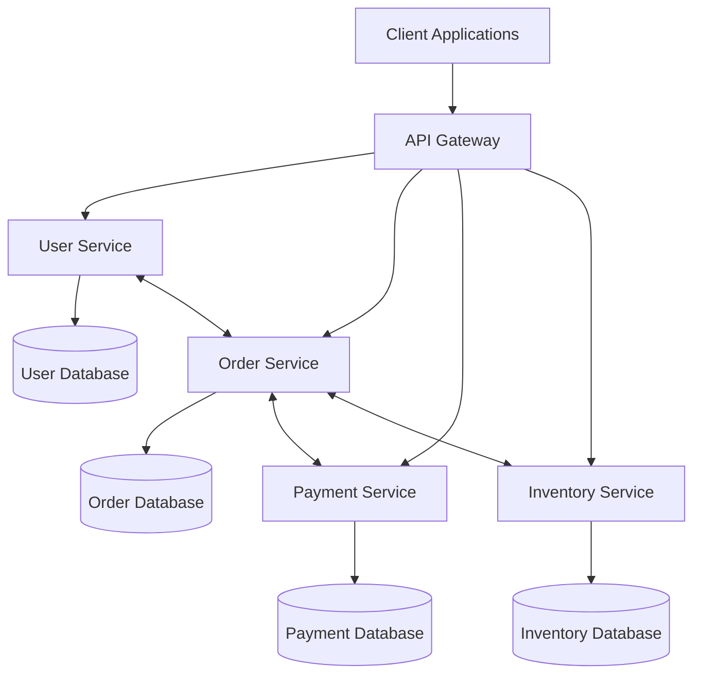

# Microservices Architecture

## Overview

**Microservices architecture is a distributed system approach where applications are built as a collection of loosely coupled, independently deployable services that communicate over well-defined APIs.** Each service is responsible for a specific business capability and can be developed, deployed, and scaled independently.

## Core Concepts

### Fundamental Principles



### Key Characteristics

1. **Business Capability Alignment**: Each service represents a business function
2. **Decentralized**: No central orchestration or shared database
3. **Independent Deployment**: Services can be deployed without affecting others
4. **Technology Diversity**: Different services can use different technologies
5. **Fault Isolation**: Failure in one service doesn't crash the entire system

### Service Boundaries

```javascript
// Domain-driven design for service boundaries
class UserService {
  // User management bounded context
  async createUser(userData) {
    const user = new User(userData);
    await this.validateUser(user);
    return await this.userRepository.save(user);
  }
  
  async getUserProfile(userId) {
    return await this.userRepository.findById(userId);
  }
  
  async updateUserProfile(userId, updates) {
    const user = await this.userRepository.findById(userId);
    user.update(updates);
    return await this.userRepository.save(user);
  }
}

class OrderService {
  // Order management bounded context
  constructor(userService, inventoryService, paymentService) {
    this.userService = userService;
    this.inventoryService = inventoryService;
    this.paymentService = paymentService;
  }
  
  async createOrder(orderData) {
    // Validate user exists
    const user = await this.userService.getUser(orderData.userId);
    
    // Check inventory
    const available = await this.inventoryService.checkAvailability(
      orderData.items
    );
    
    if (!available) {
      throw new Error('Items not available');
    }
    
    // Create order
    const order = new Order(orderData);
    await this.orderRepository.save(order);
    
    // Process payment asynchronously
    await this.publishEvent('OrderCreated', order);
    
    return order;
  }
}
```

## Microservices vs Monolithic Architecture

### Monolithic Architecture

```javascript
// Monolithic application structure
class ECommerceApplication {
  constructor() {
    this.userManager = new UserManager();
    this.orderManager = new OrderManager();
    this.inventoryManager = new InventoryManager();
    this.paymentManager = new PaymentManager();
    this.database = new SharedDatabase();
  }
  
  async processOrder(orderData) {
    // All logic in single application
    const transaction = await this.database.beginTransaction();
    
    try {
      const user = await this.userManager.getUser(orderData.userId);
      await this.inventoryManager.reserveItems(orderData.items);
      const payment = await this.paymentManager.processPayment(orderData.payment);
      const order = await this.orderManager.createOrder(orderData);
      
      await transaction.commit();
      return order;
    } catch (error) {
      await transaction.rollback();
      throw error;
    }
  }
}
```

### Microservices Architecture

```javascript
// Microservices approach
class OrderOrchestrator {
  constructor() {
    this.userService = new UserServiceClient();
    this.inventoryService = new InventoryServiceClient();
    this.paymentService = new PaymentServiceClient();
    this.orderService = new OrderServiceClient();
    this.eventBus = new EventBus();
  }
  
  async processOrder(orderData) {
    try {
      // Saga pattern for distributed transactions
      const saga = new OrderSaga();
      
      // Step 1: Validate user
      const user = await this.userService.getUser(orderData.userId);
      saga.addCompensation(() => this.userService.releaseUser(user.id));
      
      // Step 2: Reserve inventory
      await this.inventoryService.reserveItems(orderData.items);
      saga.addCompensation(() => 
        this.inventoryService.releaseItems(orderData.items)
      );
      
      // Step 3: Process payment
      const payment = await this.paymentService.processPayment(orderData.payment);
      saga.addCompensation(() => 
        this.paymentService.refundPayment(payment.id)
      );
      
      // Step 4: Create order
      const order = await this.orderService.createOrder(orderData);
      
      // Publish success event
      await this.eventBus.publish('OrderCompleted', order);
      
      return order;
    } catch (error) {
      // Execute compensating actions
      await saga.compensate();
      throw error;
    }
  }
}
```

## Benefits and Advantages

### 1. Independent Scaling

```javascript
// Service-specific scaling configuration
class ServiceScaler {
  constructor() {
    this.scalingPolicies = {
      userService: {
        minInstances: 2,
        maxInstances: 10,
        targetCPU: 70,
        targetMemory: 80
      },
      orderService: {
        minInstances: 3,
        maxInstances: 20,
        targetCPU: 60,
        targetMemory: 75,
        customMetrics: ['orderRate']
      },
      paymentService: {
        minInstances: 5, // High availability requirement
        maxInstances: 15,
        targetCPU: 50,
        targetMemory: 70
      }
    };
  }
  
  async scaleService(serviceName, metrics) {
    const policy = this.scalingPolicies[serviceName];
    const currentInstances = await this.getCurrentInstances(serviceName);
    
    let targetInstances = currentInstances;
    
    if (metrics.cpu > policy.targetCPU || metrics.memory > policy.targetMemory) {
      targetInstances = Math.min(
        currentInstances + 1, 
        policy.maxInstances
      );
    } else if (metrics.cpu < policy.targetCPU * 0.5) {
      targetInstances = Math.max(
        currentInstances - 1, 
        policy.minInstances
      );
    }
    
    if (targetInstances !== currentInstances) {
      await this.updateInstances(serviceName, targetInstances);
    }
  }
}
```

### 2. Technology Diversity

```javascript
// Different services using different technologies
class UserService {
  // Node.js with PostgreSQL
  constructor() {
    this.database = new PostgreSQLClient();
  }
  
  async getUser(id) {
    return await this.database.query(
      'SELECT * FROM users WHERE id = $1', 
      [id]
    );
  }
}

class RecommendationService {
  // Python with machine learning libraries
  constructor() {
    this.mlModel = new TensorFlowModel();
    this.redisCache = new RedisClient();
  }
  
  async getRecommendations(userId) {
    const cacheKey = `recommendations:${userId}`;
    let recommendations = await this.redisCache.get(cacheKey);
    
    if (!recommendations) {
      recommendations = await this.mlModel.predict(userId);
      await this.redisCache.set(cacheKey, recommendations, 3600);
    }
    
    return recommendations;
  }
}

class ImageProcessingService {
  // Go for high-performance image processing
  constructor() {
    this.imageProcessor = new ImageProcessor();
    this.s3Client = new S3Client();
  }
  
  async processImage(imageData) {
    const processed = await this.imageProcessor.resize(
      imageData, 
      { width: 800, height: 600 }
    );
    
    const url = await this.s3Client.upload(processed);
    return { url, size: processed.length };
  }
}
```

### 3. Fault Isolation

```javascript
// Circuit breaker pattern for fault tolerance
class ServiceClient {
  constructor(serviceName, baseUrl) {
    this.serviceName = serviceName;
    this.baseUrl = baseUrl;
    this.circuitBreaker = new CircuitBreaker({
      failureThreshold: 5,
      timeout: 30000,
      resetTimeout: 60000
    });
  }
  
  async makeRequest(endpoint, options = {}) {
    return await this.circuitBreaker.execute(async () => {
      const response = await fetch(`${this.baseUrl}${endpoint}`, {
        ...options,
        timeout: 5000
      });
      
      if (!response.ok) {
        throw new Error(`Service ${this.serviceName} error: ${response.status}`);
      }
      
      return await response.json();
    });
  }
}

// Bulkhead pattern for resource isolation
class ResourcePool {
  constructor(serviceName) {
    this.pools = {
      database: new ConnectionPool(10),
      cache: new ConnectionPool(5),
      external: new ConnectionPool(3)
    };
  }
  
  async executeWithPool(poolName, operation) {
    const pool = this.pools[poolName];
    const connection = await pool.acquire();
    
    try {
      return await operation(connection);
    } finally {
      pool.release(connection);
    }
  }
}
```

## Challenges and Solutions

### 1. Distributed System Complexity

```javascript
// Service discovery and health checking
class ServiceRegistry {
  constructor() {
    this.services = new Map();
    this.healthCheckers = new Map();
  }
  
  async registerService(serviceName, instance) {
    if (!this.services.has(serviceName)) {
      this.services.set(serviceName, []);
    }
    
    this.services.get(serviceName).push(instance);
    
    // Start health checking
    this.startHealthCheck(serviceName, instance);
  }
  
  async discoverService(serviceName) {
    const instances = this.services.get(serviceName) || [];
    const healthyInstances = [];
    
    for (const instance of instances) {
      if (await this.isHealthy(instance)) {
        healthyInstances.push(instance);
      }
    }
    
    if (healthyInstances.length === 0) {
      throw new Error(`No healthy instances of ${serviceName} available`);
    }
    
    // Return instance using load balancing
    return this.selectInstance(healthyInstances);
  }
  
  startHealthCheck(serviceName, instance) {
    const checker = setInterval(async () => {
      try {
        await fetch(`${instance.url}/health`);
        instance.lastHealthCheck = Date.now();
        instance.healthy = true;
      } catch (error) {
        instance.healthy = false;
        console.warn(`Health check failed for ${serviceName}:`, error.message);
      }
    }, 30000); // Check every 30 seconds
    
    this.healthCheckers.set(`${serviceName}:${instance.id}`, checker);
  }
}
```

### 2. Data Consistency

```javascript
// Saga pattern for distributed transactions
class OrderSaga {
  constructor() {
    this.steps = [];
    this.compensations = [];
    this.state = 'PENDING';
  }
  
  addStep(operation, compensation) {
    this.steps.push(operation);
    this.compensations.push(compensation);
  }
  
  async execute() {
    this.state = 'EXECUTING';
    
    for (let i = 0; i < this.steps.length; i++) {
      try {
        await this.steps[i]();
      } catch (error) {
        this.state = 'COMPENSATING';
        await this.compensate(i);
        this.state = 'FAILED';
        throw error;
      }
    }
    
    this.state = 'COMPLETED';
  }
  
  async compensate(failedStepIndex) {
    // Execute compensations in reverse order
    for (let i = failedStepIndex - 1; i >= 0; i--) {
      try {
        await this.compensations[i]();
      } catch (error) {
        console.error(`Compensation failed at step ${i}:`, error);
      }
    }
  }
}

// Event sourcing for data consistency
class EventStore {
  constructor() {
    this.events = [];
    this.snapshots = new Map();
  }
  
  async saveEvent(aggregateId, event) {
    const eventWithMetadata = {
      ...event,
      aggregateId,
      eventId: this.generateId(),
      timestamp: Date.now(),
      version: await this.getNextVersion(aggregateId)
    };
    
    this.events.push(eventWithMetadata);
    
    // Publish event to other services
    await this.publishEvent(eventWithMetadata);
    
    return eventWithMetadata;
  }
  
  async getAggregate(aggregateId) {
    const snapshot = this.snapshots.get(aggregateId);
    const startVersion = snapshot ? snapshot.version : 0;
    
    const events = this.events.filter(
      e => e.aggregateId === aggregateId && e.version > startVersion
    );
    
    let aggregate = snapshot ? snapshot.data : {};
    
    for (const event of events) {
      aggregate = this.applyEvent(aggregate, event);
    }
    
    return aggregate;
  }
}
```

### 3. Network Latency and Communication

```javascript
// Asynchronous messaging with event bus
class EventBus {
  constructor() {
    this.subscribers = new Map();
    this.messageQueue = new MessageQueue();
  }
  
  subscribe(eventType, handler) {
    if (!this.subscribers.has(eventType)) {
      this.subscribers.set(eventType, []);
    }
    
    this.subscribers.get(eventType).push(handler);
  }
  
  async publish(eventType, data) {
    const event = {
      type: eventType,
      data,
      timestamp: Date.now(),
      id: this.generateEventId()
    };
    
    // Store for reliability
    await this.messageQueue.enqueue(event);
    
    // Notify subscribers asynchronously
    this.notifySubscribers(eventType, event);
  }
  
  async notifySubscribers(eventType, event) {
    const handlers = this.subscribers.get(eventType) || [];
    
    const promises = handlers.map(async handler => {
      try {
        await handler(event);
      } catch (error) {
        console.error(`Event handler failed for ${eventType}:`, error);
        // Implement retry logic
        await this.scheduleRetry(handler, event);
      }
    });
    
    await Promise.allSettled(promises);
  }
}

// GraphQL Federation for efficient data fetching
class GraphQLGateway {
  constructor() {
    this.services = new Map();
    this.schema = this.buildFederatedSchema();
  }
  
  registerService(serviceName, schema, url) {
    this.services.set(serviceName, { schema, url });
    this.schema = this.buildFederatedSchema();
  }
  
  async resolveQuery(query, variables) {
    const executionPlan = this.createExecutionPlan(query);
    const results = {};
    
    // Execute queries in parallel where possible
    for (const step of executionPlan) {
      const stepResults = await Promise.all(
        step.map(({ service, subQuery }) =>
          this.executeSubQuery(service, subQuery, variables)
        )
      );
      
      // Merge results
      Object.assign(results, ...stepResults);
    }
    
    return results;
  }
}
```

## Service Communication Patterns

### 1. Synchronous Communication

```javascript
// RESTful API communication
class OrderService {
  constructor() {
    this.userServiceClient = new UserServiceClient();
    this.inventoryServiceClient = new InventoryServiceClient();
  }
  
  async createOrder(orderData) {
    // Synchronous calls with timeout and retry
    const user = await this.userServiceClient.getUser(
      orderData.userId,
      { timeout: 3000, retries: 2 }
    );
    
    const inventoryCheck = await this.inventoryServiceClient.checkAvailability(
      orderData.items,
      { timeout: 5000, retries: 1 }
    );
    
    if (!inventoryCheck.available) {
      throw new Error('Items not available');
    }
    
    return await this.orderRepository.create(orderData);
  }
}

// gRPC communication
class UserServiceGRPCClient {
  constructor() {
    this.client = new UserServiceClient(
      'user-service:50051',
      grpc.credentials.createInsecure()
    );
  }
  
  async getUser(userId) {
    return new Promise((resolve, reject) => {
      this.client.getUser({ userId }, (error, response) => {
        if (error) {
          reject(error);
        } else {
          resolve(response);
        }
      });
    });
  }
}
```

### 2. Asynchronous Communication

```javascript
// Message queue implementation
class OrderEventHandler {
  constructor() {
    this.messageQueue = new RabbitMQClient();
    this.setupSubscriptions();
  }
  
  async setupSubscriptions() {
    await this.messageQueue.subscribe('order.created', this.handleOrderCreated.bind(this));
    await this.messageQueue.subscribe('payment.completed', this.handlePaymentCompleted.bind(this));
    await this.messageQueue.subscribe('inventory.reserved', this.handleInventoryReserved.bind(this));
  }
  
  async handleOrderCreated(event) {
    const { orderId, items, paymentInfo } = event.data;
    
    // Publish inventory reservation request
    await this.messageQueue.publish('inventory.reserve', {
      orderId,
      items,
      correlationId: event.correlationId
    });
    
    // Publish payment processing request
    await this.messageQueue.publish('payment.process', {
      orderId,
      amount: paymentInfo.amount,
      method: paymentInfo.method,
      correlationId: event.correlationId
    });
  }
  
  async handlePaymentCompleted(event) {
    const { orderId, paymentId, status } = event.data;
    
    if (status === 'success') {
      await this.orderRepository.updateStatus(orderId, 'paid');
      
      // Publish order confirmed event
      await this.messageQueue.publish('order.confirmed', {
        orderId,
        paymentId,
        timestamp: Date.now()
      });
    } else {
      await this.handlePaymentFailure(orderId);
    }
  }
}
```

### 3. Event Streaming

```javascript
// Apache Kafka event streaming
class EventStreamProcessor {
  constructor() {
    this.kafka = new KafkaClient();
    this.producer = this.kafka.producer();
    this.consumer = this.kafka.consumer({ groupId: 'order-processor' });
  }
  
  async publishEvent(topic, event) {
    await this.producer.send({
      topic,
      messages: [{
        key: event.aggregateId,
        value: JSON.stringify(event),
        timestamp: Date.now()
      }]
    });
  }
  
  async subscribeToEvents() {
    await this.consumer.subscribe({ 
      topics: ['user-events', 'order-events', 'payment-events']
    });
    
    await this.consumer.run({
      eachMessage: async ({ topic, partition, message }) => {
        const event = JSON.parse(message.value.toString());
        await this.processEvent(topic, event);
      }
    });
  }
  
  async processEvent(topic, event) {
    switch (topic) {
      case 'user-events':
        await this.handleUserEvent(event);
        break;
      case 'order-events':
        await this.handleOrderEvent(event);
        break;
      case 'payment-events':
        await this.handlePaymentEvent(event);
        break;
    }
  }
}
```

## Data Management Strategies

### 1. Database Per Service

```javascript
// Each service has its own database
class UserService {
  constructor() {
    this.userDatabase = new PostgreSQLClient({
      host: 'user-db',
      database: 'users',
      schema: 'user_management'
    });
  }
  
  async createUser(userData) {
    return await this.userDatabase.query(
      'INSERT INTO users (name, email, created_at) VALUES ($1, $2, $3) RETURNING *',
      [userData.name, userData.email, new Date()]
    );
  }
}

class OrderService {
  constructor() {
    this.orderDatabase = new MongoDBClient({
      host: 'order-db',
      database: 'orders',
      collection: 'order_documents'
    });
  }
  
  async createOrder(orderData) {
    return await this.orderDatabase.insertOne({
      ...orderData,
      createdAt: new Date(),
      status: 'pending'
    });
  }
}
```

### 2. Shared Data Synchronization

```javascript
// CQRS (Command Query Responsibility Segregation)
class UserProjectionService {
  constructor() {
    this.readDatabase = new MongoDBClient(); // Optimized for queries
    this.eventStore = new EventStore();
  }
  
  async updateUserProjection(userEvent) {
    const { userId, eventType, data } = userEvent;
    
    switch (eventType) {
      case 'UserCreated':
        await this.readDatabase.insertOne({
          userId,
          name: data.name,
          email: data.email,
          createdAt: data.createdAt,
          version: userEvent.version
        });
        break;
        
      case 'UserUpdated':
        await this.readDatabase.updateOne(
          { userId },
          { $set: { ...data, version: userEvent.version } }
        );
        break;
        
      case 'UserDeleted':
        await this.readDatabase.deleteOne({ userId });
        break;
    }
  }
  
  async getUserProjection(userId) {
    return await this.readDatabase.findOne({ userId });
  }
}

// Data synchronization between services
class DataSyncService {
  constructor() {
    this.eventBus = new EventBus();
    this.setupSyncHandlers();
  }
  
  setupSyncHandlers() {
    // Sync user data to order service
    this.eventBus.subscribe('user.updated', async (event) => {
      await this.syncUserToOrderService(event.data);
    });
    
    // Sync product data to recommendation service
    this.eventBus.subscribe('product.updated', async (event) => {
      await this.syncProductToRecommendationService(event.data);
    });
  }
  
  async syncUserToOrderService(userData) {
    try {
      await this.orderServiceClient.updateUserInfo(userData);
    } catch (error) {
      console.error('Failed to sync user data to order service:', error);
      // Queue for retry
      await this.retryQueue.add('syncUserToOrder', userData);
    }
  }
}
```

## API Gateway Pattern

```javascript
// Centralized API Gateway
class APIGateway {
  constructor() {
    this.serviceRegistry = new ServiceRegistry();
    this.rateLimiter = new RateLimiter();
    this.authService = new AuthenticationService();
    this.loadBalancer = new LoadBalancer();
  }
  
  async handleRequest(req, res) {
    try {
      // Authentication
      const user = await this.authService.authenticate(req.headers.authorization);
      
      // Rate limiting
      await this.rateLimiter.checkLimit(user.id, req.ip);
      
      // Route to appropriate service
      const service = this.determineService(req.path);
      const serviceInstance = await this.serviceRegistry.discoverService(service);
      
      // Load balancing
      const targetInstance = this.loadBalancer.selectInstance(serviceInstance);
      
      // Proxy request
      const response = await this.proxyRequest(req, targetInstance);
      
      // Response transformation
      const transformedResponse = this.transformResponse(response, user);
      
      res.json(transformedResponse);
    } catch (error) {
      this.handleError(res, error);
    }
  }
  
  determineService(path) {
    const routes = {
      '/api/users': 'user-service',
      '/api/orders': 'order-service',
      '/api/products': 'product-service',
      '/api/payments': 'payment-service'
    };
    
    for (const [route, service] of Object.entries(routes)) {
      if (path.startsWith(route)) {
        return service;
      }
    }
    
    throw new Error('Service not found');
  }
  
  async proxyRequest(req, targetInstance) {
    const proxyUrl = `${targetInstance.url}${req.path}`;
    
    return await fetch(proxyUrl, {
      method: req.method,
      headers: {
        ...req.headers,
        'X-Forwarded-For': req.ip,
        'X-Service-Gateway': 'api-gateway'
      },
      body: req.method !== 'GET' ? JSON.stringify(req.body) : undefined
    });
  }
}
```

## Container Orchestration and Deployment

### 1. Docker Containerization

```dockerfile
# Dockerfile for a Node.js microservice
FROM node:18-alpine

WORKDIR /app

# Copy package files
COPY package*.json ./

# Install dependencies
RUN npm ci --only=production

# Copy source code
COPY src/ ./src/

# Create non-root user
RUN addgroup -g 1001 -S nodejs
RUN adduser -S nodejs -u 1001

# Change ownership of the app directory
RUN chown -R nodejs:nodejs /app
USER nodejs

# Expose port
EXPOSE 3000

# Health check
HEALTHCHECK --interval=30s --timeout=3s --start-period=5s --retries=3 \
  CMD curl -f http://localhost:3000/health || exit 1

# Start the application
CMD ["node", "src/index.js"]
```

### 2. Kubernetes Deployment

```yaml
# Kubernetes deployment configuration
apiVersion: apps/v1
kind: Deployment
metadata:
  name: user-service
  labels:
    app: user-service
spec:
  replicas: 3
  selector:
    matchLabels:
      app: user-service
  template:
    metadata:
      labels:
        app: user-service
    spec:
      containers:
      - name: user-service
        image: user-service:v1.2.0
        ports:
        - containerPort: 3000
        env:
        - name: DATABASE_URL
          valueFrom:
            secretKeyRef:
              name: user-service-secrets
              key: database-url
        - name: REDIS_URL
          valueFrom:
            configMapKeyRef:
              name: user-service-config
              key: redis-url
        resources:
          requests:
            memory: "256Mi"
            cpu: "250m"
          limits:
            memory: "512Mi"
            cpu: "500m"
        livenessProbe:
          httpGet:
            path: /health
            port: 3000
          initialDelaySeconds: 30
          periodSeconds: 10
        readinessProbe:
          httpGet:
            path: /ready
            port: 3000
          initialDelaySeconds: 5
          periodSeconds: 5

---
apiVersion: v1
kind: Service
metadata:
  name: user-service
spec:
  selector:
    app: user-service
  ports:
  - protocol: TCP
    port: 80
    targetPort: 3000
  type: ClusterIP
```

### 3. Service Mesh with Istio

```javascript
// Service mesh integration
class ServiceMeshClient {
  constructor(serviceName) {
    this.serviceName = serviceName;
    this.istioHeaders = {
      'x-request-id': this.generateRequestId(),
      'x-b3-traceid': this.generateTraceId(),
      'x-b3-spanid': this.generateSpanId()
    };
  }
  
  async makeRequest(targetService, endpoint, options = {}) {
    const headers = {
      ...this.istioHeaders,
      ...options.headers
    };
    
    // Service mesh will handle load balancing, retries, and circuit breaking
    const response = await fetch(`http://${targetService}${endpoint}`, {
      ...options,
      headers
    });
    
    // Extract tracing information
    this.extractTracingHeaders(response.headers);
    
    return response;
  }
  
  extractTracingHeaders(responseHeaders) {
    const traceId = responseHeaders.get('x-b3-traceid');
    const spanId = responseHeaders.get('x-b3-spanid');
    
    // Update current trace context
    this.istioHeaders['x-b3-parentspanid'] = spanId;
    this.istioHeaders['x-b3-spanid'] = this.generateSpanId();
  }
}
```

## Monitoring and Observability

### 1. Distributed Tracing

```javascript
// OpenTelemetry tracing
const opentelemetry = require('@opentelemetry/api');
const { NodeSDK } = require('@opentelemetry/auto-instrumentations-node');

class TracingService {
  constructor() {
    this.tracer = opentelemetry.trace.getTracer('user-service');
  }
  
  async createUser(userData) {
    const span = this.tracer.startSpan('create_user');
    
    try {
      span.setAttributes({
        'user.email': userData.email,
        'operation': 'create_user',
        'service.name': 'user-service'
      });
      
      // Database operation
      const dbSpan = this.tracer.startSpan('database_insert', { parent: span });
      const user = await this.userRepository.create(userData);
      dbSpan.end();
      
      // External API call
      const apiSpan = this.tracer.startSpan('notification_api', { parent: span });
      await this.notificationService.sendWelcomeEmail(user.email);
      apiSpan.end();
      
      span.setStatus({ code: opentelemetry.SpanStatusCode.OK });
      return user;
    } catch (error) {
      span.recordException(error);
      span.setStatus({
        code: opentelemetry.SpanStatusCode.ERROR,
        message: error.message
      });
      throw error;
    } finally {
      span.end();
    }
  }
}
```

### 2. Metrics and Logging

```javascript
// Prometheus metrics
const prometheus = require('prom-client');

class MetricsService {
  constructor() {
    this.httpRequestDuration = new prometheus.Histogram({
      name: 'http_request_duration_seconds',
      help: 'Duration of HTTP requests in seconds',
      labelNames: ['method', 'route', 'status_code']
    });
    
    this.httpRequestTotal = new prometheus.Counter({
      name: 'http_requests_total',
      help: 'Total number of HTTP requests',
      labelNames: ['method', 'route', 'status_code']
    });
    
    this.activeConnections = new prometheus.Gauge({
      name: 'active_connections',
      help: 'Number of active connections'
    });
  }
  
  recordRequest(method, route, statusCode, duration) {
    this.httpRequestDuration
      .labels(method, route, statusCode)
      .observe(duration);
    
    this.httpRequestTotal
      .labels(method, route, statusCode)
      .inc();
  }
  
  updateActiveConnections(count) {
    this.activeConnections.set(count);
  }
}

// Structured logging
class Logger {
  constructor(serviceName) {
    this.serviceName = serviceName;
  }
  
  info(message, context = {}) {
    console.log(JSON.stringify({
      level: 'info',
      message,
      service: this.serviceName,
      timestamp: new Date().toISOString(),
      ...context
    }));
  }
  
  error(message, error = null, context = {}) {
    console.error(JSON.stringify({
      level: 'error',
      message,
      service: this.serviceName,
      timestamp: new Date().toISOString(),
      error: error ? {
        message: error.message,
        stack: error.stack
      } : null,
      ...context
    }));
  }
}
```

## Security Considerations

### 1. Service-to-Service Authentication

```javascript
// JWT-based service authentication
class ServiceAuthenticator {
  constructor(jwtSecret) {
    this.jwtSecret = jwtSecret;
    this.tokenCache = new Map();
  }
  
  generateServiceToken(serviceName, permissions) {
    const payload = {
      sub: serviceName,
      iss: 'service-mesh',
      permissions,
      exp: Math.floor(Date.now() / 1000) + 3600 // 1 hour
    };
    
    return jwt.sign(payload, this.jwtSecret);
  }
  
  async validateServiceToken(token) {
    try {
      // Check cache first
      if (this.tokenCache.has(token)) {
        const cached = this.tokenCache.get(token);
        if (cached.exp > Date.now()) {
          return cached.payload;
        }
        this.tokenCache.delete(token);
      }
      
      const payload = jwt.verify(token, this.jwtSecret);
      
      // Cache valid token
      this.tokenCache.set(token, {
        payload,
        exp: payload.exp * 1000
      });
      
      return payload;
    } catch (error) {
      throw new Error('Invalid service token');
    }
  }
}
```

### 2. API Rate Limiting

```javascript
// Distributed rate limiting
class DistributedRateLimiter {
  constructor(redisClient) {
    this.redis = redisClient;
  }
  
  async checkLimit(identifier, limit, windowSeconds) {
    const key = `rate_limit:${identifier}`;
    const now = Date.now();
    const windowStart = now - (windowSeconds * 1000);
    
    // Remove old entries
    await this.redis.zremrangebyscore(key, 0, windowStart);
    
    // Count current requests
    const currentCount = await this.redis.zcard(key);
    
    if (currentCount >= limit) {
      const oldestEntry = await this.redis.zrange(key, 0, 0, 'WITHSCORES');
      const resetTime = oldestEntry[1] + (windowSeconds * 1000);
      
      throw new RateLimitError(`Rate limit exceeded. Reset at ${new Date(resetTime)}`);
    }
    
    // Add current request
    await this.redis.zadd(key, now, `${now}-${Math.random()}`);
    await this.redis.expire(key, windowSeconds);
    
    return {
      allowed: true,
      remaining: limit - currentCount - 1,
      resetTime: now + (windowSeconds * 1000)
    };
  }
}
```

## Best Practices

### 1. Service Design Principles

```javascript
// Single Responsibility Principle for services
class UserProfileService {
  // Only handles user profile management
  constructor() {
    this.userRepository = new UserRepository();
    this.eventBus = new EventBus();
  }
  
  async updateProfile(userId, profileData) {
    const user = await this.userRepository.findById(userId);
    
    if (!user) {
      throw new Error('User not found');
    }
    
    const updatedUser = await this.userRepository.update(userId, profileData);
    
    // Publish event for other services
    await this.eventBus.publish('user.profile.updated', {
      userId,
      changes: profileData,
      timestamp: Date.now()
    });
    
    return updatedUser;
  }
}

// Separate service for user authentication
class UserAuthenticationService {
  constructor() {
    this.authRepository = new AuthRepository();
    this.tokenService = new TokenService();
  }
  
  async authenticate(credentials) {
    const user = await this.authRepository.validateCredentials(credentials);
    
    if (!user) {
      throw new Error('Invalid credentials');
    }
    
    const token = this.tokenService.generateToken(user);
    
    await this.eventBus.publish('user.authenticated', {
      userId: user.id,
      timestamp: Date.now()
    });
    
    return { user, token };
  }
}
```

### 2. Error Handling Strategies

```javascript
// Comprehensive error handling
class ServiceErrorHandler {
  constructor() {
    this.logger = new Logger();
    this.metrics = new MetricsService();
  }
  
  handleError(error, context = {}) {
    // Log error with context
    this.logger.error(error.message, error, context);
    
    // Update metrics
    this.metrics.recordError(error.type || 'unknown');
    
    // Determine error response
    if (error instanceof ValidationError) {
      return {
        status: 400,
        message: error.message,
        code: 'VALIDATION_ERROR'
      };
    }
    
    if (error instanceof NotFoundError) {
      return {
        status: 404,
        message: 'Resource not found',
        code: 'NOT_FOUND'
      };
    }
    
    if (error instanceof ServiceUnavailableError) {
      return {
        status: 503,
        message: 'Service temporarily unavailable',
        code: 'SERVICE_UNAVAILABLE',
        retryAfter: error.retryAfter
      };
    }
    
    // Default to internal server error
    return {
      status: 500,
      message: 'Internal server error',
      code: 'INTERNAL_ERROR'
    };
  }
}
```

### 3. Testing Strategies

```javascript
// Contract testing between services
class ContractTest {
  constructor() {
    this.pact = new Pact({
      consumer: 'order-service',
      provider: 'user-service'
    });
  }
  
  async testUserServiceContract() {
    await this.pact
      .given('user exists')
      .uponReceiving('a request for user details')
      .withRequest({
        method: 'GET',
        path: '/users/123',
        headers: {
          'Authorization': 'Bearer token123'
        }
      })
      .willRespondWith({
        status: 200,
        headers: {
          'Content-Type': 'application/json'
        },
        body: {
          id: '123',
          name: 'John Doe',
          email: 'john@example.com'
        }
      });
    
    // Execute the contract test
    const userService = new UserServiceClient();
    const user = await userService.getUser('123');
    
    expect(user.id).toBe('123');
    expect(user.name).toBe('John Doe');
  }
}

// Integration testing with test containers
class IntegrationTest {
  constructor() {
    this.testContainers = new TestContainers();
  }
  
  async setupTestEnvironment() {
    // Start test dependencies
    this.database = await this.testContainers.start('postgres:13');
    this.redis = await this.testContainers.start('redis:6');
    this.messageQueue = await this.testContainers.start('rabbitmq:3');
    
    // Initialize service with test configuration
    this.userService = new UserService({
      database: {
        host: this.database.host,
        port: this.database.port
      },
      redis: {
        host: this.redis.host,
        port: this.redis.port
      }
    });
  }
  
  async teardownTestEnvironment() {
    await this.testContainers.stopAll();
  }
}
```

## Real-World Examples

### 1. E-commerce Platform

```javascript
// E-commerce microservices architecture
class ECommercePlatform {
  constructor() {
    this.services = {
      apiGateway: new APIGateway(),
      userService: new UserService(),
      productService: new ProductService(),
      orderService: new OrderService(),
      paymentService: new PaymentService(),
      inventoryService: new InventoryService(),
      notificationService: new NotificationService(),
      recommendationService: new RecommendationService()
    };
    
    this.setupServiceCommunication();
  }
  
  setupServiceCommunication() {
    // Event-driven communication
    this.services.orderService.on('order.created', async (order) => {
      await this.services.inventoryService.reserveItems(order.items);
      await this.services.paymentService.processPayment(order.payment);
      await this.services.notificationService.sendOrderConfirmation(order);
    });
    
    this.services.userService.on('user.created', async (user) => {
      await this.services.recommendationService.initializeProfile(user.id);
      await this.services.notificationService.sendWelcomeEmail(user.email);
    });
  }
}
```

### 2. Streaming Platform

```javascript
// Video streaming microservices
class StreamingPlatform {
  constructor() {
    this.services = {
      userService: new UserService(),
      contentService: new ContentService(),
      streamingService: new StreamingService(),
      analyticsService: new AnalyticsService(),
      recommendationService: new RecommendationService(),
      billingService: new BillingService()
    };
  }
  
  async handleStreamRequest(userId, contentId) {
    // Check user subscription
    const user = await this.services.userService.getUser(userId);
    const subscription = await this.services.billingService.getSubscription(userId);
    
    if (!subscription.isActive) {
      throw new Error('Subscription required');
    }
    
    // Get content metadata
    const content = await this.services.contentService.getContent(contentId);
    
    // Generate streaming URL
    const streamUrl = await this.services.streamingService.generateStreamUrl(
      contentId,
      user.location,
      user.deviceType
    );
    
    // Record analytics
    await this.services.analyticsService.recordStreamStart({
      userId,
      contentId,
      timestamp: Date.now()
    });
    
    return { streamUrl, content };
  }
}
```

## Key Takeaways

1. **Service Boundaries**: Design services around business capabilities, not technical layers
2. **Data Ownership**: Each service should own its data and expose it through well-defined APIs
3. **Communication**: Prefer asynchronous communication for better resilience and performance
4. **Observability**: Implement comprehensive monitoring, logging, and tracing from the start
5. **Testing**: Invest in contract testing and integration testing strategies
6. **Security**: Implement proper authentication, authorization, and network security
7. **Gradual Migration**: Consider strangler fig pattern when migrating from monoliths

Microservices architecture offers significant benefits for large, complex applications but requires careful planning, robust infrastructure, and strong operational practices to be successful.