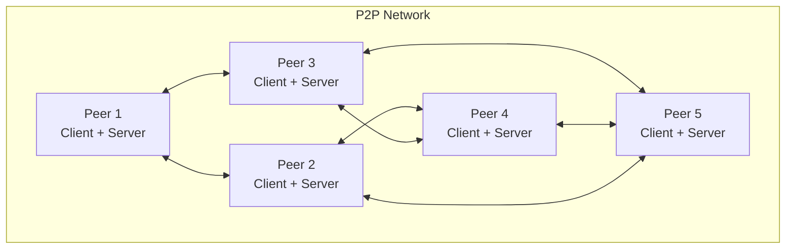

# Peer-to-Peer Architecture

## Overview

**Peer-to-peer (P2P) architecture is a distributed system design where participants (peers) act as both clients and servers, sharing resources, data, and services directly with each other without relying on a centralized server.** In this model, each node has equivalent capabilities and responsibilities, creating a decentralized network that can be more resilient, scalable, and fault-tolerant than traditional client-server architectures.

## Core Concepts

### What is a Peer?



A peer is a network node that can:
- Request resources (client role)
- Provide resources (server role)
- Route requests to other peers
- Maintain partial or complete network state

```javascript
// Basic peer implementation
class Peer {
  constructor(id, address, port) {
    this.id = id;
    this.address = address;
    this.port = port;
    this.connectedPeers = new Set();
    this.resources = new Map();
    this.server = new PeerServer(port);
    this.client = new PeerClient();
  }
  
  async start() {
    await this.server.start();
    this.server.on('request', this.handleIncomingRequest.bind(this));
    this.server.on('connection', this.handleNewPeerConnection.bind(this));
  }
  
  async connectToPeer(peerAddress) {
    try {
      const connection = await this.client.connect(peerAddress);
      this.connectedPeers.add(connection);
      
      // Exchange peer lists for network discovery
      await this.exchangePeerList(connection);
      
      return connection;
    } catch (error) {
      console.error(`Failed to connect to peer ${peerAddress}:`, error);
      throw error;
    }
  }
  
  async shareResource(resourceId, data) {
    this.resources.set(resourceId, {
      data,
      sharedAt: new Date(),
      accessCount: 0
    });
    
    // Announce resource to connected peers
    await this.announceResource(resourceId);
  }
  
  async requestResource(resourceId) {
    // Check local resources first
    if (this.resources.has(resourceId)) {
      const resource = this.resources.get(resourceId);
      resource.accessCount++;
      return resource.data;
    }
    
    // Search network for resource
    return await this.searchNetworkForResource(resourceId);
  }
  
  async handleIncomingRequest(request, peer) {
    switch (request.type) {
      case 'RESOURCE_REQUEST':
        return await this.handleResourceRequest(request, peer);
      case 'SEARCH_REQUEST':
        return await this.handleSearchRequest(request, peer);
      case 'PEER_LIST_REQUEST':
        return await this.handlePeerListRequest(request, peer);
      default:
        throw new Error(`Unknown request type: ${request.type}`);
    }
  }
}
```

### Key Characteristics

#### 1. Decentralization
No single point of control or failure:

```javascript
class DecentralizedNetwork {
  constructor() {
    this.peers = new Map();
    this.networkTopology = new NetworkTopology();
  }
  
  addPeer(peer) {
    this.peers.set(peer.id, peer);
    this.networkTopology.addNode(peer.id);
    
    // Connect to existing peers
    this.establishConnections(peer);
  }
  
  removePeer(peerId) {
    const peer = this.peers.get(peerId);
    if (peer) {
      // Gracefully disconnect from other peers
      peer.disconnect();
      this.peers.delete(peerId);
      this.networkTopology.removeNode(peerId);
      
      // Network self-heals by establishing new connections
      this.healNetwork();
    }
  }
  
  establishConnections(newPeer) {
    // Connect to a subset of existing peers
    const existingPeers = Array.from(this.peers.values())
      .filter(p => p.id !== newPeer.id);
    
    const connectionsNeeded = Math.min(5, existingPeers.length);
    const peersToConnect = this.selectPeersForConnection(existingPeers, connectionsNeeded);
    
    peersToConnect.forEach(peer => {
      newPeer.connectToPeer(peer.address);
    });
  }
  
  healNetwork() {
    // Ensure network connectivity after peer removal
    const disconnectedComponents = this.networkTopology.findDisconnectedComponents();
    
    if (disconnectedComponents.length > 1) {
      this.bridgeComponents(disconnectedComponents);
    }
  }
}
```

#### 2. Resource Sharing
Direct sharing between peers:

```javascript
class ResourceSharingManager {
  constructor(peer) {
    this.peer = peer;
    this.sharedResources = new Map();
    this.resourceIndex = new ResourceIndex();
  }
  
  async shareFile(filePath, metadata = {}) {
    const fileHash = await this.calculateFileHash(filePath);
    const fileInfo = {
      hash: fileHash,
      name: path.basename(filePath),
      size: fs.statSync(filePath).size,
      path: filePath,
      metadata,
      sharedAt: new Date(),
      downloadCount: 0
    };
    
    this.sharedResources.set(fileHash, fileInfo);
    this.resourceIndex.addResource(fileHash, fileInfo);
    
    // Announce to network
    await this.announceResourceAvailability(fileHash, fileInfo);
    
    return fileHash;
  }
  
  async downloadFile(fileHash, targetPath) {
    // Find peers that have the file
    const availablePeers = await this.findPeersWithResource(fileHash);
    
    if (availablePeers.length === 0) {
      throw new Error('File not found in network');
    }
    
    // Download from multiple peers in parallel (swarming)
    return await this.swarmDownload(fileHash, availablePeers, targetPath);
  }
  
  async swarmDownload(fileHash, peers, targetPath) {
    const fileInfo = await this.getFileInfo(fileHash, peers[0]);
    const chunks = this.calculateChunks(fileInfo.size);
    
    const downloadPromises = chunks.map(async (chunk, index) => {
      const peer = peers[index % peers.length];
      return await this.downloadChunk(peer, fileHash, chunk);
    });
    
    const chunkData = await Promise.all(downloadPromises);
    
    // Reassemble file
    await this.assembleFile(chunkData, targetPath);
    
    return targetPath;
  }
  
  async findPeersWithResource(resourceHash) {
    const searchId = generateSearchId();
    const searchRequest = {
      type: 'RESOURCE_SEARCH',
      searchId,
      resourceHash,
      ttl: 7, // Time to live
      originPeer: this.peer.id
    };
    
    const results = await this.floodSearch(searchRequest);
    return results.filter(result => result.hasResource);
  }
}
```

## Types of P2P Networks

### 1. Pure P2P (Unstructured)

```javascript
// Gnutella-style unstructured P2P
class UnstructuredP2PNetwork {
  constructor() {
    this.peers = new Map();
    this.activeSearches = new Map();
  }
  
  async search(query, originPeer) {
    const searchId = generateSearchId();
    const searchRequest = {
      id: searchId,
      query,
      ttl: 7,
      origin: originPeer.id,
      path: [originPeer.id]
    };
    
    this.activeSearches.set(searchId, {
      request: searchRequest,
      results: [],
      startTime: Date.now()
    });
    
    // Flood search through network
    await this.floodSearch(searchRequest, originPeer);
    
    // Collect results
    return this.collectSearchResults(searchId);
  }
  
  async floodSearch(searchRequest, excludePeer = null) {
    const connectedPeers = Array.from(this.peers.values())
      .filter(peer => peer !== excludePeer && !searchRequest.path.includes(peer.id));
    
    const searchPromises = connectedPeers.map(async peer => {
      try {
        const modifiedRequest = {
          ...searchRequest,
          ttl: searchRequest.ttl - 1,
          path: [...searchRequest.path, peer.id]
        };
        
        if (modifiedRequest.ttl > 0) {
          return await peer.processSearchRequest(modifiedRequest);
        }
      } catch (error) {
        console.warn(`Search failed for peer ${peer.id}:`, error);
      }
    });
    
    await Promise.allSettled(searchPromises);
  }
  
  processSearchRequest(searchRequest) {
    // Check local resources
    const localResults = this.searchLocalResources(searchRequest.query);
    
    // Forward to connected peers if TTL allows
    if (searchRequest.ttl > 1) {
      this.forwardSearchRequest(searchRequest);
    }
    
    // Send results back to origin
    if (localResults.length > 0) {
      this.sendSearchResults(searchRequest.origin, searchRequest.id, localResults);
    }
  }
}
```

### 2. Structured P2P (DHT)

```javascript
// Chord-style Distributed Hash Table
class ChordDHT {
  constructor(nodeId, m = 160) { // m = key space size (bits)
    this.nodeId = nodeId;
    this.m = m;
    this.fingerTable = new Array(m);
    this.predecessor = null;
    this.successor = null;
    this.data = new Map();
  }
  
  // Join the DHT network
  async join(existingNode = null) {
    if (existingNode) {
      await this.initFingerTable(existingNode);
      await this.updateOthers();
      await this.moveKeys();
    } else {
      // First node in network
      this.predecessor = this;
      this.successor = this;
      this.initializeFingerTable();
    }
  }
  
  // Store key-value pair
  async put(key, value) {
    const keyHash = this.hash(key);
    const responsibleNode = await this.findSuccessor(keyHash);
    
    if (responsibleNode.nodeId === this.nodeId) {
      this.data.set(keyHash, value);
      // Replicate to successor nodes for fault tolerance
      await this.replicateData(keyHash, value);
    } else {
      await responsibleNode.put(key, value);
    }
  }
  
  // Retrieve value by key
  async get(key) {
    const keyHash = this.hash(key);
    const responsibleNode = await this.findSuccessor(keyHash);
    
    if (responsibleNode.nodeId === this.nodeId) {
      return this.data.get(keyHash);
    } else {
      return await responsibleNode.get(key);
    }
  }
  
  // Find successor node for given key
  async findSuccessor(keyHash) {
    if (this.inRange(keyHash, this.nodeId, this.successor.nodeId)) {
      return this.successor;
    } else {
      const closestPrecedingNode = this.closestPrecedingFinger(keyHash);
      return await closestPrecedingNode.findSuccessor(keyHash);
    }
  }
  
  closestPrecedingFinger(keyHash) {
    for (let i = this.m - 1; i >= 0; i--) {
      const finger = this.fingerTable[i];
      if (finger && this.inRange(finger.nodeId, this.nodeId, keyHash)) {
        return finger;
      }
    }
    return this;
  }
  
  // Consistent hashing
  hash(input) {
    const crypto = require('crypto');
    const hash = crypto.createHash('sha1').update(input.toString()).digest();
    return this.hashToInt(hash) % Math.pow(2, this.m);
  }
  
  inRange(value, start, end) {
    if (start < end) {
      return value > start && value <= end;
    } else {
      return value > start || value <= end;
    }
  }
}
```

### 3. Hybrid P2P

```javascript
// BitTorrent-style hybrid P2P
class HybridP2PNetwork {
  constructor() {
    this.trackers = new Set();
    this.peers = new Map();
    this.swarms = new Map(); // Resource-specific peer groups
  }
  
  // Central tracker for peer discovery
  class Tracker {
    constructor() {
      this.torrents = new Map();
      this.peers = new Map();
    }
    
    async announce(peerId, infoHash, port, event = 'started') {
      if (!this.torrents.has(infoHash)) {
        this.torrents.set(infoHash, new Set());
      }
      
      const peerInfo = {
        peerId,
        port,
        lastSeen: Date.now(),
        uploaded: 0,
        downloaded: 0,
        left: 0
      };
      
      this.peers.set(peerId, peerInfo);
      this.torrents.get(infoHash).add(peerId);
      
      // Return peer list
      const swarmPeers = Array.from(this.torrents.get(infoHash))
        .filter(id => id !== peerId)
        .map(id => this.peers.get(id))
        .slice(0, 50); // Limit peer list size
      
      return {
        interval: 1800, // 30 minutes
        peers: swarmPeers
      };
    }
    
    async scrape(infoHashes) {
      const stats = {};
      
      for (const infoHash of infoHashes) {
        const swarm = this.torrents.get(infoHash);
        if (swarm) {
          stats[infoHash] = {
            complete: swarm.size,
            downloaded: 0,
            incomplete: 0
          };
        }
      }
      
      return stats;
    }
  }
  
  // P2P file sharing implementation
  class TorrentPeer {
    constructor(peerId) {
      this.peerId = peerId;
      this.connectedPeers = new Map();
      this.pieces = new BitField();
      this.requests = new RequestQueue();
    }
    
    async downloadFile(torrentInfo) {
      // Get peer list from tracker
      const peers = await this.announceToTracker(torrentInfo);
      
      // Connect to peers
      await this.connectToPeers(peers);
      
      // Start piece exchange
      await this.startPieceExchange(torrentInfo);
    }
    
    async startPieceExchange(torrentInfo) {
      while (!this.isDownloadComplete(torrentInfo)) {
        // Select pieces to request using rarest-first strategy
        const piecesToRequest = this.selectPieces(torrentInfo);
        
        // Request pieces from peers
        for (const piece of piecesToRequest) {
          const peer = this.selectPeerForPiece(piece);
          if (peer) {
            await this.requestPiece(peer, piece);
          }
        }
        
        // Process incoming pieces
        await this.processIncomingPieces();
        
        // Upload pieces to requesting peers
        await this.handleUploadRequests();
        
        await this.sleep(100); // Brief pause
      }
    }
    
    selectPieces(torrentInfo) {
      // Rarest-first piece selection
      const availablePieces = this.getAvailablePieces(torrentInfo);
      const pieceRarity = this.calculatePieceRarity(availablePieces);
      
      return availablePieces
        .sort((a, b) => pieceRarity.get(a) - pieceRarity.get(b))
        .slice(0, 10); // Request up to 10 pieces at once
    }
    
    async requestPiece(peer, pieceIndex) {
      const piece = {
        index: pieceIndex,
        begin: 0,
        length: this.getPieceLength(pieceIndex)
      };
      
      await peer.sendRequest(piece);
      this.requests.add(piece, peer);
    }
  }
}
```

## Benefits and Advantages

### 1. Scalability

```javascript
// Demonstrating P2P scalability characteristics
class ScalabilityAnalyzer {
  static analyzeNetworkScaling(networkSize) {
    // In P2P networks, capacity scales with network size
    const totalCapacity = networkSize * this.averagePeerCapacity;
    const loadPerPeer = this.totalNetworkLoad / networkSize;
    
    return {
      networkSize,
      totalCapacity,
      loadPerPeer,
      utilizationRatio: loadPerPeer / this.averagePeerCapacity,
      scalabilityIndex: totalCapacity / this.totalNetworkLoad
    };
  }
  
  static simulateGrowth(initialSize, growthRate, periods) {
    const results = [];
    let currentSize = initialSize;
    
    for (let i = 0; i < periods; i++) {
      const metrics = this.analyzeNetworkScaling(currentSize);
      results.push({
        period: i,
        ...metrics
      });
      
      currentSize *= (1 + growthRate);
    }
    
    return results;
  }
  
  // Compare with client-server scaling
  static compareWithClientServer(networkSize) {
    const p2pCapacity = networkSize * this.averagePeerCapacity;
    const clientServerCapacity = this.serverCapacity; // Fixed server capacity
    
    return {
      p2pCapacity,
      clientServerCapacity,
      scalingAdvantage: p2pCapacity / clientServerCapacity
    };
  }
}
```

### 2. Fault Tolerance

```javascript
// P2P fault tolerance mechanisms
class FaultToleranceManager {
  constructor(network) {
    this.network = network;
    this.replicationFactor = 3;
    this.failureDetector = new FailureDetector();
  }
  
  async handleNodeFailure(failedNodeId) {
    console.log(`Handling failure of node ${failedNodeId}`);
    
    // Remove failed node from network
    this.network.removeNode(failedNodeId);
    
    // Redistribute data from failed node
    await this.redistributeData(failedNodeId);
    
    // Repair network topology
    await this.repairTopology(failedNodeId);
    
    // Update routing tables
    await this.updateRoutingTables();
  }
  
  async redistributeData(failedNodeId) {
    // Find data that was stored on failed node
    const lostData = await this.findDataOnNode(failedNodeId);
    
    for (const [key, data] of lostData) {
      // Check if sufficient replicas exist
      const existingReplicas = await this.findReplicas(key);
      
      if (existingReplicas.length < this.replicationFactor) {
        // Create additional replicas
        const newReplicaNodes = this.selectReplicationNodes(
          key, 
          this.replicationFactor - existingReplicas.length
        );
        
        await this.createReplicas(key, data, newReplicaNodes);
      }
    }
  }
  
  async repairTopology(failedNodeId) {
    // Find nodes that were connected to failed node
    const affectedNodes = this.network.getConnectedNodes(failedNodeId);
    
    // Establish new connections to maintain connectivity
    for (const node of affectedNodes) {
      const currentConnections = node.getConnections().length;
      const targetConnections = this.network.getTargetDegree();
      
      if (currentConnections < targetConnections) {
        const newPeers = this.selectNewPeers(node, targetConnections - currentConnections);
        await node.connectToPeers(newPeers);
      }
    }
  }
  
  // Periodic health monitoring
  async monitorNetworkHealth() {
    setInterval(async () => {
      const healthMetrics = await this.assessNetworkHealth();
      
      if (healthMetrics.connectivity < 0.9) {
        await this.improveConnectivity();
      }
      
      if (healthMetrics.dataAvailability < 0.95) {
        await this.increaseDataReplication();
      }
      
      if (healthMetrics.loadBalance > 2.0) {
        await this.rebalanceLoad();
      }
    }, 30000); // Check every 30 seconds
  }
}
```

### 3. Cost Efficiency

```javascript
// P2P cost analysis
class CostAnalyzer {
  static calculateP2PCosts(networkSize, avgBandwidthPerPeer, avgStoragePerPeer) {
    // In P2P, costs are distributed among peers
    const totalBandwidthCost = networkSize * avgBandwidthPerPeer * this.bandwidthCostPerUnit;
    const totalStorageCost = networkSize * avgStoragePerPeer * this.storageCostPerUnit;
    const infrastructureCost = 0; // No centralized infrastructure
    
    return {
      bandwidthCost: totalBandwidthCost,
      storageCost: totalStorageCost,
      infrastructureCost,
      totalCost: totalBandwidthCost + totalStorageCost + infrastructureCost,
      costPerUser: (totalBandwidthCost + totalStorageCost) / networkSize
    };
  }
  
  static calculateClientServerCosts(userCount, serverCapacity) {
    const serversNeeded = Math.ceil(userCount / serverCapacity);
    const serverCost = serversNeeded * this.serverCostPerUnit;
    const bandwidthCost = userCount * this.avgBandwidthPerUser * this.bandwidthCostPerUnit;
    const maintenanceCost = serversNeeded * this.maintenanceCostPerServer;
    
    return {
      serverCost,
      bandwidthCost,
      maintenanceCost,
      totalCost: serverCost + bandwidthCost + maintenanceCost,
      costPerUser: (serverCost + bandwidthCost + maintenanceCost) / userCount
    };
  }
  
  static compareCosts(userCount) {
    const p2pCosts = this.calculateP2PCosts(userCount, 100, 50); // MB/month
    const clientServerCosts = this.calculateClientServerCosts(userCount, 1000);
    
    return {
      p2p: p2pCosts,
      clientServer: clientServerCosts,
      savings: clientServerCosts.totalCost - p2pCosts.totalCost,
      savingsPercentage: ((clientServerCosts.totalCost - p2pCosts.totalCost) / clientServerCosts.totalCost) * 100
    };
  }
}
```

## Challenges and Solutions

### 1. Security Concerns

```javascript
// P2P security implementation
class P2PSecurityManager {
  constructor() {
    this.trustedPeers = new Set();
    this.blacklistedPeers = new Set();
    this.reputationSystem = new ReputationSystem();
  }
  
  // Peer authentication using cryptographic signatures
  async authenticatePeer(peer, challenge) {
    const response = await peer.signChallenge(challenge);
    const isValid = this.verifySignature(challenge, response, peer.publicKey);
    
    if (isValid) {
      this.trustedPeers.add(peer.id);
      return true;
    } else {
      this.blacklistedPeers.add(peer.id);
      return false;
    }
  }
  
  // Content verification using hash checking
  async verifyContent(contentHash, receivedData) {
    const calculatedHash = await this.calculateHash(receivedData);
    
    if (calculatedHash !== contentHash) {
      throw new SecurityError('Content integrity verification failed');
    }
    
    return true;
  }
  
  // Reputation-based trust system
  class ReputationSystem {
    constructor() {
      this.peerReputations = new Map();
    }
    
    updateReputation(peerId, interaction) {
      const currentRep = this.peerReputations.get(peerId) || 0.5;
      
      let adjustment = 0;
      switch (interaction.type) {
        case 'successful_download':
          adjustment = 0.1;
          break;
        case 'failed_download':
          adjustment = -0.2;
          break;
        case 'malicious_content':
          adjustment = -0.5;
          break;
        case 'helpful_peer':
          adjustment = 0.05;
          break;
      }
      
      const newReputation = Math.max(0, Math.min(1, currentRep + adjustment));
      this.peerReputations.set(peerId, newReputation);
    }
    
    shouldTrustPeer(peerId, threshold = 0.3) {
      const reputation = this.peerReputations.get(peerId) || 0.5;
      return reputation >= threshold;
    }
    
    selectTrustedPeers(peers, count) {
      return peers
        .filter(peer => this.shouldTrustPeer(peer.id))
        .sort((a, b) => this.peerReputations.get(b.id) - this.peerReputations.get(a.id))
        .slice(0, count);
    }
  }
  
  // Sybil attack prevention
  async preventSybilAttack(newPeer) {
    // Proof of work challenge
    const puzzle = this.generatePuzzle();
    const solution = await newPeer.solvePuzzle(puzzle);
    
    if (!this.verifyPuzzleSolution(puzzle, solution)) {
      throw new SecurityError('Failed proof of work challenge');
    }
    
    // Resource verification
    const resourceProof = await newPeer.proveResources();
    if (!this.verifyResourceProof(resourceProof)) {
      throw new SecurityError('Failed resource verification');
    }
    
    // Social network analysis
    const connections = await this.analyzeConnections(newPeer);
    if (this.detectSuspiciousPattern(connections)) {
      throw new SecurityError('Suspicious connection pattern detected');
    }
    
    return true;
  }
}
```

### 2. NAT Traversal

```javascript
// NAT traversal implementation
class NATTraversal {
  constructor() {
    this.stunServers = [
      'stun:stun.l.google.com:19302',
      'stun:stun1.l.google.com:19302'
    ];
    this.turnServers = new Map();
  }
  
  // STUN (Session Traversal Utilities for NAT)
  async discoverPublicEndpoint() {
    for (const stunServer of this.stunServers) {
      try {
        const response = await this.sendSTUNRequest(stunServer);
        
        if (response.mappedAddress) {
          return {
            publicIP: response.mappedAddress.ip,
            publicPort: response.mappedAddress.port,
            natType: this.determineNATType(response)
          };
        }
      } catch (error) {
        console.warn(`STUN request failed for ${stunServer}:`, error);
      }
    }
    
    throw new Error('Failed to discover public endpoint');
  }
  
  // ICE (Interactive Connectivity Establishment)
  async establishConnection(remotePeer) {
    const iceAgent = new ICEAgent();
    
    // Gather candidates
    const localCandidates = await iceAgent.gatherCandidates();
    
    // Exchange candidates with remote peer
    const remoteCandidates = await remotePeer.exchangeCandidates(localCandidates);
    
    // Perform connectivity checks
    const validPairs = await iceAgent.performConnectivityChecks(remoteCandidates);
    
    // Select best candidate pair
    const selectedPair = this.selectBestCandidatePair(validPairs);
    
    if (selectedPair) {
      return await this.establishDirectConnection(selectedPair);
    } else {
      // Fall back to TURN relay
      return await this.establishRelayConnection(remotePeer);
    }
  }
  
  // Hole punching for symmetric NAT
  async performHolePunching(remotePeer) {
    const localEndpoint = await this.discoverPublicEndpoint();
    const remoteEndpoint = await remotePeer.getPublicEndpoint();
    
    // Simultaneous TCP/UDP hole punching
    const holePunchingPromises = [
      this.tcpHolePunch(remoteEndpoint),
      this.udpHolePunch(remoteEndpoint)
    ];
    
    const results = await Promise.allSettled(holePunchingPromises);
    
    for (const result of results) {
      if (result.status === 'fulfilled' && result.value.success) {
        return result.value.connection;
      }
    }
    
    throw new Error('Hole punching failed');
  }
  
  async udpHolePunch(remoteEndpoint) {
    const socket = dgram.createSocket('udp4');
    
    // Send packets to create NAT binding
    const message = Buffer.from('HOLE_PUNCH');
    
    return new Promise((resolve, reject) => {
      const timeout = setTimeout(() => {
        socket.close();
        reject(new Error('Hole punching timeout'));
      }, 10000);
      
      socket.on('message', (msg, rinfo) => {
        if (msg.toString() === 'HOLE_PUNCH_RESPONSE') {
          clearTimeout(timeout);
          resolve({
            success: true,
            connection: socket,
            remoteAddress: rinfo
          });
        }
      });
      
      // Send hole punching packets
      for (let i = 0; i < 10; i++) {
        socket.send(message, remoteEndpoint.port, remoteEndpoint.ip);
      }
    });
  }
}
```

### 3. Search and Discovery

```javascript
// Efficient search algorithms for P2P networks
class P2PSearchEngine {
  constructor(network) {
    this.network = network;
    this.searchCache = new Map();
    this.bloomFilters = new Map();
  }
  
  // Distributed search using flooding with optimizations
  async floodSearch(query, originPeer, maxHops = 7) {
    const searchId = generateSearchId();
    const searchRequest = {
      id: searchId,
      query,
      ttl: maxHops,
      origin: originPeer.id,
      visited: new Set([originPeer.id])
    };
    
    // Use bloom filter to avoid redundant searches
    const queryHash = this.hashQuery(query);
    if (this.hasRecentSearch(queryHash)) {
      return this.getCachedResults(queryHash);
    }
    
    const results = await this.propagateSearch(searchRequest);
    this.cacheResults(queryHash, results);
    
    return results;
  }
  
  // Random walk search for better efficiency
  async randomWalkSearch(query, originPeer, walkLength = 50, parallelWalks = 5) {
    const walkPromises = Array.from({ length: parallelWalks }, async () => {
      let currentPeer = originPeer;
      const visited = new Set();
      const results = [];
      
      for (let step = 0; step < walkLength; step++) {
        if (visited.has(currentPeer.id)) {
          break; // Avoid cycles
        }
        
        visited.add(currentPeer.id);
        
        // Check if current peer has matching resources
        const localResults = await currentPeer.searchLocal(query);
        results.push(...localResults);
        
        // Move to random neighbor
        const neighbors = currentPeer.getNeighbors().filter(n => !visited.has(n.id));
        if (neighbors.length === 0) break;
        
        currentPeer = neighbors[Math.floor(Math.random() * neighbors.length)];
      }
      
      return results;
    });
    
    const walkResults = await Promise.all(walkPromises);
    return this.mergeResults(walkResults);
  }
  
  // DHT-based search for structured networks
  async dhtSearch(key) {
    const keyHash = this.hash(key);
    const responsibleNode = await this.findSuccessor(keyHash);
    
    if (responsibleNode) {
      return await responsibleNode.lookup(keyHash);
    } else {
      throw new Error('No responsible node found for key');
    }
  }
  
  // Content-based search using bloom filters
  async contentBasedSearch(contentSignature) {
    const matchingPeers = [];
    
    for (const [peerId, bloomFilter] of this.bloomFilters) {
      if (bloomFilter.test(contentSignature)) {
        const peer = this.network.getPeer(peerId);
        if (peer) {
          matchingPeers.push(peer);
        }
      }
    }
    
    // Query matching peers for exact content
    const searchPromises = matchingPeers.map(async peer => {
      try {
        return await peer.hasContent(contentSignature);
      } catch (error) {
        console.warn(`Search failed for peer ${peer.id}:`, error);
        return null;
      }
    });
    
    const results = await Promise.allSettled(searchPromises);
    return results
      .filter(result => result.status === 'fulfilled' && result.value)
      .map(result => result.value);
  }
  
  // Maintain search index using gossip protocol
  async updateSearchIndex() {
    const myBloomFilter = this.createBloomFilterFromContent();
    
    // Gossip bloom filter to random peers
    const randomPeers = this.selectRandomPeers(5);
    
    for (const peer of randomPeers) {
      try {
        await peer.exchangeBloomFilter(myBloomFilter);
      } catch (error) {
        console.warn(`Failed to exchange bloom filter with ${peer.id}:`, error);
      }
    }
  }
}
```

## Real-World Applications

### 1. File Sharing (BitTorrent)

```javascript
// BitTorrent implementation
class BitTorrentClient {
  constructor() {
    this.torrents = new Map();
    this.peers = new Map();
    this.tracker = new TrackerClient();
  }
  
  async addTorrent(torrentFile) {
    const torrent = await this.parseTorrentFile(torrentFile);
    const torrentId = torrent.infoHash;
    
    this.torrents.set(torrentId, {
      ...torrent,
      pieces: new BitField(torrent.pieceCount),
      downloadedBytes: 0,
      uploadedBytes: 0,
      peers: new Set(),
      state: 'downloading'
    });
    
    // Announce to tracker
    const peerList = await this.tracker.announce(torrentId, 'started');
    
    // Connect to peers
    await this.connectToPeers(torrentId, peerList);
    
    // Start download
    await this.startDownload(torrentId);
  }
  
  async startDownload(torrentId) {
    const torrent = this.torrents.get(torrentId);
    
    while (torrent.state === 'downloading' && !this.isComplete(torrent)) {
      // Select pieces to download
      const piecesToRequest = this.selectPiecesToDownload(torrent);
      
      // Request pieces from peers
      for (const pieceIndex of piecesToRequest) {
        const peer = this.selectPeerForPiece(torrent, pieceIndex);
        if (peer && !peer.choked) {
          await this.requestPiece(peer, pieceIndex);
        }
      }
      
      // Process incoming pieces
      await this.processIncomingData(torrentId);
      
      // Send pieces to requesting peers
      await this.handlePeerRequests(torrentId);
      
      // Update choking/unchoking
      await this.updateChoking(torrentId);
      
      await this.sleep(100);
    }
    
    if (this.isComplete(torrent)) {
      torrent.state = 'seeding';
      await this.tracker.announce(torrentId, 'completed');
    }
  }
  
  selectPiecesToDownload(torrent) {
    // Rarest first strategy
    const rarityMap = this.calculatePieceRarity(torrent);
    const missing = this.getMissingPieces(torrent);
    
    return missing
      .sort((a, b) => rarityMap.get(a) - rarityMap.get(b))
      .slice(0, 10); // Download up to 10 pieces concurrently
  }
  
  calculatePieceRarity(torrent) {
    const rarity = new Map();
    
    for (let i = 0; i < torrent.pieceCount; i++) {
      let count = 0;
      for (const peer of torrent.peers) {
        if (peer.pieces.get(i)) {
          count++;
        }
      }
      rarity.set(i, count);
    }
    
    return rarity;
  }
  
  // Choking algorithm for fair sharing
  updateChoking(torrentId) {
    const torrent = this.torrents.get(torrentId);
    const peers = Array.from(torrent.peers);
    
    // Sort peers by upload rate
    peers.sort((a, b) => b.uploadRate - a.uploadRate);
    
    // Unchoke top uploaders
    const unchokeCount = 4;
    for (let i = 0; i < Math.min(unchokeCount, peers.length); i++) {
      peers[i].choked = false;
    }
    
    // Choke others
    for (let i = unchokeCount; i < peers.length; i++) {
      peers[i].choked = true;
    }
    
    // Optimistic unchoking for new peers
    const choked = peers.filter(p => p.choked);
    if (choked.length > 0) {
      const randomPeer = choked[Math.floor(Math.random() * choked.length)];
      randomPeer.choked = false;
    }
  }
}
```

### 2. Blockchain Networks

```javascript
// Blockchain P2P network
class BlockchainP2PNetwork {
  constructor() {
    this.peers = new Map();
    this.blockchain = new Blockchain();
    this.mempool = new TransactionPool();
    this.consensus = new ConsensusManager();
  }
  
  async broadcastTransaction(transaction) {
    // Validate transaction
    if (!this.validateTransaction(transaction)) {
      throw new Error('Invalid transaction');
    }
    
    // Add to mempool
    this.mempool.add(transaction);
    
    // Broadcast to peers
    const message = {
      type: 'NEW_TRANSACTION',
      data: transaction,
      timestamp: Date.now()
    };
    
    await this.broadcastToPeers(message);
  }
  
  async broadcastBlock(block) {
    // Validate block
    if (!this.validateBlock(block)) {
      throw new Error('Invalid block');
    }
    
    // Add to blockchain
    await this.blockchain.addBlock(block);
    
    // Remove transactions from mempool
    this.mempool.removeTransactions(block.transactions);
    
    // Broadcast to peers
    const message = {
      type: 'NEW_BLOCK',
      data: block,
      timestamp: Date.now()
    };
    
    await this.broadcastToPeers(message);
  }
  
  async handlePeerMessage(message, fromPeer) {
    switch (message.type) {
      case 'NEW_TRANSACTION':
        await this.handleNewTransaction(message.data, fromPeer);
        break;
      case 'NEW_BLOCK':
        await this.handleNewBlock(message.data, fromPeer);
        break;
      case 'BLOCK_REQUEST':
        await this.handleBlockRequest(message.data, fromPeer);
        break;
      case 'CHAIN_SYNC_REQUEST':
        await this.handleChainSyncRequest(fromPeer);
        break;
    }
  }
  
  async synchronizeChain(peer) {
    // Request peer's chain length
    const peerChainLength = await peer.getChainLength();
    const myChainLength = this.blockchain.getLength();
    
    if (peerChainLength > myChainLength) {
      // Download missing blocks
      const startBlock = myChainLength;
      const blocksToDownload = peerChainLength - myChainLength;
      
      for (let i = startBlock; i < startBlock + blocksToDownload; i++) {
        const block = await peer.getBlock(i);
        
        if (this.validateBlock(block)) {
          await this.blockchain.addBlock(block);
        } else {
          throw new Error(`Invalid block at height ${i}`);
        }
      }
    }
  }
  
  // Consensus mechanism (Proof of Work example)
  async mineBlock() {
    const transactions = this.mempool.getPendingTransactions(1000);
    
    if (transactions.length === 0) {
      return; // No transactions to mine
    }
    
    const previousBlock = this.blockchain.getLatestBlock();
    const newBlock = {
      index: previousBlock.index + 1,
      previousHash: previousBlock.hash,
      timestamp: Date.now(),
      transactions,
      nonce: 0
    };
    
    // Proof of work
    const difficulty = this.consensus.getDifficulty();
    while (!this.isValidProofOfWork(newBlock, difficulty)) {
      newBlock.nonce++;
      
      // Check if another peer found a block
      if (this.blockchain.getLength() > previousBlock.index) {
        return; // Another peer found a block first
      }
    }
    
    newBlock.hash = this.calculateBlockHash(newBlock);
    
    // Broadcast the new block
    await this.broadcastBlock(newBlock);
  }
}
```

### 3. Content Delivery Networks

```javascript
// P2P CDN implementation
class P2PCDN {
  constructor() {
    this.nodes = new Map();
    this.contentRegistry = new ContentRegistry();
    this.loadBalancer = new P2PLoadBalancer();
  }
  
  async deliverContent(contentId, clientLocation) {
    // Find nearby nodes with the content
    const availableNodes = await this.findNearbyNodes(contentId, clientLocation);
    
    if (availableNodes.length === 0) {
      // Fall back to origin server
      return await this.getFromOrigin(contentId);
    }
    
    // Select best nodes based on load, latency, and bandwidth
    const selectedNodes = this.loadBalancer.selectNodes(availableNodes, 3);
    
    // Download content segments in parallel
    const segments = await this.downloadSegments(contentId, selectedNodes);
    
    // Assemble content
    const content = this.assembleContent(segments);
    
    // Cache content locally for future requests
    await this.cacheContent(contentId, content);
    
    return content;
  }
  
  async downloadSegments(contentId, nodes) {
    const contentInfo = await this.contentRegistry.getContentInfo(contentId);
    const segmentSize = 1024 * 1024; // 1MB segments
    const segmentCount = Math.ceil(contentInfo.size / segmentSize);
    
    const downloadPromises = [];
    
    for (let i = 0; i < segmentCount; i++) {
      const node = nodes[i % nodes.length];
      const promise = this.downloadSegment(node, contentId, i);
      downloadPromises.push(promise);
    }
    
    return await Promise.all(downloadPromises);
  }
  
  async downloadSegment(node, contentId, segmentIndex) {
    const maxRetries = 3;
    let retryCount = 0;
    
    while (retryCount < maxRetries) {
      try {
        const segment = await node.getSegment(contentId, segmentIndex);
        
        // Verify segment integrity
        if (this.verifySegmentHash(segment)) {
          return segment;
        } else {
          throw new Error('Segment integrity check failed');
        }
      } catch (error) {
        retryCount++;
        console.warn(`Segment download failed (attempt ${retryCount}):`, error);
        
        if (retryCount === maxRetries) {
          // Try different node
          const alternativeNode = await this.findAlternativeNode(contentId, segmentIndex);
          if (alternativeNode) {
            return await this.downloadSegment(alternativeNode, contentId, segmentIndex);
          } else {
            throw error;
          }
        }
        
        await this.sleep(1000 * retryCount); // Exponential backoff
      }
    }
  }
  
  // Intelligent caching strategy
  class CacheManager {
    constructor() {
      this.cache = new Map();
      this.popularity = new Map();
      this.maxCacheSize = 10 * 1024 * 1024 * 1024; // 10GB
      this.currentCacheSize = 0;
    }
    
    async cacheContent(contentId, content) {
      const contentSize = content.length;
      
      // Check if we need to evict content
      while (this.currentCacheSize + contentSize > this.maxCacheSize) {
        await this.evictLeastPopular();
      }
      
      this.cache.set(contentId, {
        content,
        size: contentSize,
        cachedAt: Date.now(),
        accessCount: 0
      });
      
      this.currentCacheSize += contentSize;
    }
    
    async evictLeastPopular() {
      let leastPopular = null;
      let minScore = Infinity;
      
      for (const [contentId, cacheEntry] of this.cache) {
        const popularity = this.popularity.get(contentId) || 0;
        const age = Date.now() - cacheEntry.cachedAt;
        const score = popularity / (age / 1000 / 60 / 60); // popularity per hour
        
        if (score < minScore) {
          minScore = score;
          leastPopular = contentId;
        }
      }
      
      if (leastPopular) {
        const evicted = this.cache.get(leastPopular);
        this.cache.delete(leastPopular);
        this.currentCacheSize -= evicted.size;
      }
    }
  }
}
```

## Performance Considerations

### 1. Bandwidth Optimization

```javascript
// Bandwidth optimization techniques
class BandwidthOptimizer {
  constructor() {
    this.compressionEnabled = true;
    this.adaptiveBitrate = true;
    this.trafficShaping = new TrafficShaper();
  }
  
  async optimizeTransfer(data, targetPeer) {
    let optimizedData = data;
    
    // Compression
    if (this.shouldCompress(data, targetPeer)) {
      optimizedData = await this.compress(optimizedData);
    }
    
    // Delta compression for repeated transfers
    if (this.hasPreviousVersion(data.id, targetPeer)) {
      optimizedData = await this.createDelta(optimizedData, targetPeer);
    }
    
    // Adaptive segmentation based on network conditions
    const segments = await this.adaptiveSegmentation(optimizedData, targetPeer);
    
    // Rate limiting to prevent network congestion
    return await this.trafficShaping.shapeTransfer(segments, targetPeer);
  }
  
  shouldCompress(data, targetPeer) {
    // Consider data type, size, and peer capabilities
    return data.size > 1024 && // Larger than 1KB
           !data.isCompressed && // Not already compressed
           targetPeer.supportsCompression && // Peer supports it
           this.estimatedCompressionRatio(data) > 0.3; // Good compression ratio
  }
  
  async adaptiveSegmentation(data, targetPeer) {
    const networkMetrics = await this.measureNetwork(targetPeer);
    
    let segmentSize;
    if (networkMetrics.latency < 50) { // Low latency
      segmentSize = 64 * 1024; // 64KB segments
    } else if (networkMetrics.latency < 200) { // Medium latency
      segmentSize = 32 * 1024; // 32KB segments
    } else { // High latency
      segmentSize = 16 * 1024; // 16KB segments
    }
    
    return this.segmentData(data, segmentSize);
  }
  
  class TrafficShaper {
    constructor() {
      this.rateLimits = new Map();
      this.priorityQueues = new Map();
    }
    
    async shapeTransfer(segments, targetPeer) {
      const rateLimit = this.getRateLimit(targetPeer);
      const priority = this.getTransferPriority(segments[0]);
      
      const queue = this.getOrCreateQueue(targetPeer, priority);
      
      for (const segment of segments) {
        queue.enqueue(segment);
      }
      
      return await this.processQueue(queue, rateLimit);
    }
    
    async processQueue(queue, rateLimit) {
      const results = [];
      const startTime = Date.now();
      let bytesTransferred = 0;
      
      while (!queue.isEmpty()) {
        const segment = queue.dequeue();
        const segmentSize = segment.data.length;
        
        // Check if we need to throttle
        const elapsed = Date.now() - startTime;
        const expectedBytes = (elapsed / 1000) * rateLimit;
        
        if (bytesTransferred + segmentSize > expectedBytes) {
          const delay = ((bytesTransferred + segmentSize - expectedBytes) / rateLimit) * 1000;
          await this.sleep(delay);
        }
        
        const result = await this.transferSegment(segment);
        results.push(result);
        bytesTransferred += segmentSize;
      }
      
      return results;
    }
  }
}
```

### 2. Latency Optimization

```javascript
// Latency optimization strategies
class LatencyOptimizer {
  constructor() {
    this.peerLatencies = new Map();
    this.routingTable = new RoutingTable();
  }
  
  async measurePeerLatency(peer) {
    const measurements = [];
    
    for (let i = 0; i < 5; i++) {
      const start = Date.now();
      await peer.ping();
      const latency = Date.now() - start;
      measurements.push(latency);
      
      await this.sleep(100); // Brief pause between measurements
    }
    
    // Calculate average, excluding outliers
    const sortedMeasurements = measurements.sort((a, b) => a - b);
    const trimmedMeasurements = sortedMeasurements.slice(1, -1);
    const averageLatency = trimmedMeasurements.reduce((sum, latency) => sum + latency, 0) / trimmedMeasurements.length;
    
    this.peerLatencies.set(peer.id, averageLatency);
    return averageLatency;
  }
  
  selectOptimalPeers(availablePeers, count) {
    // Sort by latency, bandwidth, and reliability
    const scoredPeers = availablePeers.map(peer => ({
      peer,
      score: this.calculatePeerScore(peer)
    }));
    
    scoredPeers.sort((a, b) => b.score - a.score);
    
    return scoredPeers.slice(0, count).map(item => item.peer);
  }
  
  calculatePeerScore(peer) {
    const latency = this.peerLatencies.get(peer.id) || 1000;
    const bandwidth = peer.bandwidth || 1;
    const reliability = peer.reliability || 0.5;
    
    // Lower latency is better, higher bandwidth and reliability are better
    return (bandwidth * reliability) / latency;
  }
  
  // Predictive peer selection
  async predictivePeerSelection(contentId, historicalAccess) {
    const predictions = new Map();
    
    for (const [peerId, accessHistory] of historicalAccess) {
      const peer = this.getPeer(peerId);
      if (!peer) continue;
      
      // Predict availability based on historical patterns
      const availability = this.predictAvailability(accessHistory);
      
      // Predict performance based on past metrics
      const performance = this.predictPerformance(peer, accessHistory);
      
      predictions.set(peerId, {
        availability,
        performance,
        overallScore: availability * performance
      });
    }
    
    // Select peers with highest predicted scores
    return Array.from(predictions.entries())
      .sort((a, b) => b[1].overallScore - a[1].overallScore)
      .slice(0, 5)
      .map(([peerId]) => this.getPeer(peerId));
  }
  
  // Connection pooling and reuse
  class ConnectionPool {
    constructor() {
      this.connections = new Map();
      this.maxConnections = 50;
      this.connectionTimeout = 30000;
    }
    
    async getConnection(peer) {
      const existingConnection = this.connections.get(peer.id);
      
      if (existingConnection && this.isConnectionValid(existingConnection)) {
        return existingConnection;
      }
      
      // Create new connection
      const connection = await this.createConnection(peer);
      this.connections.set(peer.id, connection);
      
      // Set up connection cleanup
      setTimeout(() => {
        this.closeConnection(peer.id);
      }, this.connectionTimeout);
      
      return connection;
    }
    
    isConnectionValid(connection) {
      return connection.isOpen && !connection.hasError && Date.now() - connection.lastUsed < 30000;
    }
    
    async createConnection(peer) {
      const connection = await peer.connect();
      connection.lastUsed = Date.now();
      return connection;
    }
  }
}
```

## Comparison with Client-Server Architecture

```javascript
// Architectural comparison framework
class ArchitectureComparison {
  static compareScalability(userCount) {
    const p2pMetrics = {
      totalCapacity: userCount * 100, // Each user contributes 100 units
      costPerUser: 5, // Fixed cost per user
      latency: Math.log(userCount) * 10 // Logarithmic latency growth
    };
    
    const clientServerMetrics = {
      totalCapacity: Math.ceil(userCount / 1000) * 10000, // Server capacity in chunks
      costPerUser: (Math.ceil(userCount / 1000) * 1000) / userCount, // Decreasing cost per user
      latency: 50 // Fixed latency
    };
    
    return {
      p2p: p2pMetrics,
      clientServer: clientServerMetrics,
      recommendation: userCount > 10000 ? 'P2P' : 'Client-Server'
    };
  }
  
  static compareReliability() {
    return {
      p2p: {
        singlePointOfFailure: false,
        faultTolerance: 'High - network self-heals',
        dataAvailability: 'Depends on replication and online peers',
        consistency: 'Eventual consistency'
      },
      clientServer: {
        singlePointOfFailure: true,
        faultTolerance: 'Low - depends on server redundancy',
        dataAvailability: 'High - centralized control',
        consistency: 'Strong consistency'
      }
    };
  }
  
  static compareSecurity() {
    return {
      p2p: {
        authenticationComplexity: 'High - distributed trust',
        dataIntegrity: 'Cryptographic verification required',
        privacyControl: 'Distributed - harder to monitor',
        attackSurface: 'Large - many entry points'
      },
      clientServer: {
        authenticationComplexity: 'Medium - centralized control',
        dataIntegrity: 'Server-side validation',
        privacyControl: 'Centralized - easier to monitor',
        attackSurface: 'Small - focused on servers'
      }
    };
  }
  
  static selectArchitecture(requirements) {
    let p2pScore = 0;
    let clientServerScore = 0;
    
    // Scalability requirements
    if (requirements.expectedUsers > 100000) p2pScore += 2;
    else clientServerScore += 2;
    
    // Reliability requirements
    if (requirements.highAvailability) p2pScore += 1;
    if (requirements.strongConsistency) clientServerScore += 2;
    
    // Cost constraints
    if (requirements.lowInfrastructureCost) p2pScore += 2;
    if (requirements.predictableCosts) clientServerScore += 1;
    
    // Security requirements
    if (requirements.decentralizedControl) p2pScore += 2;
    if (requirements.complianceRequired) clientServerScore += 2;
    
    // Performance requirements
    if (requirements.lowLatency) clientServerScore += 1;
    if (requirements.highThroughput) p2pScore += 1;
    
    return {
      recommendation: p2pScore > clientServerScore ? 'P2P' : 'Client-Server',
      scores: { p2p: p2pScore, clientServer: clientServerScore },
      reasoning: this.generateReasoning(requirements, p2pScore, clientServerScore)
    };
  }
}
```

## Key Takeaways

1. **Decentralization Benefits**: P2P architectures eliminate single points of failure and can scale resources with network size
2. **Complexity Trade-offs**: Implementation complexity increases significantly with P2P, especially for security and consistency
3. **Network Effects**: P2P networks become more valuable and efficient as they grow larger
4. **Use Case Suitability**: Best suited for file sharing, content distribution, and applications that can tolerate eventual consistency
5. **Security Considerations**: Require sophisticated mechanisms for trust, authentication, and data integrity
6. **Performance Characteristics**: Can achieve high aggregate throughput but may have variable latency
7. **Hybrid Approaches**: Many successful systems combine P2P and client-server elements to optimize for specific requirements

Peer-to-peer architecture offers compelling advantages for certain use cases, particularly those requiring high scalability, fault tolerance, and cost efficiency. However, the increased complexity and unique challenges make it most suitable for applications where the benefits clearly outweigh the implementation costs.