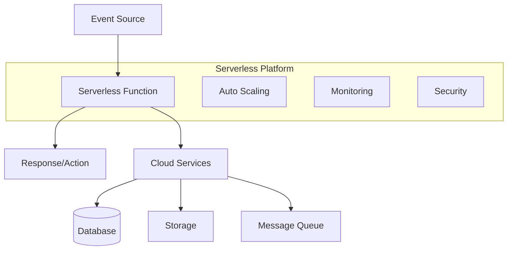

# Serverless Architecture

## Overview

**Serverless architecture refers to a cloud computing model where the cloud provider dynamically manages the allocation of machine resources, and developers deploy their code in the form of functions or services without worrying about the underlying infrastructure.** Despite the name "serverless," servers are still involved, but they are abstracted away from the developer's concern.

## Core Concepts

### Key Characteristics



#### 1. Event-Driven Execution
- Functions are triggered by specific events
- Stateless execution model
- Automatic resource allocation and deallocation

#### 2. Pay-per-Use Model
- Billing based on actual execution time and resource consumption
- No costs when functions are not running
- Granular pricing down to milliseconds

#### 3. Automatic Scaling
- Seamless scaling from zero to thousands of concurrent executions
- No manual configuration required
- Built-in load balancing

#### 4. Managed Infrastructure
- Cloud provider handles server provisioning, maintenance, and updates
- Built-in high availability and fault tolerance
- Automatic security patching

### Function Lifecycle

```javascript
// Serverless function lifecycle example
class ServerlessFunction {
  constructor() {
    this.isWarm = false;
    this.initializationTime = null;
  }
  
  // Cold start initialization
  async initialize() {
    if (!this.isWarm) {
      console.log('Cold start: Initializing function...');
      this.initializationTime = Date.now();
      
      // Initialize connections, load configuration
      await this.setupDatabaseConnection();
      await this.loadConfiguration();
      
      this.isWarm = true;
      console.log(`Initialization completed in ${Date.now() - this.initializationTime}ms`);
    }
  }
  
  // Main function handler
  async handler(event, context) {
    await this.initialize();
    
    try {
      // Process the event
      const result = await this.processEvent(event);
      
      return {
        statusCode: 200,
        headers: {
          'Content-Type': 'application/json',
          'Access-Control-Allow-Origin': '*'
        },
        body: JSON.stringify(result)
      };
    } catch (error) {
      console.error('Function execution error:', error);
      
      return {
        statusCode: 500,
        body: JSON.stringify({
          error: 'Internal server error',
          requestId: context.requestId
        })
      };
    }
  }
  
  async processEvent(event) {
    // Business logic implementation
    switch (event.httpMethod) {
      case 'GET':
        return await this.handleGet(event);
      case 'POST':
        return await this.handlePost(event);
      default:
        throw new Error(`Unsupported method: ${event.httpMethod}`);
    }
  }
}
```

## Serverless Platforms and Services

### 1. AWS Lambda

```javascript
// AWS Lambda function example
const AWS = require('aws-sdk');
const dynamodb = new AWS.DynamoDB.DocumentClient();

exports.handler = async (event, context) => {
  console.log('Event received:', JSON.stringify(event, null, 2));
  
  try {
    switch (event.httpMethod) {
      case 'GET':
        return await getUser(event.pathParameters.id);
      case 'POST':
        return await createUser(JSON.parse(event.body));
      case 'PUT':
        return await updateUser(event.pathParameters.id, JSON.parse(event.body));
      case 'DELETE':
        return await deleteUser(event.pathParameters.id);
      default:
        return {
          statusCode: 405,
          body: JSON.stringify({ error: 'Method not allowed' })
        };
    }
  } catch (error) {
    console.error('Error:', error);
    return {
      statusCode: 500,
      body: JSON.stringify({ error: 'Internal server error' })
    };
  }
};

async function getUser(userId) {
  const params = {
    TableName: 'Users',
    Key: { id: userId }
  };
  
  const result = await dynamodb.get(params).promise();
  
  if (!result.Item) {
    return {
      statusCode: 404,
      body: JSON.stringify({ error: 'User not found' })
    };
  }
  
  return {
    statusCode: 200,
    body: JSON.stringify(result.Item)
  };
}

async function createUser(userData) {
  const user = {
    id: generateUserId(),
    ...userData,
    createdAt: new Date().toISOString()
  };
  
  const params = {
    TableName: 'Users',
    Item: user
  };
  
  await dynamodb.put(params).promise();
  
  return {
    statusCode: 201,
    body: JSON.stringify(user)
  };
}
```

### 2. Azure Functions

```javascript
// Azure Functions example
const { CosmosClient } = require('@azure/cosmos');

module.exports = async function (context, req) {
  context.log('JavaScript HTTP trigger function processed a request.');
  
  const cosmosClient = new CosmosClient({
    endpoint: process.env.COSMOS_DB_ENDPOINT,
    key: process.env.COSMOS_DB_KEY
  });
  
  const database = cosmosClient.database('UserDatabase');
  const container = database.container('Users');
  
  try {
    switch (req.method) {
      case 'GET':
        const user = await getUser(container, req.params.id);
        context.res = {
          status: 200,
          body: user
        };
        break;
        
      case 'POST':
        const newUser = await createUser(container, req.body);
        context.res = {
          status: 201,
          body: newUser
        };
        break;
        
      default:
        context.res = {
          status: 405,
          body: { error: 'Method not allowed' }
        };
    }
  } catch (error) {
    context.log.error('Error processing request:', error);
    context.res = {
      status: 500,
      body: { error: 'Internal server error' }
    };
  }
};

async function getUser(container, userId) {
  const { resource } = await container.item(userId, userId).read();
  return resource;
}

async function createUser(container, userData) {
  const user = {
    id: generateUserId(),
    ...userData,
    createdAt: new Date().toISOString()
  };
  
  const { resource } = await container.items.create(user);
  return resource;
}
```

### 3. Google Cloud Functions

```javascript
// Google Cloud Functions example
const { Firestore } = require('@google-cloud/firestore');
const firestore = new Firestore();

exports.userHandler = async (req, res) => {
  // Enable CORS
  res.set('Access-Control-Allow-Origin', '*');
  res.set('Access-Control-Allow-Methods', 'GET, POST, PUT, DELETE');
  res.set('Access-Control-Allow-Headers', 'Content-Type, Authorization');
  
  if (req.method === 'OPTIONS') {
    return res.status(204).send('');
  }
  
  try {
    switch (req.method) {
      case 'GET':
        const user = await getUser(req.params.id);
        res.status(200).json(user);
        break;
        
      case 'POST':
        const newUser = await createUser(req.body);
        res.status(201).json(newUser);
        break;
        
      case 'PUT':
        const updatedUser = await updateUser(req.params.id, req.body);
        res.status(200).json(updatedUser);
        break;
        
      case 'DELETE':
        await deleteUser(req.params.id);
        res.status(204).send('');
        break;
        
      default:
        res.status(405).json({ error: 'Method not allowed' });
    }
  } catch (error) {
    console.error('Error:', error);
    res.status(500).json({ error: 'Internal server error' });
  }
};

async function getUser(userId) {
  const doc = await firestore.collection('users').doc(userId).get();
  
  if (!doc.exists) {
    throw new Error('User not found');
  }
  
  return { id: doc.id, ...doc.data() };
}

async function createUser(userData) {
  const userRef = firestore.collection('users').doc();
  const user = {
    ...userData,
    createdAt: new Date().toISOString()
  };
  
  await userRef.set(user);
  
  return { id: userRef.id, ...user };
}
```

## Architectural Patterns

### 1. Functions as a Service (FaaS)

```javascript
// Microfunction pattern
class UserMicroFunctions {
  static async createUser(event) {
    const userData = JSON.parse(event.body);
    
    // Validation
    if (!userData.email || !userData.name) {
      return {
        statusCode: 400,
        body: JSON.stringify({ error: 'Email and name are required' })
      };
    }
    
    // Create user
    const user = await UserService.create(userData);
    
    // Trigger welcome email function
    await EventBridge.publish('user.created', user);
    
    return {
      statusCode: 201,
      body: JSON.stringify(user)
    };
  }
  
  static async sendWelcomeEmail(event) {
    const { user } = event.detail;
    
    const emailContent = {
      to: user.email,
      subject: 'Welcome to our platform!',
      template: 'welcome',
      data: { name: user.name }
    };
    
    await EmailService.send(emailContent);
    
    // Log email sent event
    await EventBridge.publish('email.sent', {
      userId: user.id,
      type: 'welcome'
    });
  }
  
  static async processUserAnalytics(event) {
    const { userId, action } = event.detail;
    
    await AnalyticsService.track({
      userId,
      action,
      timestamp: Date.now(),
      source: 'serverless-function'
    });
  }
}
```

### 2. Event-Driven Workflows

```javascript
// Step Functions workflow
const StepFunctions = require('aws-sdk/clients/stepfunctions');
const stepfunctions = new StepFunctions();

class OrderWorkflow {
  static async processOrder(event) {
    const order = JSON.parse(event.body);
    
    // Start Step Functions workflow
    const workflow = {
      stateMachineArn: process.env.ORDER_WORKFLOW_ARN,
      input: JSON.stringify({
        orderId: order.id,
        userId: order.userId,
        items: order.items,
        totalAmount: order.totalAmount
      })
    };
    
    const execution = await stepfunctions.startExecution(workflow).promise();
    
    return {
      statusCode: 202,
      body: JSON.stringify({
        orderId: order.id,
        workflowExecutionArn: execution.executionArn
      })
    };
  }
  
  static async validateInventory(event) {
    const { items } = event;
    
    for (const item of items) {
      const inventory = await InventoryService.check(item.productId);
      
      if (inventory.quantity < item.quantity) {
        throw new Error(`Insufficient inventory for product ${item.productId}`);
      }
    }
    
    return { inventoryValid: true };
  }
  
  static async processPayment(event) {
    const { userId, totalAmount } = event;
    
    const payment = await PaymentService.charge({
      userId,
      amount: totalAmount,
      currency: 'USD'
    });
    
    return {
      paymentId: payment.id,
      status: payment.status
    };
  }
  
  static async fulfillOrder(event) {
    const { orderId, items, paymentId } = event;
    
    // Reserve inventory
    for (const item of items) {
      await InventoryService.reserve(item.productId, item.quantity);
    }
    
    // Create fulfillment order
    const fulfillment = await FulfillmentService.create({
      orderId,
      items,
      paymentId
    });
    
    return fulfillment;
  }
}
```

### 3. API Gateway Integration

```javascript
// API Gateway with Lambda proxy integration
class APIHandler {
  static async handleRequest(event, context) {
    const { httpMethod, path, pathParameters, queryStringParameters, headers, body } = event;
    
    // Request logging
    console.log(`${httpMethod} ${path}`, {
      requestId: context.awsRequestId,
      pathParameters,
      queryStringParameters
    });
    
    try {
      // Route to appropriate handler
      const handler = APIHandler.getHandler(httpMethod, path);
      const result = await handler(event, context);
      
      return APIHandler.formatResponse(result);
    } catch (error) {
      console.error('API Error:', error);
      return APIHandler.formatErrorResponse(error);
    }
  }
  
  static getHandler(method, path) {
    const routes = {
      'GET /users': UserHandlers.getUsers,
      'GET /users/{id}': UserHandlers.getUser,
      'POST /users': UserHandlers.createUser,
      'PUT /users/{id}': UserHandlers.updateUser,
      'DELETE /users/{id}': UserHandlers.deleteUser,
      'GET /orders': OrderHandlers.getOrders,
      'POST /orders': OrderHandlers.createOrder
    };
    
    const routeKey = `${method} ${path}`;
    const handler = routes[routeKey];
    
    if (!handler) {
      throw new Error(`No handler found for ${routeKey}`);
    }
    
    return handler;
  }
  
  static formatResponse(result, statusCode = 200) {
    return {
      statusCode,
      headers: {
        'Content-Type': 'application/json',
        'Access-Control-Allow-Origin': '*',
        'Access-Control-Allow-Credentials': true
      },
      body: JSON.stringify(result)
    };
  }
  
  static formatErrorResponse(error) {
    const statusCode = error.statusCode || 500;
    
    return {
      statusCode,
      headers: {
        'Content-Type': 'application/json',
        'Access-Control-Allow-Origin': '*'
      },
      body: JSON.stringify({
        error: error.message || 'Internal server error',
        timestamp: new Date().toISOString()
      })
    };
  }
}
```

## Benefits and Advantages

### 1. Cost Efficiency

```javascript
// Cost optimization strategies
class CostOptimizer {
  static async optimizeMemoryAllocation(functionName) {
    // Analyze CloudWatch metrics
    const metrics = await CloudWatch.getMetrics({
      functionName,
      startTime: new Date(Date.now() - 7 * 24 * 60 * 60 * 1000), // 7 days
      endTime: new Date()
    });
    
    const avgMemoryUsed = metrics.reduce((sum, metric) => 
      sum + metric.memoryUsed, 0) / metrics.length;
    
    const currentMemory = await Lambda.getFunctionConfiguration({
      FunctionName: functionName
    }).promise();
    
    // Recommend optimal memory size
    const recommendedMemory = Math.ceil(avgMemoryUsed * 1.2); // 20% buffer
    
    if (recommendedMemory < currentMemory.MemorySize) {
      console.log(`Recommendation: Reduce memory from ${currentMemory.MemorySize}MB to ${recommendedMemory}MB`);
      console.log(`Estimated monthly savings: $${calculateMonthlySavings(currentMemory.MemorySize, recommendedMemory)}`);
    }
    
    return {
      currentMemory: currentMemory.MemorySize,
      recommendedMemory,
      avgMemoryUsed
    };
  }
  
  static calculateCostPerInvocation(memoryMB, durationMS) {
    const gbSeconds = (memoryMB / 1024) * (durationMS / 1000);
    const costPerGbSecond = 0.0000166667; // AWS pricing
    const costPerRequest = 0.0000002; // AWS pricing
    
    return (gbSeconds * costPerGbSecond) + costPerRequest;
  }
}
```

### 2. Automatic Scaling

```javascript
// Scaling characteristics demonstration
class ScalingDemo {
  static async handleConcurrentRequests(event) {
    const startTime = Date.now();
    const concurrency = parseInt(event.headers['x-concurrent-executions'] || '1');
    
    console.log(`Handling request with concurrency level: ${concurrency}`);
    
    // Simulate processing time
    await new Promise(resolve => setTimeout(resolve, 1000));
    
    const endTime = Date.now();
    
    return {
      statusCode: 200,
      body: JSON.stringify({
        message: 'Request processed successfully',
        concurrency,
        processingTime: endTime - startTime,
        coldStart: !global.isWarm,
        timestamp: new Date().toISOString()
      })
    };
  }
  
  // Demonstrate burst handling
  static async handleBurstTraffic(event) {
    const batchSize = parseInt(event.queryStringParameters?.batchSize || '1');
    const results = [];
    
    // Process requests in parallel
    const promises = Array.from({ length: batchSize }, async (_, index) => {
      return await this.processItem({
        id: index,
        data: `Item ${index}`,
        timestamp: Date.now()
      });
    });
    
    const processedResults = await Promise.all(promises);
    
    return {
      statusCode: 200,
      body: JSON.stringify({
        batchSize,
        processedCount: processedResults.length,
        results: processedResults
      })
    };
  }
}
```

### 3. Developer Productivity

```javascript
// Simplified deployment and management
class DeploymentAutomation {
  static async deployFunction(functionConfig) {
    const { functionName, runtime, handler, code, environment } = functionConfig;
    
    // Package function code
    const zipBuffer = await this.packageCode(code);
    
    // Deploy to Lambda
    const deployment = await Lambda.createFunction({
      FunctionName: functionName,
      Runtime: runtime,
      Role: process.env.LAMBDA_EXECUTION_ROLE,
      Handler: handler,
      Code: { ZipFile: zipBuffer },
      Environment: { Variables: environment },
      Timeout: 30,
      MemorySize: 256
    }).promise();
    
    // Configure API Gateway
    await this.configureAPIGateway(functionName, deployment.FunctionArn);
    
    // Set up monitoring
    await this.setupMonitoring(functionName);
    
    return {
      functionArn: deployment.FunctionArn,
      apiEndpoint: `https://${process.env.API_GATEWAY_ID}.execute-api.${process.env.AWS_REGION}.amazonaws.com/${functionName}`
    };
  }
  
  static async configureAPIGateway(functionName, functionArn) {
    // Create API Gateway integration
    const apiGateway = new AWS.APIGateway();
    
    await apiGateway.putIntegration({
      restApiId: process.env.API_GATEWAY_ID,
      resourceId: process.env.RESOURCE_ID,
      httpMethod: 'POST',
      type: 'AWS_PROXY',
      integrationHttpMethod: 'POST',
      uri: `arn:aws:apigateway:${process.env.AWS_REGION}:lambda:path/2015-03-31/functions/${functionArn}/invocations`
    }).promise();
    
    // Deploy API
    await apiGateway.createDeployment({
      restApiId: process.env.API_GATEWAY_ID,
      stageName: 'prod'
    }).promise();
  }
}
```

## Challenges and Solutions

### 1. Cold Start Optimization

```javascript
// Cold start mitigation strategies
class ColdStartOptimizer {
  constructor() {
    this.connectionPool = null;
    this.configCache = null;
  }
  
  // Connection reuse
  async getDBConnection() {
    if (!this.connectionPool) {
      console.log('Creating new connection pool...');
      this.connectionPool = new ConnectionPool({
        host: process.env.DB_HOST,
        port: process.env.DB_PORT,
        database: process.env.DB_NAME,
        max: 1, // Single connection for serverless
        idleTimeoutMillis: 30000
      });
    }
    
    return await this.connectionPool.connect();
  }
  
  // Configuration caching
  async getConfiguration() {
    if (!this.configCache) {
      console.log('Loading configuration...');
      this.configCache = await ParameterStore.getParameters([
        'database_url',
        'api_key',
        'encryption_key'
      ]);
    }
    
    return this.configCache;
  }
  
  // Minimize dependencies
  async handler(event, context) {
    // Lazy load heavy dependencies
    if (event.requiresImageProcessing && !this.imageProcessor) {
      const sharp = require('sharp');
      this.imageProcessor = sharp;
    }
    
    // Process request
    return await this.processRequest(event);
  }
  
  // Provisioned concurrency for critical functions
  static async enableProvisionedConcurrency(functionName, concurrency) {
    await Lambda.putProvisionedConcurrencyConfig({
      FunctionName: functionName,
      ProvisionedConcurrencyConfig: {
        ProvisionedConcurrencyCount: concurrency
      }
    }).promise();
    
    console.log(`Enabled provisioned concurrency: ${concurrency} for ${functionName}`);
  }
}

// Warming function
exports.warmer = async (event) => {
  if (event.source === 'aws.events' && event['detail-type'] === 'Scheduled Event') {
    console.log('Warming function...');
    
    // Keep function warm by invoking it periodically
    const functions = [
      'user-service',
      'order-service',
      'payment-service'
    ];
    
    const promises = functions.map(async functionName => {
      return await Lambda.invoke({
        FunctionName: functionName,
        InvocationType: 'Event',
        Payload: JSON.stringify({ source: 'warmer' })
      }).promise();
    });
    
    await Promise.all(promises);
    
    return { statusCode: 200, body: 'Functions warmed' };
  }
  
  return { statusCode: 200, body: 'Function is warm' };
};
```

### 2. State Management

```javascript
// External state management
class StateManager {
  constructor() {
    this.redis = new RedisClient({
      host: process.env.REDIS_HOST,
      port: process.env.REDIS_PORT,
      ttl: 3600 // 1 hour default TTL
    });
  }
  
  async setState(key, value, ttl = 3600) {
    await this.redis.setex(key, ttl, JSON.stringify(value));
  }
  
  async getState(key) {
    const value = await this.redis.get(key);
    return value ? JSON.parse(value) : null;
  }
  
  async deleteState(key) {
    await this.redis.del(key);
  }
  
  // Session management
  async createSession(userId, data) {
    const sessionId = generateSessionId();
    const sessionData = {
      userId,
      ...data,
      createdAt: Date.now()
    };
    
    await this.setState(`session:${sessionId}`, sessionData, 1800); // 30 minutes
    
    return sessionId;
  }
  
  async getSession(sessionId) {
    return await this.getState(`session:${sessionId}`);
  }
  
  async updateSession(sessionId, updates) {
    const session = await this.getSession(sessionId);
    
    if (session) {
      const updatedSession = { ...session, ...updates };
      await this.setState(`session:${sessionId}`, updatedSession, 1800);
      return updatedSession;
    }
    
    return null;
  }
}

// Distributed state with DynamoDB
class DynamoDBStateManager {
  constructor() {
    this.dynamodb = new AWS.DynamoDB.DocumentClient();
    this.tableName = 'ServerlessState';
  }
  
  async saveState(key, value, ttl = 3600) {
    const item = {
      id: key,
      data: value,
      ttl: Math.floor(Date.now() / 1000) + ttl
    };
    
    await this.dynamodb.put({
      TableName: this.tableName,
      Item: item
    }).promise();
  }
  
  async loadState(key) {
    const result = await this.dynamodb.get({
      TableName: this.tableName,
      Key: { id: key }
    }).promise();
    
    if (!result.Item) {
      return null;
    }
    
    // Check if expired
    if (result.Item.ttl < Math.floor(Date.now() / 1000)) {
      await this.deleteState(key);
      return null;
    }
    
    return result.Item.data;
  }
}
```

### 3. Debugging and Observability

```javascript
// Comprehensive logging and monitoring
class ServerlessObservability {
  constructor() {
    this.xray = AWSXRay.captureAWS(AWS);
    this.metrics = new AWS.CloudWatch();
  }
  
  async handler(event, context) {
    const segment = AWSXRay.getSegment();
    const subsegment = segment.addNewSubsegment('business-logic');
    
    try {
      // Structured logging
      this.log('info', 'Function started', {
        requestId: context.awsRequestId,
        functionName: context.functionName,
        event: event
      });
      
      // Add custom annotations for filtering
      subsegment.addAnnotation('userId', event.userId);
      subsegment.addAnnotation('operation', event.operation);
      
      // Process request
      const startTime = Date.now();
      const result = await this.processRequest(event);
      const duration = Date.now() - startTime;
      
      // Custom metrics
      await this.putMetric('ProcessingDuration', duration, 'Milliseconds');
      await this.putMetric('RequestsProcessed', 1, 'Count');
      
      // Add metadata
      subsegment.addMetadata('result', result);
      
      this.log('info', 'Function completed successfully', {
        requestId: context.awsRequestId,
        duration,
        result
      });
      
      return result;
    } catch (error) {
      // Error tracking
      subsegment.addError(error);
      
      this.log('error', 'Function failed', {
        requestId: context.awsRequestId,
        error: error.message,
        stack: error.stack
      });
      
      await this.putMetric('Errors', 1, 'Count');
      
      throw error;
    } finally {
      subsegment.close();
    }
  }
  
  log(level, message, context = {}) {
    const logEntry = {
      level,
      message,
      timestamp: new Date().toISOString(),
      service: 'serverless-function',
      ...context
    };
    
    console.log(JSON.stringify(logEntry));
  }
  
  async putMetric(metricName, value, unit = 'Count') {
    await this.metrics.putMetricData({
      Namespace: 'ServerlessApp',
      MetricData: [{
        MetricName: metricName,
        Value: value,
        Unit: unit,
        Timestamp: new Date()
      }]
    }).promise();
  }
}

// Performance monitoring
class PerformanceMonitor {
  static async trackPerformance(functionName, handler) {
    return async (event, context) => {
      const startTime = Date.now();
      const startMemory = process.memoryUsage();
      
      try {
        const result = await handler(event, context);
        
        const endTime = Date.now();
        const endMemory = process.memoryUsage();
        
        const metrics = {
          functionName,
          duration: endTime - startTime,
          memoryUsed: endMemory.heapUsed - startMemory.heapUsed,
          coldStart: !global.isWarm,
          timestamp: new Date().toISOString()
        };
        
        // Send to monitoring service
        await this.sendMetrics(metrics);
        
        return result;
      } catch (error) {
        await this.recordError(functionName, error);
        throw error;
      }
    };
  }
  
  static async sendMetrics(metrics) {
    // Send to custom monitoring dashboard
    await fetch(process.env.MONITORING_ENDPOINT, {
      method: 'POST',
      headers: { 'Content-Type': 'application/json' },
      body: JSON.stringify(metrics)
    });
  }
}
```

## Security Best Practices

### 1. Function-Level Security

```javascript
// Authentication and authorization
class SecurityHandler {
  static async validateRequest(event, context) {
    const authHeader = event.headers.Authorization || event.headers.authorization;
    
    if (!authHeader) {
      throw new UnauthorizedError('Missing authorization header');
    }
    
    const token = authHeader.replace('Bearer ', '');
    
    try {
      // Validate JWT token
      const decoded = jwt.verify(token, process.env.JWT_SECRET);
      
      // Check token expiration
      if (decoded.exp < Math.floor(Date.now() / 1000)) {
        throw new UnauthorizedError('Token expired');
      }
      
      // Check permissions
      if (!this.hasPermission(decoded, event.httpMethod, event.path)) {
        throw new ForbiddenError('Insufficient permissions');
      }
      
      return decoded;
    } catch (error) {
      throw new UnauthorizedError('Invalid token');
    }
  }
  
  static hasPermission(user, method, path) {
    const requiredPermissions = {
      'GET /users': ['read:users'],
      'POST /users': ['write:users'],
      'PUT /users': ['write:users'],
      'DELETE /users': ['delete:users']
    };
    
    const required = requiredPermissions[`${method} ${path}`] || [];
    return required.every(permission => user.permissions.includes(permission));
  }
  
  // Input validation and sanitization
  static validateInput(data, schema) {
    const { error, value } = schema.validate(data);
    
    if (error) {
      throw new ValidationError(error.details[0].message);
    }
    
    return value;
  }
  
  // Rate limiting
  static async checkRateLimit(userId, functionName) {
    const key = `rate_limit:${functionName}:${userId}`;
    const limit = 100; // requests per minute
    const window = 60; // seconds
    
    const current = await redis.incr(key);
    
    if (current === 1) {
      await redis.expire(key, window);
    }
    
    if (current > limit) {
      throw new RateLimitError('Rate limit exceeded');
    }
    
    return current;
  }
}
```

### 2. Data Protection

```javascript
// Encryption and data handling
class DataProtection {
  constructor() {
    this.kms = new AWS.KMS();
  }
  
  async encryptSensitiveData(data) {
    const params = {
      KeyId: process.env.KMS_KEY_ID,
      Plaintext: JSON.stringify(data)
    };
    
    const result = await this.kms.encrypt(params).promise();
    return result.CiphertextBlob.toString('base64');
  }
  
  async decryptSensitiveData(encryptedData) {
    const params = {
      CiphertextBlob: Buffer.from(encryptedData, 'base64')
    };
    
    const result = await this.kms.decrypt(params).promise();
    return JSON.parse(result.Plaintext.toString());
  }
  
  // PII data handling
  static sanitizePII(data) {
    const sanitized = { ...data };
    
    // Remove or mask sensitive fields
    if (sanitized.ssn) {
      sanitized.ssn = 'XXX-XX-' + sanitized.ssn.slice(-4);
    }
    
    if (sanitized.creditCard) {
      sanitized.creditCard = '**** **** **** ' + sanitized.creditCard.slice(-4);
    }
    
    if (sanitized.email) {
      const [username, domain] = sanitized.email.split('@');
      sanitized.email = username.slice(0, 2) + '***@' + domain;
    }
    
    return sanitized;
  }
  
  // Secure configuration management
  static async getSecureConfig() {
    const ssm = new AWS.SSM();
    
    const params = {
      Names: [
        '/app/database/password',
        '/app/api/key',
        '/app/encryption/secret'
      ],
      WithDecryption: true
    };
    
    const result = await ssm.getParameters(params).promise();
    
    const config = {};
    result.Parameters.forEach(param => {
      const key = param.Name.split('/').pop();
      config[key] = param.Value;
    });
    
    return config;
  }
}
```

## Real-World Use Cases

### 1. Image Processing Service

```javascript
// Serverless image processing pipeline
class ImageProcessor {
  static async processUpload(event) {
    console.log('Image upload event received:', event);
    
    // S3 event triggered the function
    const bucket = event.Records[0].s3.bucket.name;
    const key = event.Records[0].s3.object.key;
    
    try {
      // Download image from S3
      const s3Object = await S3.getObject({ Bucket: bucket, Key: key }).promise();
      const imageBuffer = s3Object.Body;
      
      // Process image - create multiple sizes
      const sizes = [
        { name: 'thumbnail', width: 150, height: 150 },
        { name: 'medium', width: 400, height: 400 },
        { name: 'large', width: 800, height: 800 }
      ];
      
      const processedImages = await Promise.all(
        sizes.map(size => this.resizeImage(imageBuffer, size))
      );
      
      // Upload processed images
      const uploadPromises = processedImages.map(async ({ name, buffer }) => {
        const newKey = key.replace(/\.[^/.]+$/, `_${name}$&`);
        
        return await S3.putObject({
          Bucket: bucket,
          Key: newKey,
          Body: buffer,
          ContentType: 'image/jpeg'
        }).promise();
      });
      
      await Promise.all(uploadPromises);
      
      // Update database with image metadata
      await this.updateImageMetadata(key, processedImages);
      
      // Send notification
      await SNS.publish({
        TopicArn: process.env.IMAGE_PROCESSED_TOPIC,
        Message: JSON.stringify({
          originalKey: key,
          processedSizes: sizes.map(s => s.name),
          timestamp: new Date().toISOString()
        })
      }).promise();
      
      return { statusCode: 200, body: 'Image processed successfully' };
    } catch (error) {
      console.error('Image processing failed:', error);
      
      // Send to DLQ for retry
      await SQS.sendMessage({
        QueueUrl: process.env.FAILED_PROCESSING_QUEUE,
        MessageBody: JSON.stringify({
          bucket,
          key,
          error: error.message,
          timestamp: new Date().toISOString()
        })
      }).promise();
      
      throw error;
    }
  }
  
  static async resizeImage(buffer, { name, width, height }) {
    const sharp = require('sharp');
    
    const resizedBuffer = await sharp(buffer)
      .resize(width, height, {
        fit: 'cover',
        position: 'center'
      })
      .jpeg({ quality: 85 })
      .toBuffer();
    
    return { name, buffer: resizedBuffer };
  }
}
```

### 2. Real-Time Data Processing

```javascript
// Kinesis stream processing
class StreamProcessor {
  static async processKinesisRecords(event) {
    console.log(`Processing ${event.Records.length} records`);
    
    const processedRecords = [];
    const failedRecords = [];
    
    for (const record of event.Records) {
      try {
        // Decode Kinesis data
        const payload = Buffer.from(record.kinesis.data, 'base64').toString();
        const data = JSON.parse(payload);
        
        // Process the record
        const processed = await this.processRecord(data);
        processedRecords.push(processed);
        
      } catch (error) {
        console.error('Failed to process record:', error);
        failedRecords.push({
          recordId: record.kinesis.sequenceNumber,
          error: error.message
        });
      }
    }
    
    // Batch write to database
    if (processedRecords.length > 0) {
      await this.batchWriteToDatabase(processedRecords);
    }
    
    // Handle failed records
    if (failedRecords.length > 0) {
      await this.handleFailedRecords(failedRecords);
    }
    
    return {
      processedCount: processedRecords.length,
      failedCount: failedRecords.length
    };
  }
  
  static async processRecord(data) {
    // Business logic for record processing
    const enriched = {
      ...data,
      processedAt: new Date().toISOString(),
      processingDuration: 0
    };
    
    // Enrich with external data
    if (data.userId) {
      const userInfo = await this.getUserInfo(data.userId);
      enriched.userSegment = userInfo.segment;
      enriched.userTier = userInfo.tier;
    }
    
    // Apply business rules
    enriched.score = this.calculateScore(enriched);
    enriched.category = this.categorizeEvent(enriched);
    
    return enriched;
  }
  
  static async batchWriteToDatabase(records) {
    const batchSize = 25; // DynamoDB batch limit
    const batches = [];
    
    for (let i = 0; i < records.length; i += batchSize) {
      batches.push(records.slice(i, i + batchSize));
    }
    
    const writePromises = batches.map(async batch => {
      const requestItems = {
        [process.env.PROCESSED_DATA_TABLE]: batch.map(record => ({
          PutRequest: { Item: record }
        }))
      };
      
      return await DynamoDB.batchWriteItem({ RequestItems: requestItems }).promise();
    });
    
    await Promise.all(writePromises);
  }
}
```

### 3. Scheduled Data Sync

```javascript
// CloudWatch Events triggered data synchronization
class DataSyncService {
  static async syncCustomerData(event) {
    console.log('Starting customer data sync...');
    
    try {
      // Get last sync timestamp
      const lastSync = await this.getLastSyncTimestamp();
      const currentTime = new Date();
      
      // Fetch updated records from external API
      const updatedCustomers = await this.fetchUpdatedCustomers(lastSync);
      
      console.log(`Found ${updatedCustomers.length} updated customers`);
      
      // Process in batches
      const batchSize = 10;
      for (let i = 0; i < updatedCustomers.length; i += batchSize) {
        const batch = updatedCustomers.slice(i, i + batchSize);
        await this.processBatch(batch);
      }
      
      // Update sync timestamp
      await this.updateSyncTimestamp(currentTime);
      
      // Send metrics
      await CloudWatch.putMetricData({
        Namespace: 'DataSync',
        MetricData: [{
          MetricName: 'CustomersSync',
          Value: updatedCustomers.length,
          Unit: 'Count',
          Timestamp: currentTime
        }]
      }).promise();
      
      return {
        statusCode: 200,
        body: JSON.stringify({
          syncedCount: updatedCustomers.length,
          lastSync: lastSync.toISOString(),
          currentSync: currentTime.toISOString()
        })
      };
      
    } catch (error) {
      console.error('Data sync failed:', error);
      
      // Alert operations team
      await SNS.publish({
        TopicArn: process.env.ALERTS_TOPIC,
        Subject: 'Customer Data Sync Failed',
        Message: JSON.stringify({
          error: error.message,
          timestamp: new Date().toISOString(),
          function: 'syncCustomerData'
        })
      }).promise();
      
      throw error;
    }
  }
  
  static async processBatch(customers) {
    const promises = customers.map(async customer => {
      try {
        // Transform data
        const transformed = this.transformCustomerData(customer);
        
        // Upsert to database
        await DynamoDB.putItem({
          TableName: process.env.CUSTOMERS_TABLE,
          Item: transformed,
          ConditionExpression: 'attribute_not_exists(id) OR #version < :newVersion',
          ExpressionAttributeNames: { '#version': 'version' },
          ExpressionAttributeValues: { ':newVersion': transformed.version }
        }).promise();
        
        // Index for search
        await this.indexCustomer(transformed);
        
        return { id: customer.id, status: 'success' };
      } catch (error) {
        console.error(`Failed to process customer ${customer.id}:`, error);
        return { id: customer.id, status: 'failed', error: error.message };
      }
    });
    
    const results = await Promise.all(promises);
    
    const failed = results.filter(r => r.status === 'failed');
    if (failed.length > 0) {
      console.warn(`${failed.length} customers failed to sync:`, failed);
    }
    
    return results;
  }
}
```

## Performance Optimization

### 1. Memory and Timeout Configuration

```javascript
// Optimize function configuration based on workload
class ConfigurationOptimizer {
  static getOptimalConfiguration(workloadType) {
    const configurations = {
      'api-handler': {
        memorySize: 512,
        timeout: 10,
        description: 'Fast API responses with moderate memory'
      },
      'data-processing': {
        memorySize: 1024,
        timeout: 300,
        description: 'CPU intensive data processing'
      },
      'image-processing': {
        memorySize: 2048,
        timeout: 180,
        description: 'Memory intensive image operations'
      },
      'database-sync': {
        memorySize: 256,
        timeout: 900,
        description: 'I/O intensive operations'
      }
    };
    
    return configurations[workloadType] || configurations['api-handler'];
  }
  
  static async benchmarkFunction(functionName, testCases) {
    const results = [];
    
    for (const testCase of testCases) {
      const { memorySize, payload } = testCase;
      
      // Update function configuration
      await Lambda.updateFunctionConfiguration({
        FunctionName: functionName,
        MemorySize: memorySize
      }).promise();
      
      // Wait for configuration to take effect
      await new Promise(resolve => setTimeout(resolve, 1000));
      
      // Run benchmark
      const startTime = Date.now();
      const result = await Lambda.invoke({
        FunctionName: functionName,
        Payload: JSON.stringify(payload)
      }).promise();
      const endTime = Date.now();
      
      const duration = endTime - startTime;
      const cost = this.calculateCost(memorySize, duration);
      
      results.push({
        memorySize,
        duration,
        cost,
        success: result.StatusCode === 200
      });
    }
    
    return results;
  }
}
```

### 2. Connection Pooling and Caching

```javascript
// Efficient resource management
class ResourceManager {
  constructor() {
    this.connectionPool = null;
    this.cache = new Map();
  }
  
  async getConnection() {
    if (!this.connectionPool) {
      this.connectionPool = mysql.createPool({
        host: process.env.DB_HOST,
        port: process.env.DB_PORT,
        user: process.env.DB_USER,
        password: process.env.DB_PASSWORD,
        database: process.env.DB_NAME,
        connectionLimit: 1, // Single connection for Lambda
        acquireTimeout: 60000,
        timeout: 60000
      });
    }
    
    return this.connectionPool;
  }
  
  async cacheGet(key, fetchFunction, ttl = 300) {
    // Check memory cache first
    if (this.cache.has(key)) {
      const cached = this.cache.get(key);
      if (Date.now() < cached.expires) {
        return cached.value;
      }
      this.cache.delete(key);
    }
    
    // Check Redis cache
    const redisValue = await redis.get(key);
    if (redisValue) {
      const value = JSON.parse(redisValue);
      this.cache.set(key, {
        value,
        expires: Date.now() + (ttl * 1000)
      });
      return value;
    }
    
    // Fetch fresh data
    const value = await fetchFunction();
    
    // Cache in both Redis and memory
    await redis.setex(key, ttl, JSON.stringify(value));
    this.cache.set(key, {
      value,
      expires: Date.now() + (ttl * 1000)
    });
    
    return value;
  }
  
  // Cleanup resources on function end
  async cleanup() {
    if (this.connectionPool) {
      await this.connectionPool.end();
    }
    this.cache.clear();
  }
}
```

## Key Takeaways

1. **Event-Driven Design**: Serverless functions work best when designed around events and stateless execution
2. **Cold Start Awareness**: Implement strategies to minimize cold start impact on performance
3. **Cost Optimization**: Monitor and optimize memory allocation, execution time, and invocation frequency
4. **Security First**: Implement proper authentication, input validation, and data protection
5. **Observability**: Comprehensive logging, monitoring, and tracing are essential for serverless applications
6. **State Management**: Use external services for state persistence and sharing between function invocations
7. **Error Handling**: Implement robust error handling and retry mechanisms for resilient operations

Serverless architecture offers compelling benefits for many use cases, particularly for event-driven workloads, APIs, and data processing tasks. Success requires understanding the platform's characteristics and designing applications accordingly.