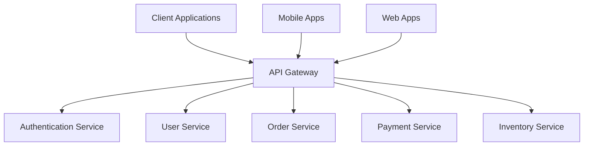

# API Gateway

## Overview

An **API Gateway is a central server that sits between clients (e.g., browsers, mobile apps) and backend services** which processes and routes requests across microservices. It acts as a single entry point for all client requests, providing a unified interface while managing cross-cutting concerns like authentication, rate limiting, and request transformation.

## Core Architecture



## Key Features

### 1. Authentication and Authorization

```javascript
class AuthenticationMiddleware {
  constructor(authService) {
    this.authService = authService;
  }
  
  async authenticate(request) {
    const token = this.extractToken(request);
    
    if (!token) {
      throw new Error('Authentication token required');
    }
    
    try {
      const user = await this.authService.validateToken(token);
      return {
        valid: true,
        user,
        permissions: user.permissions
      };
    } catch (error) {
      return {
        valid: false,
        error: 'Invalid authentication token'
      };
    }
  }
  
  authorize(user, resource, action) {
    const permission = `${resource}:${action}`;
    return user.permissions.includes(permission) || 
           user.permissions.includes(`${resource}:*`) ||
           user.permissions.includes('*:*');
  }
  
  extractToken(request) {
    const authHeader = request.headers.authorization;
    if (authHeader && authHeader.startsWith('Bearer ')) {
      return authHeader.substring(7);
    }
    return null;
  }
}
```

### 2. Rate Limiting

```javascript
class RateLimiter {
  constructor() {
    this.windowSizeMs = 60000; // 1 minute
    this.maxRequests = 100;
    this.clients = new Map();
  }
  
  async checkRateLimit(clientId, endpoint) {
    const now = Date.now();
    const windowStart = now - this.windowSizeMs;
    
    if (!this.clients.has(clientId)) {
      this.clients.set(clientId, new Map());
    }
    
    const clientRequests = this.clients.get(clientId);
    
    if (!clientRequests.has(endpoint)) {
      clientRequests.set(endpoint, []);
    }
    
    const requests = clientRequests.get(endpoint);
    
    // Remove old requests outside the window
    const recentRequests = requests.filter(time => time > windowStart);
    clientRequests.set(endpoint, recentRequests);
    
    if (recentRequests.length >= this.maxRequests) {
      return {
        allowed: false,
        retryAfter: Math.ceil((recentRequests[0] - windowStart) / 1000)
      };
    }
    
    // Add current request
    recentRequests.push(now);
    
    return {
      allowed: true,
      remaining: this.maxRequests - recentRequests.length
    };
  }
}
```

### 3. Load Balancing

```javascript
class LoadBalancer {
  constructor() {
    this.services = new Map();
    this.healthChecks = new Map();
  }
  
  registerService(serviceName, instances) {
    this.services.set(serviceName, {
      instances: instances.map(instance => ({
        ...instance,
        healthy: true,
        activeConnections: 0
      })),
      strategy: 'round-robin'
    });
    
    this.startHealthChecks(serviceName);
  }
  
  selectInstance(serviceName) {
    const service = this.services.get(serviceName);
    if (!service) {
      throw new Error(`Service ${serviceName} not found`);
    }
    
    const healthyInstances = service.instances.filter(i => i.healthy);
    
    if (healthyInstances.length === 0) {
      throw new Error(`No healthy instances for service ${serviceName}`);
    }
    
    switch (service.strategy) {
      case 'round-robin':
        return this.roundRobin(healthyInstances);
      case 'least-connections':
        return this.leastConnections(healthyInstances);
      case 'weighted':
        return this.weighted(healthyInstances);
      default:
        return healthyInstances[0];
    }
  }
  
  roundRobin(instances) {
    const service = this.getCurrentService();
    service.currentIndex = (service.currentIndex || 0) % instances.length;
    return instances[service.currentIndex++];
  }
  
  leastConnections(instances) {
    return instances.reduce((min, instance) => 
      instance.activeConnections < min.activeConnections ? instance : min
    );
  }
}
```

### 4. Request Transformation

```javascript
class RequestTransformer {
  constructor() {
    this.transformations = new Map();
  }
  
  registerTransformation(path, transformation) {
    this.transformations.set(path, transformation);
  }
  
  async transformRequest(request) {
    const transformation = this.getTransformation(request.path);
    
    if (!transformation) {
      return request;
    }
    
    return {
      ...request,
      headers: await this.transformHeaders(request.headers, transformation.headers),
      body: await this.transformBody(request.body, transformation.body),
      path: this.transformPath(request.path, transformation.path)
    };
  }
  
  async transformResponse(response, request) {
    const transformation = this.getTransformation(request.path);
    
    if (!transformation || !transformation.response) {
      return response;
    }
    
    return {
      ...response,
      headers: await this.transformHeaders(response.headers, transformation.response.headers),
      body: await this.transformBody(response.body, transformation.response.body)
    };
  }
  
  transformHeaders(headers, headerTransformation) {
    if (!headerTransformation) return headers;
    
    const transformed = { ...headers };
    
    // Add headers
    if (headerTransformation.add) {
      Object.assign(transformed, headerTransformation.add);
    }
    
    // Remove headers
    if (headerTransformation.remove) {
      headerTransformation.remove.forEach(header => {
        delete transformed[header];
      });
    }
    
    return transformed;
  }
}
```

### 5. Caching

```javascript
class GatewayCaching {
  constructor(cache) {
    this.cache = cache;
    this.cacheableRoutes = new Map();
  }
  
  configureCaching(route, config) {
    this.cacheableRoutes.set(route, {
      ttl: config.ttl || 300,
      keyGenerator: config.keyGenerator || this.defaultKeyGenerator,
      condition: config.condition || (() => true)
    });
  }
  
  async getCachedResponse(request) {
    const config = this.getCacheConfig(request.path);
    
    if (!config || !config.condition(request)) {
      return null;
    }
    
    const cacheKey = config.keyGenerator(request);
    return await this.cache.get(cacheKey);
  }
  
  async cacheResponse(request, response) {
    const config = this.getCacheConfig(request.path);
    
    if (!config || !config.condition(request) || response.status !== 200) {
      return;
    }
    
    const cacheKey = config.keyGenerator(request);
    await this.cache.set(cacheKey, response, config.ttl);
  }
  
  defaultKeyGenerator(request) {
    return `gateway:${request.method}:${request.path}:${JSON.stringify(request.query)}`;
  }
}
```

### 6. Service Discovery

```javascript
class ServiceDiscovery {
  constructor() {
    this.registry = new Map();
    this.watchers = new Map();
  }
  
  async registerService(serviceName, instance) {
    if (!this.registry.has(serviceName)) {
      this.registry.set(serviceName, new Set());
    }
    
    this.registry.get(serviceName).add(instance);
    
    // Start health checking
    this.startHealthCheck(serviceName, instance);
    
    // Notify watchers
    this.notifyWatchers(serviceName);
  }
  
  async discoverService(serviceName) {
    return Array.from(this.registry.get(serviceName) || []);
  }
  
  watchService(serviceName, callback) {
    if (!this.watchers.has(serviceName)) {
      this.watchers.set(serviceName, new Set());
    }
    
    this.watchers.get(serviceName).add(callback);
  }
  
  async startHealthCheck(serviceName, instance) {
    setInterval(async () => {
      try {
        const response = await fetch(`${instance.url}/health`);
        if (!response.ok) {
          this.markUnhealthy(serviceName, instance);
        }
      } catch (error) {
        this.markUnhealthy(serviceName, instance);
      }
    }, 30000); // Check every 30 seconds
  }
  
  markUnhealthy(serviceName, instance) {
    const instances = this.registry.get(serviceName);
    if (instances) {
      instances.delete(instance);
      this.notifyWatchers(serviceName);
    }
  }
}
```

## Complete API Gateway Implementation

```javascript
class APIGateway {
  constructor(config) {
    this.config = config;
    this.auth = new AuthenticationMiddleware(config.authService);
    this.rateLimiter = new RateLimiter();
    this.loadBalancer = new LoadBalancer();
    this.transformer = new RequestTransformer();
    this.cache = new GatewayCaching(config.cache);
    this.serviceDiscovery = new ServiceDiscovery();
    this.routes = new Map();
    
    this.setupRoutes();
  }
  
  async handleRequest(request) {
    const startTime = Date.now();
    
    try {
      // 1. Authentication
      const authResult = await this.auth.authenticate(request);
      if (!authResult.valid) {
        return this.errorResponse(401, 'Unauthorized');
      }
      
      // 2. Rate limiting
      const rateLimitResult = await this.rateLimiter.checkRateLimit(
        authResult.user.id, 
        request.path
      );
      
      if (!rateLimitResult.allowed) {
        return this.errorResponse(429, 'Too Many Requests', {
          'Retry-After': rateLimitResult.retryAfter
        });
      }
      
      // 3. Check cache
      const cachedResponse = await this.cache.getCachedResponse(request);
      if (cachedResponse) {
        return this.addMetrics(cachedResponse, startTime, 'cache-hit');
      }
      
      // 4. Route resolution
      const route = this.resolveRoute(request.path);
      if (!route) {
        return this.errorResponse(404, 'Route not found');
      }
      
      // 5. Authorization
      if (!this.auth.authorize(authResult.user, route.resource, request.method)) {
        return this.errorResponse(403, 'Forbidden');
      }
      
      // 6. Service discovery and load balancing
      const serviceInstance = this.loadBalancer.selectInstance(route.service);
      
      // 7. Request transformation
      const transformedRequest = await this.transformer.transformRequest(request);
      
      // 8. Forward request
      const response = await this.forwardRequest(serviceInstance, transformedRequest);
      
      // 9. Response transformation
      const transformedResponse = await this.transformer.transformResponse(response, request);
      
      // 10. Cache response
      await this.cache.cacheResponse(request, transformedResponse);
      
      return this.addMetrics(transformedResponse, startTime, 'success');
      
    } catch (error) {
      console.error('Gateway error:', error);
      return this.addMetrics(
        this.errorResponse(500, 'Internal Server Error'),
        startTime,
        'error'
      );
    }
  }
  
  async forwardRequest(serviceInstance, request) {
    const url = `${serviceInstance.url}${request.path}`;
    
    serviceInstance.activeConnections++;
    
    try {
      const response = await fetch(url, {
        method: request.method,
        headers: request.headers,
        body: request.body
      });
      
      return {
        status: response.status,
        headers: Object.fromEntries(response.headers.entries()),
        body: await response.text()
      };
    } finally {
      serviceInstance.activeConnections--;
    }
  }
  
  resolveRoute(path) {
    for (const [pattern, route] of this.routes) {
      if (this.matchRoute(pattern, path)) {
        return route;
      }
    }
    return null;
  }
  
  errorResponse(status, message, headers = {}) {
    return {
      status,
      headers: {
        'Content-Type': 'application/json',
        ...headers
      },
      body: JSON.stringify({ error: message })
    };
  }
}
```

## Benefits

### 1. Simplified Client Interactions
- **Single Entry Point**: Clients only need to know one URL
- **Unified Interface**: Consistent API across all services
- **Protocol Translation**: Handle different protocols (HTTP, gRPC, WebSocket)

### 2. Centralized Operational Tasks
- **Cross-cutting Concerns**: Authentication, logging, monitoring in one place
- **Policy Enforcement**: Consistent security and operational policies
- **Configuration Management**: Central configuration for all services

### 3. Enhanced System Security
- **Attack Surface Reduction**: Single point for security measures
- **Input Validation**: Centralized request validation
- **Security Policies**: Consistent security enforcement

### 4. Improved Scalability and Performance
- **Load Distribution**: Intelligent routing and load balancing
- **Caching**: Response caching for improved performance
- **Circuit Breaking**: Prevent cascade failures

## Use Cases

### 1. Microservices Architecture

```javascript
const microservicesGateway = new APIGateway({
  routes: {
    '/api/users/*': { service: 'user-service', resource: 'users' },
    '/api/orders/*': { service: 'order-service', resource: 'orders' },
    '/api/payments/*': { service: 'payment-service', resource: 'payments' },
    '/api/inventory/*': { service: 'inventory-service', resource: 'inventory' }
  }
});
```

### 2. Legacy System Modernization

```javascript
const legacyGateway = new APIGateway({
  transformations: {
    '/api/v2/customers': {
      target: '/legacy/customer-service',
      requestTransform: modernToLegacyFormat,
      responseTransform: legacyToModernFormat
    }
  }
});
```

### 3. Multi-tenant Applications

```javascript
class MultiTenantGateway extends APIGateway {
  async handleRequest(request) {
    const tenant = this.extractTenant(request);
    
    // Route to tenant-specific services
    const tenantConfig = await this.getTenantConfig(tenant);
    
    return super.handleRequest({
      ...request,
      tenant,
      config: tenantConfig
    });
  }
}
```

## Implementation Example: Food Delivery App

```javascript
class FoodDeliveryGateway extends APIGateway {
  setupRoutes() {
    // User management
    this.routes.set('/api/auth/*', {
      service: 'auth-service',
      resource: 'auth',
      cache: { ttl: 0 } // No caching for auth
    });
    
    // Restaurant listings
    this.routes.set('/api/restaurants', {
      service: 'restaurant-service',
      resource: 'restaurants',
      cache: { ttl: 300 } // 5 minutes
    });
    
    // Order management
    this.routes.set('/api/orders/*', {
      service: 'order-service',
      resource: 'orders',
      rateLimit: { requests: 10, window: 60 } // 10 requests per minute
    });
    
    // Payment processing
    this.routes.set('/api/payments/*', {
      service: 'payment-service',
      resource: 'payments',
      security: 'high',
      timeout: 30000
    });
    
    // Delivery tracking
    this.routes.set('/api/delivery/*', {
      service: 'delivery-service',
      resource: 'delivery',
      realtime: true
    });
  }
  
  async processOrderRequest(request) {
    // 1. Validate order data
    const validation = await this.validateOrder(request.body);
    if (!validation.valid) {
      return this.errorResponse(400, validation.errors);
    }
    
    // 2. Check restaurant availability
    const restaurant = await this.checkRestaurantAvailability(request.body.restaurantId);
    if (!restaurant.available) {
      return this.errorResponse(503, 'Restaurant unavailable');
    }
    
    // 3. Process payment
    const payment = await this.processPayment(request.body.paymentInfo);
    if (!payment.success) {
      return this.errorResponse(402, 'Payment failed');
    }
    
    // 4. Create order
    const order = await this.createOrder({
      ...request.body,
      paymentId: payment.id
    });
    
    // 5. Assign delivery
    await this.assignDelivery(order.id);
    
    return {
      status: 201,
      body: JSON.stringify(order)
    };
  }
}
```

## Popular API Gateway Solutions

### 1. Kong
```yaml
services:
- name: user-service
  url: http://user-service:8080
  
routes:
- name: user-route
  service: user-service
  paths:
  - /api/users
  
plugins:
- name: rate-limiting
  config:
    minute: 100
- name: jwt
- name: cors
```

### 2. AWS API Gateway
```yaml
Resources:
  UserAPI:
    Type: AWS::ApiGateway::RestApi
    Properties:
      Name: UserAPI
      
  UserResource:
    Type: AWS::ApiGateway::Resource
    Properties:
      RestApiId: !Ref UserAPI
      PathPart: users
      
  UserMethod:
    Type: AWS::ApiGateway::Method
    Properties:
      HttpMethod: GET
      ResourceId: !Ref UserResource
      AuthorizationType: AWS_IAM
```

### 3. Nginx as API Gateway
```nginx
upstream user_service {
    server user-service:8080;
}

upstream order_service {
    server order-service:8080;
}

server {
    listen 80;
    
    # Rate limiting
    limit_req_zone $binary_remote_addr zone=api:10m rate=10r/s;
    
    location /api/users {
        limit_req zone=api burst=20 nodelay;
        proxy_pass http://user_service;
        proxy_set_header Host $host;
    }
    
    location /api/orders {
        limit_req zone=api burst=20 nodelay;
        proxy_pass http://order_service;
        proxy_set_header Host $host;
    }
}
```

## Best Practices

### 1. Design Principles
```javascript
const gatewayPrinciples = {
  singleResponsibility: 'Handle only cross-cutting concerns',
  stateless: 'Maintain no session state',
  resilient: 'Implement circuit breakers and timeouts',
  observable: 'Comprehensive logging and monitoring',
  secure: 'Defense in depth security measures'
};
```

### 2. Performance Optimization
```javascript
class OptimizedGateway extends APIGateway {
  constructor(config) {
    super(config);
    this.connectionPool = new ConnectionPool({
      maxConnections: 100,
      keepAlive: true
    });
  }
  
  async forwardRequest(serviceInstance, request) {
    // Use connection pooling
    const connection = await this.connectionPool.getConnection(serviceInstance.url);
    
    try {
      return await connection.request(request);
    } finally {
      this.connectionPool.releaseConnection(connection);
    }
  }
}
```

### 3. Monitoring and Observability
```javascript
class ObservableGateway extends APIGateway {
  async handleRequest(request) {
    const traceId = this.generateTraceId();
    const span = this.tracer.startSpan('gateway.request', { traceId });
    
    try {
      const response = await super.handleRequest({
        ...request,
        traceId
      });
      
      span.setTag('http.status_code', response.status);
      return response;
    } catch (error) {
      span.setTag('error', true);
      span.log({ event: 'error', message: error.message });
      throw error;
    } finally {
      span.finish();
    }
  }
}
```

## Key Takeaways

1. **Centralized Management**: API gateways provide a single point for managing cross-cutting concerns
2. **Simplified Architecture**: Reduce complexity for client applications
3. **Enhanced Security**: Centralized security policies and enforcement
4. **Improved Performance**: Caching, load balancing, and request optimization
5. **Operational Excellence**: Comprehensive monitoring, logging, and metrics
6. **Scalability**: Support for microservices and distributed architectures

API gateways are essential building blocks for modern distributed systems, enabling secure, scalable, and maintainable service-oriented architectures.