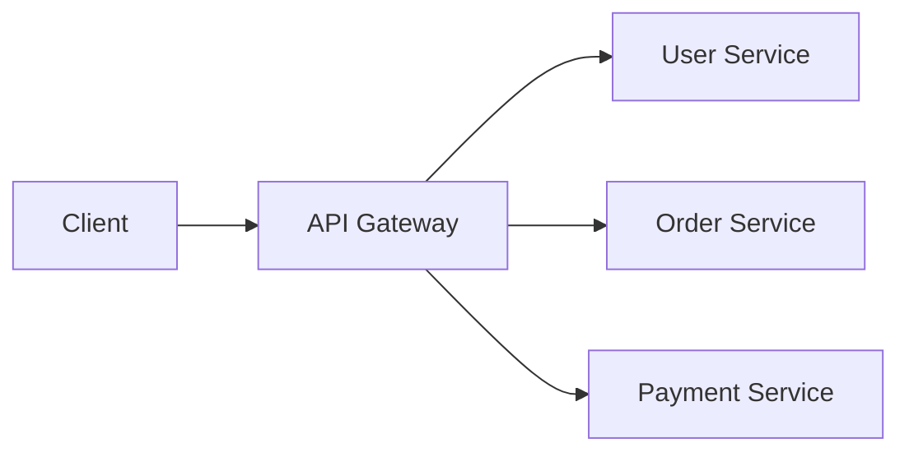

# APIs (Application Programming Interfaces)

## Overview

**API stands for Application Programming Interface** - a fundamental building block that serves as a middleman enabling applications to interact without needing direct access to each other's code or database. At its core, an API is "a bunch of code that takes an input and gives you predictable outputs."

## Core Concepts

### Definition and Purpose

An API acts as a contract between different software components, defining how they can communicate. It abstracts the complexity of underlying systems and provides a standardized way for applications to interact.

### Request-Response Model

APIs follow a fundamental request-response pattern:

1. **Client** sends a request to an API
2. **API** processes the request and returns a structured response
3. **Response** typically uses formats like JSON or XML

```json
// Example API Request
GET /api/users/123

// Example API Response
{
  "id": 123,
  "name": "John Doe",
  "email": "john@example.com",
  "created_at": "2024-01-15T10:30:00Z"
}
```

## Types of APIs

### 1. Open/Public APIs

- **Accessibility**: Available to external developers
- **Restrictions**: Minimal limitations
- **Use Cases**: Third-party integrations, public data access
- **Example**: YouTube Data API, Twitter API

```javascript
// Example: Public API usage
fetch('https://api.github.com/users/octocat')
  .then(response => response.json())
  .then(data => console.log(data));
```

### 2. Internal/Private APIs

- **Accessibility**: Exclusively for organizational use
- **Purpose**: Facilitate communication between internal systems
- **Benefits**: Microservices architecture, system modularity
- **Security**: Enhanced control and access restrictions

### 3. Code Interfaces/Library APIs

- **Definition**: Predefined functions within programming languages
- **Purpose**: Simplify development by abstracting complex operations
- **Examples**: Standard library functions, framework methods

```python
# Example: Library API usage
import requests

# Using requests library API
response = requests.get('https://api.example.com/data')
data = response.json()
```

## Communication Protocols

### REST (Representational State Transfer)

- **Most Common**: Widely adopted web API standard
- **HTTP Methods**: GET, POST, PUT, DELETE
- **Stateless**: Each request contains all necessary information
- **Resource-Based**: URLs represent resources

```http
GET    /api/users          # Retrieve all users
GET    /api/users/123      # Retrieve specific user
POST   /api/users          # Create new user
PUT    /api/users/123      # Update user
DELETE /api/users/123      # Delete user
```

### SOAP (Simple Object Access Protocol)

- **Protocol**: XML-based messaging protocol
- **Features**: Built-in error handling, security
- **Use Cases**: Enterprise applications, complex transactions

### GraphQL

- **Query Language**: Flexible data fetching
- **Single Endpoint**: One URL for all operations
- **Precise Data**: Request exactly what you need

```graphql
query {
  user(id: "123") {
    name
    email
    posts {
      title
      createdAt
    }
  }
}
```

### gRPC

- **High Performance**: Binary protocol using Protocol Buffers
- **Features**: Streaming, strong typing, code generation
- **Use Cases**: Microservices, high-throughput systems

## API Best Practices

### Authentication and Security

```javascript
// API Key Authentication
const headers = {
  'Authorization': 'Bearer YOUR_API_KEY',
  'Content-Type': 'application/json'
};

// OAuth 2.0 Authentication
const headers = {
  'Authorization': 'Bearer ' + accessToken,
  'Content-Type': 'application/json'
};
```

### Error Handling

```javascript
async function callAPI() {
  try {
    const response = await fetch('/api/data');
    
    if (!response.ok) {
      throw new Error(`HTTP error! status: ${response.status}`);
    }
    
    const data = await response.json();
    return data;
  } catch (error) {
    console.error('API call failed:', error);
    // Handle error appropriately
  }
}
```

### Rate Limiting

```javascript
// Implement exponential backoff
async function apiCallWithRetry(url, options, maxRetries = 3) {
  for (let i = 0; i < maxRetries; i++) {
    try {
      const response = await fetch(url, options);
      
      if (response.status === 429) {
        // Rate limited - wait and retry
        const delay = Math.pow(2, i) * 1000;
        await new Promise(resolve => setTimeout(resolve, delay));
        continue;
      }
      
      return response;
    } catch (error) {
      if (i === maxRetries - 1) throw error;
    }
  }
}
```

## Real-World Examples

### Weather API

```javascript
// Input: City name
// Output: Temperature and weather conditions
const getWeather = async (city) => {
  const response = await fetch(`/api/weather?city=${city}`);
  return response.json();
};

// Usage
const weather = await getWeather('London');
console.log(`Temperature: ${weather.temperature}°C`);
```

### Payment Processing API

```javascript
// Input: Payment details
// Output: Transaction result
const processPayment = async (paymentData) => {
  const response = await fetch('/api/payments', {
    method: 'POST',
    headers: {
      'Content-Type': 'application/json',
      'Authorization': 'Bearer ' + apiKey
    },
    body: JSON.stringify(paymentData)
  });
  
  return response.json();
};
```

### Ride-Sharing API

```javascript
// Input: Pickup and destination locations
// Output: Available drivers and fare estimate
const requestRide = async (pickup, destination) => {
  const response = await fetch('/api/rides/request', {
    method: 'POST',
    headers: { 'Content-Type': 'application/json' },
    body: JSON.stringify({ pickup, destination })
  });
  
  return response.json();
};
```

## API Design Principles

### RESTful Design

1. **Resource Identification**: Use nouns for resources
2. **HTTP Methods**: Use appropriate verbs (GET, POST, PUT, DELETE)
3. **Status Codes**: Return meaningful HTTP status codes
4. **Consistent Naming**: Use consistent URL patterns

```http
# Good RESTful API design
GET    /api/v1/users
POST   /api/v1/users
GET    /api/v1/users/{id}
PUT    /api/v1/users/{id}
DELETE /api/v1/users/{id}
```

### Versioning

```http
# URL Versioning
GET /api/v1/users
GET /api/v2/users

# Header Versioning
GET /api/users
Accept: application/vnd.api+json;version=1
```

### Documentation

- **Clear Examples**: Provide request/response examples
- **Error Codes**: Document all possible error scenarios
- **Rate Limits**: Specify usage limitations
- **Authentication**: Explain authentication methods

## Modern API Architecture

### Microservices Integration

Modern digital services are essentially "a collection of APIs with a polished user interface on top." APIs enable:

- **Service Decomposition**: Breaking monoliths into microservices
- **Technology Diversity**: Different services using different technologies
- **Independent Scaling**: Scale services based on demand
- **Team Autonomy**: Teams can work independently on services

### API Gateway Pattern



## Performance Considerations

### Caching

```javascript
// Client-side caching
const cache = new Map();

async function getCachedData(url) {
  if (cache.has(url)) {
    return cache.get(url);
  }
  
  const data = await fetch(url).then(r => r.json());
  cache.set(url, data);
  return data;
}
```

### Pagination

```javascript
// Cursor-based pagination
GET /api/users?cursor=abc123&limit=20

// Offset-based pagination
GET /api/users?page=2&size=20
```

## Key Takeaways

1. **Abstraction Layer**: APIs hide implementation complexity
2. **Standardization**: Enable consistent communication protocols
3. **Modularity**: Support microservices and distributed architectures
4. **Integration**: Facilitate third-party and internal system connections
5. **Scalability**: Enable independent scaling of system components

APIs are the fundamental building blocks that power modern software architecture, enabling everything from simple data retrieval to complex distributed system orchestration.