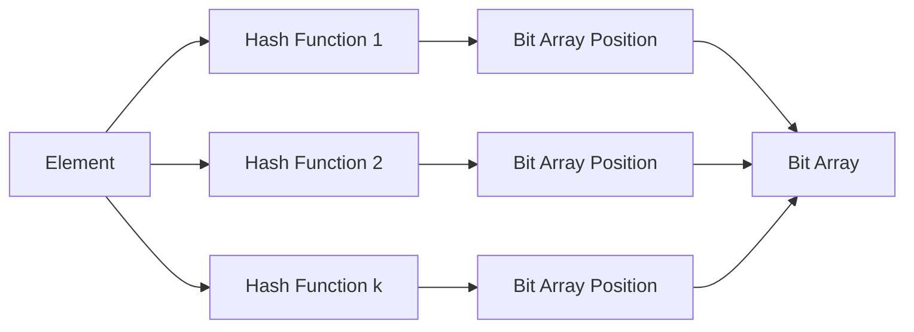

# Bloom Filters

## Overview

**A Bloom filter is a probabilistic data structure that allows you to quickly check whether an element might be in a set.** It's extremely memory-efficient and provides very fast lookups, making it ideal for scenarios where you need to test set membership but can tolerate false positives.

## Core Concepts

### How Bloom Filters Work



### Key Components

1. **Bit Array**: A fixed-size array of bits, initially all set to 0
2. **Hash Functions**: Multiple independent hash functions that map elements to array positions
3. **Elements**: Items to be added to the set

### Basic Operations

#### Insertion Process

```javascript
class BloomFilter {
  constructor(size, hashFunctions) {
    this.size = size;
    this.bitArray = new Array(size).fill(0);
    this.hashFunctions = hashFunctions;
  }
  
  add(element) {
    this.hashFunctions.forEach(hashFunc => {
      const index = hashFunc(element) % this.size;
      this.bitArray[index] = 1;
    });
  }
}
```

#### Membership Testing

```javascript
mightContain(element) {
  return this.hashFunctions.every(hashFunc => {
    const index = hashFunc(element) % this.size;
    return this.bitArray[index] === 1;
  });
}
```

## Characteristics

### Advantages

1. **Space Efficiency**: Uses minimal memory regardless of element size
2. **Fast Operations**: Constant time O(k) for both insertion and lookup
3. **No False Negatives**: If filter says "no", element is definitely not in set
4. **Scalable**: Performance doesn't degrade with set size

### Limitations

1. **False Positives**: May incorrectly report element presence
2. **No Deletions**: Standard implementation doesn't support element removal
3. **No Element Retrieval**: Can only test membership, not retrieve elements
4. **Hash Collision Vulnerability**: Multiple elements may map to same positions

## Implementation Examples

### Basic Bloom Filter in JavaScript

```javascript
class SimpleBloomFilter {
  constructor(expectedElements, falsePositiveRate = 0.01) {
    // Calculate optimal bit array size
    this.size = Math.ceil(
      -(expectedElements * Math.log(falsePositiveRate)) / 
      (Math.log(2) ** 2)
    );
    
    // Calculate optimal number of hash functions
    this.hashCount = Math.ceil(
      (this.size / expectedElements) * Math.log(2)
    );
    
    this.bitArray = new Array(this.size).fill(0);
  }
  
  // Simple hash function family using different seeds
  hash(element, seed) {
    let hash = 0;
    const str = element.toString();
    
    for (let i = 0; i < str.length; i++) {
      hash = ((hash << 5) - hash + str.charCodeAt(i) + seed) & 0xffffffff;
    }
    
    return Math.abs(hash);
  }
  
  add(element) {
    for (let i = 0; i < this.hashCount; i++) {
      const index = this.hash(element, i) % this.size;
      this.bitArray[index] = 1;
    }
  }
  
  mightContain(element) {
    for (let i = 0; i < this.hashCount; i++) {
      const index = this.hash(element, i) % this.size;
      if (this.bitArray[index] === 0) {
        return false; // Definitely not in set
      }
    }
    return true; // Probably in set
  }
  
  // Calculate current false positive probability
  getFalsePositiveRate() {
    const setBits = this.bitArray.reduce((sum, bit) => sum + bit, 0);
    return Math.pow(setBits / this.size, this.hashCount);
  }
}
```

### Advanced Bloom Filter with Metrics

```javascript
class AdvancedBloomFilter extends SimpleBloomFilter {
  constructor(expectedElements, falsePositiveRate = 0.01) {
    super(expectedElements, falsePositiveRate);
    this.addedElements = 0;
    this.lookupCount = 0;
    this.falsePositiveCount = 0;
  }
  
  add(element) {
    super.add(element);
    this.addedElements++;
  }
  
  mightContain(element) {
    this.lookupCount++;
    return super.mightContain(element);
  }
  
  // Test with known false positive (for metrics)
  testLookup(element, isActuallyPresent) {
    const result = this.mightContain(element);
    
    if (result && !isActuallyPresent) {
      this.falsePositiveCount++;
    }
    
    return result;
  }
  
  getMetrics() {
    return {
      size: this.size,
      hashFunctions: this.hashCount,
      addedElements: this.addedElements,
      totalLookups: this.lookupCount,
      falsePositives: this.falsePositiveCount,
      actualFalsePositiveRate: this.falsePositiveCount / this.lookupCount,
      expectedFalsePositiveRate: this.getFalsePositiveRate(),
      fillRatio: this.bitArray.reduce((sum, bit) => sum + bit, 0) / this.size
    };
  }
}
```

### Python Implementation

```python
import hashlib
import math
from typing import Any

class BloomFilter:
    def __init__(self, expected_elements: int, false_positive_rate: float = 0.01):
        # Calculate optimal parameters
        self.size = int(-(expected_elements * math.log(false_positive_rate)) / 
                       (math.log(2) ** 2))
        self.hash_count = int((self.size / expected_elements) * math.log(2))
        self.bit_array = [0] * self.size
        self.added_elements = 0
    
    def _hash(self, element: Any, seed: int) -> int:
        """Generate hash using different seeds"""
        data = str(element).encode('utf-8')
        hash_obj = hashlib.md5(data + str(seed).encode('utf-8'))
        return int(hash_obj.hexdigest(), 16) % self.size
    
    def add(self, element: Any) -> None:
        """Add element to the filter"""
        for i in range(self.hash_count):
            index = self._hash(element, i)
            self.bit_array[index] = 1
        self.added_elements += 1
    
    def might_contain(self, element: Any) -> bool:
        """Test if element might be in the set"""
        for i in range(self.hash_count):
            index = self._hash(element, i)
            if self.bit_array[index] == 0:
                return False
        return True
    
    def false_positive_rate(self) -> float:
        """Calculate current false positive probability"""
        set_bits = sum(self.bit_array)
        return (set_bits / self.size) ** self.hash_count
```

## Advanced Variants

### Counting Bloom Filter

```javascript
class CountingBloomFilter {
  constructor(expectedElements, falsePositiveRate = 0.01) {
    this.size = Math.ceil(
      -(expectedElements * Math.log(falsePositiveRate)) / 
      (Math.log(2) ** 2)
    );
    this.hashCount = Math.ceil(
      (this.size / expectedElements) * Math.log(2)
    );
    
    // Use counters instead of bits
    this.counters = new Array(this.size).fill(0);
  }
  
  add(element) {
    for (let i = 0; i < this.hashCount; i++) {
      const index = this.hash(element, i) % this.size;
      this.counters[index]++;
    }
  }
  
  remove(element) {
    // Check if element might be present first
    if (!this.mightContain(element)) {
      return false; // Element definitely not present
    }
    
    for (let i = 0; i < this.hashCount; i++) {
      const index = this.hash(element, i) % this.size;
      if (this.counters[index] > 0) {
        this.counters[index]--;
      }
    }
    return true;
  }
  
  mightContain(element) {
    for (let i = 0; i < this.hashCount; i++) {
      const index = this.hash(element, i) % this.size;
      if (this.counters[index] === 0) {
        return false;
      }
    }
    return true;
  }
  
  hash(element, seed) {
    // Same hash implementation as before
    let hash = 0;
    const str = element.toString();
    
    for (let i = 0; i < str.length; i++) {
      hash = ((hash << 5) - hash + str.charCodeAt(i) + seed) & 0xffffffff;
    }
    
    return Math.abs(hash);
  }
}
```

### Scalable Bloom Filter

```javascript
class ScalableBloomFilter {
  constructor(initialCapacity = 1000, falsePositiveRate = 0.01, growthFactor = 2) {
    this.filters = [];
    this.initialCapacity = initialCapacity;
    this.falsePositiveRate = falsePositiveRate;
    this.growthFactor = growthFactor;
    this.addedElements = 0;
    
    // Create first filter
    this.addNewFilter();
  }
  
  addNewFilter() {
    const capacity = this.initialCapacity * (this.growthFactor ** this.filters.length);
    const fpRate = this.falsePositiveRate * (0.5 ** this.filters.length);
    
    this.filters.push(new SimpleBloomFilter(capacity, fpRate));
  }
  
  add(element) {
    const currentFilter = this.filters[this.filters.length - 1];
    
    // Check if current filter is getting full
    if (currentFilter.addedElements >= this.initialCapacity) {
      this.addNewFilter();
    }
    
    this.filters[this.filters.length - 1].add(element);
    this.addedElements++;
  }
  
  mightContain(element) {
    // Check all filters
    return this.filters.some(filter => filter.mightContain(element));
  }
  
  getMetrics() {
    return {
      totalFilters: this.filters.length,
      totalElements: this.addedElements,
      totalSize: this.filters.reduce((sum, filter) => sum + filter.size, 0),
      averageFillRatio: this.filters.reduce((sum, filter) => 
        sum + filter.bitArray.reduce((s, bit) => s + bit, 0) / filter.size, 0
      ) / this.filters.length
    };
  }
}
```

## Real-World Applications

### 1. Web Caching

```javascript
class WebCacheBloomFilter {
  constructor() {
    this.bloomFilter = new AdvancedBloomFilter(100000, 0.01);
    this.cache = new Map();
  }
  
  async getResource(url) {
    // Quick check if URL might be cached
    if (!this.bloomFilter.mightContain(url)) {
      // Definitely not cached, fetch from origin
      const resource = await this.fetchFromOrigin(url);
      this.addToCache(url, resource);
      return resource;
    }
    
    // Might be cached, check actual cache
    if (this.cache.has(url)) {
      return this.cache.get(url);
    }
    
    // False positive - fetch from origin
    const resource = await this.fetchFromOrigin(url);
    this.addToCache(url, resource);
    return resource;
  }
  
  addToCache(url, resource) {
    this.cache.set(url, resource);
    this.bloomFilter.add(url);
  }
  
  async fetchFromOrigin(url) {
    // Simulate network request
    const response = await fetch(url);
    return response.data;
  }
}
```

### 2. Spam Email Detection

```javascript
class SpamDetectionBloomFilter {
  constructor() {
    this.spamKeywords = new BloomFilter(50000, 0.001);
    this.spamSenders = new BloomFilter(10000, 0.001);
    this.spamDomains = new BloomFilter(5000, 0.001);
  }
  
  trainOnSpam(emails) {
    emails.forEach(email => {
      // Add sender to spam filter
      this.spamSenders.add(email.sender);
      
      // Extract domain
      const domain = email.sender.split('@')[1];
      this.spamDomains.add(domain);
      
      // Add keywords from subject and body
      const keywords = this.extractKeywords(email.subject + ' ' + email.body);
      keywords.forEach(keyword => this.spamKeywords.add(keyword));
    });
  }
  
  isLikelySpam(email) {
    const senderScore = this.spamSenders.mightContain(email.sender) ? 1 : 0;
    const domainScore = this.spamDomains.mightContain(
      email.sender.split('@')[1]
    ) ? 1 : 0;
    
    const keywords = this.extractKeywords(email.subject + ' ' + email.body);
    const keywordScore = keywords.filter(keyword => 
      this.spamKeywords.mightContain(keyword)
    ).length / keywords.length;
    
    // Simple scoring system
    const spamScore = (senderScore * 0.4) + (domainScore * 0.3) + (keywordScore * 0.3);
    
    return {
      isLikelySpam: spamScore > 0.5,
      confidence: spamScore,
      reasons: {
        suspiciousSender: senderScore > 0,
        suspiciousDomain: domainScore > 0,
        spamKeywordRatio: keywordScore
      }
    };
  }
  
  extractKeywords(text) {
    return text.toLowerCase()
      .split(/\W+/)
      .filter(word => word.length > 3);
  }
}
```

### 3. Database Optimization

```javascript
class DatabaseBloomOptimizer {
  constructor(database) {
    this.database = database;
    this.tableFilters = new Map();
    this.indexFilters = new Map();
  }
  
  createTableFilter(tableName, expectedRows) {
    const filter = new BloomFilter(expectedRows, 0.01);
    this.tableFilters.set(tableName, filter);
    return filter;
  }
  
  async insertRecord(tableName, record) {
    // Insert into actual database
    await this.database.insert(tableName, record);
    
    // Update bloom filter
    const filter = this.tableFilters.get(tableName);
    if (filter) {
      filter.add(record.id);
    }
  }
  
  async recordExists(tableName, recordId) {
    const filter = this.tableFilters.get(tableName);
    
    if (!filter || !filter.mightContain(recordId)) {
      // Definitely doesn't exist
      return false;
    }
    
    // Might exist, check database
    return await this.database.exists(tableName, recordId);
  }
  
  async findRecord(tableName, recordId) {
    // Quick bloom filter check first
    if (!await this.recordExists(tableName, recordId)) {
      return null;
    }
    
    // Might exist, query database
    return await this.database.findById(tableName, recordId);
  }
}
```

## Performance Optimization

### Memory-Efficient Implementation

```javascript
class CompactBloomFilter {
  constructor(expectedElements, falsePositiveRate = 0.01) {
    this.size = Math.ceil(
      -(expectedElements * Math.log(falsePositiveRate)) / 
      (Math.log(2) ** 2)
    );
    this.hashCount = Math.ceil(
      (this.size / expectedElements) * Math.log(2)
    );
    
    // Use Uint8Array for memory efficiency
    this.byteArraySize = Math.ceil(this.size / 8);
    this.bitArray = new Uint8Array(this.byteArraySize);
  }
  
  setBit(index) {
    const byteIndex = Math.floor(index / 8);
    const bitIndex = index % 8;
    this.bitArray[byteIndex] |= (1 << bitIndex);
  }
  
  getBit(index) {
    const byteIndex = Math.floor(index / 8);
    const bitIndex = index % 8;
    return (this.bitArray[byteIndex] & (1 << bitIndex)) !== 0;
  }
  
  add(element) {
    for (let i = 0; i < this.hashCount; i++) {
      const index = this.hash(element, i) % this.size;
      this.setBit(index);
    }
  }
  
  mightContain(element) {
    for (let i = 0; i < this.hashCount; i++) {
      const index = this.hash(element, i) % this.size;
      if (!this.getBit(index)) {
        return false;
      }
    }
    return true;
  }
  
  // Murmur hash implementation for better distribution
  hash(element, seed) {
    const data = new TextEncoder().encode(element.toString());
    let hash = seed;
    
    for (let i = 0; i < data.length; i++) {
      hash ^= data[i];
      hash *= 0x5bd1e995;
      hash ^= hash >>> 15;
    }
    
    return Math.abs(hash);
  }
  
  getMemoryUsage() {
    return {
      bitsUsed: this.size,
      bytesUsed: this.byteArraySize,
      compressionRatio: this.size / (this.byteArraySize * 8)
    };
  }
}
```

## Best Practices

### 1. Parameter Optimization

```javascript
class BloomFilterOptimizer {
  static calculateOptimalParameters(expectedElements, maxMemory, targetFPR = 0.01) {
    // Calculate optimal bit array size within memory constraints
    const optimalSize = Math.ceil(
      -(expectedElements * Math.log(targetFPR)) / (Math.log(2) ** 2)
    );
    
    const maxBits = maxMemory * 8;
    const actualSize = Math.min(optimalSize, maxBits);
    
    // Calculate optimal hash function count
    const optimalHashCount = Math.ceil((actualSize / expectedElements) * Math.log(2));
    
    // Calculate actual false positive rate with constraints
    const actualFPR = Math.pow(0.5, optimalHashCount);
    
    return {
      bitArraySize: actualSize,
      hashFunctionCount: optimalHashCount,
      expectedFalsePositiveRate: actualFPR,
      memoryUsageBytes: Math.ceil(actualSize / 8)
    };
  }
  
  static compareConfigurations(expectedElements, configurations) {
    return configurations.map(config => {
      const params = this.calculateOptimalParameters(
        expectedElements, 
        config.maxMemory, 
        config.targetFPR
      );
      
      return {
        ...config,
        ...params,
        efficiency: expectedElements / params.memoryUsageBytes
      };
    }).sort((a, b) => b.efficiency - a.efficiency);
  }
}
```

### 2. Error Handling and Validation

```javascript
class RobustBloomFilter extends BloomFilter {
  constructor(expectedElements, falsePositiveRate = 0.01) {
    if (expectedElements <= 0) {
      throw new Error('Expected elements must be positive');
    }
    
    if (falsePositiveRate <= 0 || falsePositiveRate >= 1) {
      throw new Error('False positive rate must be between 0 and 1');
    }
    
    super(expectedElements, falsePositiveRate);
    this.maxElements = expectedElements * 2; // Safety margin
  }
  
  add(element) {
    if (element == null) {
      throw new Error('Cannot add null or undefined element');
    }
    
    if (this.addedElements >= this.maxElements) {
      console.warn('Bloom filter capacity exceeded. Consider resizing.');
    }
    
    super.add(element);
  }
  
  mightContain(element) {
    if (element == null) {
      return false;
    }
    
    return super.mightContain(element);
  }
  
  getHealthMetrics() {
    const fillRatio = this.bitArray.reduce((sum, bit) => sum + bit, 0) / this.size;
    const capacityUtilization = this.addedElements / this.maxElements;
    
    return {
      fillRatio,
      capacityUtilization,
      estimatedFPR: this.getFalsePositiveRate(),
      recommendsResize: capacityUtilization > 0.8 || fillRatio > 0.7
    };
  }
}
```

## Monitoring and Metrics

```javascript
class BloomFilterMonitor {
  constructor(bloomFilter) {
    this.filter = bloomFilter;
    this.startTime = Date.now();
    this.operations = {
      adds: 0,
      lookups: 0,
      falsePositives: 0
    };
  }
  
  add(element) {
    this.operations.adds++;
    return this.filter.add(element);
  }
  
  mightContain(element, knownResult = null) {
    this.operations.lookups++;
    const result = this.filter.mightContain(element);
    
    // Track false positives if we know the actual result
    if (knownResult !== null && result && !knownResult) {
      this.operations.falsePositives++;
    }
    
    return result;
  }
  
  getPerformanceReport() {
    const runtime = Date.now() - this.startTime;
    const actualFPR = this.operations.falsePositives / this.operations.lookups;
    
    return {
      runtime: `${runtime}ms`,
      operations: this.operations,
      averageOpsPerSecond: (this.operations.adds + this.operations.lookups) / (runtime / 1000),
      actualFalsePositiveRate: actualFPR,
      expectedFalsePositiveRate: this.filter.getFalsePositiveRate(),
      efficiency: {
        memoryUsage: `${Math.ceil(this.filter.size / 8)} bytes`,
        elementsPerByte: this.filter.addedElements / Math.ceil(this.filter.size / 8)
      }
    };
  }
}
```

## Key Takeaways

1. **Space Efficiency**: Bloom filters provide exceptional memory efficiency for set membership testing
2. **Trade-offs**: Accept false positives for space and speed benefits
3. **Parameter Tuning**: Optimize bit array size and hash function count based on requirements
4. **Use Cases**: Ideal for caching, spam detection, database optimization, and large-scale filtering
5. **Variants**: Consider counting, scalable, or other variants for specific needs
6. **Monitoring**: Track false positive rates and performance metrics in production

Bloom filters are fundamental probabilistic data structures that excel in scenarios requiring fast, memory-efficient set membership testing where occasional false positives are acceptable.