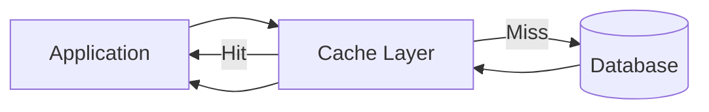
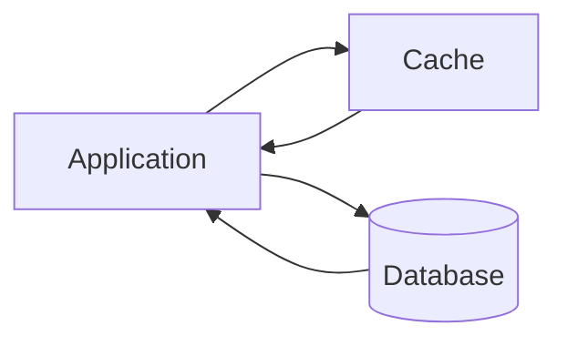
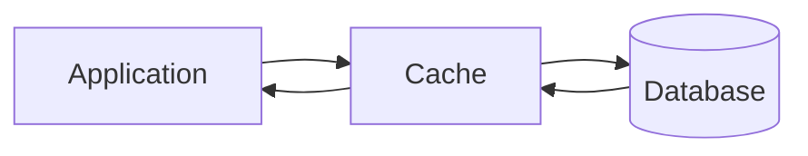
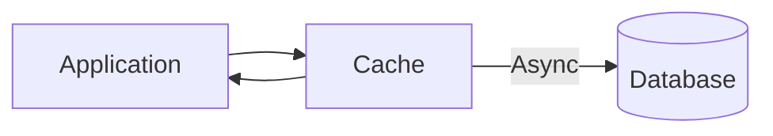

# Caching Strategies

## Overview

Caching strategies define how applications interact with cache systems to store and retrieve data. The choice of caching strategy significantly impacts system performance, consistency, and complexity. Each strategy offers different trade-offs between consistency, latency, and implementation complexity.

## Core Caching Strategies

### 1. Read-Through Cache

#### Definition
In a read-through cache strategy, the cache acts as an intermediary between the application and the database. The cache automatically fetches and stores data when a cache miss occurs.

#### How It Works



#### Implementation

```javascript
class ReadThroughCache {
  constructor(cache, dataLoader) {
    this.cache = cache;
    this.dataLoader = dataLoader;
  }
  
  async get(key) {
    // Check cache first
    let value = await this.cache.get(key);
    
    if (value === null) {
      // Cache miss - automatically load data
      value = await this.dataLoader.load(key);
      
      if (value !== null) {
        // Store in cache for future requests
        await this.cache.set(key, value);
      }
    }
    
    return value;
  }
}

// Usage
const cache = new ReadThroughCache(redisClient, databaseLoader);
const userData = await cache.get('user:123');
```

#### Benefits
- **Simplified Application Logic**: Cache handles data loading automatically
- **Consistent Data Access**: Single interface for data retrieval
- **Automatic Population**: Cache is populated on first access

#### Use Cases
- **Read-Heavy Applications**: Where data is accessed frequently but updated less often
- **Content Management Systems**: Article caching, media metadata
- **Product Catalogs**: E-commerce product information
- **User Profile Systems**: Frequently accessed profile data

```javascript
// E-commerce product catalog example
class ProductCatalogCache extends ReadThroughCache {
  constructor() {
    super(
      new RedisCache(),
      {
        load: async (productId) => {
          return await database.products.findById(productId);
        }
      }
    );
  }
  
  async getProduct(productId) {
    return await this.get(`product:${productId}`);
  }
}
```

### 2. Cache-Aside (Lazy Loading)

#### Definition
In cache-aside strategy, the application manages all cache interactions explicitly. The application checks the cache first and handles loading data from the database when needed.

#### How It Works



#### Implementation

```javascript
class CacheAsidePattern {
  constructor(cache, database) {
    this.cache = cache;
    this.database = database;
  }
  
  async read(key) {
    // 1. Check cache first
    let value = await this.cache.get(key);
    
    if (value === null) {
      // 2. Cache miss - load from database
      value = await this.database.get(key);
      
      if (value !== null) {
        // 3. Store in cache
        await this.cache.set(key, value, this.getTTL(key));
      }
    }
    
    return value;
  }
  
  async write(key, value) {
    // 1. Write to database first
    await this.database.set(key, value);
    
    // 2. Invalidate cache entry
    await this.cache.delete(key);
  }
  
  getTTL(key) {
    // Different TTL based on data type
    if (key.startsWith('user:')) return 3600; // 1 hour
    if (key.startsWith('product:')) return 86400; // 1 day
    return 1800; // 30 minutes default
  }
}
```

#### Advanced Cache-Aside with Error Handling

```javascript
class ResilientCacheAside {
  constructor(cache, database, options = {}) {
    this.cache = cache;
    this.database = database;
    this.options = {
      maxRetries: 3,
      retryDelay: 100,
      fallbackToStale: true,
      ...options
    };
  }
  
  async read(key) {
    try {
      // Try cache first
      const cached = await this.cache.get(key);
      if (cached) return cached.value;
      
      // Cache miss - load from database with retry
      const value = await this.withRetry(() => this.database.get(key));
      
      if (value) {
        // Cache the result
        await this.cache.set(key, {
          value,
          timestamp: Date.now()
        });
      }
      
      return value;
    } catch (error) {
      // Fallback to stale cache if enabled
      if (this.options.fallbackToStale) {
        const stale = await this.cache.get(key);
        if (stale) return stale.value;
      }
      throw error;
    }
  }
  
  async withRetry(operation) {
    let lastError;
    
    for (let i = 0; i < this.options.maxRetries; i++) {
      try {
        return await operation();
      } catch (error) {
        lastError = error;
        await this.delay(this.options.retryDelay * Math.pow(2, i));
      }
    }
    
    throw lastError;
  }
}
```

#### Benefits
- **Fine-Grained Control**: Application has complete control over caching logic
- **Failure Resilience**: Cache failures don't affect database operations
- **Flexible TTL**: Different expiration policies per data type

#### Use Cases
- **High Read-to-Write Ratio Systems**: Social media feeds, news platforms
- **Custom Caching Logic**: Complex business rules for cache invalidation
- **Legacy System Integration**: Adding caching to existing applications

### 3. Write-Through Cache

#### Definition
Write-through cache synchronously updates both the cache and database simultaneously, ensuring strong data consistency at the cost of higher write latency.

#### How It Works



#### Implementation

```javascript
class WriteThroughCache {
  constructor(cache, database) {
    this.cache = cache;
    this.database = database;
  }
  
  async read(key) {
    // Always read from cache
    return await this.cache.get(key);
  }
  
  async write(key, value) {
    try {
      // 1. Write to database first (ensure durability)
      await this.database.set(key, value);
      
      // 2. Write to cache
      await this.cache.set(key, value);
      
      return true;
    } catch (error) {
      // Rollback if cache write fails
      // (Database write already succeeded)
      throw new Error(`Write-through failed: ${error.message}`);
    }
  }
  
  async update(key, value) {
    return await this.write(key, value);
  }
}
```

#### Transactional Write-Through

```javascript
class TransactionalWriteThrough {
  constructor(cache, database) {
    this.cache = cache;
    this.database = database;
  }
  
  async write(key, value) {
    const transaction = await this.database.beginTransaction();
    
    try {
      // 1. Update database within transaction
      await transaction.set(key, value);
      
      // 2. Update cache
      await this.cache.set(key, value);
      
      // 3. Commit transaction
      await transaction.commit();
      
      return true;
    } catch (error) {
      // Rollback on any failure
      await transaction.rollback();
      await this.cache.delete(key); // Ensure cache consistency
      throw error;
    }
  }
}
```

#### Benefits
- **Strong Consistency**: Cache and database always in sync
- **Simple Read Operations**: Always read from fast cache
- **Data Durability**: Data immediately persisted to database

#### Use Cases
- **Consistency-Critical Systems**: Financial applications, banking systems
- **Audit Requirements**: Systems requiring complete transaction logs
- **Real-Time Analytics**: Where stale data is unacceptable

```javascript
// Banking transaction example
class BankingTransactionCache extends WriteThroughCache {
  async transferFunds(fromAccount, toAccount, amount) {
    const timestamp = Date.now();
    
    // Update both accounts atomically
    await Promise.all([
      this.write(`account:${fromAccount}`, {
        balance: await this.getBalance(fromAccount) - amount,
        lastTransaction: timestamp
      }),
      this.write(`account:${toAccount}`, {
        balance: await this.getBalance(toAccount) + amount,
        lastTransaction: timestamp
      })
    ]);
  }
}
```

### 4. Write-Around Cache

#### Definition
Write-around cache writes data directly to the database, bypassing the cache. The cache is only updated during subsequent read operations.

#### How It Works


#### Implementation

```javascript
class WriteAroundCache {
  constructor(cache, database) {
    this.cache = cache;
    this.database = database;
  }
  
  async read(key) {
    // Check cache first
    let value = await this.cache.get(key);
    
    if (value === null) {
      // Cache miss - load from database
      value = await this.database.get(key);
      
      if (value !== null) {
        // Cache for future reads
        await this.cache.set(key, value);
      }
    }
    
    return value;
  }
  
  async write(key, value) {
    // Write directly to database, bypass cache
    await this.database.set(key, value);
    
    // Optional: invalidate cache entry
    await this.cache.delete(key);
  }
}
```

#### Smart Write-Around with Access Pattern Analysis

```javascript
class SmartWriteAroundCache {
  constructor(cache, database) {
    this.cache = cache;
    this.database = database;
    this.accessPatterns = new Map(); // Track read frequency
  }
  
  async read(key) {
    // Track access patterns
    this.trackAccess(key);
    
    let value = await this.cache.get(key);
    
    if (value === null) {
      value = await this.database.get(key);
      
      if (value !== null) {
        // Only cache frequently accessed data
        if (this.isFrequentlyAccessed(key)) {
          await this.cache.set(key, value);
        }
      }
    }
    
    return value;
  }
  
  async write(key, value) {
    await this.database.set(key, value);
    
    // Only invalidate if the key is cached
    if (await this.cache.exists(key)) {
      await this.cache.delete(key);
    }
  }
  
  trackAccess(key) {
    const current = this.accessPatterns.get(key) || { count: 0, lastAccess: 0 };
    this.accessPatterns.set(key, {
      count: current.count + 1,
      lastAccess: Date.now()
    });
  }
  
  isFrequentlyAccessed(key) {
    const pattern = this.accessPatterns.get(key);
    return pattern && pattern.count > 5; // Cache after 5 accesses
  }
}
```

#### Benefits
- **Write Performance**: Optimal for write-heavy operations
- **Storage Efficiency**: Doesn't cache infrequently accessed data
- **Reduced Cache Pollution**: Only popular data ends up in cache

#### Use Cases
- **Write-Heavy Systems**: Logging systems, time-series data
- **Large Dataset Processing**: ETL operations, batch processing
- **Infrequent Read Patterns**: Data written often but read rarely

### 5. Write-Back (Write-Behind) Cache

#### Definition
Write-back cache writes data to the cache immediately and asynchronously updates the database later, minimizing write latency at the cost of potential data loss.

#### How It Works



#### Implementation

```javascript
class WriteBackCache {
  constructor(cache, database, options = {}) {
    this.cache = cache;
    this.database = database;
    this.writeQueue = new Map();
    this.options = {
      batchSize: 100,
      flushInterval: 5000, // 5 seconds
      maxRetries: 3,
      ...options
    };
    
    this.startBatchProcessor();
  }
  
  async read(key) {
    return await this.cache.get(key);
  }
  
  async write(key, value) {
    // 1. Write to cache immediately
    await this.cache.set(key, value);
    
    // 2. Queue for batch write to database
    this.writeQueue.set(key, {
      value,
      timestamp: Date.now(),
      retries: 0
    });
    
    return true; // Return immediately
  }
  
  startBatchProcessor() {
    setInterval(async () => {
      await this.flushWrites();
    }, this.options.flushInterval);
  }
  
  async flushWrites() {
    if (this.writeQueue.size === 0) return;
    
    const batch = Array.from(this.writeQueue.entries())
      .slice(0, this.options.batchSize);
    
    for (const [key, data] of batch) {
      try {
        await this.database.set(key, data.value);
        this.writeQueue.delete(key);
      } catch (error) {
        data.retries++;
        
        if (data.retries >= this.options.maxRetries) {
          console.error(`Failed to write ${key} after ${data.retries} retries`);
          this.writeQueue.delete(key);
        }
      }
    }
  }
  
  async forceFlush() {
    // Force immediate write of all queued data
    const promises = Array.from(this.writeQueue.entries()).map(
      ([key, data]) => this.database.set(key, data.value)
    );
    
    await Promise.all(promises);
    this.writeQueue.clear();
  }
}
```

#### Advanced Write-Back with Persistence

```javascript
class PersistentWriteBackCache {
  constructor(cache, database, diskQueue) {
    this.cache = cache;
    this.database = database;
    this.diskQueue = diskQueue; // Persistent queue for durability
    this.inMemoryQueue = new Map();
  }
  
  async write(key, value) {
    // Write to cache
    await this.cache.set(key, value);
    
    // Persist to disk queue for durability
    await this.diskQueue.enqueue({
      key,
      value,
      timestamp: Date.now()
    });
    
    // Also add to in-memory queue for fast processing
    this.inMemoryQueue.set(key, { value, timestamp: Date.now() });
  }
  
  async processQueue() {
    let item;
    while ((item = await this.diskQueue.dequeue()) !== null) {
      try {
        await this.database.set(item.key, item.value);
      } catch (error) {
        // Re-queue failed items
        await this.diskQueue.enqueue(item);
        break; // Stop processing on error
      }
    }
  }
}
```

#### Benefits
- **Minimal Write Latency**: Fastest write performance
- **Batch Efficiency**: Database writes can be batched for better throughput
- **High Throughput**: Optimal for write-intensive applications

#### Use Cases
- **Write-Heavy Scenarios**: Gaming leaderboards, social media activity
- **Real-Time Applications**: Chat applications, live streaming
- **High-Frequency Trading**: Where every millisecond matters

## Strategy Comparison

### Performance Characteristics

| Strategy | Read Latency | Write Latency | Consistency | Complexity |
|----------|--------------|---------------|-------------|------------|
| Read-Through | Low (cached) / Medium (miss) | N/A | Medium | Low |
| Cache-Aside | Low (hit) / Medium (miss) | Low | Medium | Medium |
| Write-Through | Low | High | Strong | Medium |
| Write-Around | Low (hit) / Medium (miss) | Medium | Medium | Low |
| Write-Back | Low | Very Low | Weak | High |

### Choosing the Right Strategy

```javascript
class CacheStrategySelector {
  static selectStrategy(requirements) {
    const {
      readToWriteRatio,
      consistencyRequirement,
      latencyTolerance,
      dataVolatility
    } = requirements;
    
    if (consistencyRequirement === 'strong') {
      return 'write-through';
    }
    
    if (readToWriteRatio > 10) {
      return 'cache-aside';
    }
    
    if (latencyTolerance === 'very-low' && consistencyRequirement === 'weak') {
      return 'write-back';
    }
    
    if (dataVolatility === 'high') {
      return 'write-around';
    }
    
    return 'read-through'; // Default
  }
}
```

## Hybrid Strategies

### Multi-Level Caching

```javascript
class HybridCacheStrategy {
  constructor() {
    this.l1Cache = new Map(); // In-memory
    this.l2Cache = new RedisCache(); // Distributed
    this.database = new Database();
  }
  
  async read(key) {
    // L1 Cache (in-memory)
    let value = this.l1Cache.get(key);
    if (value) return value;
    
    // L2 Cache (distributed)
    value = await this.l2Cache.get(key);
    if (value) {
      this.l1Cache.set(key, value);
      return value;
    }
    
    // Database
    value = await this.database.get(key);
    if (value) {
      this.l1Cache.set(key, value);
      await this.l2Cache.set(key, value);
    }
    
    return value;
  }
}
```

### Context-Aware Strategy Selection

```javascript
class ContextAwareCaching {
  constructor() {
    this.strategies = {
      user: new CacheAsidePattern(),
      product: new ReadThroughCache(),
      session: new WriteBackCache(),
      analytics: new WriteAroundCache()
    };
  }
  
  async read(key) {
    const context = this.getContext(key);
    const strategy = this.strategies[context];
    return await strategy.read(key);
  }
  
  async write(key, value) {
    const context = this.getContext(key);
    const strategy = this.strategies[context];
    return await strategy.write(key, value);
  }
  
  getContext(key) {
    if (key.startsWith('user:')) return 'user';
    if (key.startsWith('product:')) return 'product';
    if (key.startsWith('session:')) return 'session';
    return 'analytics';
  }
}
```

## Best Practices

### 1. Strategy Selection Guidelines

```javascript
const strategyGuidelines = {
  readThrough: {
    ideal: ['read-heavy workloads', 'simple application logic'],
    avoid: ['write-heavy systems', 'complex invalidation needs']
  },
  cacheAside: {
    ideal: ['existing applications', 'custom cache logic'],
    avoid: ['simple read patterns', 'strong consistency needs']
  },
  writeThrough: {
    ideal: ['strong consistency', 'financial systems'],
    avoid: ['high write volume', 'latency-sensitive writes']
  },
  writeAround: {
    ideal: ['write-heavy with rare reads', 'large datasets'],
    avoid: ['frequent data updates', 'immediate read requirements']
  },
  writeBack: {
    ideal: ['write-intensive', 'latency-critical'],
    avoid: ['critical data durability', 'simple consistency models']
  }
};
```

### 2. Monitoring and Metrics

```javascript
class CacheStrategyMonitor {
  constructor(strategy) {
    this.strategy = strategy;
    this.metrics = {
      hitRate: 0,
      avgReadLatency: 0,
      avgWriteLatency: 0,
      errorRate: 0
    };
  }
  
  async measurePerformance() {
    const testKeys = this.generateTestKeys();
    const results = [];
    
    for (const key of testKeys) {
      const start = performance.now();
      try {
        await this.strategy.read(key);
        results.push({
          success: true,
          latency: performance.now() - start
        });
      } catch (error) {
        results.push({
          success: false,
          latency: performance.now() - start
        });
      }
    }
    
    return this.calculateMetrics(results);
  }
}
```

## Key Takeaways

1. **No One-Size-Fits-All**: Choose strategy based on specific application requirements
2. **Trade-offs Matter**: Balance between consistency, performance, and complexity
3. **Monitor and Adapt**: Continuously monitor cache performance and adjust strategies
4. **Hybrid Approaches**: Combine multiple strategies for optimal results
5. **Context Awareness**: Different data types may benefit from different strategies

Understanding these caching strategies enables architects to design systems that effectively balance performance, consistency, and complexity based on specific application needs.