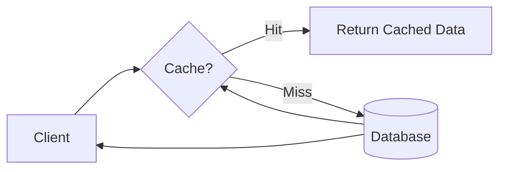

# Caching

## Overview

**Caching is a technique used to temporarily store copies of data in high-speed storage layers (such as RAM) to reduce the time taken to access data.** It acts as a buffer between applications and slower storage systems, dramatically improving performance and reducing system load.

## Core Concepts

### How Caching Works



### Cache Hit vs Cache Miss

```javascript
// Cache operation flow
class CacheManager {
  async get(key) {
    // Check cache first
    const cachedValue = await this.cache.get(key);
    
    if (cachedValue !== null) {
      // Cache hit - return immediately
      this.metrics.recordHit();
      return cachedValue;
    }
    
    // Cache miss - fetch from source
    this.metrics.recordMiss();
    const value = await this.fetchFromSource(key);
    
    // Store in cache for future requests
    await this.cache.set(key, value, this.ttl);
    
    return value;
  }
}
```

## Benefits of Caching

### 1. Improved Performance

```javascript
// Performance comparison example
const performanceMetrics = {
  withoutCache: {
    databaseQuery: '100ms',
    networkLatency: '50ms',
    totalTime: '150ms'
  },
  withCache: {
    cacheAccess: '1ms',
    networkLatency: '0ms',
    totalTime: '1ms',
    improvement: '99.3%'
  }
};
```

### 2. Reduced Backend System Load

```javascript
// Load reduction example
const systemLoad = {
  requests: 10000,
  cacheHitRate: 0.8,
  requestsToDatabase: 10000 * (1 - 0.8), // 2000 instead of 10000
  loadReduction: '80%'
};
```

### 3. Increased Scalability

- **Horizontal Scaling**: Cache clusters can handle more requests
- **Vertical Scaling**: Reduced load allows existing systems to handle more traffic
- **Cost Efficiency**: Less expensive than scaling database infrastructure

### 4. Enhanced User Experience

```javascript
// User experience metrics
const userExperience = {
  pageLoadTime: {
    withoutCache: '3.2s',
    withCache: '0.8s'
  },
  bounceRate: {
    withoutCache: '25%',
    withCache: '12%'
  },
  conversionRate: {
    withoutCache: '2.1%',
    withCache: '3.8%'
  }
};
```

## Types of Caching

### 1. In-Memory Cache

#### Redis Implementation

```javascript
// Redis caching example
const Redis = require('redis');

class RedisCache {
  constructor() {
    this.client = Redis.createClient({
      host: 'localhost',
      port: 6379,
      retry_strategy: (options) => {
        return Math.min(options.attempt * 100, 3000);
      }
    });
  }
  
  async set(key, value, ttl = 3600) {
    const serializedValue = JSON.stringify(value);
    await this.client.setex(key, ttl, serializedValue);
  }
  
  async get(key) {
    const value = await this.client.get(key);
    return value ? JSON.parse(value) : null;
  }
  
  async del(key) {
    await this.client.del(key);
  }
  
  async exists(key) {
    return await this.client.exists(key);
  }
}
```

#### Memcached Implementation

```javascript
// Memcached caching example
const Memcached = require('memcached');

class MemcachedCache {
  constructor() {
    this.client = new Memcached('localhost:11211', {
      retries: 10,
      retry: 10000,
      remove: true
    });
  }
  
  set(key, value, ttl = 3600) {
    return new Promise((resolve, reject) => {
      this.client.set(key, value, ttl, (err) => {
        if (err) reject(err);
        else resolve();
      });
    });
  }
  
  get(key) {
    return new Promise((resolve, reject) => {
      this.client.get(key, (err, data) => {
        if (err) reject(err);
        else resolve(data);
      });
    });
  }
}
```

### 2. Distributed Cache

```javascript
// Redis Cluster configuration
const Redis = require('ioredis');

class DistributedCache {
  constructor() {
    this.cluster = new Redis.Cluster([
      { host: '127.0.0.1', port: 7000 },
      { host: '127.0.0.1', port: 7001 },
      { host: '127.0.0.1', port: 7002 }
    ], {
      enableReadyCheck: false,
      redisOptions: {
        password: 'your_password'
      }
    });
  }
  
  async set(key, value, ttl) {
    await this.cluster.setex(key, ttl, JSON.stringify(value));
  }
  
  async get(key) {
    const value = await this.cluster.get(key);
    return value ? JSON.parse(value) : null;
  }
  
  async mget(keys) {
    const values = await this.cluster.mget(keys);
    return values.map(v => v ? JSON.parse(v) : null);
  }
}
```

### 3. Client-Side Cache

```javascript
// Browser cache implementation
class BrowserCache {
  constructor() {
    this.storage = localStorage;
    this.sessionStorage = sessionStorage;
  }
  
  set(key, value, type = 'local') {
    const data = {
      value,
      timestamp: Date.now()
    };
    
    const storage = type === 'session' ? this.sessionStorage : this.storage;
    storage.setItem(key, JSON.stringify(data));
  }
  
  get(key, maxAge = Infinity, type = 'local') {
    const storage = type === 'session' ? this.sessionStorage : this.storage;
    const item = storage.getItem(key);
    
    if (!item) return null;
    
    const data = JSON.parse(item);
    const age = Date.now() - data.timestamp;
    
    if (age > maxAge) {
      this.delete(key, type);
      return null;
    }
    
    return data.value;
  }
  
  delete(key, type = 'local') {
    const storage = type === 'session' ? this.sessionStorage : this.storage;
    storage.removeItem(key);
  }
}
```

### 4. Database Cache

```sql
-- MySQL Query Cache configuration
SET GLOBAL query_cache_type = ON;
SET GLOBAL query_cache_size = 268435456; -- 256MB

-- Example cached query
SELECT SQL_CACHE * FROM users WHERE active = 1;

-- Force cache bypass
SELECT SQL_NO_CACHE * FROM users WHERE id = 123;
```

### 5. Content Delivery Network (CDN)

```javascript
// CDN cache configuration
const cdnConfig = {
  cloudflare: {
    cacheTtl: {
      html: '4 hours',
      css: '1 year',
      js: '1 year',
      images: '1 month',
      api: '5 minutes'
    }
  },
  purgeCache: async (urls) => {
    await fetch('https://api.cloudflare.com/client/v4/zones/zone_id/purge_cache', {
      method: 'POST',
      headers: {
        'Authorization': 'Bearer your_token',
        'Content-Type': 'application/json'
      },
      body: JSON.stringify({ files: urls })
    });
  }
};
```

## Caching Strategies

### 1. Cache-Aside (Lazy Loading)

```javascript
class CacheAsidePattern {
  constructor(cache, database) {
    this.cache = cache;
    this.database = database;
  }
  
  async read(key) {
    // Check cache first
    let value = await this.cache.get(key);
    
    if (value === null) {
      // Cache miss - load from database
      value = await this.database.get(key);
      
      if (value !== null) {
        // Store in cache
        await this.cache.set(key, value);
      }
    }
    
    return value;
  }
  
  async write(key, value) {
    // Write to database
    await this.database.set(key, value);
    
    // Invalidate cache
    await this.cache.del(key);
  }
}
```

### 2. Read-Through Cache

```javascript
class ReadThroughCache {
  constructor(cache, database) {
    this.cache = cache;
    this.database = database;
  }
  
  async read(key) {
    // Cache handles the database interaction
    return await this.cache.getWithLoader(key, async (key) => {
      return await this.database.get(key);
    });
  }
}
```

### 3. Write-Through Cache

```javascript
class WriteThroughCache {
  constructor(cache, database) {
    this.cache = cache;
    this.database = database;
  }
  
  async write(key, value) {
    // Write to database first
    await this.database.set(key, value);
    
    // Then write to cache
    await this.cache.set(key, value);
  }
  
  async read(key) {
    // Always read from cache
    return await this.cache.get(key);
  }
}
```

### 4. Write-Back (Write-Behind) Cache

```javascript
class WriteBackCache {
  constructor(cache, database) {
    this.cache = cache;
    this.database = database;
    this.writeQueue = new Queue();
    this.startBatchProcessor();
  }
  
  async write(key, value) {
    // Write to cache immediately
    await this.cache.set(key, value);
    
    // Queue for later database write
    this.writeQueue.push({ key, value, timestamp: Date.now() });
  }
  
  startBatchProcessor() {
    setInterval(async () => {
      const batch = this.writeQueue.drain();
      
      if (batch.length > 0) {
        await this.writeBatchToDatabase(batch);
      }
    }, 5000); // Process every 5 seconds
  }
  
  async writeBatchToDatabase(batch) {
    const promises = batch.map(item => 
      this.database.set(item.key, item.value)
    );
    
    await Promise.all(promises);
  }
}
```

## Cache Eviction Policies

### 1. Least Recently Used (LRU)

```javascript
class LRUCache {
  constructor(maxSize) {
    this.maxSize = maxSize;
    this.cache = new Map();
  }
  
  get(key) {
    if (this.cache.has(key)) {
      // Move to end (most recently used)
      const value = this.cache.get(key);
      this.cache.delete(key);
      this.cache.set(key, value);
      return value;
    }
    return null;
  }
  
  set(key, value) {
    if (this.cache.has(key)) {
      // Update existing
      this.cache.delete(key);
    } else if (this.cache.size >= this.maxSize) {
      // Remove least recently used (first item)
      const firstKey = this.cache.keys().next().value;
      this.cache.delete(firstKey);
    }
    
    this.cache.set(key, value);
  }
}
```

### 2. Least Frequently Used (LFU)

```javascript
class LFUCache {
  constructor(maxSize) {
    this.maxSize = maxSize;
    this.cache = new Map();
    this.frequencies = new Map();
  }
  
  get(key) {
    if (this.cache.has(key)) {
      // Increment frequency
      this.frequencies.set(key, (this.frequencies.get(key) || 0) + 1);
      return this.cache.get(key);
    }
    return null;
  }
  
  set(key, value) {
    if (this.cache.size >= this.maxSize && !this.cache.has(key)) {
      // Find least frequently used key
      let minFreq = Infinity;
      let lfuKey = null;
      
      for (const [k, freq] of this.frequencies) {
        if (freq < minFreq) {
          minFreq = freq;
          lfuKey = k;
        }
      }
      
      this.cache.delete(lfuKey);
      this.frequencies.delete(lfuKey);
    }
    
    this.cache.set(key, value);
    this.frequencies.set(key, (this.frequencies.get(key) || 0) + 1);
  }
}
```

### 3. Time-to-Live (TTL)

```javascript
class TTLCache {
  constructor() {
    this.cache = new Map();
    this.timers = new Map();
  }
  
  set(key, value, ttl) {
    // Clear existing timer
    if (this.timers.has(key)) {
      clearTimeout(this.timers.get(key));
    }
    
    this.cache.set(key, value);
    
    // Set expiration timer
    const timer = setTimeout(() => {
      this.cache.delete(key);
      this.timers.delete(key);
    }, ttl * 1000);
    
    this.timers.set(key, timer);
  }
  
  get(key) {
    return this.cache.get(key) || null;
  }
  
  delete(key) {
    if (this.timers.has(key)) {
      clearTimeout(this.timers.get(key));
      this.timers.delete(key);
    }
    this.cache.delete(key);
  }
}
```

## Cache Challenges and Solutions

### 1. Cache Coherence

```javascript
// Cache invalidation strategy
class CacheCoherence {
  constructor() {
    this.subscribers = new Set();
  }
  
  subscribe(cache) {
    this.subscribers.add(cache);
  }
  
  async invalidate(key) {
    const promises = Array.from(this.subscribers).map(cache => 
      cache.delete(key)
    );
    await Promise.all(promises);
  }
  
  async update(key, value) {
    const promises = Array.from(this.subscribers).map(cache => 
      cache.set(key, value)
    );
    await Promise.all(promises);
  }
}
```

### 2. Cache Penetration

```javascript
// Null object pattern to prevent cache penetration
class CachePenetrationProtection {
  constructor(cache, database) {
    this.cache = cache;
    this.database = database;
    this.nullTtl = 60; // 1 minute for null values
  }
  
  async get(key) {
    let value = await this.cache.get(key);
    
    if (value === null) {
      value = await this.database.get(key);
      
      if (value === null) {
        // Cache null value with short TTL
        await this.cache.set(key, 'NULL', this.nullTtl);
        return null;
      } else {
        await this.cache.set(key, value);
      }
    } else if (value === 'NULL') {
      return null;
    }
    
    return value;
  }
}
```

### 3. Cache Stampede

```javascript
// Mutex to prevent cache stampede
class CacheStampedeProtection {
  constructor(cache, database) {
    this.cache = cache;
    this.database = database;
    this.locks = new Map();
  }
  
  async get(key) {
    let value = await this.cache.get(key);
    
    if (value === null) {
      // Check if another request is already loading this key
      if (this.locks.has(key)) {
        // Wait for the other request to complete
        await this.locks.get(key);
        return await this.cache.get(key);
      }
      
      // Create a lock for this key
      const lockPromise = this.loadAndCache(key);
      this.locks.set(key, lockPromise);
      
      try {
        value = await lockPromise;
      } finally {
        this.locks.delete(key);
      }
    }
    
    return value;
  }
  
  async loadAndCache(key) {
    const value = await this.database.get(key);
    if (value !== null) {
      await this.cache.set(key, value);
    }
    return value;
  }
}
```

### 4. Cache Warming

```javascript
// Proactive cache warming
class CacheWarmer {
  constructor(cache, database) {
    this.cache = cache;
    this.database = database;
  }
  
  async warmCache(keys) {
    const batchSize = 100;
    
    for (let i = 0; i < keys.length; i += batchSize) {
      const batch = keys.slice(i, i + batchSize);
      
      const promises = batch.map(async (key) => {
        const value = await this.database.get(key);
        if (value !== null) {
          await this.cache.set(key, value);
        }
      });
      
      await Promise.all(promises);
    }
  }
  
  async scheduledWarming() {
    // Schedule cache warming during low traffic periods
    const lowTrafficHours = [2, 3, 4]; // 2 AM - 4 AM
    const currentHour = new Date().getHours();
    
    if (lowTrafficHours.includes(currentHour)) {
      const popularKeys = await this.getPopularKeys();
      await this.warmCache(popularKeys);
    }
  }
}
```

## Monitoring and Metrics

### Cache Performance Metrics

```javascript
class CacheMetrics {
  constructor() {
    this.hits = 0;
    this.misses = 0;
    this.operations = 0;
    this.responseTimeSum = 0;
  }
  
  recordHit(responseTime) {
    this.hits++;
    this.operations++;
    this.responseTimeSum += responseTime;
  }
  
  recordMiss(responseTime) {
    this.misses++;
    this.operations++;
    this.responseTimeSum += responseTime;
  }
  
  getMetrics() {
    const hitRate = this.hits / (this.hits + this.misses);
    const avgResponseTime = this.responseTimeSum / this.operations;
    
    return {
      hitRate: hitRate * 100,
      missRate: (1 - hitRate) * 100,
      totalOperations: this.operations,
      averageResponseTime: avgResponseTime
    };
  }
  
  reset() {
    this.hits = 0;
    this.misses = 0;
    this.operations = 0;
    this.responseTimeSum = 0;
  }
}
```

### Cache Health Monitoring

```javascript
class CacheHealthMonitor {
  constructor(cache) {
    this.cache = cache;
    this.alertThresholds = {
      hitRate: 80, // Alert if hit rate drops below 80%
      responseTime: 100, // Alert if response time exceeds 100ms
      errorRate: 5 // Alert if error rate exceeds 5%
    };
  }
  
  async checkHealth() {
    const metrics = await this.cache.getMetrics();
    const alerts = [];
    
    if (metrics.hitRate < this.alertThresholds.hitRate) {
      alerts.push(`Low hit rate: ${metrics.hitRate}%`);
    }
    
    if (metrics.averageResponseTime > this.alertThresholds.responseTime) {
      alerts.push(`High response time: ${metrics.averageResponseTime}ms`);
    }
    
    if (metrics.errorRate > this.alertThresholds.errorRate) {
      alerts.push(`High error rate: ${metrics.errorRate}%`);
    }
    
    return {
      healthy: alerts.length === 0,
      alerts,
      metrics
    };
  }
}
```

## Best Practices

### 1. Cache the Right Data

```javascript
const cachingDecisionMatrix = {
  shouldCache: (data) => {
    const criteria = {
      accessFrequency: data.accessCount > 100, // Frequently accessed
      computationCost: data.computeTime > 500, // Expensive to compute
      dataSize: data.size < 1024 * 1024, // Not too large (< 1MB)
      volatility: data.changeFrequency < 0.1, // Relatively stable
      personalData: !data.isPII // Not personally identifiable
    };
    
    return Object.values(criteria).filter(Boolean).length >= 4;
  }
};
```

### 2. Appropriate TTL Settings

```javascript
const ttlStrategy = {
  staticContent: 86400 * 30, // 30 days
  userProfiles: 3600, // 1 hour
  productCatalog: 86400, // 1 day
  realTimeData: 60, // 1 minute
  sessionData: 1800, // 30 minutes
  
  calculateTTL: (dataType, updateFrequency) => {
    const baseTTL = ttlStrategy[dataType] || 3600;
    return Math.max(60, baseTTL / updateFrequency);
  }
};
```

### 3. Layered Caching

```javascript
class LayeredCache {
  constructor() {
    this.l1Cache = new Map(); // In-memory
    this.l2Cache = new RedisCache(); // Distributed
    this.l3Cache = new DatabaseCache(); // Persistent
  }
  
  async get(key) {
    // Check L1 cache first
    let value = this.l1Cache.get(key);
    if (value) return value;
    
    // Check L2 cache
    value = await this.l2Cache.get(key);
    if (value) {
      this.l1Cache.set(key, value);
      return value;
    }
    
    // Check L3 cache
    value = await this.l3Cache.get(key);
    if (value) {
      this.l1Cache.set(key, value);
      await this.l2Cache.set(key, value);
      return value;
    }
    
    return null;
  }
}
```

### 4. Error Handling

```javascript
class ResilientCache {
  constructor(primaryCache, fallbackCache) {
    this.primary = primaryCache;
    this.fallback = fallbackCache;
    this.circuitBreaker = new CircuitBreaker();
  }
  
  async get(key) {
    try {
      if (this.circuitBreaker.isOpen()) {
        return await this.fallback.get(key);
      }
      
      const value = await this.primary.get(key);
      this.circuitBreaker.recordSuccess();
      return value;
    } catch (error) {
      this.circuitBreaker.recordFailure();
      
      // Fallback to secondary cache
      try {
        return await this.fallback.get(key);
      } catch (fallbackError) {
        throw new Error('All cache layers failed');
      }
    }
  }
}
```

## Real-World Implementation Examples

### E-commerce Product Catalog

```javascript
class ProductCatalogCache {
  constructor() {
    this.cache = new Redis();
    this.database = new ProductDatabase();
  }
  
  async getProduct(productId) {
    const cacheKey = `product:${productId}`;
    
    // Check cache
    let product = await this.cache.get(cacheKey);
    
    if (!product) {
      // Load from database
      product = await this.database.getProduct(productId);
      
      if (product) {
        // Cache with 1 hour TTL
        await this.cache.set(cacheKey, product, 3600);
      }
    }
    
    return product;
  }
  
  async invalidateProduct(productId) {
    await this.cache.del(`product:${productId}`);
  }
}
```

### User Session Management

```javascript
class SessionCache {
  constructor() {
    this.cache = new Redis();
  }
  
  async createSession(userId, sessionData) {
    const sessionId = this.generateSessionId();
    const cacheKey = `session:${sessionId}`;
    
    await this.cache.set(cacheKey, {
      userId,
      ...sessionData,
      createdAt: Date.now()
    }, 3600); // 1 hour expiry
    
    return sessionId;
  }
  
  async getSession(sessionId) {
    const cacheKey = `session:${sessionId}`;
    return await this.cache.get(cacheKey);
  }
  
  async extendSession(sessionId) {
    const cacheKey = `session:${sessionId}`;
    await this.cache.expire(cacheKey, 3600);
  }
}
```

## Key Takeaways

1. **Performance Impact**: Caching can reduce response times by 99%+ for frequently accessed data
2. **Strategic Implementation**: Choose the right caching strategy based on data access patterns
3. **Multiple Layers**: Implement layered caching for optimal performance
4. **Monitoring**: Continuously monitor cache performance and health
5. **Consistency**: Plan for cache invalidation and data consistency
6. **Resilience**: Implement fallback mechanisms for cache failures

Caching is one of the most effective techniques for improving system performance and scalability, making it an essential building block in modern distributed systems.