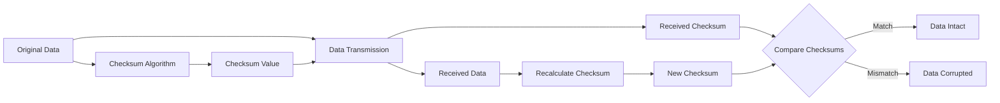

# Checksums

## Overview

**A checksum is a unique fingerprint attached to the data before it's transmitted that helps verify data integrity.** It's a mathematical value calculated through algorithms that can detect whether data has been altered unintentionally or maliciously since it was created, stored, or transmitted.

## Core Concepts

### How Checksums Work



### Basic Process

1. **Calculation**: Generate a unique value using a mathematical algorithm
2. **Transmission**: Append checksum to original data
3. **Verification**: Recalculate checksum at destination
4. **Comparison**: Match original and newly calculated checksums

## Types of Checksums

### 1. Simple Checksums

#### Parity Bit

```javascript
class ParityChecksum {
  // Even parity - count of 1s should be even
  static calculateEvenParity(data) {
    let count = 0;
    
    for (let byte of data) {
      // Count number of 1 bits in each byte
      let temp = byte;
      while (temp) {
        count += temp & 1;
        temp >>= 1;
      }
    }
    
    // Return 1 if odd count (to make total even), 0 if even count
    return count % 2;
  }
  
  // Odd parity - count of 1s should be odd
  static calculateOddParity(data) {
    return 1 - this.calculateEvenParity(data);
  }
  
  static verifyEvenParity(data, parityBit) {
    const calculatedParity = this.calculateEvenParity(data);
    return calculatedParity === parityBit;
  }
}

// Usage example
const data = new Uint8Array([0b10110001, 0b01001100, 0b11110000]);
const parity = ParityChecksum.calculateEvenParity(data);
console.log('Parity bit:', parity);
console.log('Verification:', ParityChecksum.verifyEvenParity(data, parity));
```

#### Simple Additive Checksum

```javascript
class AdditiveChecksum {
  static calculate(data, modulus = 256) {
    let sum = 0;
    
    for (let byte of data) {
      sum = (sum + byte) % modulus;
    }
    
    return sum;
  }
  
  static verify(data, checksum, modulus = 256) {
    return this.calculate(data, modulus) === checksum;
  }
  
  // Fletcher's checksum (improved additive checksum)
  static fletcher16(data) {
    let sum1 = 0;
    let sum2 = 0;
    
    for (let byte of data) {
      sum1 = (sum1 + byte) % 255;
      sum2 = (sum2 + sum1) % 255;
    }
    
    return (sum2 << 8) | sum1;
  }
  
  static verifyFletcher16(data, checksum) {
    return this.fletcher16(data) === checksum;
  }
}

// Usage example
const message = new TextEncoder().encode("Hello, World!");
const checksum = AdditiveChecksum.calculate(message);
const fletcherChecksum = AdditiveChecksum.fletcher16(message);

console.log('Simple checksum:', checksum);
console.log('Fletcher-16 checksum:', fletcherChecksum.toString(16));
```

### 2. Cyclic Redundancy Check (CRC)

```javascript
class CRCChecksum {
  constructor() {
    // CRC-32 polynomial (IEEE 802.3)
    this.polynomial = 0xEDB88320;
    this.table = this.generateTable();
  }
  
  generateTable() {
    const table = new Array(256);
    
    for (let i = 0; i < 256; i++) {
      let crc = i;
      
      for (let j = 0; j < 8; j++) {
        if (crc & 1) {
          crc = (crc >>> 1) ^ this.polynomial;
        } else {
          crc = crc >>> 1;
        }
      }
      
      table[i] = crc;
    }
    
    return table;
  }
  
  calculate(data) {
    let crc = 0xFFFFFFFF;
    
    for (let byte of data) {
      const index = (crc ^ byte) & 0xFF;
      crc = (crc >>> 8) ^ this.table[index];
    }
    
    return (crc ^ 0xFFFFFFFF) >>> 0; // Unsigned 32-bit
  }
  
  verify(data, expectedCrc) {
    return this.calculate(data) === expectedCrc;
  }
  
  // CRC-16 (CCITT)
  static crc16(data) {
    let crc = 0xFFFF;
    const polynomial = 0x1021;
    
    for (let byte of data) {
      crc ^= (byte << 8);
      
      for (let i = 0; i < 8; i++) {
        if (crc & 0x8000) {
          crc = (crc << 1) ^ polynomial;
        } else {
          crc <<= 1;
        }
        crc &= 0xFFFF;
      }
    }
    
    return crc;
  }
  
  // CRC-8
  static crc8(data) {
    let crc = 0;
    const polynomial = 0x07; // x^8 + x^2 + x + 1
    
    for (let byte of data) {
      crc ^= byte;
      
      for (let i = 0; i < 8; i++) {
        if (crc & 0x80) {
          crc = (crc << 1) ^ polynomial;
        } else {
          crc <<= 1;
        }
        crc &= 0xFF;
      }
    }
    
    return crc;
  }
}

// Usage example
const crc = new CRCChecksum();
const data = new TextEncoder().encode("The quick brown fox jumps over the lazy dog");

const crc32 = crc.calculate(data);
const crc16 = CRCChecksum.crc16(data);
const crc8 = CRCChecksum.crc8(data);

console.log('CRC-32:', crc32.toString(16).padStart(8, '0'));
console.log('CRC-16:', crc16.toString(16).padStart(4, '0'));
console.log('CRC-8:', crc8.toString(16).padStart(2, '0'));
```

### 3. Cryptographic Hash Functions

#### MD5 Implementation

```javascript
class MD5Checksum {
  constructor() {
    // MD5 constants
    this.s = [
      7, 12, 17, 22,  7, 12, 17, 22,  7, 12, 17, 22,  7, 12, 17, 22,
      5,  9, 14, 20,  5,  9, 14, 20,  5,  9, 14, 20,  5,  9, 14, 20,
      4, 11, 16, 23,  4, 11, 16, 23,  4, 11, 16, 23,  4, 11, 16, 23,
      6, 10, 15, 21,  6, 10, 15, 21,  6, 10, 15, 21,  6, 10, 15, 21
    ];
    
    this.K = [];
    for (let i = 0; i < 64; i++) {
      this.K[i] = Math.floor(Math.abs(Math.sin(i + 1)) * Math.pow(2, 32));
    }
  }
  
  calculate(message) {
    // Convert string to bytes
    const bytes = new TextEncoder().encode(message);
    
    // Pre-processing: padding
    const padded = this.pad(bytes);
    
    // Initialize hash values
    let h0 = 0x67452301;
    let h1 = 0xEFCDAB89;
    let h2 = 0x98BADCFE;
    let h3 = 0x10325476;
    
    // Process message in 512-bit chunks
    for (let i = 0; i < padded.length; i += 64) {
      const chunk = padded.slice(i, i + 64);
      const w = this.bytesToWords(chunk);
      
      let a = h0, b = h1, c = h2, d = h3;
      
      // Main loop
      for (let j = 0; j < 64; j++) {
        let f, g;
        
        if (j < 16) {
          f = (b & c) | (~b & d);
          g = j;
        } else if (j < 32) {
          f = (d & b) | (~d & c);
          g = (5 * j + 1) % 16;
        } else if (j < 48) {
          f = b ^ c ^ d;
          g = (3 * j + 5) % 16;
        } else {
          f = c ^ (b | ~d);
          g = (7 * j) % 16;
        }
        
        f = (f + a + this.K[j] + w[g]) >>> 0;
        a = d;
        d = c;
        c = b;
        b = (b + this.rotateLeft(f, this.s[j])) >>> 0;
      }
      
      h0 = (h0 + a) >>> 0;
      h1 = (h1 + b) >>> 0;
      h2 = (h2 + c) >>> 0;
      h3 = (h3 + d) >>> 0;
    }
    
    return this.toHexString([h0, h1, h2, h3]);
  }
  
  pad(bytes) {
    const originalLength = bytes.length;
    const bitLength = originalLength * 8;
    
    // Create new array with padding
    const paddedLength = Math.ceil((originalLength + 9) / 64) * 64;
    const padded = new Uint8Array(paddedLength);
    
    // Copy original data
    padded.set(bytes);
    
    // Add padding bit
    padded[originalLength] = 0x80;
    
    // Add length as 64-bit little-endian integer
    const lengthArray = new DataView(padded.buffer, paddedLength - 8);
    lengthArray.setUint32(0, bitLength, true);
    lengthArray.setUint32(4, Math.floor(bitLength / Math.pow(2, 32)), true);
    
    return padded;
  }
  
  bytesToWords(bytes) {
    const words = new Array(16);
    const view = new DataView(bytes.buffer, bytes.byteOffset);
    
    for (let i = 0; i < 16; i++) {
      words[i] = view.getUint32(i * 4, true); // Little-endian
    }
    
    return words;
  }
  
  rotateLeft(value, shift) {
    return ((value << shift) | (value >>> (32 - shift))) >>> 0;
  }
  
  toHexString(words) {
    return words.map(word => {
      // Convert to little-endian hex string
      const bytes = [
        word & 0xFF,
        (word >>> 8) & 0xFF,
        (word >>> 16) & 0xFF,
        (word >>> 24) & 0xFF
      ];
      return bytes.map(b => b.toString(16).padStart(2, '0')).join('');
    }).join('');
  }
  
  static quickHash(data) {
    // Simple wrapper for common use cases
    const md5 = new MD5Checksum();
    return md5.calculate(data);
  }
}

// Usage example
const md5 = new MD5Checksum();
const hash = md5.calculate("Hello, World!");
console.log('MD5 hash:', hash);
```

#### SHA-256 Implementation

```javascript
class SHA256Checksum {
  constructor() {
    // SHA-256 constants
    this.h = [
      0x6a09e667, 0xbb67ae85, 0x3c6ef372, 0xa54ff53a,
      0x510e527f, 0x9b05688c, 0x1f83d9ab, 0x5be0cd19
    ];
    
    this.k = [
      0x428a2f98, 0x71374491, 0xb5c0fbcf, 0xe9b5dba5,
      0x3956c25b, 0x59f111f1, 0x923f82a4, 0xab1c5ed5,
      0xd807aa98, 0x12835b01, 0x243185be, 0x550c7dc3,
      0x72be5d74, 0x80deb1fe, 0x9bdc06a7, 0xc19bf174,
      0xe49b69c1, 0xefbe4786, 0x0fc19dc6, 0x240ca1cc,
      0x2de92c6f, 0x4a7484aa, 0x5cb0a9dc, 0x76f988da,
      0x983e5152, 0xa831c66d, 0xb00327c8, 0xbf597fc7,
      0xc6e00bf3, 0xd5a79147, 0x06ca6351, 0x14292967,
      0x27b70a85, 0x2e1b2138, 0x4d2c6dfc, 0x53380d13,
      0x650a7354, 0x766a0abb, 0x81c2c92e, 0x92722c85,
      0xa2bfe8a1, 0xa81a664b, 0xc24b8b70, 0xc76c51a3,
      0xd192e819, 0xd6990624, 0xf40e3585, 0x106aa070,
      0x19a4c116, 0x1e376c08, 0x2748774c, 0x34b0bcb5,
      0x391c0cb3, 0x4ed8aa4a, 0x5b9cca4f, 0x682e6ff3,
      0x748f82ee, 0x78a5636f, 0x84c87814, 0x8cc70208,
      0x90befffa, 0xa4506ceb, 0xbef9a3f7, 0xc67178f2
    ];
  }
  
  calculate(message) {
    const bytes = new TextEncoder().encode(message);
    const padded = this.pad(bytes);
    
    let hash = [...this.h];
    
    // Process message in 512-bit chunks
    for (let i = 0; i < padded.length; i += 64) {
      const chunk = padded.slice(i, i + 64);
      const w = this.prepareSchedule(chunk);
      
      let [a, b, c, d, e, f, g, h] = hash;
      
      // Main compression loop
      for (let t = 0; t < 64; t++) {
        const S1 = this.rotr(e, 6) ^ this.rotr(e, 11) ^ this.rotr(e, 25);
        const ch = (e & f) ^ (~e & g);
        const temp1 = (h + S1 + ch + this.k[t] + w[t]) >>> 0;
        
        const S0 = this.rotr(a, 2) ^ this.rotr(a, 13) ^ this.rotr(a, 22);
        const maj = (a & b) ^ (a & c) ^ (b & c);
        const temp2 = (S0 + maj) >>> 0;
        
        h = g;
        g = f;
        f = e;
        e = (d + temp1) >>> 0;
        d = c;
        c = b;
        b = a;
        a = (temp1 + temp2) >>> 0;
      }
      
      hash[0] = (hash[0] + a) >>> 0;
      hash[1] = (hash[1] + b) >>> 0;
      hash[2] = (hash[2] + c) >>> 0;
      hash[3] = (hash[3] + d) >>> 0;
      hash[4] = (hash[4] + e) >>> 0;
      hash[5] = (hash[5] + f) >>> 0;
      hash[6] = (hash[6] + g) >>> 0;
      hash[7] = (hash[7] + h) >>> 0;
    }
    
    return hash.map(h => h.toString(16).padStart(8, '0')).join('');
  }
  
  pad(bytes) {
    const originalLength = bytes.length;
    const bitLength = originalLength * 8;
    
    // Calculate padding
    const paddingLength = 64 - ((originalLength + 9) % 64);
    const totalLength = originalLength + 1 + paddingLength + 8;
    
    const padded = new Uint8Array(totalLength);
    padded.set(bytes);
    padded[originalLength] = 0x80;
    
    // Add length as 64-bit big-endian integer
    const view = new DataView(padded.buffer);
    view.setUint32(totalLength - 8, Math.floor(bitLength / Math.pow(2, 32)), false);
    view.setUint32(totalLength - 4, bitLength, false);
    
    return padded;
  }
  
  prepareSchedule(chunk) {
    const w = new Array(64);
    const view = new DataView(chunk.buffer, chunk.byteOffset);
    
    // First 16 words are the chunk
    for (let t = 0; t < 16; t++) {
      w[t] = view.getUint32(t * 4, false); // Big-endian
    }
    
    // Extend the first 16 words into the remaining 48 words
    for (let t = 16; t < 64; t++) {
      const s0 = this.rotr(w[t-15], 7) ^ this.rotr(w[t-15], 18) ^ (w[t-15] >>> 3);
      const s1 = this.rotr(w[t-2], 17) ^ this.rotr(w[t-2], 19) ^ (w[t-2] >>> 10);
      w[t] = (w[t-16] + s0 + w[t-7] + s1) >>> 0;
    }
    
    return w;
  }
  
  rotr(n, b) {
    return ((n >>> b) | (n << (32 - b))) >>> 0;
  }
  
  static quickHash(data) {
    const sha256 = new SHA256Checksum();
    return sha256.calculate(data);
  }
}

// Usage example
const sha256 = new SHA256Checksum();
const hash = sha256.calculate("Hello, World!");
console.log('SHA-256 hash:', hash);
```

## Real-World Applications

### 1. File Integrity Verification

```javascript
class FileIntegrityChecker {
  constructor() {
    this.checksums = new Map(); // filename -> checksum info
    this.algorithms = {
      'md5': new MD5Checksum(),
      'sha256': new SHA256Checksum(),
      'crc32': new CRCChecksum()
    };
  }
  
  async calculateFileChecksum(file, algorithm = 'sha256') {
    return new Promise((resolve, reject) => {
      const reader = new FileReader();
      
      reader.onload = (event) => {
        try {
          const arrayBuffer = event.target.result;
          const bytes = new Uint8Array(arrayBuffer);
          
          let checksum;
          switch (algorithm) {
            case 'md5':
              checksum = this.algorithms.md5.calculate(
                new TextDecoder().decode(bytes)
              );
              break;
            case 'sha256':
              checksum = this.algorithms.sha256.calculate(
                new TextDecoder().decode(bytes)
              );
              break;
            case 'crc32':
              checksum = this.algorithms.crc32.calculate(bytes);
              break;
            default:
              throw new Error(`Unsupported algorithm: ${algorithm}`);
          }
          
          resolve(checksum);
        } catch (error) {
          reject(error);
        }
      };
      
      reader.onerror = reject;
      reader.readAsArrayBuffer(file);
    });
  }
  
  async storeFileChecksum(filename, file, algorithm = 'sha256') {
    const checksum = await this.calculateFileChecksum(file, algorithm);
    
    this.checksums.set(filename, {
      checksum,
      algorithm,
      size: file.size,
      lastModified: file.lastModified,
      timestamp: Date.now()
    });
    
    return checksum;
  }
  
  async verifyFileIntegrity(filename, file) {
    const stored = this.checksums.get(filename);
    if (!stored) {
      throw new Error('No stored checksum found for file');
    }
    
    const currentChecksum = await this.calculateFileChecksum(file, stored.algorithm);
    
    return {
      isValid: currentChecksum === stored.checksum,
      storedChecksum: stored.checksum,
      currentChecksum,
      algorithm: stored.algorithm,
      sizeMatches: file.size === stored.size,
      timeChanged: file.lastModified !== stored.lastModified
    };
  }
  
  exportChecksums() {
    const exports = [];
    
    for (const [filename, info] of this.checksums) {
      exports.push({
        filename,
        checksum: info.checksum,
        algorithm: info.algorithm,
        size: info.size,
        timestamp: info.timestamp
      });
    }
    
    return exports;
  }
  
  importChecksums(checksumData) {
    for (const item of checksumData) {
      this.checksums.set(item.filename, {
        checksum: item.checksum,
        algorithm: item.algorithm,
        size: item.size,
        lastModified: null,
        timestamp: item.timestamp
      });
    }
  }
}
```

### 2. Data Transmission Verification

```javascript
class DataTransmissionVerifier {
  constructor() {
    this.pendingTransmissions = new Map();
    this.completedTransmissions = new Map();
  }
  
  prepareDataForTransmission(data, algorithm = 'crc32') {
    const bytes = new TextEncoder().encode(JSON.stringify(data));
    let checksum;
    
    switch (algorithm) {
      case 'crc32':
        const crc = new CRCChecksum();
        checksum = crc.calculate(bytes);
        break;
      case 'md5':
        const md5 = new MD5Checksum();
        checksum = md5.calculate(JSON.stringify(data));
        break;
      case 'sha256':
        const sha256 = new SHA256Checksum();
        checksum = sha256.calculate(JSON.stringify(data));
        break;
      default:
        throw new Error(`Unsupported algorithm: ${algorithm}`);
    }
    
    const packet = {
      id: this.generatePacketId(),
      data,
      checksum,
      algorithm,
      size: bytes.length,
      timestamp: Date.now()
    };
    
    this.pendingTransmissions.set(packet.id, packet);
    
    return packet;
  }
  
  verifyReceivedData(packet) {
    const { id, data, checksum, algorithm, size } = packet;
    
    // Recalculate checksum
    const bytes = new TextEncoder().encode(JSON.stringify(data));
    let calculatedChecksum;
    
    switch (algorithm) {
      case 'crc32':
        const crc = new CRCChecksum();
        calculatedChecksum = crc.calculate(bytes);
        break;
      case 'md5':
        const md5 = new MD5Checksum();
        calculatedChecksum = md5.calculate(JSON.stringify(data));
        break;
      case 'sha256':
        const sha256 = new SHA256Checksum();
        calculatedChecksum = sha256.calculate(JSON.stringify(data));
        break;
      default:
        throw new Error(`Unsupported algorithm: ${algorithm}`);
    }
    
    const verification = {
      packetId: id,
      isValid: calculatedChecksum === checksum,
      expectedChecksum: checksum,
      calculatedChecksum,
      algorithm,
      sizeMatches: bytes.length === size,
      receivedAt: Date.now()
    };
    
    this.completedTransmissions.set(id, verification);
    
    if (this.pendingTransmissions.has(id)) {
      this.pendingTransmissions.delete(id);
    }
    
    return verification;
  }
  
  generatePacketId() {
    return `pkt_${Date.now()}_${Math.random().toString(36).substr(2, 9)}`;
  }
  
  getTransmissionStats() {
    const completed = Array.from(this.completedTransmissions.values());
    const valid = completed.filter(t => t.isValid);
    const invalid = completed.filter(t => !t.isValid);
    
    return {
      totalTransmissions: completed.length,
      validTransmissions: valid.length,
      invalidTransmissions: invalid.length,
      errorRate: invalid.length / completed.length,
      pendingTransmissions: this.pendingTransmissions.size
    };
  }
}
```

### 3. Database Backup Verification

```javascript
class DatabaseBackupVerifier {
  constructor() {
    this.backupChecksums = new Map();
    this.verificationHistory = [];
  }
  
  async createBackupWithChecksum(databaseData, backupId) {
    const serialized = JSON.stringify(databaseData, null, 2);
    const bytes = new TextEncoder().encode(serialized);
    
    // Calculate multiple checksums for redundancy
    const checksums = {
      md5: new MD5Checksum().calculate(serialized),
      sha256: new SHA256Checksum().calculate(serialized),
      crc32: new CRCChecksum().calculate(bytes)
    };
    
    const backupMetadata = {
      id: backupId,
      checksums,
      size: bytes.length,
      recordCount: this.countRecords(databaseData),
      createdAt: Date.now(),
      tables: this.analyzeTableStructure(databaseData)
    };
    
    this.backupChecksums.set(backupId, backupMetadata);
    
    return {
      backup: serialized,
      metadata: backupMetadata
    };
  }
  
  async verifyBackupIntegrity(backupData, backupId) {
    const storedMetadata = this.backupChecksums.get(backupId);
    if (!storedMetadata) {
      throw new Error('Backup metadata not found');
    }
    
    const serialized = typeof backupData === 'string' ? 
      backupData : JSON.stringify(backupData, null, 2);
    const bytes = new TextEncoder().encode(serialized);
    
    // Recalculate checksums
    const currentChecksums = {
      md5: new MD5Checksum().calculate(serialized),
      sha256: new SHA256Checksum().calculate(serialized),
      crc32: new CRCChecksum().calculate(bytes)
    };
    
    const verification = {
      backupId,
      timestamp: Date.now(),
      checksumMatches: {
        md5: currentChecksums.md5 === storedMetadata.checksums.md5,
        sha256: currentChecksums.sha256 === storedMetadata.checksums.sha256,
        crc32: currentChecksums.crc32 === storedMetadata.checksums.crc32
      },
      sizeMatches: bytes.length === storedMetadata.size,
      allChecksumsPassed: false
    };
    
    verification.allChecksumsPassed = Object.values(verification.checksumMatches)
      .every(match => match);
    
    // Additional structural verification
    if (typeof backupData === 'object') {
      const currentRecordCount = this.countRecords(backupData);
      const currentTables = this.analyzeTableStructure(backupData);
      
      verification.recordCountMatches = currentRecordCount === storedMetadata.recordCount;
      verification.tableStructureMatches = this.compareTableStructures(
        currentTables, 
        storedMetadata.tables
      );
    }
    
    this.verificationHistory.push(verification);
    
    return verification;
  }
  
  countRecords(databaseData) {
    let count = 0;
    
    if (Array.isArray(databaseData)) {
      count = databaseData.length;
    } else if (typeof databaseData === 'object') {
      for (const table of Object.values(databaseData)) {
        if (Array.isArray(table)) {
          count += table.length;
        }
      }
    }
    
    return count;
  }
  
  analyzeTableStructure(databaseData) {
    const structure = {};
    
    if (typeof databaseData === 'object' && !Array.isArray(databaseData)) {
      for (const [tableName, tableData] of Object.entries(databaseData)) {
        if (Array.isArray(tableData) && tableData.length > 0) {
          structure[tableName] = {
            recordCount: tableData.length,
            columns: Object.keys(tableData[0]),
            columnTypes: this.inferColumnTypes(tableData[0])
          };
        }
      }
    }
    
    return structure;
  }
  
  inferColumnTypes(record) {
    const types = {};
    
    for (const [key, value] of Object.entries(record)) {
      types[key] = typeof value;
    }
    
    return types;
  }
  
  compareTableStructures(current, stored) {
    const currentKeys = Object.keys(current).sort();
    const storedKeys = Object.keys(stored).sort();
    
    if (JSON.stringify(currentKeys) !== JSON.stringify(storedKeys)) {
      return false;
    }
    
    for (const tableName of currentKeys) {
      const currentTable = current[tableName];
      const storedTable = stored[tableName];
      
      if (currentTable.recordCount !== storedTable.recordCount) {
        return false;
      }
      
      if (JSON.stringify(currentTable.columns.sort()) !== 
          JSON.stringify(storedTable.columns.sort())) {
        return false;
      }
    }
    
    return true;
  }
  
  getVerificationReport() {
    const recentVerifications = this.verificationHistory.slice(-10);
    const successRate = recentVerifications.filter(v => v.allChecksumsPassed).length / 
                       recentVerifications.length;
    
    return {
      totalBackups: this.backupChecksums.size,
      totalVerifications: this.verificationHistory.length,
      recentSuccessRate: successRate,
      lastVerification: recentVerifications[recentVerifications.length - 1],
      backupList: Array.from(this.backupChecksums.keys())
    };
  }
}
```

## Performance Optimization

### 1. Streaming Checksum Calculation

```javascript
class StreamingChecksumCalculator {
  constructor(algorithm = 'sha256') {
    this.algorithm = algorithm;
    this.reset();
  }
  
  reset() {
    switch (this.algorithm) {
      case 'sha256':
        this.hasher = new StreamingSHA256();
        break;
      case 'crc32':
        this.hasher = new StreamingCRC32();
        break;
      default:
        throw new Error(`Unsupported streaming algorithm: ${this.algorithm}`);
    }
  }
  
  update(chunk) {
    const bytes = typeof chunk === 'string' ? 
      new TextEncoder().encode(chunk) : chunk;
    this.hasher.update(bytes);
  }
  
  finalize() {
    return this.hasher.finalize();
  }
  
  // Process large files in chunks
  async processLargeFile(file, chunkSize = 1024 * 1024) { // 1MB chunks
    return new Promise((resolve, reject) => {
      let offset = 0;
      
      const processChunk = () => {
        const slice = file.slice(offset, offset + chunkSize);
        const reader = new FileReader();
        
        reader.onload = (event) => {
          const chunk = new Uint8Array(event.target.result);
          this.update(chunk);
          
          offset += chunkSize;
          
          if (offset < file.size) {
            // Continue with next chunk
            setTimeout(processChunk, 0); // Yield to UI thread
          } else {
            // Finished processing
            resolve(this.finalize());
          }
        };
        
        reader.onerror = reject;
        reader.readAsArrayBuffer(slice);
      };
      
      processChunk();
    });
  }
}

class StreamingCRC32 {
  constructor() {
    this.crc = new CRCChecksum();
    this.state = 0xFFFFFFFF;
  }
  
  update(bytes) {
    for (let byte of bytes) {
      const index = (this.state ^ byte) & 0xFF;
      this.state = (this.state >>> 8) ^ this.crc.table[index];
    }
  }
  
  finalize() {
    return (this.state ^ 0xFFFFFFFF) >>> 0;
  }
}

// Usage example
async function calculateLargeFileChecksum(file) {
  const calculator = new StreamingChecksumCalculator('crc32');
  const checksum = await calculator.processLargeFile(file);
  console.log(`Checksum for ${file.name}:`, checksum.toString(16));
  return checksum;
}
```

### 2. Parallel Checksum Calculation

```javascript
class ParallelChecksumCalculator {
  constructor(workerCount = navigator.hardwareConcurrency || 4) {
    this.workerCount = workerCount;
    this.workers = [];
    this.setupWorkers();
  }
  
  setupWorkers() {
    // Web Worker script for checksum calculation
    const workerScript = `
      class WorkerCRCChecksum {
        constructor() {
          this.polynomial = 0xEDB88320;
          this.table = this.generateTable();
        }
        
        generateTable() {
          const table = new Array(256);
          for (let i = 0; i < 256; i++) {
            let crc = i;
            for (let j = 0; j < 8; j++) {
              if (crc & 1) {
                crc = (crc >>> 1) ^ this.polynomial;
              } else {
                crc = crc >>> 1;
              }
            }
            table[i] = crc;
          }
          return table;
        }
        
        calculate(data, initialCrc = 0xFFFFFFFF) {
          let crc = initialCrc;
          for (let byte of data) {
            const index = (crc ^ byte) & 0xFF;
            crc = (crc >>> 8) ^ this.table[index];
          }
          return crc;
        }
      }
      
      const crc = new WorkerCRCChecksum();
      
      self.onmessage = function(e) {
        const { chunk, initialCrc, isLast } = e.data;
        const result = crc.calculate(new Uint8Array(chunk), initialCrc);
        
        self.postMessage({
          result: isLast ? (result ^ 0xFFFFFFFF) >>> 0 : result,
          isLast
        });
      };
    `;
    
    const blob = new Blob([workerScript], { type: 'application/javascript' });
    const workerUrl = URL.createObjectURL(blob);
    
    for (let i = 0; i < this.workerCount; i++) {
      this.workers.push(new Worker(workerUrl));
    }
  }
  
  async calculateParallelChecksum(data) {
    const bytes = new Uint8Array(data);
    const chunkSize = Math.ceil(bytes.length / this.workerCount);
    const chunks = [];
    
    // Split data into chunks
    for (let i = 0; i < this.workerCount; i++) {
      const start = i * chunkSize;
      const end = Math.min(start + chunkSize, bytes.length);
      if (start < bytes.length) {
        chunks.push(bytes.slice(start, end));
      }
    }
    
    // Process chunks in parallel
    const promises = chunks.map((chunk, index) => {
      return new Promise((resolve) => {
        const worker = this.workers[index % this.workers.length];
        
        worker.onmessage = (e) => {
          resolve(e.data.result);
        };
        
        worker.postMessage({
          chunk: chunk.buffer,
          initialCrc: index === 0 ? 0xFFFFFFFF : 0,
          isLast: index === chunks.length - 1
        });
      });
    });
    
    const results = await Promise.all(promises);
    
    // Combine results (simplified - real implementation would need proper CRC combining)
    return results[results.length - 1];
  }
  
  destroy() {
    this.workers.forEach(worker => worker.terminate());
    this.workers = [];
  }
}
```

## Best Practices

### 1. Algorithm Selection Guidelines

```javascript
class ChecksumStrategy {
  static selectAlgorithm(useCase, dataSize, securityRequirements) {
    const recommendations = {
      fileIntegrity: {
        small: 'crc32',     // < 1MB
        medium: 'sha256',   // 1MB - 100MB
        large: 'sha256'     // > 100MB
      },
      networkTransmission: {
        small: 'crc32',
        medium: 'crc32',
        large: 'sha256'
      },
      cryptographicSecurity: {
        small: 'sha256',
        medium: 'sha256',
        large: 'sha256'
      },
      errorDetection: {
        small: 'crc16',
        medium: 'crc32',
        large: 'crc32'
      }
    };
    
    let sizeCategory;
    if (dataSize < 1024 * 1024) sizeCategory = 'small';
    else if (dataSize < 100 * 1024 * 1024) sizeCategory = 'medium';
    else sizeCategory = 'large';
    
    const recommendation = recommendations[useCase]?.[sizeCategory];
    
    return {
      algorithm: recommendation || 'sha256',
      reasoning: this.getReasoningForSelection(useCase, sizeCategory, securityRequirements),
      alternatives: this.getAlternatives(useCase, sizeCategory)
    };
  }
  
  static getReasoningForSelection(useCase, sizeCategory, securityRequirements) {
    const reasoning = {
      fileIntegrity: 'Balanced approach between speed and collision resistance',
      networkTransmission: 'Fast computation for real-time verification',
      cryptographicSecurity: 'High collision resistance for security applications',
      errorDetection: 'Optimized for detecting transmission errors'
    };
    
    return reasoning[useCase] || 'General-purpose recommendation';
  }
  
  static getAlternatives(useCase, sizeCategory) {
    return {
      faster: ['crc32', 'crc16'],
      moreSecure: ['sha256', 'sha512'],
      balanced: ['md5', 'sha1'] // Note: MD5 and SHA1 are deprecated for security
    };
  }
}
```

### 2. Error Detection and Recovery

```javascript
class ChecksumErrorHandler {
  constructor() {
    this.errorLog = [];
    this.recoveryStrategies = new Map();
    this.setupDefaultStrategies();
  }
  
  setupDefaultStrategies() {
    this.recoveryStrategies.set('retransmit', this.retransmitStrategy);
    this.recoveryStrategies.set('redundancy', this.redundancyStrategy);
    this.recoveryStrategies.set('errorCorrection', this.errorCorrectionStrategy);
  }
  
  handleChecksumMismatch(data, expectedChecksum, actualChecksum, context = {}) {
    const error = {
      timestamp: Date.now(),
      expectedChecksum,
      actualChecksum,
      dataSize: data.length,
      context,
      errorType: this.categorizeError(expectedChecksum, actualChecksum)
    };
    
    this.errorLog.push(error);
    
    // Determine recovery strategy
    const strategy = this.selectRecoveryStrategy(error);
    
    return {
      error,
      recoveryAction: strategy,
      canRecover: strategy !== null
    };
  }
  
  categorizeError(expected, actual) {
    // Simple error categorization
    const hammingDistance = this.calculateHammingDistance(expected, actual);
    
    if (hammingDistance === 1) {
      return 'single_bit_error';
    } else if (hammingDistance <= 3) {
      return 'few_bit_errors';
    } else {
      return 'major_corruption';
    }
  }
  
  calculateHammingDistance(str1, str2) {
    if (str1.length !== str2.length) {
      return Math.max(str1.length, str2.length);
    }
    
    let distance = 0;
    for (let i = 0; i < str1.length; i++) {
      if (str1[i] !== str2[i]) {
        distance++;
      }
    }
    
    return distance;
  }
  
  selectRecoveryStrategy(error) {
    switch (error.errorType) {
      case 'single_bit_error':
        return 'errorCorrection';
      case 'few_bit_errors':
        return 'retransmit';
      case 'major_corruption':
        return 'redundancy';
      default:
        return null;
    }
  }
  
  getErrorStatistics() {
    const recentErrors = this.errorLog.filter(
      error => Date.now() - error.timestamp < 3600000 // Last hour
    );
    
    const errorsByType = recentErrors.reduce((acc, error) => {
      acc[error.errorType] = (acc[error.errorType] || 0) + 1;
      return acc;
    }, {});
    
    return {
      totalErrors: this.errorLog.length,
      recentErrors: recentErrors.length,
      errorsByType,
      errorRate: recentErrors.length / Math.max(1, this.getTotalTransmissions())
    };
  }
  
  getTotalTransmissions() {
    // This would be tracked separately in a real implementation
    return 1000; // Placeholder
  }
}
```

## Key Takeaways

1. **Purpose**: Checksums provide essential data integrity verification
2. **Algorithm Selection**: Choose based on security requirements, performance needs, and data size
3. **Implementation**: Consider streaming processing for large data sets
4. **Error Handling**: Plan for checksum mismatches with appropriate recovery strategies
5. **Performance**: Use parallel processing and efficient algorithms for large-scale operations
6. **Security**: Use cryptographic hashes (SHA-256+) for security-critical applications
7. **Monitoring**: Track error rates and patterns to identify systemic issues

Checksums are fundamental building blocks for ensuring data integrity across distributed systems, providing the foundation for reliable data storage, transmission, and verification.