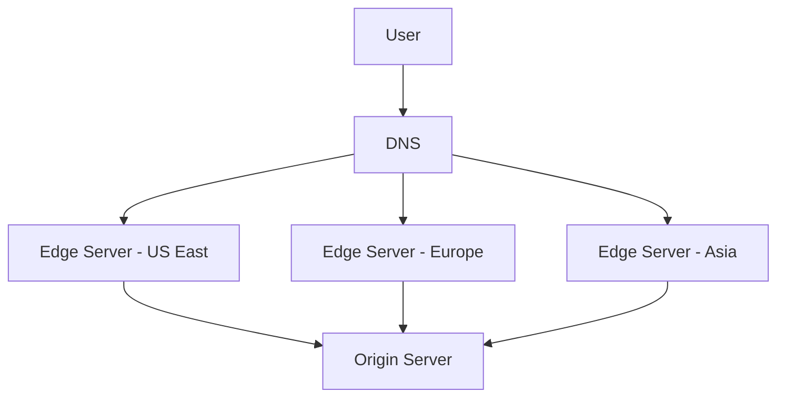

# Content Delivery Networks (CDNs)

## Overview

A **Content Delivery Network (CDN)** is a geographically distributed network of servers that work together to deliver web content based on users' geographic locations. The core purpose is to "bring your content physically closer to your users, reducing the distance data must travel."

## Core Architecture

### Key Components

1. **Edge Servers**: Cache servers located at Points of Presence (PoPs) worldwide
2. **Origin Servers**: Primary servers storing the original content
3. **DNS Infrastructure**: Routes user requests to the nearest edge server
4. **Control Systems**: Manage content distribution and cache invalidation



### Points of Presence (PoPs)

- **Strategic Locations**: Major cities and internet exchange points
- **Low Latency**: Minimize distance between users and content
- **High Availability**: Multiple servers per location for redundancy

## How CDNs Work

### Request Flow

1. **User Request**: User requests content (e.g., image, video, webpage)
2. **DNS Resolution**: DNS resolves request to nearest edge server IP
3. **Edge Server Check**: Edge server checks local cache
4. **Cache Hit/Miss**:
   - **Hit**: Serves content immediately from cache
   - **Miss**: Retrieves content from origin server, caches it, then serves

```javascript
// Simplified CDN request flow
async function handleCDNRequest(url, userLocation) {
  const nearestEdge = findNearestEdgeServer(userLocation);
  
  // Check edge server cache
  let content = await nearestEdge.getFromCache(url);
  
  if (!content) {
    // Cache miss - fetch from origin
    content = await originServer.getContent(url);
    
    // Cache for future requests
    await nearestEdge.cacheContent(url, content, ttl);
  }
  
  return content;
}
```

### Geographic Routing

```javascript
// Example of geographic routing logic
function findNearestEdgeServer(userIP) {
  const userLocation = geoIP.lookup(userIP);
  
  const edgeServers = [
    { location: 'us-east', latency: calculateLatency(userLocation, 'us-east') },
    { location: 'europe', latency: calculateLatency(userLocation, 'europe') },
    { location: 'asia', latency: calculateLatency(userLocation, 'asia') }
  ];
  
  return edgeServers.sort((a, b) => a.latency - b.latency)[0];
}
```

## Caching Strategies

### Time-to-Live (TTL) Management

```javascript
// CDN cache configuration
const cacheConfig = {
  images: { ttl: '1 week' },        // Static images
  css: { ttl: '1 month' },          // Stylesheets
  js: { ttl: '1 month' },           // JavaScript files
  html: { ttl: '1 hour' },          // Dynamic HTML
  api: { ttl: '5 minutes' },        // API responses
  video: { ttl: '1 month' }         // Video content
};
```

### Cache Headers

```http
# Origin server cache directives
Cache-Control: public, max-age=3600, s-maxage=86400
ETag: "abc123"
Last-Modified: Wed, 15 Nov 2023 10:30:00 GMT

# CDN-specific headers
CDN-Cache-Control: max-age=31536000
Vary: Accept-Encoding, User-Agent
```

### Cache Invalidation

```javascript
// Programmatic cache invalidation
class CDNManager {
  async invalidateCache(patterns) {
    const invalidationId = await this.createInvalidation({
      distributionId: 'E1EXAMPLE',
      paths: patterns
    });
    
    return this.waitForCompletion(invalidationId);
  }
  
  // Example usage
  async deployNewVersion() {
    await this.invalidateCache([
      '/css/*',
      '/js/*',
      '/index.html'
    ]);
  }
}
```

## Benefits

### Performance Improvements

1. **Reduced Latency**: Content served from geographically closer servers
2. **Faster Load Times**: Cached content eliminates origin server round-trips
3. **Bandwidth Optimization**: Compressed and optimized content delivery

```javascript
// Performance measurement
const performanceMetrics = {
  withoutCDN: {
    averageLoadTime: '2.5s',
    originServerLoad: '80%',
    globalAvailability: '95%'
  },
  withCDN: {
    averageLoadTime: '0.8s',    // 68% improvement
    originServerLoad: '20%',     // 75% reduction
    globalAvailability: '99.9%'  // Improved reliability
  }
};
```

### Scalability Benefits

- **Traffic Distribution**: Distributes load across multiple edge servers
- **Origin Protection**: Shields origin server from direct traffic
- **Auto-scaling**: Edge servers can handle traffic spikes

### Security Features

```javascript
// CDN security configurations
const securityConfig = {
  ddosProtection: true,
  wafRules: [
    'block-sql-injection',
    'block-xss-attacks',
    'rate-limiting'
  ],
  ssl: {
    certificate: 'wildcard',
    protocols: ['TLSv1.2', 'TLSv1.3']
  },
  geoBlocking: ['country-a', 'country-b']
};
```

## Use Cases

### Website Performance Acceleration

```html
<!-- Static asset optimization -->
<link rel="stylesheet" href="https://cdn.example.com/css/styles.min.css">
<script src="https://cdn.example.com/js/app.min.js"></script>

```

### Video Streaming

```javascript
// Video CDN configuration
const videoConfig = {
  adaptiveBitrate: true,
  protocols: ['HLS', 'DASH'],
  transcoding: {
    resolutions: ['720p', '1080p', '4K'],
    formats: ['mp4', 'webm']
  },
  edgeCache: '7 days'
};
```

### Software Distribution

```bash
# Example: npm packages via CDN
npm config set registry https://cdn.npmjs.com/

# Example: Software downloads
wget https://cdn.releases.com/software/v1.2.3/installer.zip
```

### API Acceleration

```javascript
// API response caching
app.get('/api/data', cacheMiddleware({ ttl: 300 }), (req, res) => {
  res.setHeader('Cache-Control', 'public, max-age=300');
  res.json(data);
});
```

## Popular CDN Providers

### Global Providers

1. **Akamai**
   - Largest CDN network
   - Enterprise-focused
   - Advanced security features

2. **Cloudflare**
   - Free tier available
   - Integrated security services
   - Easy setup and management

3. **Amazon CloudFront**
   - AWS integration
   - Pay-as-you-use pricing
   - Lambda@Edge for custom logic

4. **Google Cloud CDN**
   - Google Cloud integration
   - Global anycast IP
   - HTTP/2 and gRPC support

5. **Fastly**
   - Real-time configuration changes
   - Edge computing capabilities
   - Developer-friendly APIs

### Implementation Example

```javascript
// CloudFront configuration example
const cloudFrontConfig = {
  distributionConfig: {
    callerReference: Date.now().toString(),
    origins: {
      quantity: 1,
      items: [{
        id: 'origin1',
        domainName: 'example.com',
        customOriginConfig: {
          httpPort: 80,
          httpsPort: 443,
          originProtocolPolicy: 'https-only'
        }
      }]
    },
    defaultCacheBehavior: {
      targetOriginId: 'origin1',
      viewerProtocolPolicy: 'redirect-to-https',
      cachePolicyId: 'managed-caching-optimized'
    }
  }
};
```

## Performance Optimization

### Image Optimization

```javascript
// Automatic image optimization
const imageOptimization = {
  formats: ['webp', 'avif', 'jpeg'],
  sizes: [320, 768, 1024, 1440],
  quality: 85,
  compression: 'aggressive'
};

// Example URL transformation
// Original: https://cdn.example.com/image.jpg
// Optimized: https://cdn.example.com/image.jpg?w=768&f=webp&q=85
```

### Compression

```javascript
// Content compression settings
const compressionConfig = {
  gzip: {
    enabled: true,
    types: ['text/html', 'text/css', 'application/javascript']
  },
  brotli: {
    enabled: true,
    quality: 6
  }
};
```

## Monitoring and Analytics

### Key Metrics

```javascript
const cdnMetrics = {
  performance: {
    cacheHitRatio: '95%',
    averageResponseTime: '45ms',
    throughput: '10 Gbps'
  },
  usage: {
    bandwidth: '500 GB/month',
    requests: '10M/month',
    storage: '50 GB'
  },
  errors: {
    4xxErrors: '0.1%',
    5xxErrors: '0.01%',
    timeouts: '0.005%'
  }
};
```

### Real-time Monitoring

```javascript
// CDN monitoring dashboard
class CDNMonitor {
  constructor(cdnProvider) {
    this.provider = cdnProvider;
    this.metrics = new MetricsCollector();
  }
  
  async getRealtimeStats() {
    return {
      requestsPerSecond: await this.provider.getRPS(),
      bandwidthUsage: await this.provider.getBandwidth(),
      cacheHitRatio: await this.provider.getCacheHitRatio(),
      errorRates: await this.provider.getErrorRates()
    };
  }
}
```

## Best Practices

### Configuration Optimization

1. **Appropriate TTL Settings**: Balance freshness with performance
2. **Cache Headers**: Use proper cache-control headers
3. **Content Versioning**: Implement cache-busting for updates
4. **Compression**: Enable gzip/brotli for text content

### Content Strategy

```javascript
// Versioned asset URLs for cache busting
const assetVersioning = {
  css: '/css/styles.v1.2.3.css',
  js: '/js/app.v1.2.3.js',
  images: '/images/logo.v2.png'
};

// Dynamic versioning
function getVersionedUrl(path, version) {
  return `${CDN_BASE_URL}${path}?v=${version}`;
}
```

### Security Considerations

```javascript
// Security best practices
const securityBestPractices = {
  httpsOnly: true,
  secureHeaders: {
    'Strict-Transport-Security': 'max-age=31536000',
    'X-Content-Type-Options': 'nosniff',
    'X-Frame-Options': 'DENY'
  },
  accessControl: {
    allowedOrigins: ['https://example.com'],
    allowedMethods: ['GET', 'HEAD']
  }
};
```

## Cost Optimization

### Pricing Models

```javascript
// Cost analysis example
const cdnCostAnalysis = {
  dataTransfer: {
    cost: '$0.085/GB',
    monthlyUsage: '1000 GB',
    monthlyCost: '$85'
  },
  requests: {
    cost: '$0.0075/10K requests',
    monthlyRequests: '50M',
    monthlyCost: '$37.50'
  },
  totalMonthlyCost: '$122.50'
};
```

### Optimization Strategies

1. **Smart Caching**: Optimize TTL based on content type
2. **Compression**: Reduce bandwidth costs
3. **Geographic Targeting**: Use regional pricing tiers
4. **Traffic Analysis**: Identify and optimize high-cost routes

## Future Trends

### Edge Computing Integration

```javascript
// Edge computing example
addEventListener('fetch', event => {
  event.respondWith(handleRequest(event.request));
});

async function handleRequest(request) {
  // Process at the edge
  const response = await processAtEdge(request);
  return response;
}
```

### Advanced Features

- **Serverless Edge Functions**: Run custom code at edge locations
- **Real-time Analytics**: Instant insights into traffic patterns
- **AI-powered Optimization**: Intelligent caching and routing decisions
- **IoT Content Delivery**: Specialized delivery for IoT devices

## Key Takeaways

1. **Performance**: CDNs significantly reduce latency and improve load times
2. **Scalability**: Handle traffic spikes and global distribution effectively
3. **Reliability**: Improve availability through redundancy and failover
4. **Security**: Provide DDoS protection and security features
5. **Cost Efficiency**: Reduce origin server load and bandwidth costs

CDNs are essential building blocks for modern web applications, enabling fast, reliable, and secure content delivery at global scale.