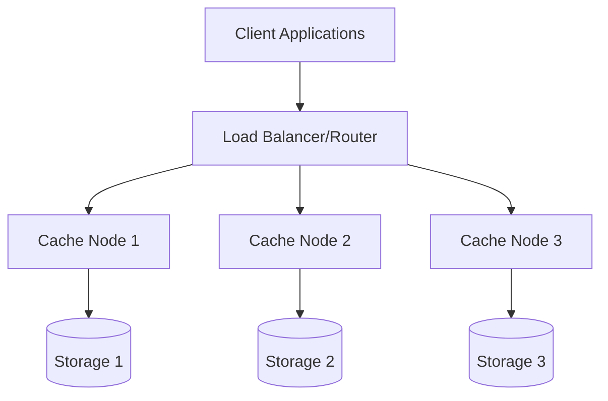

# Distributed Caching

## Overview

**Distributed caching is a technique where cache data is stored across multiple nodes (servers) instead of being confined to a single machine.** This approach enables horizontal scaling of cache infrastructure, provides fault tolerance, and distributes computational load across multiple servers.

## Core Architecture

### Basic Components



### Key Components

1. **Cache Nodes**: Individual servers storing cached data
2. **Client Library**: Handles connections and data distribution
3. **Consistent Hashing**: Distributes data evenly across nodes
4. **Replication**: Ensures data reliability across multiple nodes
5. **Sharding**: Splits data across different cache nodes

## Data Distribution Strategies

### 1. Consistent Hashing

```javascript
class ConsistentHashRing {
  constructor(nodes = [], virtualNodes = 150) {
    this.ring = new Map();
    this.nodes = new Set();
    this.virtualNodes = virtualNodes;
    
    nodes.forEach(node => this.addNode(node));
  }
  
  hash(key) {
    // Simple hash function (use crypto.createHash in production)
    let hash = 0;
    for (let i = 0; i < key.length; i++) {
      hash = ((hash << 5) - hash + key.charCodeAt(i)) & 0xffffffff;
    }
    return Math.abs(hash);
  }
  
  addNode(node) {
    this.nodes.add(node);
    
    // Add virtual nodes for better distribution
    for (let i = 0; i < this.virtualNodes; i++) {
      const virtualKey = this.hash(`${node}:${i}`);
      this.ring.set(virtualKey, node);
    }
    
    // Sort ring by hash values
    this.sortedKeys = Array.from(this.ring.keys()).sort((a, b) => a - b);
  }
  
  removeNode(node) {
    this.nodes.delete(node);
    
    // Remove all virtual nodes
    for (let i = 0; i < this.virtualNodes; i++) {
      const virtualKey = this.hash(`${node}:${i}`);
      this.ring.delete(virtualKey);
    }
    
    this.sortedKeys = Array.from(this.ring.keys()).sort((a, b) => a - b);
  }
  
  getNode(key) {
    if (this.ring.size === 0) return null;
    
    const keyHash = this.hash(key);
    
    // Find the first node with hash >= keyHash
    let nodeHash = this.sortedKeys.find(hash => hash >= keyHash);
    
    // If not found, wrap around to the first node
    if (!nodeHash) {
      nodeHash = this.sortedKeys[0];
    }
    
    return this.ring.get(nodeHash);
  }
}
```

### 2. Sharding Strategies

```javascript
class CacheSharding {
  constructor(nodes) {
    this.nodes = nodes;
    this.shardingStrategy = 'hash'; // 'hash', 'range', 'directory'
  }
  
  // Hash-based sharding
  hashShard(key) {
    const hash = this.simpleHash(key);
    return this.nodes[hash % this.nodes.length];
  }
  
  // Range-based sharding
  rangeShard(key) {
    const keyNum = parseInt(key.split(':')[1]) || 0;
    const rangeSize = Math.ceil(1000000 / this.nodes.length);
    const shardIndex = Math.floor(keyNum / rangeSize);
    return this.nodes[Math.min(shardIndex, this.nodes.length - 1)];
  }
  
  // Directory-based sharding
  directoryShard(key) {
    const prefix = key.split(':')[0];
    const shardMap = {
      'user': 0,
      'product': 1,
      'order': 2,
      'session': 0 // Can map multiple prefixes to same shard
    };
    
    const shardIndex = shardMap[prefix] || 0;
    return this.nodes[shardIndex % this.nodes.length];
  }
  
  getShard(key) {
    switch (this.shardingStrategy) {
      case 'range':
        return this.rangeShard(key);
      case 'directory':
        return this.directoryShard(key);
      default:
        return this.hashShard(key);
    }
  }
}
```

## Implementation Patterns

### 1. Dedicated Cache Servers

```javascript
class DedicatedCacheCluster {
  constructor(cacheNodes) {
    this.nodes = cacheNodes;
    this.hashRing = new ConsistentHashRing(cacheNodes);
    this.connections = new Map();
    
    // Initialize connections to all nodes
    this.initializeConnections();
  }
  
  async initializeConnections() {
    for (const node of this.nodes) {
      try {
        const connection = await this.createConnection(node);
        this.connections.set(node, connection);
      } catch (error) {
        console.error(`Failed to connect to ${node}:`, error);
      }
    }
  }
  
  async get(key) {
    const node = this.hashRing.getNode(key);
    const connection = this.connections.get(node);
    
    if (!connection) {
      throw new Error(`No connection available for node ${node}`);
    }
    
    try {
      return await connection.get(key);
    } catch (error) {
      // Handle node failure
      return await this.handleNodeFailure(key, node, 'get');
    }
  }
  
  async set(key, value, ttl) {
    const node = this.hashRing.getNode(key);
    const connection = this.connections.get(node);
    
    if (!connection) {
      throw new Error(`No connection available for node ${node}`);
    }
    
    try {
      // Primary write
      await connection.set(key, value, ttl);
      
      // Optional: Write to replica
      await this.writeToReplica(key, value, ttl, node);
      
      return true;
    } catch (error) {
      return await this.handleNodeFailure(key, node, 'set', { value, ttl });
    }
  }
  
  async handleNodeFailure(key, failedNode, operation, data) {
    // Remove failed node from ring
    this.hashRing.removeNode(failedNode);
    this.connections.delete(failedNode);
    
    // Retry operation on new node
    const newNode = this.hashRing.getNode(key);
    const newConnection = this.connections.get(newNode);
    
    if (operation === 'get') {
      return await newConnection.get(key);
    } else if (operation === 'set') {
      return await newConnection.set(key, data.value, data.ttl);
    }
  }
}
```

### 2. Co-located Cache

```javascript
class ColocatedCache {
  constructor(localCacheSize = 1000) {
    this.localCache = new LRUCache(localCacheSize);
    this.distributedCache = new DistributedCacheClient();
    this.localHitRate = 0;
    this.requests = 0;
  }
  
  async get(key) {
    this.requests++;
    
    // Check local cache first
    let value = this.localCache.get(key);
    if (value !== undefined) {
      this.updateHitRate(true);
      return value;
    }
    
    // Check distributed cache
    value = await this.distributedCache.get(key);
    if (value !== null) {
      // Store in local cache for future requests
      this.localCache.set(key, value);
      this.updateHitRate(false);
      return value;
    }
    
    this.updateHitRate(false);
    return null;
  }
  
  async set(key, value, ttl) {
    // Update both local and distributed cache
    this.localCache.set(key, value);
    await this.distributedCache.set(key, value, ttl);
  }
  
  updateHitRate(isLocalHit) {
    if (isLocalHit) {
      this.localHitRate = (this.localHitRate * (this.requests - 1) + 1) / this.requests;
    } else {
      this.localHitRate = (this.localHitRate * (this.requests - 1)) / this.requests;
    }
  }
}
```

## Replication Strategies

### 1. Master-Slave Replication

```javascript
class MasterSlaveCache {
  constructor(masterNode, slaveNodes) {
    this.master = masterNode;
    this.slaves = slaveNodes;
    this.replicationFactor = slaveNodes.length + 1;
  }
  
  async set(key, value, ttl) {
    // Write to master first
    await this.master.set(key, value, ttl);
    
    // Asynchronously replicate to slaves
    const replicationPromises = this.slaves.map(slave =>
      this.replicateToSlave(slave, key, value, ttl)
    );
    
    // Don't wait for replication to complete
    Promise.all(replicationPromises).catch(error => {
      console.error('Replication failed:', error);
    });
    
    return true;
  }
  
  async get(key) {
    try {
      // Try master first
      return await this.master.get(key);
    } catch (error) {
      // Fallback to slaves
      for (const slave of this.slaves) {
        try {
          return await slave.get(key);
        } catch (slaveError) {
          continue;
        }
      }
      throw new Error('All nodes failed');
    }
  }
  
  async replicateToSlave(slave, key, value, ttl) {
    const maxRetries = 3;
    
    for (let i = 0; i < maxRetries; i++) {
      try {
        await slave.set(key, value, ttl);
        return;
      } catch (error) {
        if (i === maxRetries - 1) throw error;
        await this.delay(100 * Math.pow(2, i)); // Exponential backoff
      }
    }
  }
}
```

### 2. Multi-Master Replication

```javascript
class MultiMasterCache {
  constructor(nodes) {
    this.nodes = nodes;
    this.consistentHashing = new ConsistentHashRing(nodes);
    this.replicationFactor = Math.min(3, nodes.length);
  }
  
  async set(key, value, ttl) {
    const primaryNode = this.consistentHashing.getNode(key);
    const replicaNodes = this.getReplicaNodes(key, primaryNode);
    
    // Write to all replicas
    const writePromises = [primaryNode, ...replicaNodes].map(node =>
      this.writeWithRetry(node, key, value, ttl)
    );
    
    // Wait for majority of writes to succeed
    const results = await Promise.allSettled(writePromises);
    const successCount = results.filter(r => r.status === 'fulfilled').length;
    
    if (successCount < Math.ceil(this.replicationFactor / 2)) {
      throw new Error('Failed to achieve write quorum');
    }
    
    return true;
  }
  
  async get(key) {
    const primaryNode = this.consistentHashing.getNode(key);
    const replicaNodes = this.getReplicaNodes(key, primaryNode);
    
    // Try primary first
    try {
      return await primaryNode.get(key);
    } catch (error) {
      // Try replicas
      for (const replica of replicaNodes) {
        try {
          return await replica.get(key);
        } catch (replicaError) {
          continue;
        }
      }
      return null;
    }
  }
  
  getReplicaNodes(key, primaryNode) {
    const allNodes = [...this.nodes];
    const primaryIndex = allNodes.indexOf(primaryNode);
    const replicas = [];
    
    for (let i = 1; i < this.replicationFactor; i++) {
      const replicaIndex = (primaryIndex + i) % allNodes.length;
      replicas.push(allNodes[replicaIndex]);
    }
    
    return replicas;
  }
}
```

## Popular Technologies

### 1. Redis Cluster

```javascript
class RedisClusterClient {
  constructor(nodes) {
    this.cluster = new Redis.Cluster(nodes, {
      enableReadyCheck: false,
      redisOptions: {
        password: process.env.REDIS_PASSWORD
      },
      scaleReads: 'slave'
    });
    
    this.cluster.on('error', this.handleError.bind(this));
    this.cluster.on('node error', this.handleNodeError.bind(this));
  }
  
  async set(key, value, ttl = 3600) {
    const serializedValue = JSON.stringify({
      data: value,
      timestamp: Date.now()
    });
    
    return await this.cluster.setex(key, ttl, serializedValue);
  }
  
  async get(key) {
    const value = await this.cluster.get(key);
    
    if (!value) return null;
    
    try {
      const parsed = JSON.parse(value);
      return parsed.data;
    } catch (error) {
      console.error('Failed to parse cached value:', error);
      return null;
    }
  }
  
  async mget(keys) {
    const values = await this.cluster.mget(keys);
    return values.map(value => {
      if (!value) return null;
      try {
        return JSON.parse(value).data;
      } catch (error) {
        return null;
      }
    });
  }
  
  async del(keys) {
    return await this.cluster.del(keys);
  }
  
  handleError(error) {
    console.error('Redis Cluster error:', error);
  }
  
  handleNodeError(error, node) {
    console.error(`Redis node ${node.options.host}:${node.options.port} error:`, error);
  }
}
```

### 2. Memcached Cluster

```javascript
class MemcachedCluster {
  constructor(servers) {
    this.memcached = new Memcached(servers, {
      retries: 10,
      retry: 10000,
      remove: true,
      failOverServers: servers
    });
    
    this.servers = servers;
    this.hashRing = new ConsistentHashRing(servers);
  }
  
  set(key, value, ttl = 3600) {
    return new Promise((resolve, reject) => {
      this.memcached.set(key, value, ttl, (err) => {
        if (err) reject(err);
        else resolve();
      });
    });
  }
  
  get(key) {
    return new Promise((resolve, reject) => {
      this.memcached.get(key, (err, data) => {
        if (err) reject(err);
        else resolve(data);
      });
    });
  }
  
  getMulti(keys) {
    return new Promise((resolve, reject) => {
      this.memcached.getMulti(keys, (err, data) => {
        if (err) reject(err);
        else resolve(data);
      });
    });
  }
  
  del(key) {
    return new Promise((resolve, reject) => {
      this.memcached.del(key, (err) => {
        if (err) reject(err);
        else resolve();
      });
    });
  }
}
```

## Challenges and Solutions

### 1. Data Consistency

```javascript
class EventuallyConsistentCache {
  constructor(nodes) {
    this.nodes = nodes;
    this.vectorClock = new VectorClock();
    this.conflictResolver = new ConflictResolver();
  }
  
  async set(key, value, ttl) {
    const timestamp = this.vectorClock.increment();
    const versionedValue = {
      data: value,
      version: timestamp,
      ttl: ttl
    };
    
    // Write to all nodes with version info
    const writePromises = this.nodes.map(node =>
      node.set(key, versionedValue, ttl)
    );
    
    await Promise.allSettled(writePromises);
  }
  
  async get(key) {
    const readPromises = this.nodes.map(node => node.get(key));
    const results = await Promise.allSettled(readPromises);
    
    const values = results
      .filter(r => r.status === 'fulfilled' && r.value)
      .map(r => r.value);
    
    if (values.length === 0) return null;
    if (values.length === 1) return values[0].data;
    
    // Resolve conflicts using vector clocks
    const resolvedValue = this.conflictResolver.resolve(values);
    return resolvedValue.data;
  }
}
```

### 2. Cache Invalidation

```javascript
class DistributedCacheInvalidation {
  constructor(cacheNodes, messageQueue) {
    this.cacheNodes = cacheNodes;
    this.messageQueue = messageQueue;
    this.subscribeToInvalidations();
  }
  
  async invalidate(keys) {
    // Publish invalidation message to all nodes
    const message = {
      type: 'invalidate',
      keys: Array.isArray(keys) ? keys : [keys],
      timestamp: Date.now()
    };
    
    await this.messageQueue.publish('cache-invalidation', message);
  }
  
  async invalidatePattern(pattern) {
    const message = {
      type: 'invalidate-pattern',
      pattern: pattern,
      timestamp: Date.now()
    };
    
    await this.messageQueue.publish('cache-invalidation', message);
  }
  
  subscribeToInvalidations() {
    this.messageQueue.subscribe('cache-invalidation', async (message) => {
      if (message.type === 'invalidate') {
        await this.processInvalidation(message.keys);
      } else if (message.type === 'invalidate-pattern') {
        await this.processPatternInvalidation(message.pattern);
      }
    });
  }
  
  async processInvalidation(keys) {
    const promises = this.cacheNodes.map(node =>
      Promise.all(keys.map(key => node.del(key)))
    );
    
    await Promise.allSettled(promises);
  }
  
  async processPatternInvalidation(pattern) {
    const promises = this.cacheNodes.map(async (node) => {
      const matchingKeys = await node.keys(pattern);
      if (matchingKeys.length > 0) {
        await node.del(matchingKeys);
      }
    });
    
    await Promise.allSettled(promises);
  }
}
```

### 3. Network Partitioning

```javascript
class PartitionTolerantCache {
  constructor(nodes) {
    this.nodes = nodes;
    this.quorumSize = Math.floor(nodes.length / 2) + 1;
    this.availableNodes = new Set(nodes);
  }
  
  async set(key, value, ttl) {
    const availableNodes = Array.from(this.availableNodes);
    
    if (availableNodes.length < this.quorumSize) {
      throw new Error('Insufficient nodes available for write quorum');
    }
    
    const writePromises = availableNodes.map(node =>
      this.writeWithTimeout(node, key, value, ttl, 1000)
    );
    
    const results = await Promise.allSettled(writePromises);
    const successful = results.filter(r => r.status === 'fulfilled').length;
    
    if (successful < this.quorumSize) {
      throw new Error('Failed to achieve write quorum');
    }
    
    return true;
  }
  
  async get(key) {
    const availableNodes = Array.from(this.availableNodes);
    const readQuorum = Math.ceil(this.quorumSize / 2);
    
    if (availableNodes.length < readQuorum) {
      throw new Error('Insufficient nodes available for read quorum');
    }
    
    const readPromises = availableNodes.slice(0, readQuorum).map(node =>
      this.readWithTimeout(node, key, 1000)
    );
    
    const results = await Promise.allSettled(readPromises);
    const values = results
      .filter(r => r.status === 'fulfilled' && r.value)
      .map(r => r.value);
    
    return values.length > 0 ? values[0] : null;
  }
  
  async writeWithTimeout(node, key, value, ttl, timeout) {
    return Promise.race([
      node.set(key, value, ttl),
      new Promise((_, reject) =>
        setTimeout(() => reject(new Error('Write timeout')), timeout)
      )
    ]);
  }
  
  monitorNodeHealth() {
    setInterval(async () => {
      for (const node of this.nodes) {
        try {
          await this.healthCheck(node);
          this.availableNodes.add(node);
        } catch (error) {
          this.availableNodes.delete(node);
        }
      }
    }, 5000);
  }
}
```

## Performance Optimization

### 1. Connection Pooling

```javascript
class CacheConnectionPool {
  constructor(nodes, options = {}) {
    this.nodes = nodes;
    this.options = {
      maxConnections: 20,
      minConnections: 5,
      idleTimeout: 30000,
      ...options
    };
    
    this.pools = new Map();
    this.initializePools();
  }
  
  initializePools() {
    this.nodes.forEach(node => {
      const pool = new ConnectionPool({
        host: node.host,
        port: node.port,
        ...this.options
      });
      
      this.pools.set(node, pool);
    });
  }
  
  async execute(node, operation, ...args) {
    const pool = this.pools.get(node);
    
    if (!pool) {
      throw new Error(`No pool available for node ${node.host}:${node.port}`);
    }
    
    const connection = await pool.acquire();
    
    try {
      return await connection[operation](...args);
    } finally {
      pool.release(connection);
    }
  }
  
  async get(key) {
    const node = this.selectNode(key);
    return await this.execute(node, 'get', key);
  }
  
  async set(key, value, ttl) {
    const node = this.selectNode(key);
    return await this.execute(node, 'set', key, value, ttl);
  }
}
```

### 2. Batch Operations

```javascript
class BatchedDistributedCache {
  constructor(cache) {
    this.cache = cache;
    this.batchQueue = new Map();
    this.batchTimeout = 10; // 10ms
    this.maxBatchSize = 100;
    
    this.processBatches();
  }
  
  async get(key) {
    return new Promise((resolve, reject) => {
      // Add to batch queue
      if (!this.batchQueue.has('get')) {
        this.batchQueue.set('get', []);
      }
      
      this.batchQueue.get('get').push({ key, resolve, reject });
      
      // Process immediately if batch is full
      if (this.batchQueue.get('get').length >= this.maxBatchSize) {
        this.processBatch('get');
      }
    });
  }
  
  processBatches() {
    setInterval(() => {
      for (const [operation, batch] of this.batchQueue) {
        if (batch.length > 0) {
          this.processBatch(operation);
        }
      }
    }, this.batchTimeout);
  }
  
  async processBatch(operation) {
    const batch = this.batchQueue.get(operation) || [];
    if (batch.length === 0) return;
    
    this.batchQueue.set(operation, []);
    
    if (operation === 'get') {
      const keys = batch.map(item => item.key);
      
      try {
        const values = await this.cache.mget(keys);
        
        batch.forEach((item, index) => {
          item.resolve(values[index]);
        });
      } catch (error) {
        batch.forEach(item => item.reject(error));
      }
    }
  }
}
```

## Monitoring and Metrics

### Distributed Cache Metrics

```javascript
class DistributedCacheMonitor {
  constructor(cacheCluster) {
    this.cluster = cacheCluster;
    this.metrics = {
      totalRequests: 0,
      hitRate: 0,
      missRate: 0,
      errorRate: 0,
      avgLatency: 0,
      nodeHealth: new Map()
    };
    
    this.startMonitoring();
  }
  
  async collectMetrics() {
    const nodeMetrics = await Promise.all(
      this.cluster.nodes.map(node => this.collectNodeMetrics(node))
    );
    
    return {
      cluster: this.aggregateMetrics(nodeMetrics),
      nodes: nodeMetrics
    };
  }
  
  async collectNodeMetrics(node) {
    try {
      const info = await node.info();
      const stats = this.parseRedisInfo(info);
      
      return {
        node: `${node.options.host}:${node.options.port}`,
        connected: true,
        hitRate: stats.keyspace_hits / (stats.keyspace_hits + stats.keyspace_misses),
        memory: stats.used_memory_human,
        connections: stats.connected_clients,
        ops: stats.instantaneous_ops_per_sec
      };
    } catch (error) {
      return {
        node: `${node.options.host}:${node.options.port}`,
        connected: false,
        error: error.message
      };
    }
  }
  
  startMonitoring() {
    setInterval(async () => {
      const metrics = await this.collectMetrics();
      this.publishMetrics(metrics);
    }, 30000); // Every 30 seconds
  }
  
  publishMetrics(metrics) {
    // Send to monitoring system
    console.log('Cache Cluster Metrics:', JSON.stringify(metrics, null, 2));
  }
}
```

## Best Practices

### 1. Configuration Management

```javascript
const distributedCacheConfig = {
  development: {
    nodes: ['127.0.0.1:6379'],
    replicationFactor: 1,
    readQuorum: 1,
    writeQuorum: 1
  },
  production: {
    nodes: [
      'cache-node-1:6379',
      'cache-node-2:6379',
      'cache-node-3:6379',
      'cache-node-4:6379',
      'cache-node-5:6379'
    ],
    replicationFactor: 3,
    readQuorum: 2,
    writeQuorum: 2,
    maxRetries: 3,
    timeout: 1000
  }
};
```

### 2. Error Handling

```javascript
class ResilientDistributedCache {
  constructor(config) {
    this.cache = new DistributedCache(config);
    this.fallbackCache = new LocalCache(1000);
    this.circuitBreaker = new CircuitBreaker();
  }
  
  async get(key) {
    if (this.circuitBreaker.isOpen()) {
      return await this.fallbackCache.get(key);
    }
    
    try {
      const value = await this.cache.get(key);
      this.circuitBreaker.recordSuccess();
      return value;
    } catch (error) {
      this.circuitBreaker.recordFailure();
      
      // Fallback to local cache
      return await this.fallbackCache.get(key);
    }
  }
}
```

## Key Takeaways

1. **Horizontal Scalability**: Distributed caching enables scaling cache infrastructure across multiple nodes
2. **Fault Tolerance**: Replication and sharding provide resilience against node failures
3. **Consistency Trade-offs**: Choose appropriate consistency models based on application requirements
4. **Performance Benefits**: Proper implementation can dramatically improve system performance
5. **Operational Complexity**: Requires careful monitoring, configuration, and maintenance
6. **Technology Choice**: Select appropriate technology (Redis, Memcached) based on specific needs

Distributed caching is essential for building scalable, high-performance systems that can handle large amounts of data and traffic across multiple servers.