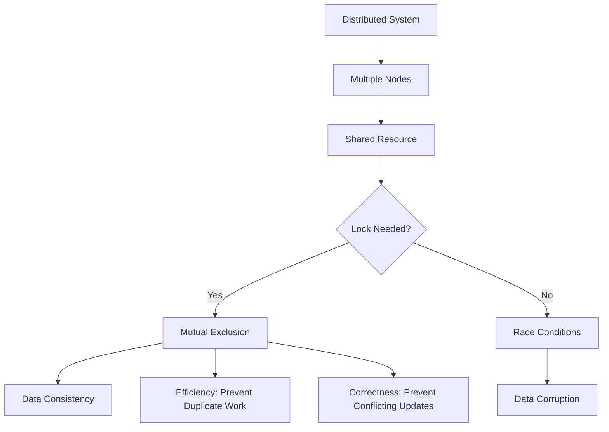

# Distributed Locking

## Overview

**Distributed locking is a mechanism for coordinating access to shared resources across multiple nodes in a distributed system.** Unlike single-process mutexes, distributed locks must handle network failures, node crashes, and timing issues while ensuring mutual exclusion and safety properties.

## Core Concepts

### Purpose of Distributed Locks



### Two Primary Use Cases

1. **Efficiency**: Prevent redundant work by ensuring only one node processes a task
2. **Correctness**: Prevent concurrent processes from corrupting shared state

## Fundamental Challenges

### 1. Network Partitions and Timing

```javascript
class DistributedLockingChallenges {
  // Demonstrate timing issues in distributed systems
  async demonstrateTimingIssues() {
    const scenarios = [
      {
        name: 'Process Pause',
        description: 'GC pause causes lock holder to appear dead',
        simulation: this.simulateProcessPause
      },
      {
        name: 'Network Delay',
        description: 'Network delays cause timeout confusion',
        simulation: this.simulateNetworkDelay
      },
      {
        name: 'Clock Skew',
        description: 'Different system clocks cause timing conflicts',
        simulation: this.simulateClockSkew
      }
    ];
    
    for (const scenario of scenarios) {
      console.log(`\n=== ${scenario.name} ===`);
      console.log(scenario.description);
      await scenario.simulation();
    }
  }
  
  async simulateProcessPause() {
    const client1 = new DistributedLockClient('client1');
    const client2 = new DistributedLockClient('client2');
    
    // Client 1 acquires lock
    const lock1 = await client1.acquireLock('resource1', 30000); // 30s timeout
    console.log('Client 1 acquired lock');
    
    // Simulate GC pause - client 1 stops processing
    console.log('Client 1 experiences GC pause...');
    
    // During pause, lock expires and client 2 acquires it
    setTimeout(async () => {
      const lock2 = await client2.acquireLock('resource1', 30000);
      console.log('Client 2 acquired lock (client 1 paused)');
      
      // Client 1 resumes and thinks it still has the lock
      console.log('Client 1 resumes, still thinks it has the lock');
      console.log('PROBLEM: Both clients think they have the lock!');
    }, 15000);
  }
  
  async simulateNetworkDelay() {
    // Demonstrate how network delays can cause false timeouts
    const lockService = new MockLockService();
    const client = new DistributedLockClient('client');
    
    // Client sends lock request
    console.log('Client requests lock');
    const startTime = Date.now();
    
    // Simulate network delay
    setTimeout(() => {
      lockService.receiveLockRequest(client.id, 'resource1');
      console.log('Lock service receives request after delay');
    }, 8000); // 8 second delay
    
    // Client times out after 5 seconds
    setTimeout(() => {
      console.log('Client times out waiting for response');
      console.log('PROBLEM: Client assumes lock failed, but service may grant it');
    }, 5000);
  }
  
  async simulateClockSkew() {
    // Different nodes have different system times
    const node1Time = Date.now();
    const node2Time = Date.now() + 30000; // 30 seconds ahead
    const node3Time = Date.now() - 15000; // 15 seconds behind
    
    console.log('Node times:');
    console.log(`Node 1: ${new Date(node1Time)}`);
    console.log(`Node 2: ${new Date(node2Time)}`);
    console.log(`Node 3: ${new Date(node3Time)}`);
    
    // TTL-based locks will behave differently on each node
    const lock1Expires = node1Time + 60000;
    const lock2Expires = node2Time + 60000;
    const lock3Expires = node3Time + 60000;
    
    console.log('Lock expiry times (local to each node):');
    console.log(`Node 1 thinks lock expires: ${new Date(lock1Expires)}`);
    console.log(`Node 2 thinks lock expires: ${new Date(lock2Expires)}`);
    console.log(`Node 3 thinks lock expires: ${new Date(lock3Expires)}`);
    console.log('PROBLEM: Inconsistent lock expiry across nodes');
  }
}
```

### 2. Fencing Tokens

```javascript
class FencingTokenExample {
  constructor() {
    this.currentToken = 0;
    this.validTokens = new Set();
  }
  
  // Proper distributed lock with fencing token
  async acquireLockWithFencing(resourceId, clientId) {
    const token = ++this.currentToken;
    
    const lock = {
      resourceId,
      clientId,
      token,
      acquiredAt: Date.now(),
      expiresAt: Date.now() + 30000, // 30 seconds
      valid: true
    };
    
    this.validTokens.add(token);
    
    console.log(`Client ${clientId} acquired lock with token ${token}`);
    
    return {
      token,
      release: () => this.releaseLock(token),
      isValid: () => this.validTokens.has(token)
    };
  }
  
  // Storage service that validates fencing tokens
  async writeWithFencing(resourceId, data, fencingToken) {
    // Check if token is valid and current
    if (!this.validTokens.has(fencingToken)) {
      throw new Error(`Invalid fencing token: ${fencingToken}`);
    }
    
    // Check if there's a newer token (this one is stale)
    if (fencingToken < this.currentToken) {
      throw new Error(`Stale fencing token: ${fencingToken}, current: ${this.currentToken}`);
    }
    
    // Perform the write operation
    console.log(`Writing data with valid token ${fencingToken}: ${data}`);
    
    return { success: true, token: fencingToken };
  }
  
  releaseLock(token) {
    this.validTokens.delete(token);
    console.log(`Released lock with token ${token}`);
  }
  
  // Demonstrate fencing in action
  async demonstrateFencing() {
    console.log('=== Fencing Token Demonstration ===');
    
    // Client 1 acquires lock
    const lock1 = await this.acquireLockWithFencing('resource1', 'client1');
    
    // Client 1 writes successfully
    await this.writeWithFencing('resource1', 'data1', lock1.token);
    
    // Simulate: Client 1 experiences delay, lock expires, Client 2 gets lock
    const lock2 = await this.acquireLockWithFencing('resource1', 'client2');
    
    // Client 2 writes successfully
    await this.writeWithFencing('resource1', 'data2', lock2.token);
    
    // Client 1 tries to write with stale token - REJECTED
    try {
      await this.writeWithFencing('resource1', 'data1_retry', lock1.token);
    } catch (error) {
      console.log(`Client 1 write rejected: ${error.message}`);
    }
    
    console.log('Fencing prevented data corruption!');
  }
}
```

## Implementation Approaches

### 1. ZooKeeper-Based Locking (Recommended for Correctness)

```javascript
class ZooKeeperDistributedLock {
  constructor(zookeeper, lockPath) {
    this.zk = zookeeper;
    this.lockPath = lockPath;
    this.sequenceNumber = null;
    this.lockNode = null;
  }
  
  async acquireLock() {
    try {
      // Create sequential ephemeral node
      this.lockNode = await this.zk.create(
        `${this.lockPath}/lock-`,
        Buffer.from(''),
        'EPHEMERAL_SEQUENTIAL'
      );
      
      this.sequenceNumber = this.extractSequenceNumber(this.lockNode);
      
      // Check if we have the lock
      const hasLock = await this.checkLock();
      
      if (!hasLock) {
        // Wait for our turn
        await this.waitForLock();
      }
      
      return {
        token: this.sequenceNumber,
        release: () => this.releaseLock(),
        node: this.lockNode
      };
    } catch (error) {
      await this.cleanup();
      throw error;
    }
  }
  
  async checkLock() {
    // Get all lock nodes
    const children = await this.zk.getChildren(this.lockPath);
    const lockNodes = children
      .filter(child => child.startsWith('lock-'))
      .sort();
    
    if (lockNodes.length === 0) {
      throw new Error('No lock nodes found');
    }
    
    // We have the lock if our node is the first in sequence
    const ourNode = this.lockNode.split('/').pop();
    return lockNodes[0] === ourNode;
  }
  
  async waitForLock() {
    return new Promise(async (resolve, reject) => {
      try {
        const children = await this.zk.getChildren(this.lockPath);
        const lockNodes = children
          .filter(child => child.startsWith('lock-'))
          .map(child => ({
            name: child,
            sequence: this.extractSequenceNumber(child)
          }))
          .sort((a, b) => a.sequence - b.sequence);
        
        // Find our position in the queue
        const ourIndex = lockNodes.findIndex(
          node => node.sequence === this.sequenceNumber
        );
        
        if (ourIndex === 0) {
          // We're first, we have the lock
          resolve();
          return;
        }
        
        // Watch the node immediately before us
        const watchNode = lockNodes[ourIndex - 1];
        const watchPath = `${this.lockPath}/${watchNode.name}`;
        
        // Set up watcher
        const exists = await this.zk.exists(watchPath, (event) => {
          if (event.type === 'NodeDeleted') {
            // The node before us was deleted, check if we have the lock now
            this.checkLock().then(hasLock => {
              if (hasLock) {
                resolve();
              } else {
                // Still not our turn, wait for next node
                this.waitForLock().then(resolve).catch(reject);
              }
            }).catch(reject);
          }
        });
        
        if (!exists) {
          // Node doesn't exist, check immediately
          const hasLock = await this.checkLock();
          if (hasLock) {
            resolve();
          } else {
            await this.waitForLock();
            resolve();
          }
        }
      } catch (error) {
        reject(error);
      }
    });
  }
  
  async releaseLock() {
    if (this.lockNode) {
      try {
        await this.zk.delete(this.lockNode);
        console.log(`Released lock: ${this.lockNode}`);
      } catch (error) {
        console.error('Error releasing lock:', error);
      } finally {
        this.lockNode = null;
        this.sequenceNumber = null;
      }
    }
  }
  
  async cleanup() {
    await this.releaseLock();
  }
  
  extractSequenceNumber(nodePath) {
    const parts = nodePath.split('-');
    return parseInt(parts[parts.length - 1], 10);
  }
}

// Usage example
class ZooKeeperLockExample {
  async demonstrateZooKeeperLock() {
    const zk = new ZooKeeper('localhost:2181');
    await zk.connect();
    
    // Ensure lock path exists
    await zk.mkdirp('/locks');
    
    // Multiple clients trying to acquire the same lock
    const clients = ['client1', 'client2', 'client3'];
    const promises = clients.map(async (clientId) => {
      const lock = new ZooKeeperDistributedLock(zk, '/locks/resource1');
      
      try {
        console.log(`${clientId} attempting to acquire lock`);
        const lockInfo = await lock.acquireLock();
        
        console.log(`${clientId} acquired lock with token ${lockInfo.token}`);
        
        // Hold lock for some work
        await this.doWork(clientId, 2000);
        
        // Release lock
        await lockInfo.release();
        console.log(`${clientId} released lock`);
      } catch (error) {
        console.error(`${clientId} failed to acquire lock:`, error);
      }
    });
    
    await Promise.all(promises);
    await zk.close();
  }
  
  async doWork(clientId, duration) {
    console.log(`${clientId} is working...`);
    await new Promise(resolve => setTimeout(resolve, duration));
    console.log(`${clientId} finished work`);
  }
}
```

### 2. Redis-Based Locking (with Caveats)

```javascript
class RedisDistributedLock {
  constructor(redis, options = {}) {
    this.redis = redis;
    this.options = {
      ttl: 30000, // 30 seconds
      retryDelay: 1000,
      maxRetries: 3,
      ...options
    };
  }
  
  // Simple Redis lock (has issues - see analysis below)
  async acquireSimpleLock(resourceId, clientId) {
    const lockKey = `lock:${resourceId}`;
    const lockValue = `${clientId}:${Date.now()}`;
    
    const result = await this.redis.set(
      lockKey,
      lockValue,
      'PX', this.options.ttl,
      'NX'
    );
    
    if (result === 'OK') {
      return {
        key: lockKey,
        value: lockValue,
        release: () => this.releaseSimpleLock(lockKey, lockValue)
      };
    }
    
    return null;
  }
  
  async releaseSimpleLock(lockKey, expectedValue) {
    // Use Lua script for atomic check-and-delete
    const script = `
      if redis.call("get", KEYS[1]) == ARGV[1] then
        return redis.call("del", KEYS[1])
      else
        return 0
      end
    `;
    
    const result = await this.redis.eval(script, 1, lockKey, expectedValue);
    return result === 1;
  }
  
  // Improved Redis lock with retry logic
  async acquireLockWithRetry(resourceId, clientId) {
    let attempts = 0;
    
    while (attempts < this.options.maxRetries) {
      const lock = await this.acquireSimpleLock(resourceId, clientId);
      
      if (lock) {
        return lock;
      }
      
      attempts++;
      if (attempts < this.options.maxRetries) {
        await this.sleep(this.options.retryDelay);
      }
    }
    
    throw new Error(`Failed to acquire lock after ${this.options.maxRetries} attempts`);
  }
  
  // Redlock algorithm (distributed Redis locking)
  async acquireRedlock(resourceId, clientId, redisInstances) {
    const lockKey = `lock:${resourceId}`;
    const lockValue = `${clientId}:${Date.now()}:${Math.random()}`;
    const ttl = this.options.ttl;
    
    const startTime = Date.now();
    let successCount = 0;
    const results = [];
    
    // Try to acquire lock on all Redis instances
    const promises = redisInstances.map(async (redis) => {
      try {
        const result = await redis.set(lockKey, lockValue, 'PX', ttl, 'NX');
        return { success: result === 'OK', redis };
      } catch (error) {
        return { success: false, redis, error };
      }
    });
    
    const acquisitionResults = await Promise.all(promises);
    successCount = acquisitionResults.filter(r => r.success).length;
    
    const elapsedTime = Date.now() - startTime;
    const quorum = Math.floor(redisInstances.length / 2) + 1;
    
    // Check if we got the majority and have enough time left
    if (successCount >= quorum && elapsedTime < ttl / 3) {
      return {
        key: lockKey,
        value: lockValue,
        instances: redisInstances,
        validityTime: ttl - elapsedTime,
        release: () => this.releaseRedlock(lockKey, lockValue, redisInstances)
      };
    } else {
      // Failed to acquire lock, release any acquired locks
      await this.releaseRedlock(lockKey, lockValue, redisInstances);
      return null;
    }
  }
  
  async releaseRedlock(lockKey, lockValue, redisInstances) {
    const script = `
      if redis.call("get", KEYS[1]) == ARGV[1] then
        return redis.call("del", KEYS[1])
      else
        return 0
      end
    `;
    
    const promises = redisInstances.map(async (redis) => {
      try {
        return await redis.eval(script, 1, lockKey, lockValue);
      } catch (error) {
        console.error('Error releasing lock:', error);
        return 0;
      }
    });
    
    await Promise.all(promises);
  }
  
  sleep(ms) {
    return new Promise(resolve => setTimeout(resolve, ms));
  }
}

// Issues with Redis-based locking
class RedisLockingIssues {
  async demonstrateRedisIssues() {
    console.log('=== Redis Locking Issues ===');
    
    // Issue 1: No fencing tokens
    await this.demonstrateNoFencingTokens();
    
    // Issue 2: Clock dependency
    await this.demonstrateClockDependency();
    
    // Issue 3: Split-brain scenarios
    await this.demonstrateSplitBrain();
  }
  
  async demonstrateNoFencingTokens() {
    console.log('\n--- Issue 1: No Fencing Tokens ---');
    
    const redis = new Redis();
    const lock = new RedisDistributedLock(redis);
    
    // Client 1 acquires lock
    const lock1 = await lock.acquireSimpleLock('resource1', 'client1');
    console.log('Client 1 acquired lock');
    
    // Simulate: Client 1 pauses, lock expires
    setTimeout(async () => {
      // Client 2 acquires lock
      const lock2 = await lock.acquireSimpleLock('resource1', 'client2');
      console.log('Client 2 acquired expired lock');
      
      // Client 1 resumes and writes (NO PROTECTION!)
      console.log('Client 1 resumes and writes to storage');
      console.log('PROBLEM: No fencing token prevents this unsafe write');
    }, 5000);
  }
  
  async demonstrateClockDependency() {
    console.log('\n--- Issue 2: Clock Dependency ---');
    
    // Redlock relies on synchronized clocks across Redis instances
    const instances = [
      { name: 'Redis1', clockOffset: 0 },
      { name: 'Redis2', clockOffset: 15000 }, // 15 seconds fast
      { name: 'Redis3', clockOffset: -10000 }  // 10 seconds slow
    ];
    
    console.log('Redis instances with different clocks:');
    instances.forEach(instance => {
      const time = new Date(Date.now() + instance.clockOffset);
      console.log(`${instance.name}: ${time} (offset: ${instance.clockOffset}ms)`);
    });
    
    console.log('PROBLEM: TTL calculations become unreliable');
  }
  
  async demonstrateSplitBrain() {
    console.log('\n--- Issue 3: Split-Brain Scenarios ---');
    
    // Network partition separates Redis instances
    const scenario = {
      partition1: ['Redis1', 'Redis2'],
      partition2: ['Redis3', 'Redis4', 'Redis5']
    };
    
    console.log('Network partition occurs:');
    console.log(`Partition 1: ${scenario.partition1.join(', ')}`);
    console.log(`Partition 2: ${scenario.partition2.join(', ')}`);
    
    console.log('Client A can reach Partition 1 (2/5 instances)');
    console.log('Client B can reach Partition 2 (3/5 instances)');
    console.log('PROBLEM: Client B gets lock, but Client A may still think it has it');
  }
}
```

### 3. Database-Based Locking

```javascript
class DatabaseDistributedLock {
  constructor(database) {
    this.db = database;
    this.initializeLockTable();
  }
  
  async initializeLockTable() {
    await this.db.query(`
      CREATE TABLE IF NOT EXISTS distributed_locks (
        resource_id VARCHAR(255) PRIMARY KEY,
        client_id VARCHAR(255) NOT NULL,
        acquired_at TIMESTAMP DEFAULT CURRENT_TIMESTAMP,
        expires_at TIMESTAMP NOT NULL,
        fencing_token BIGINT NOT NULL AUTO_INCREMENT,
        INDEX idx_expires_at (expires_at)
      )
    `);
  }
  
  async acquireLock(resourceId, clientId, ttlMs = 30000) {
    const expiresAt = new Date(Date.now() + ttlMs);
    
    try {
      // Try to insert new lock
      const result = await this.db.query(`
        INSERT INTO distributed_locks (resource_id, client_id, expires_at)
        VALUES (?, ?, ?)
      `, [resourceId, clientId, expiresAt]);
      
      const token = result.insertId;
      
      return {
        resourceId,
        clientId,
        token,
        expiresAt,
        release: () => this.releaseLock(resourceId, clientId, token)
      };
    } catch (error) {
      if (error.code === 'ER_DUP_ENTRY') {
        // Lock already exists, check if expired
        return await this.tryAcquireExpiredLock(resourceId, clientId, ttlMs);
      }
      throw error;
    }
  }
  
  async tryAcquireExpiredLock(resourceId, clientId, ttlMs) {
    const now = new Date();
    const expiresAt = new Date(Date.now() + ttlMs);
    
    // Try to acquire expired lock atomically
    const result = await this.db.query(`
      UPDATE distributed_locks 
      SET client_id = ?, acquired_at = ?, expires_at = ?
      WHERE resource_id = ? AND expires_at <= ?
    `, [clientId, now, expiresAt, resourceId, now]);
    
    if (result.affectedRows === 1) {
      // Get the fencing token
      const lockInfo = await this.db.query(`
        SELECT fencing_token FROM distributed_locks 
        WHERE resource_id = ? AND client_id = ?
      `, [resourceId, clientId]);
      
      const token = lockInfo[0].fencing_token;
      
      return {
        resourceId,
        clientId,
        token,
        expiresAt,
        release: () => this.releaseLock(resourceId, clientId, token)
      };
    }
    
    return null; // Could not acquire lock
  }
  
  async releaseLock(resourceId, clientId, expectedToken) {
    const result = await this.db.query(`
      DELETE FROM distributed_locks 
      WHERE resource_id = ? AND client_id = ? AND fencing_token = ?
    `, [resourceId, clientId, expectedToken]);
    
    return result.affectedRows === 1;
  }
  
  async renewLock(resourceId, clientId, token, ttlMs = 30000) {
    const expiresAt = new Date(Date.now() + ttlMs);
    
    const result = await this.db.query(`
      UPDATE distributed_locks 
      SET expires_at = ?
      WHERE resource_id = ? AND client_id = ? AND fencing_token = ?
    `, [expiresAt, resourceId, clientId, token]);
    
    return result.affectedRows === 1;
  }
  
  // Cleanup expired locks
  async cleanupExpiredLocks() {
    const result = await this.db.query(`
      DELETE FROM distributed_locks WHERE expires_at <= ?
    `, [new Date()]);
    
    console.log(`Cleaned up ${result.affectedRows} expired locks`);
    return result.affectedRows;
  }
  
  // Start periodic cleanup
  startCleanupJob(intervalMs = 60000) {
    setInterval(() => {
      this.cleanupExpiredLocks().catch(console.error);
    }, intervalMs);
  }
}

// Protected resource with fencing token validation
class ProtectedResource {
  constructor(database) {
    this.db = database;
    this.data = new Map();
  }
  
  async writeWithFencing(resourceId, data, fencingToken) {
    // Validate fencing token
    const lockInfo = await this.db.query(`
      SELECT fencing_token, expires_at FROM distributed_locks 
      WHERE resource_id = ?
    `, [resourceId]);
    
    if (lockInfo.length === 0) {
      throw new Error('No active lock found for resource');
    }
    
    const currentToken = lockInfo[0].fencing_token;
    const expiresAt = lockInfo[0].expires_at;
    
    if (new Date() > expiresAt) {
      throw new Error('Lock has expired');
    }
    
    if (fencingToken !== currentToken) {
      throw new Error(`Stale fencing token. Expected: ${currentToken}, Got: ${fencingToken}`);
    }
    
    // Perform the write
    this.data.set(resourceId, {
      data,
      writtenAt: new Date(),
      fencingToken
    });
    
    console.log(`Successfully wrote data with fencing token ${fencingToken}`);
    return true;
  }
  
  read(resourceId) {
    return this.data.get(resourceId);
  }
}
```

## Best Practices and Safety Guidelines

### 1. Fencing Token Implementation

```javascript
class SafeDistributedLocking {
  constructor() {
    this.lockService = new DatabaseDistributedLock(database);
    this.protectedResource = new ProtectedResource(database);
  }
  
  // Template for safe distributed operations
  async performSafeOperation(resourceId, clientId, operation) {
    let lock = null;
    
    try {
      // 1. Acquire lock with fencing token
      lock = await this.lockService.acquireLock(resourceId, clientId);
      
      if (!lock) {
        throw new Error('Could not acquire lock');
      }
      
      console.log(`Acquired lock with token ${lock.token}`);
      
      // 2. Perform operation with fencing token
      const result = await operation(lock.token);
      
      // 3. Renew lock if operation takes longer
      if (this.needsRenewal(lock)) {
        const renewed = await this.lockService.renewLock(
          resourceId, clientId, lock.token
        );
        
        if (!renewed) {
          throw new Error('Failed to renew lock');
        }
      }
      
      return result;
    } finally {
      // 4. Always release lock
      if (lock) {
        await lock.release();
        console.log(`Released lock with token ${lock.token}`);
      }
    }
  }
  
  needsRenewal(lock) {
    const timeRemaining = lock.expiresAt.getTime() - Date.now();
    return timeRemaining < 10000; // Renew if less than 10 seconds remaining
  }
  
  // Example: Safe file processing
  async processFilesSafely(filePattern) {
    const files = await this.getFilesToProcess(filePattern);
    
    for (const file of files) {
      const resourceId = `file:${file.name}`;
      
      try {
        await this.performSafeOperation(resourceId, 'processor', async (token) => {
          // Check if file still needs processing (idempotency)
          if (await this.isFileProcessed(file.name)) {
            console.log(`File ${file.name} already processed`);
            return;
          }
          
          // Process file with fencing token
          const result = await this.processFile(file, token);
          
          // Mark as processed with fencing token
          await this.markFileProcessed(file.name, token);
          
          return result;
        });
      } catch (error) {
        console.error(`Failed to process file ${file.name}:`, error);
      }
    }
  }
  
  async processFile(file, fencingToken) {
    // Simulate file processing
    console.log(`Processing file ${file.name} with token ${fencingToken}`);
    
    // Write results to protected storage
    await this.protectedResource.writeWithFencing(
      `result:${file.name}`,
      { processed: true, timestamp: Date.now() },
      fencingToken
    );
    
    return { success: true };
  }
}
```

### 2. Lock Monitoring and Health Checks

```javascript
class LockMonitoringSystem {
  constructor(lockService) {
    this.lockService = lockService;
    this.metrics = {
      locksAcquired: 0,
      locksReleased: 0,
      lockFailures: 0,
      averageHoldTime: 0,
      longestHoldTime: 0
    };
    
    this.activeLocks = new Map();
    this.startMonitoring();
  }
  
  async monitoredAcquireLock(resourceId, clientId, ttl) {
    const startTime = Date.now();
    
    try {
      const lock = await this.lockService.acquireLock(resourceId, clientId, ttl);
      
      if (lock) {
        this.metrics.locksAcquired++;
        this.activeLocks.set(`${resourceId}:${clientId}`, {
          lock,
          acquiredAt: startTime,
          resourceId,
          clientId
        });
        
        // Wrap release method to track metrics
        const originalRelease = lock.release;
        lock.release = async () => {
          const holdTime = Date.now() - startTime;
          this.recordLockRelease(holdTime);
          this.activeLocks.delete(`${resourceId}:${clientId}`);
          return await originalRelease();
        };
      }
      
      return lock;
    } catch (error) {
      this.metrics.lockFailures++;
      throw error;
    }
  }
  
  recordLockRelease(holdTime) {
    this.metrics.locksReleased++;
    
    // Update average hold time
    const totalLocks = this.metrics.locksReleased;
    this.metrics.averageHoldTime = 
      ((this.metrics.averageHoldTime * (totalLocks - 1)) + holdTime) / totalLocks;
    
    // Update longest hold time
    this.metrics.longestHoldTime = Math.max(this.metrics.longestHoldTime, holdTime);
  }
  
  startMonitoring() {
    // Monitor for stuck locks
    setInterval(() => {
      this.checkForStuckLocks();
    }, 30000); // Check every 30 seconds
    
    // Report metrics
    setInterval(() => {
      this.reportMetrics();
    }, 60000); // Report every minute
  }
  
  checkForStuckLocks() {
    const now = Date.now();
    const stuckThreshold = 300000; // 5 minutes
    
    for (const [key, lockInfo] of this.activeLocks) {
      const holdTime = now - lockInfo.acquiredAt;
      
      if (holdTime > stuckThreshold) {
        console.warn(`Potential stuck lock detected:`, {
          resourceId: lockInfo.resourceId,
          clientId: lockInfo.clientId,
          holdTime: holdTime,
          token: lockInfo.lock.token
        });
        
        // Optionally force release or alert
        this.handleStuckLock(lockInfo);
      }
    }
  }
  
  async handleStuckLock(lockInfo) {
    // Check if the lock is still valid
    const isValid = await this.lockService.isLockValid(
      lockInfo.resourceId,
      lockInfo.clientId,
      lockInfo.lock.token
    );
    
    if (!isValid) {
      // Lock expired, remove from tracking
      this.activeLocks.delete(`${lockInfo.resourceId}:${lockInfo.clientId}`);
    } else {
      // Send alert for manual investigation
      await this.sendAlert({
        type: 'stuck_lock',
        resourceId: lockInfo.resourceId,
        clientId: lockInfo.clientId,
        holdTime: Date.now() - lockInfo.acquiredAt
      });
    }
  }
  
  reportMetrics() {
    console.log('=== Lock Metrics ===');
    console.log(`Active locks: ${this.activeLocks.size}`);
    console.log(`Total acquired: ${this.metrics.locksAcquired}`);
    console.log(`Total released: ${this.metrics.locksReleased}`);
    console.log(`Failures: ${this.metrics.lockFailures}`);
    console.log(`Average hold time: ${this.metrics.averageHoldTime}ms`);
    console.log(`Longest hold time: ${this.metrics.longestHoldTime}ms`);
    
    const successRate = this.metrics.locksAcquired / 
      (this.metrics.locksAcquired + this.metrics.lockFailures);
    console.log(`Success rate: ${(successRate * 100).toFixed(2)}%`);
  }
  
  async sendAlert(alert) {
    // Implementation would send to monitoring system
    console.error('ALERT:', alert);
  }
  
  getHealthStatus() {
    const successRate = this.metrics.locksAcquired / 
      (this.metrics.locksAcquired + this.metrics.lockFailures) || 1;
    
    return {
      healthy: successRate > 0.95 && this.activeLocks.size < 1000,
      metrics: this.metrics,
      activeLocks: this.activeLocks.size,
      successRate
    };
  }
}
```

### 3. Lock-Free Alternatives

```javascript
class LockFreeAlternatives {
  // Compare-and-Swap operations
  async compareAndSwap(key, expectedValue, newValue) {
    // Atomic operation in database
    const result = await this.database.query(`
      UPDATE resources 
      SET value = ?, version = version + 1 
      WHERE key = ? AND value = ?
    `, [newValue, key, expectedValue]);
    
    return result.affectedRows === 1;
  }
  
  // Optimistic concurrency control
  async optimisticUpdate(resourceId, updateFunction) {
    let attempts = 0;
    const maxAttempts = 10;
    
    while (attempts < maxAttempts) {
      // Read current value and version
      const current = await this.readWithVersion(resourceId);
      
      // Apply update function
      const newValue = updateFunction(current.value);
      
      // Try to update with version check
      const success = await this.updateWithVersion(
        resourceId,
        newValue,
        current.version
      );
      
      if (success) {
        return newValue;
      }
      
      attempts++;
      await this.sleep(Math.random() * 100); // Random backoff
    }
    
    throw new Error('Too many contention attempts');
  }
  
  async updateWithVersion(resourceId, newValue, expectedVersion) {
    const result = await this.database.query(`
      UPDATE resources 
      SET value = ?, version = version + 1, updated_at = NOW()
      WHERE id = ? AND version = ?
    `, [newValue, resourceId, expectedVersion]);
    
    return result.affectedRows === 1;
  }
  
  // Event sourcing without locks
  async appendEvent(streamId, event) {
    // Events are append-only, no locking needed
    await this.database.query(`
      INSERT INTO events (stream_id, event_type, event_data, sequence, timestamp)
      VALUES (?, ?, ?, (
        SELECT COALESCE(MAX(sequence), 0) + 1 
        FROM events 
        WHERE stream_id = ?
      ), NOW())
    `, [streamId, event.type, JSON.stringify(event.data), streamId]);
  }
  
  // CRDT (Conflict-free Replicated Data Types)
  class GCounter {
    constructor(nodeId) {
      this.nodeId = nodeId;
      this.counters = new Map();
    }
    
    increment() {
      const current = this.counters.get(this.nodeId) || 0;
      this.counters.set(this.nodeId, current + 1);
    }
    
    merge(other) {
      for (const [nodeId, value] of other.counters) {
        const current = this.counters.get(nodeId) || 0;
        this.counters.set(nodeId, Math.max(current, value));
      }
    }
    
    value() {
      let sum = 0;
      for (const value of this.counters.values()) {
        sum += value;
      }
      return sum;
    }
  }
  
  sleep(ms) {
    return new Promise(resolve => setTimeout(resolve, ms));
  }
}
```

## Common Pitfalls and Solutions

### 1. The Redlock Controversy

```javascript
class RedlockAnalysis {
  // Problems with Redlock as identified by Martin Kleppmann
  demonstrateRedlockProblems() {
    console.log('=== Redlock Problems ===');
    
    // Problem 1: Timing assumptions
    this.demonstrateTimingAssumptions();
    
    // Problem 2: No fencing tokens
    this.demonstrateMissingFencing();
    
    // Problem 3: Clock synchronization
    this.demonstrateClockIssues();
  }
  
  demonstrateTimingAssumptions() {
    console.log('\n--- Problem 1: Timing Assumptions ---');
    console.log('Redlock assumes:');
    console.log('- All Redis instances run at approximately the same speed');
    console.log('- Network delays are small compared to lock TTL');
    console.log('- Process pauses are small compared to lock TTL');
    console.log('');
    console.log('Reality:');
    console.log('- GC pauses can be 10+ seconds');
    console.log('- Network partitions can last minutes');
    console.log('- VMs can be paused/resumed arbitrarily');
  }
  
  demonstrateMissingFencing() {
    console.log('\n--- Problem 2: No Fencing Tokens ---');
    console.log('Scenario:');
    console.log('1. Client A acquires Redlock');
    console.log('2. Client A pauses (GC, network issue, etc.)');
    console.log('3. Lock expires, Client B acquires lock');
    console.log('4. Client A resumes, still thinks it has lock');
    console.log('5. Both clients access resource simultaneously');
    console.log('');
    console.log('Solution: Use fencing tokens with storage service validation');
  }
  
  demonstrateClockIssues() {
    console.log('\n--- Problem 3: Clock Synchronization ---');
    console.log('Redlock relies on synchronized clocks across Redis instances');
    console.log('Clock drift/skew can cause:');
    console.log('- Inconsistent TTL calculations');
    console.log('- False lock acquisitions');
    console.log('- Safety violations');
  }
  
  // Better alternatives
  recommendAlternatives() {
    console.log('\n=== Recommended Alternatives ===');
    console.log('');
    console.log('For efficiency (best effort):');
    console.log('- Single Redis instance');
    console.log('- Database-based locks');
    console.log('- Optimistic concurrency control');
    console.log('');
    console.log('For correctness (safety critical):');
    console.log('- ZooKeeper with fencing tokens');
    console.log('- Consensus-based systems (Raft, PBFT)');
    console.log('- Database transactions with proper isolation');
  }
}
```

### 2. Testing Distributed Locks

```javascript
class DistributedLockTesting {
  constructor() {
    this.chaosMonkey = new ChaosMonkey();
  }
  
  async testLockSafety(lockImplementation) {
    console.log('=== Testing Lock Safety ===');
    
    // Test 1: Mutual exclusion
    await this.testMutualExclusion(lockImplementation);
    
    // Test 2: Deadlock detection
    await this.testDeadlockPrevention(lockImplementation);
    
    // Test 3: Chaos engineering
    await this.testChaosScenarios(lockImplementation);
    
    // Test 4: Fencing token validation
    await this.testFencingTokens(lockImplementation);
  }
  
  async testMutualExclusion(lockImpl) {
    console.log('\n--- Testing Mutual Exclusion ---');
    
    const resourceId = 'test-resource';
    const clients = ['client1', 'client2', 'client3', 'client4', 'client5'];
    const sharedCounter = { value: 0 };
    const accessLog = [];
    
    // All clients try to increment counter simultaneously
    const promises = clients.map(async (clientId) => {
      for (let i = 0; i < 10; i++) {
        const lock = await lockImpl.acquireLock(resourceId, clientId);
        
        if (lock) {
          try {
            // Critical section
            accessLog.push({ clientId, entered: Date.now() });
            
            const oldValue = sharedCounter.value;
            await this.sleep(10); // Simulate work
            sharedCounter.value = oldValue + 1;
            
            accessLog.push({ clientId, exited: Date.now() });
          } finally {
            await lock.release();
          }
        }
      }
    });
    
    await Promise.all(promises);
    
    // Verify mutual exclusion
    this.verifyMutualExclusion(accessLog);
    console.log(`Final counter value: ${sharedCounter.value}`);
  }
  
  verifyMutualExclusion(accessLog) {
    const activeClients = new Map();
    let violations = 0;
    
    for (const entry of accessLog) {
      if (entry.entered) {
        if (activeClients.size > 0) {
          violations++;
          console.error(`VIOLATION: ${entry.clientId} entered while ${Array.from(activeClients.keys())} active`);
        }
        activeClients.set(entry.clientId, entry.entered);
      } else {
        activeClients.delete(entry.clientId);
      }
    }
    
    console.log(`Mutual exclusion violations: ${violations}`);
  }
  
  async testChaosScenarios(lockImpl) {
    console.log('\n--- Testing Chaos Scenarios ---');
    
    // Scenario 1: Network partitions
    await this.chaosMonkey.simulateNetworkPartition();
    
    // Scenario 2: Process kills
    await this.chaosMonkey.simulateProcessKill();
    
    // Scenario 3: Clock skew
    await this.chaosMonkey.simulateClockSkew();
    
    // Test lock behavior during chaos
    const results = await this.testLockDuringChaos(lockImpl);
    
    console.log('Chaos test results:', results);
  }
  
  async testFencingTokens(lockImpl) {
    console.log('\n--- Testing Fencing Tokens ---');
    
    const resourceId = 'fencing-test';
    const protectedResource = new MockProtectedResource();
    
    // Client 1 gets lock
    const lock1 = await lockImpl.acquireLock(resourceId, 'client1');
    
    // Simulate lock expiration
    await this.sleep(35000); // Longer than TTL
    
    // Client 2 gets lock
    const lock2 = await lockImpl.acquireLock(resourceId, 'client2');
    
    // Client 1 tries to write with stale token
    try {
      await protectedResource.writeWithFencing(resourceId, 'data1', lock1.token);
      console.error('FAILURE: Stale token was accepted!');
    } catch (error) {
      console.log('SUCCESS: Stale token rejected:', error.message);
    }
    
    // Client 2 writes successfully
    await protectedResource.writeWithFencing(resourceId, 'data2', lock2.token);
    console.log('SUCCESS: Valid token accepted');
  }
  
  sleep(ms) {
    return new Promise(resolve => setTimeout(resolve, ms));
  }
}

class ChaosMonkey {
  async simulateNetworkPartition() {
    console.log('Simulating network partition...');
    // Implementation would use tools like Chaos Monkey, Pumba, etc.
  }
  
  async simulateProcessKill() {
    console.log('Simulating process kill...');
    // Implementation would kill processes holding locks
  }
  
  async simulateClockSkew() {
    console.log('Simulating clock skew...');
    // Implementation would adjust system clocks
  }
}
```

## Key Takeaways

1. **Use Case Distinction**: Clearly distinguish between efficiency and correctness use cases
2. **Fencing Tokens**: Always use fencing tokens for correctness-critical applications
3. **Consensus Systems**: Prefer ZooKeeper or similar consensus systems for safety-critical locks
4. **Avoid Redlock**: For correctness, don't use Redlock due to timing assumptions and lack of fencing
5. **Testing**: Thoroughly test with chaos engineering and failure scenarios
6. **Monitoring**: Implement comprehensive monitoring for lock health and performance
7. **Alternatives**: Consider lock-free approaches like optimistic concurrency control

Distributed locking is complex and error-prone. Choose the right tool for your specific requirements, and always prioritize safety over convenience when correctness is critical.