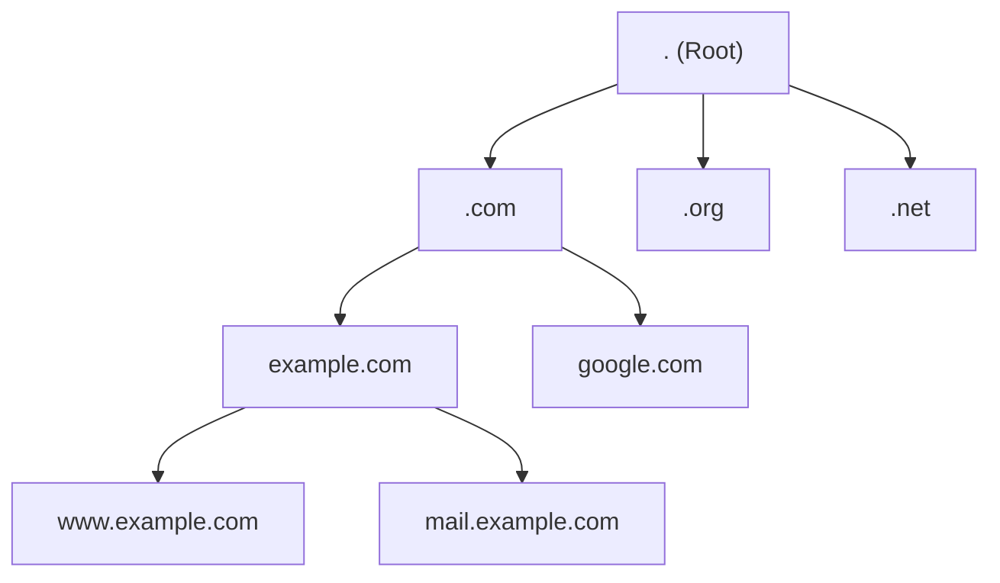

# Domain Name System (DNS)

## Overview

The **Domain Name System (DNS)** is a hierarchical, distributed naming system that translates human-readable domain names (like `example.com`) into machine-readable IP addresses (like `192.0.2.1`). DNS serves as the "phone book of the internet," enabling users to access websites using memorable names instead of complex numerical addresses.

## Core Concepts

### What DNS Solves

DNS addresses the fundamental problem of human-computer interface in networking:
- **Humans**: Prefer memorable names (`google.com`, `github.com`)
- **Computers**: Require numerical IP addresses (`8.8.8.8`, `140.82.112.4`)

### DNS Hierarchy



## DNS Components

### DNS Servers

#### 1. Root Name Servers
- **Function**: Top level of DNS hierarchy
- **Count**: 13 root server clusters worldwide (a-m.root-servers.net)
- **Purpose**: Direct queries to appropriate TLD servers

```javascript
// Root servers (simplified representation)
const rootServers = [
  { name: 'a.root-servers.net', ip: '198.41.0.4' },
  { name: 'b.root-servers.net', ip: '199.9.14.201' },
  { name: 'c.root-servers.net', ip: '192.33.4.12' },
  // ... and 10 more
];
```

#### 2. TLD (Top-Level Domain) Servers
- **Generic TLDs**: `.com`, `.org`, `.net`, `.edu`
- **Country Code TLDs**: `.uk`, `.de`, `.jp`, `.ca`
- **New gTLDs**: `.app`, `.dev`, `.cloud`, `.tech`

#### 3. Authoritative Name Servers
- **Function**: Store DNS records for specific domains
- **Authority**: Definitive source for domain information
- **Examples**: Company DNS servers, DNS hosting providers

#### 4. Recursive Resolvers
- **Function**: Query other DNS servers on behalf of clients
- **Caching**: Store results to improve performance
- **Examples**: ISP DNS servers, public resolvers (8.8.8.8)

### DNS Resolution Process

```javascript
// Simplified DNS resolution flow
async function resolveDomain(domain) {
  const steps = [];
  
  // 1. Check local cache
  let result = await checkLocalCache(domain);
  if (result) {
    steps.push('Cache hit');
    return { ip: result, steps };
  }
  
  // 2. Query recursive resolver
  steps.push('Query recursive resolver');
  const resolver = getRecursiveResolver();
  
  // 3. Resolver checks its cache
  result = await resolver.checkCache(domain);
  if (result) {
    steps.push('Resolver cache hit');
    return { ip: result, steps };
  }
  
  // 4. Query root servers
  steps.push('Query root servers');
  const rootResponse = await queryRootServers(domain);
  
  // 5. Query TLD servers
  steps.push('Query TLD servers');
  const tldResponse = await queryTLDServers(domain, rootResponse.tldServers);
  
  // 6. Query authoritative servers
  steps.push('Query authoritative servers');
  const authResponse = await queryAuthoritativeServers(domain, tldResponse.authServers);
  
  // 7. Cache and return result
  await cacheResult(domain, authResponse.ip);
  steps.push('Result cached');
  
  return { ip: authResponse.ip, steps };
}
```

## DNS Record Types

### A Record (Address)
- **Purpose**: Maps domain to IPv4 address
- **Example**: `example.com` → `192.0.2.1`

```dns
example.com.    3600    IN    A    192.0.2.1
```

### AAAA Record (IPv6 Address)
- **Purpose**: Maps domain to IPv6 address
- **Example**: `example.com` → `2001:db8::1`

```dns
example.com.    3600    IN    AAAA    2001:db8::1
```

### CNAME Record (Canonical Name)
- **Purpose**: Creates alias for another domain
- **Example**: `www.example.com` → `example.com`

```dns
www.example.com.    3600    IN    CNAME    example.com.
```

### MX Record (Mail Exchange)
- **Purpose**: Specifies mail servers for domain
- **Priority**: Lower numbers have higher priority

```dns
example.com.    3600    IN    MX    10    mail1.example.com.
example.com.    3600    IN    MX    20    mail2.example.com.
```

### TXT Record (Text)
- **Purpose**: Store arbitrary text data
- **Uses**: SPF, DKIM, domain verification

```dns
example.com.    3600    IN    TXT    "v=spf1 include:_spf.google.com ~all"
```

### NS Record (Name Server)
- **Purpose**: Delegates domain to name servers
- **Example**: Authority delegation

```dns
example.com.    3600    IN    NS    ns1.example.com.
example.com.    3600    IN    NS    ns2.example.com.
```

### SRV Record (Service)
- **Purpose**: Defines services available in domain
- **Format**: `_service._protocol.domain`

```dns
_http._tcp.example.com.    3600    IN    SRV    10    5    80    web.example.com.
```

### PTR Record (Pointer)
- **Purpose**: Reverse DNS lookup (IP to domain)
- **Example**: `1.2.0.192.in-addr.arpa` → `example.com`

```dns
1.2.0.192.in-addr.arpa.    3600    IN    PTR    example.com.
```

## DNS Configuration Examples

### BIND Configuration

```bind
; Zone file for example.com
$TTL 3600
$ORIGIN example.com.

@    IN    SOA    ns1.example.com. admin.example.com. (
              2024011501    ; Serial number
              3600          ; Refresh
              1800          ; Retry
              604800        ; Expire
              86400         ; Minimum TTL
              )

; Name servers
@    IN    NS     ns1.example.com.
@    IN    NS     ns2.example.com.

; A records
@    IN    A      192.0.2.1
www  IN    A      192.0.2.1
mail IN    A      192.0.2.2

; MX records
@    IN    MX     10    mail.example.com.

; CNAME records
ftp  IN    CNAME  www.example.com.
blog IN    CNAME  www.example.com.

; TXT records
@    IN    TXT    "v=spf1 mx ~all"
```

### PowerDNS Configuration

```sql
-- PowerDNS database schema
CREATE TABLE domains (
  id INT AUTO_INCREMENT,
  name VARCHAR(255) NOT NULL,
  master VARCHAR(128) DEFAULT NULL,
  last_check INT DEFAULT NULL,
  type VARCHAR(6) NOT NULL,
  notified_serial INT DEFAULT NULL,
  account VARCHAR(40) DEFAULT NULL,
  PRIMARY KEY (id)
);

CREATE TABLE records (
  id INT AUTO_INCREMENT,
  domain_id INT DEFAULT NULL,
  name VARCHAR(255) DEFAULT NULL,
  type VARCHAR(10) DEFAULT NULL,
  content VARCHAR(64000) DEFAULT NULL,
  ttl INT DEFAULT NULL,
  prio INT DEFAULT NULL,
  change_date INT DEFAULT NULL,
  disabled TINYINT(1) DEFAULT 0,
  ordername VARCHAR(255) BINARY DEFAULT NULL,
  auth TINYINT(1) DEFAULT 1,
  PRIMARY KEY (id)
);
```

## DNS Caching

### TTL (Time to Live)

```javascript
class DNSCache {
  constructor() {
    this.cache = new Map();
  }
  
  set(domain, record, ttl) {
    const expirationTime = Date.now() + (ttl * 1000);
    this.cache.set(domain, {
      record,
      expires: expirationTime
    });
  }
  
  get(domain) {
    const entry = this.cache.get(domain);
    
    if (!entry) {
      return null;
    }
    
    if (Date.now() > entry.expires) {
      this.cache.delete(domain);
      return null;
    }
    
    return entry.record;
  }
  
  // Cleanup expired entries
  cleanup() {
    const now = Date.now();
    for (const [domain, entry] of this.cache) {
      if (now > entry.expires) {
        this.cache.delete(domain);
      }
    }
  }
}
```

### Cache Levels

1. **Browser Cache**: DNS results cached by web browser
2. **OS Cache**: Operating system DNS cache
3. **Router Cache**: Local network router cache
4. **ISP Cache**: Internet Service Provider resolver cache
5. **Authoritative Cache**: Authoritative server caching

```javascript
// DNS cache hierarchy
const cacheHierarchy = [
  { level: 'browser', ttl: 60, hitRate: 0.3 },
  { level: 'os', ttl: 300, hitRate: 0.5 },
  { level: 'router', ttl: 600, hitRate: 0.7 },
  { level: 'isp', ttl: 3600, hitRate: 0.85 },
  { level: 'authoritative', ttl: null, hitRate: 1.0 }
];
```

## DNS Security

### DNS Security Issues

1. **DNS Cache Poisoning**: Injecting false DNS records
2. **DNS Spoofing**: Redirecting queries to malicious servers
3. **DNS Hijacking**: Unauthorized changes to DNS settings
4. **DDoS Attacks**: Overwhelming DNS servers with requests

### DNSSEC (DNS Security Extensions)

```javascript
// DNSSEC validation process
class DNSSECValidator {
  async validateRecord(domain, record) {
    // 1. Verify RRSIG (Resource Record Signature)
    const signature = await this.getRRSIG(domain);
    const isSignatureValid = await this.verifySignature(record, signature);
    
    if (!isSignatureValid) {
      throw new Error('Invalid DNSSEC signature');
    }
    
    // 2. Verify DNSKEY
    const dnskey = await this.getDNSKEY(domain);
    const isKeyValid = await this.verifyDNSKEY(dnskey, signature);
    
    if (!isKeyValid) {
      throw new Error('Invalid DNSSEC key');
    }
    
    // 3. Verify DS record in parent zone
    const dsRecord = await this.getDSRecord(domain);
    const isChainValid = await this.verifyChainOfTrust(dnskey, dsRecord);
    
    if (!isChainValid) {
      throw new Error('Broken chain of trust');
    }
    
    return { valid: true, record };
  }
}
```

### DNS over HTTPS (DoH)

```javascript
// DNS over HTTPS implementation
class DoHResolver {
  constructor(serverUrl = 'https://cloudflare-dns.com/dns-query') {
    this.serverUrl = serverUrl;
  }
  
  async resolve(domain, recordType = 'A') {
    const url = new URL(this.serverUrl);
    url.searchParams.append('name', domain);
    url.searchParams.append('type', recordType);
    
    const response = await fetch(url, {
      headers: {
        'Accept': 'application/dns-json'
      }
    });
    
    const data = await response.json();
    return data.Answer.map(answer => answer.data);
  }
}

// Usage
const resolver = new DoHResolver();
const ips = await resolver.resolve('example.com', 'A');
```

### DNS over TLS (DoT)

```javascript
// DNS over TLS configuration
const dotConfig = {
  server: 'cloudflare-dns.com',
  port: 853,
  tls: {
    serverName: 'cloudflare-dns.com',
    minVersion: 'TLSv1.2'
  }
};
```

## Performance Optimization

### DNS Load Balancing

```javascript
// DNS-based load balancing
class DNSLoadBalancer {
  constructor() {
    this.servers = [
      { ip: '192.0.2.1', weight: 3, healthy: true },
      { ip: '192.0.2.2', weight: 2, healthy: true },
      { ip: '192.0.2.3', weight: 1, healthy: false }
    ];
  }
  
  getRecord(domain) {
    const healthyServers = this.servers.filter(s => s.healthy);
    const totalWeight = healthyServers.reduce((sum, s) => sum + s.weight, 0);
    
    let random = Math.random() * totalWeight;
    
    for (const server of healthyServers) {
      random -= server.weight;
      if (random <= 0) {
        return {
          name: domain,
          type: 'A',
          ttl: 60, // Short TTL for quick failover
          data: server.ip
        };
      }
    }
  }
}
```

### GeoDNS

```javascript
// Geographic DNS routing
class GeoDNSResolver {
  constructor() {
    this.geoMappings = {
      'US': ['192.0.2.1', '192.0.2.2'],
      'EU': ['192.0.3.1', '192.0.3.2'],
      'ASIA': ['192.0.4.1', '192.0.4.2']
    };
  }
  
  resolve(domain, clientIP) {
    const clientRegion = this.getRegion(clientIP);
    const regionalServers = this.geoMappings[clientRegion] || this.geoMappings['US'];
    
    return {
      name: domain,
      type: 'A',
      ttl: 300,
      data: this.selectServer(regionalServers)
    };
  }
  
  getRegion(ip) {
    // GeoIP lookup logic
    return 'US'; // Simplified
  }
}
```

## Monitoring and Troubleshooting

### DNS Monitoring Tools

```bash
# Command-line DNS tools
nslookup example.com
dig example.com
host example.com

# Specific record types
dig MX example.com
dig TXT example.com
dig NS example.com

# Trace DNS resolution path
dig +trace example.com
```

### Performance Metrics

```javascript
// DNS performance monitoring
class DNSMonitor {
  async measureResolutionTime(domain) {
    const startTime = performance.now();
    
    try {
      await this.resolve(domain);
      const endTime = performance.now();
      return endTime - startTime;
    } catch (error) {
      return { error: error.message };
    }
  }
  
  async monitorDNSHealth() {
    const metrics = {
      resolutionTime: await this.measureResolutionTime('example.com'),
      cacheHitRate: await this.calculateCacheHitRate(),
      errorRate: await this.calculateErrorRate(),
      queryVolume: await this.getQueryVolume()
    };
    
    return metrics;
  }
}
```

## DNS in Microservices

### Service Discovery

```javascript
// DNS-based service discovery
class ServiceDiscovery {
  constructor() {
    this.services = new Map();
  }
  
  registerService(serviceName, instances) {
    const records = instances.map(instance => ({
      type: 'SRV',
      name: `_${serviceName}._tcp.local`,
      data: `${instance.priority} ${instance.weight} ${instance.port} ${instance.host}`,
      ttl: 30
    }));
    
    this.services.set(serviceName, records);
  }
  
  discoverService(serviceName) {
    return this.services.get(serviceName) || [];
  }
}

// Usage
const discovery = new ServiceDiscovery();

discovery.registerService('user-service', [
  { host: 'user1.local', port: 8080, priority: 10, weight: 5 },
  { host: 'user2.local', port: 8080, priority: 10, weight: 3 }
]);

const userServices = discovery.discoverService('user-service');
```

### Internal DNS

```yaml
# Kubernetes DNS configuration
apiVersion: v1
kind: Service
metadata:
  name: user-service
spec:
  selector:
    app: user-service
  ports:
    - port: 80
      targetPort: 8080
  type: ClusterIP

---
# DNS will automatically create:
# user-service.default.svc.cluster.local
```

## Best Practices

### DNS Configuration

1. **Use Multiple Name Servers**: Ensure redundancy
2. **Appropriate TTL Values**: Balance performance and flexibility
3. **Monitor DNS Performance**: Track resolution times and errors
4. **Implement DNSSEC**: Enhance security
5. **Use CDN for DNS**: Distribute DNS queries globally

### Security Best Practices

```javascript
const dnsBestPractices = {
  security: [
    'Enable DNSSEC',
    'Use DNS over HTTPS/TLS',
    'Implement rate limiting',
    'Monitor for suspicious queries',
    'Regular security audits'
  ],
  performance: [
    'Optimize TTL values',
    'Use anycast for DNS servers',
    'Implement DNS caching',
    'Monitor resolution times',
    'Use geographic distribution'
  ],
  reliability: [
    'Multiple authoritative servers',
    'Regular backup of zone files',
    'Automated health checks',
    'Disaster recovery plan',
    'Monitoring and alerting'
  ]
};
```

## Future of DNS

### Emerging Technologies

1. **DNS over QUIC (DoQ)**: Next-generation encrypted DNS
2. **Oblivious DNS over HTTPS (ODoH)**: Enhanced privacy
3. **DNS-based Authentication of Named Entities (DANE)**: Certificate validation
4. **DNS64**: IPv6 transition technology

```javascript
// Future DNS technologies example
class ModernDNSResolver {
  constructor() {
    this.protocols = ['DoH', 'DoT', 'DoQ'];
    this.privacyFeatures = ['ODoH', 'DNS-over-Tor'];
  }
  
  async resolve(domain, options = {}) {
    const protocol = options.protocol || this.selectBestProtocol();
    const privacyLevel = options.privacy || 'standard';
    
    return await this.resolveWithProtocol(domain, protocol, privacyLevel);
  }
}
```

## Key Takeaways

1. **Foundation**: DNS is fundamental to internet functionality
2. **Hierarchy**: Distributed, hierarchical system for scalability
3. **Caching**: Multiple cache levels improve performance
4. **Security**: DNSSEC and encrypted DNS protocols enhance security
5. **Performance**: Proper configuration and monitoring are essential
6. **Evolution**: DNS continues to evolve with new security and privacy features

DNS remains one of the most critical building blocks of internet infrastructure, enabling the seamless translation between human-readable names and machine-addressable locations.