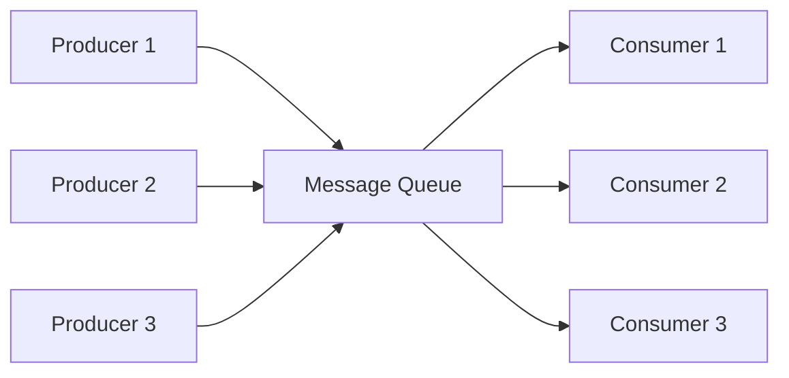

# Message Queues

## Overview

**A message queue is a communication mechanism that enables different parts of a system to send and receive messages asynchronously.** It acts as an intermediary between producers and consumers, enabling decoupled architecture where components don't need direct knowledge of each other.

## Core Concepts

### Message Queue Architecture



### Key Components

1. **Producer/Publisher**: Sends messages to the queue
2. **Consumer/Subscriber**: Reads and processes messages from the queue
3. **Queue**: Temporarily stores messages
4. **Broker/Queue Manager**: Manages message routing and delivery
5. **Message**: Contains payload and metadata

### Message Structure

```javascript
class Message {
  constructor(payload, options = {}) {
    this.id = this.generateId();
    this.payload = payload;
    this.timestamp = Date.now();
    this.headers = options.headers || {};
    this.priority = options.priority || 0;
    this.ttl = options.ttl; // Time to live
    this.retryCount = 0;
    this.maxRetries = options.maxRetries || 3;
  }
  
  generateId() {
    return `msg_${Date.now()}_${Math.random().toString(36).substr(2, 9)}`;
  }
  
  isExpired() {
    return this.ttl && (Date.now() - this.timestamp) > this.ttl;
  }
  
  canRetry() {
    return this.retryCount < this.maxRetries;
  }
}
```

## Types of Message Queues

### 1. Point-to-Point (P2P)

```javascript
class PointToPointQueue {
  constructor() {
    this.queue = [];
    this.consumers = new Set();
  }
  
  // Producer sends message
  send(message) {
    this.queue.push(new Message(message));
    this.notifyConsumers();
  }
  
  // Single consumer receives message
  receive() {
    return this.queue.shift() || null;
  }
  
  registerConsumer(consumer) {
    this.consumers.add(consumer);
  }
  
  notifyConsumers() {
    if (this.queue.length > 0) {
      // Notify one consumer (round-robin or random)
      const consumer = Array.from(this.consumers)[0];
      if (consumer) {
        consumer.process(this.receive());
      }
    }
  }
}
```

### 2. Publish/Subscribe (Pub/Sub)

```javascript
class PubSubSystem {
  constructor() {
    this.topics = new Map();
    this.subscribers = new Map();
  }
  
  // Create topic
  createTopic(topicName) {
    if (!this.topics.has(topicName)) {
      this.topics.set(topicName, []);
      this.subscribers.set(topicName, new Set());
    }
  }
  
  // Publisher publishes message to topic
  publish(topicName, message) {
    if (!this.topics.has(topicName)) {
      this.createTopic(topicName);
    }
    
    const msg = new Message(message);
    this.topics.get(topicName).push(msg);
    
    // Notify all subscribers
    this.subscribers.get(topicName).forEach(subscriber => {
      subscriber.notify(msg);
    });
  }
  
  // Subscriber subscribes to topic
  subscribe(topicName, subscriber) {
    if (!this.topics.has(topicName)) {
      this.createTopic(topicName);
    }
    
    this.subscribers.get(topicName).add(subscriber);
  }
  
  // Subscriber unsubscribes from topic
  unsubscribe(topicName, subscriber) {
    if (this.subscribers.has(topicName)) {
      this.subscribers.get(topicName).delete(subscriber);
    }
  }
}

class Subscriber {
  constructor(name, processor) {
    this.name = name;
    this.processor = processor;
  }
  
  notify(message) {
    console.log(`${this.name} received:`, message.payload);
    this.processor(message);
  }
}
```

### 3. Priority Queue

```javascript
class PriorityMessageQueue {
  constructor() {
    this.queues = new Map(); // Priority level -> queue
    this.priorities = []; // Sorted priority levels
  }
  
  enqueue(message, priority = 0) {
    if (!this.queues.has(priority)) {
      this.queues.set(priority, []);
      this.priorities.push(priority);
      this.priorities.sort((a, b) => b - a); // Higher priority first
    }
    
    const msg = new Message(message, { priority });
    this.queues.get(priority).push(msg);
  }
  
  dequeue() {
    // Process highest priority messages first
    for (const priority of this.priorities) {
      const queue = this.queues.get(priority);
      if (queue.length > 0) {
        return queue.shift();
      }
    }
    return null;
  }
  
  size() {
    return Array.from(this.queues.values())
      .reduce((total, queue) => total + queue.length, 0);
  }
}
```

### 4. Dead Letter Queue (DLQ)

```javascript
class MessageQueueWithDLQ {
  constructor() {
    this.mainQueue = [];
    this.deadLetterQueue = [];
    this.processing = new Map(); // Track in-flight messages
  }
  
  send(message, options = {}) {
    const msg = new Message(message, options);
    this.mainQueue.push(msg);
    return msg.id;
  }
  
  receive() {
    if (this.mainQueue.length === 0) return null;
    
    const message = this.mainQueue.shift();
    this.processing.set(message.id, {
      message,
      timestamp: Date.now(),
      timeout: 30000 // 30 seconds visibility timeout
    });
    
    return message;
  }
  
  acknowledge(messageId) {
    // Message processed successfully
    this.processing.delete(messageId);
  }
  
  reject(messageId, reason) {
    const processingInfo = this.processing.get(messageId);
    if (!processingInfo) return;
    
    const message = processingInfo.message;
    message.retryCount++;
    
    if (message.canRetry()) {
      // Retry message
      this.mainQueue.push(message);
    } else {
      // Move to dead letter queue
      message.headers.failureReason = reason;
      message.headers.failedAt = Date.now();
      this.deadLetterQueue.push(message);
    }
    
    this.processing.delete(messageId);
  }
  
  // Handle visibility timeout
  handleTimeouts() {
    const now = Date.now();
    
    for (const [messageId, processingInfo] of this.processing) {
      if (now - processingInfo.timestamp > processingInfo.timeout) {
        // Message timed out, put back in queue
        this.reject(messageId, 'Processing timeout');
      }
    }
  }
  
  getDeadLetterMessages() {
    return [...this.deadLetterQueue];
  }
  
  requeueFromDLQ(messageId) {
    const index = this.deadLetterQueue.findIndex(msg => msg.id === messageId);
    if (index !== -1) {
      const message = this.deadLetterQueue.splice(index, 1)[0];
      message.retryCount = 0; // Reset retry count
      delete message.headers.failureReason;
      delete message.headers.failedAt;
      this.mainQueue.push(message);
      return true;
    }
    return false;
  }
}
```

## Implementation Examples

### Redis-based Message Queue

```javascript
const Redis = require('redis');

class RedisMessageQueue {
  constructor(redisConfig = {}) {
    this.client = Redis.createClient(redisConfig);
    this.subscriber = Redis.createClient(redisConfig);
    this.queuePrefix = 'queue:';
    this.processingPrefix = 'processing:';
  }
  
  async send(queueName, message, options = {}) {
    const msg = new Message(message, options);
    
    if (options.delay) {
      // Delayed message using sorted set
      const deliveryTime = Date.now() + options.delay;
      await this.client.zadd(
        `${this.queuePrefix}delayed:${queueName}`,
        deliveryTime,
        JSON.stringify(msg)
      );
    } else {
      // Immediate message
      await this.client.lpush(
        `${this.queuePrefix}${queueName}`,
        JSON.stringify(msg)
      );
    }
    
    return msg.id;
  }
  
  async receive(queueName, timeout = 0) {
    // Process delayed messages first
    await this.processDelayedMessages(queueName);
    
    // Blocking pop from queue
    const result = await this.client.brpoplpush(
      `${this.queuePrefix}${queueName}`,
      `${this.processingPrefix}${queueName}`,
      timeout
    );
    
    if (result) {
      return JSON.parse(result);
    }
    
    return null;
  }
  
  async acknowledge(queueName, messageId) {
    // Remove from processing queue
    const processingKey = `${this.processingPrefix}${queueName}`;
    const messages = await this.client.lrange(processingKey, 0, -1);
    
    for (let i = 0; i < messages.length; i++) {
      const msg = JSON.parse(messages[i]);
      if (msg.id === messageId) {
        await this.client.lrem(processingKey, 1, messages[i]);
        break;
      }
    }
  }
  
  async processDelayedMessages(queueName) {
    const now = Date.now();
    const delayedKey = `${this.queuePrefix}delayed:${queueName}`;
    
    // Get messages ready for delivery
    const messages = await this.client.zrangebyscore(
      delayedKey, 0, now, 'WITHSCORES'
    );
    
    for (let i = 0; i < messages.length; i += 2) {
      const message = messages[i];
      const score = messages[i + 1];
      
      // Move to main queue
      await this.client.lpush(`${this.queuePrefix}${queueName}`, message);
      await this.client.zrem(delayedKey, message);
    }
  }
  
  async getQueueStats(queueName) {
    const mainQueue = await this.client.llen(`${this.queuePrefix}${queueName}`);
    const processing = await this.client.llen(`${this.processingPrefix}${queueName}`);
    const delayed = await this.client.zcard(`${this.queuePrefix}delayed:${queueName}`);
    
    return {
      pending: mainQueue,
      processing,
      delayed,
      total: mainQueue + processing + delayed
    };
  }
}
```

### RabbitMQ Implementation

```javascript
const amqp = require('amqplib');

class RabbitMQWrapper {
  constructor() {
    this.connection = null;
    this.channel = null;
  }
  
  async connect(url = 'amqp://localhost') {
    this.connection = await amqp.connect(url);
    this.channel = await this.connection.createChannel();
  }
  
  async createQueue(queueName, options = {}) {
    const queueOptions = {
      durable: true, // Survive broker restart
      exclusive: false,
      autoDelete: false,
      ...options
    };
    
    await this.channel.assertQueue(queueName, queueOptions);
  }
  
  async createExchange(exchangeName, type = 'direct', options = {}) {
    await this.channel.assertExchange(exchangeName, type, {
      durable: true,
      ...options
    });
  }
  
  async bindQueue(queueName, exchangeName, routingKey = '') {
    await this.channel.bindQueue(queueName, exchangeName, routingKey);
  }
  
  async publish(exchangeName, routingKey, message, options = {}) {
    const msg = new Message(message, options);
    const buffer = Buffer.from(JSON.stringify(msg));
    
    const publishOptions = {
      persistent: true,
      messageId: msg.id,
      timestamp: msg.timestamp,
      headers: msg.headers,
      ...options
    };
    
    return this.channel.publish(exchangeName, routingKey, buffer, publishOptions);
  }
  
  async sendToQueue(queueName, message, options = {}) {
    const msg = new Message(message, options);
    const buffer = Buffer.from(JSON.stringify(msg));
    
    const sendOptions = {
      persistent: true,
      messageId: msg.id,
      timestamp: msg.timestamp,
      headers: msg.headers,
      ...options
    };
    
    return this.channel.sendToQueue(queueName, buffer, sendOptions);
  }
  
  async consume(queueName, processor, options = {}) {
    const consumeOptions = {
      noAck: false, // Manual acknowledgment
      ...options
    };
    
    await this.channel.consume(queueName, async (msg) => {
      if (msg) {
        try {
          const message = JSON.parse(msg.content.toString());
          await processor(message);
          this.channel.ack(msg); // Acknowledge successful processing
        } catch (error) {
          console.error('Message processing error:', error);
          // Reject and requeue with retry logic
          this.channel.nack(msg, false, message.canRetry());
        }
      }
    }, consumeOptions);
  }
  
  async close() {
    if (this.channel) await this.channel.close();
    if (this.connection) await this.connection.close();
  }
}
```

### Apache Kafka Producer/Consumer

```javascript
const kafka = require('kafkajs');

class KafkaMessageSystem {
  constructor(brokers = ['localhost:9092']) {
    this.kafka = kafka({
      clientId: 'message-system',
      brokers
    });
    
    this.producer = this.kafka.producer();
    this.consumers = new Map();
  }
  
  async connect() {
    await this.producer.connect();
  }
  
  async createConsumer(groupId) {
    const consumer = this.kafka.consumer({ groupId });
    await consumer.connect();
    this.consumers.set(groupId, consumer);
    return consumer;
  }
  
  async publish(topic, message, options = {}) {
    const msg = new Message(message, options);
    
    const kafkaMessage = {
      key: options.key || msg.id,
      value: JSON.stringify(msg),
      headers: {
        messageId: msg.id,
        timestamp: msg.timestamp.toString(),
        ...msg.headers
      },
      partition: options.partition
    };
    
    await this.producer.send({
      topic,
      messages: [kafkaMessage]
    });
    
    return msg.id;
  }
  
  async subscribe(topic, groupId, processor, options = {}) {
    let consumer = this.consumers.get(groupId);
    
    if (!consumer) {
      consumer = await this.createConsumer(groupId);
    }
    
    await consumer.subscribe({ 
      topic, 
      fromBeginning: options.fromBeginning || false 
    });
    
    await consumer.run({
      eachMessage: async ({ topic, partition, message }) => {
        try {
          const msg = JSON.parse(message.value.toString());
          await processor(msg, { topic, partition, offset: message.offset });
        } catch (error) {
          console.error('Message processing error:', error);
          // Implement error handling strategy
        }
      }
    });
  }
  
  async publishBatch(topic, messages, options = {}) {
    const kafkaMessages = messages.map(message => {
      const msg = new Message(message, options);
      return {
        key: options.key || msg.id,
        value: JSON.stringify(msg),
        headers: {
          messageId: msg.id,
          timestamp: msg.timestamp.toString(),
          ...msg.headers
        }
      };
    });
    
    await this.producer.sendBatch({
      topicMessages: [{
        topic,
        messages: kafkaMessages
      }]
    });
  }
  
  async disconnect() {
    await this.producer.disconnect();
    
    for (const consumer of this.consumers.values()) {
      await consumer.disconnect();
    }
  }
}
```

## Advanced Patterns

### 1. Request-Reply Pattern

```javascript
class RequestReplyPattern {
  constructor(messageQueue) {
    this.messageQueue = messageQueue;
    this.pendingRequests = new Map();
    this.replyQueue = `reply_${Math.random().toString(36).substr(2, 9)}`;
    
    // Listen for replies
    this.setupReplyListener();
  }
  
  async request(queueName, payload, timeout = 30000) {
    const correlationId = this.generateCorrelationId();
    
    return new Promise((resolve, reject) => {
      // Store pending request
      const timer = setTimeout(() => {
        this.pendingRequests.delete(correlationId);
        reject(new Error('Request timeout'));
      }, timeout);
      
      this.pendingRequests.set(correlationId, { resolve, reject, timer });
      
      // Send request
      this.messageQueue.send(queueName, {
        payload,
        replyTo: this.replyQueue,
        correlationId
      });
    });
  }
  
  async setupReplyListener() {
    // Create reply queue
    await this.messageQueue.createQueue(this.replyQueue);
    
    // Listen for replies
    this.messageQueue.consume(this.replyQueue, (message) => {
      const { correlationId, response, error } = message.payload;
      const pendingRequest = this.pendingRequests.get(correlationId);
      
      if (pendingRequest) {
        clearTimeout(pendingRequest.timer);
        this.pendingRequests.delete(correlationId);
        
        if (error) {
          pendingRequest.reject(new Error(error));
        } else {
          pendingRequest.resolve(response);
        }
      }
    });
  }
  
  generateCorrelationId() {
    return `req_${Date.now()}_${Math.random().toString(36).substr(2, 9)}`;
  }
}

class RequestHandler {
  constructor(messageQueue, requestQueueName, processor) {
    this.messageQueue = messageQueue;
    this.processor = processor;
    
    // Listen for requests
    messageQueue.consume(requestQueueName, this.handleRequest.bind(this));
  }
  
  async handleRequest(message) {
    const { payload, replyTo, correlationId } = message.payload;
    
    try {
      const response = await this.processor(payload);
      
      // Send reply
      this.messageQueue.send(replyTo, {
        correlationId,
        response
      });
    } catch (error) {
      // Send error reply
      this.messageQueue.send(replyTo, {
        correlationId,
        error: error.message
      });
    }
  }
}
```

### 2. Saga Pattern with Message Queues

```javascript
class SagaOrchestrator {
  constructor(messageQueue) {
    this.messageQueue = messageQueue;
    this.sagas = new Map();
    this.setupEventHandlers();
  }
  
  async startSaga(sagaId, steps) {
    const saga = {
      id: sagaId,
      steps,
      currentStep: 0,
      completed: [],
      compensations: [],
      status: 'running'
    };
    
    this.sagas.set(sagaId, saga);
    await this.executeNextStep(saga);
    
    return sagaId;
  }
  
  async executeNextStep(saga) {
    if (saga.currentStep >= saga.steps.length) {
      saga.status = 'completed';
      return;
    }
    
    const step = saga.steps[saga.currentStep];
    
    try {
      await this.messageQueue.send(step.service, {
        sagaId: saga.id,
        action: step.action,
        payload: step.payload
      });
      
      saga.currentStep++;
    } catch (error) {
      await this.compensate(saga);
    }
  }
  
  async handleStepCompletion(sagaId, stepResult) {
    const saga = this.sagas.get(sagaId);
    if (!saga) return;
    
    saga.completed.push(stepResult);
    
    if (stepResult.success) {
      await this.executeNextStep(saga);
    } else {
      await this.compensate(saga);
    }
  }
  
  async compensate(saga) {
    saga.status = 'compensating';
    
    // Execute compensations in reverse order
    for (let i = saga.completed.length - 1; i >= 0; i--) {
      const completedStep = saga.completed[i];
      const compensation = saga.steps[i].compensation;
      
      if (compensation) {
        await this.messageQueue.send(compensation.service, {
          sagaId: saga.id,
          action: compensation.action,
          payload: completedStep.result
        });
      }
    }
    
    saga.status = 'compensated';
  }
  
  setupEventHandlers() {
    this.messageQueue.consume('saga_events', (message) => {
      const { sagaId, event, data } = message.payload;
      
      switch (event) {
        case 'step_completed':
          this.handleStepCompletion(sagaId, data);
          break;
        case 'step_failed':
          this.handleStepFailure(sagaId, data);
          break;
      }
    });
  }
}
```

### 3. Event Sourcing with Message Queues

```javascript
class EventStore {
  constructor(messageQueue) {
    this.messageQueue = messageQueue;
    this.events = new Map(); // In production, use persistent storage
    this.snapshots = new Map();
    this.setupEventHandlers();
  }
  
  async appendEvent(streamId, event, expectedVersion = -1) {
    const streamEvents = this.events.get(streamId) || [];
    
    // Optimistic concurrency check
    if (expectedVersion !== -1 && streamEvents.length !== expectedVersion) {
      throw new Error('Concurrency conflict');
    }
    
    const eventWithMetadata = {
      ...event,
      eventId: this.generateEventId(),
      streamId,
      version: streamEvents.length + 1,
      timestamp: Date.now()
    };
    
    streamEvents.push(eventWithMetadata);
    this.events.set(streamId, streamEvents);
    
    // Publish event to message queue
    await this.messageQueue.publish('domain_events', eventWithMetadata);
    
    return eventWithMetadata;
  }
  
  getEvents(streamId, fromVersion = 1) {
    const streamEvents = this.events.get(streamId) || [];
    return streamEvents.filter(event => event.version >= fromVersion);
  }
  
  async createSnapshot(streamId, aggregate) {
    const streamEvents = this.events.get(streamId) || [];
    const snapshot = {
      streamId,
      version: streamEvents.length,
      data: aggregate,
      timestamp: Date.now()
    };
    
    this.snapshots.set(streamId, snapshot);
    return snapshot;
  }
  
  async loadAggregate(streamId, aggregateClass) {
    // Try to load from snapshot first
    const snapshot = this.snapshots.get(streamId);
    let aggregate = new aggregateClass();
    let fromVersion = 1;
    
    if (snapshot) {
      aggregate = snapshot.data;
      fromVersion = snapshot.version + 1;
    }
    
    // Apply events after snapshot
    const events = this.getEvents(streamId, fromVersion);
    events.forEach(event => aggregate.apply(event));
    
    return aggregate;
  }
  
  setupEventHandlers() {
    // Handle domain events for projections
    this.messageQueue.subscribe('domain_events', 'projection_group', 
      async (event) => {
        await this.updateProjections(event);
      }
    );
  }
  
  async updateProjections(event) {
    // Update read models based on events
    console.log('Updating projections for event:', event.type);
  }
  
  generateEventId() {
    return `evt_${Date.now()}_${Math.random().toString(36).substr(2, 9)}`;
  }
}
```

## Monitoring and Observability

### Queue Metrics Collection

```javascript
class QueueMetricsCollector {
  constructor(messageQueue) {
    this.messageQueue = messageQueue;
    this.metrics = {
      messagesSent: 0,
      messagesReceived: 0,
      messagesProcessed: 0,
      messagesFailed: 0,
      averageProcessingTime: 0,
      queueDepths: new Map(),
      errorRates: new Map()
    };
    
    this.startMetricsCollection();
  }
  
  recordMessageSent(queueName) {
    this.metrics.messagesSent++;
    this.updateQueueDepth(queueName, 1);
  }
  
  recordMessageReceived(queueName) {
    this.metrics.messagesReceived++;
    this.updateQueueDepth(queueName, -1);
  }
  
  recordMessageProcessed(queueName, processingTime) {
    this.metrics.messagesProcessed++;
    this.updateAverageProcessingTime(processingTime);
  }
  
  recordMessageFailed(queueName, error) {
    this.metrics.messagesFailed++;
    this.updateErrorRate(queueName);
  }
  
  updateQueueDepth(queueName, delta) {
    const currentDepth = this.metrics.queueDepths.get(queueName) || 0;
    this.metrics.queueDepths.set(queueName, Math.max(0, currentDepth + delta));
  }
  
  updateAverageProcessingTime(processingTime) {
    const count = this.metrics.messagesProcessed;
    const currentAvg = this.metrics.averageProcessingTime;
    this.metrics.averageProcessingTime = 
      ((currentAvg * (count - 1)) + processingTime) / count;
  }
  
  updateErrorRate(queueName) {
    const errors = this.metrics.errorRates.get(queueName) || 0;
    this.metrics.errorRates.set(queueName, errors + 1);
  }
  
  startMetricsCollection() {
    setInterval(() => {
      this.publishMetrics();
    }, 60000); // Every minute
  }
  
  publishMetrics() {
    const report = {
      timestamp: Date.now(),
      metrics: {
        ...this.metrics,
        queueDepths: Object.fromEntries(this.metrics.queueDepths),
        errorRates: Object.fromEntries(this.metrics.errorRates),
        throughput: this.metrics.messagesProcessed / 60, // Per second
        errorRate: this.metrics.messagesFailed / this.metrics.messagesReceived
      }
    };
    
    console.log('Queue Metrics:', JSON.stringify(report, null, 2));
    
    // Send to monitoring system
    this.messageQueue.publish('system_metrics', report);
  }
  
  getHealthStatus() {
    const maxQueueDepth = Math.max(...this.metrics.queueDepths.values(), 0);
    const errorRate = this.metrics.messagesFailed / this.metrics.messagesReceived;
    
    return {
      healthy: maxQueueDepth < 1000 && errorRate < 0.05,
      queueDepths: Object.fromEntries(this.metrics.queueDepths),
      errorRate,
      averageProcessingTime: this.metrics.averageProcessingTime
    };
  }
}
```

### Circuit Breaker for Message Processing

```javascript
class MessageProcessorCircuitBreaker {
  constructor(messageQueue, processor, options = {}) {
    this.messageQueue = messageQueue;
    this.processor = processor;
    this.options = {
      failureThreshold: 5,
      recoveryTimeout: 60000,
      monitoringPeriod: 10000,
      ...options
    };
    
    this.state = 'CLOSED'; // CLOSED, OPEN, HALF_OPEN
    this.failures = 0;
    this.lastFailureTime = null;
    this.successCount = 0;
    
    this.startMonitoring();
  }
  
  async processMessage(message) {
    if (this.state === 'OPEN') {
      if (Date.now() - this.lastFailureTime > this.options.recoveryTimeout) {
        this.state = 'HALF_OPEN';
        this.successCount = 0;
      } else {
        throw new Error('Circuit breaker is OPEN');
      }
    }
    
    try {
      const result = await this.processor(message);
      this.onSuccess();
      return result;
    } catch (error) {
      this.onFailure();
      throw error;
    }
  }
  
  onSuccess() {
    this.failures = 0;
    
    if (this.state === 'HALF_OPEN') {
      this.successCount++;
      if (this.successCount >= 3) {
        this.state = 'CLOSED';
      }
    }
  }
  
  onFailure() {
    this.failures++;
    this.lastFailureTime = Date.now();
    
    if (this.failures >= this.options.failureThreshold) {
      this.state = 'OPEN';
    }
  }
  
  startMonitoring() {
    setInterval(() => {
      this.messageQueue.publish('circuit_breaker_status', {
        state: this.state,
        failures: this.failures,
        lastFailureTime: this.lastFailureTime,
        successCount: this.successCount
      });
    }, this.options.monitoringPeriod);
  }
  
  getState() {
    return {
      state: this.state,
      failures: this.failures,
      isOpen: this.state === 'OPEN',
      canProcess: this.state !== 'OPEN'
    };
  }
}
```

## Best Practices

### 1. Message Design

```javascript
class MessageDesignPatterns {
  // Command pattern for actions
  static createCommand(action, payload, metadata = {}) {
    return new Message({
      type: 'command',
      action,
      payload,
      ...metadata
    });
  }
  
  // Event pattern for notifications
  static createEvent(eventType, data, metadata = {}) {
    return new Message({
      type: 'event',
      eventType,
      data,
      occurredAt: Date.now(),
      ...metadata
    });
  }
  
  // Query pattern for requests
  static createQuery(query, parameters, metadata = {}) {
    return new Message({
      type: 'query',
      query,
      parameters,
      ...metadata
    });
  }
  
  // Ensure idempotency
  static createIdempotentMessage(payload, idempotencyKey, metadata = {}) {
    return new Message(payload, {
      ...metadata,
      headers: {
        idempotencyKey,
        ...metadata.headers
      }
    });
  }
}
```

### 2. Error Handling Strategies

```javascript
class MessageErrorHandler {
  constructor(messageQueue, options = {}) {
    this.messageQueue = messageQueue;
    this.options = {
      maxRetries: 3,
      retryDelays: [1000, 5000, 15000], // Progressive delays
      deadLetterQueue: 'dlq',
      ...options
    };
  }
  
  async handleMessage(message, processor) {
    try {
      return await processor(message);
    } catch (error) {
      await this.handleError(message, error);
      throw error;
    }
  }
  
  async handleError(message, error) {
    message.retryCount = (message.retryCount || 0) + 1;
    message.errors = message.errors || [];
    message.errors.push({
      error: error.message,
      timestamp: Date.now(),
      attempt: message.retryCount
    });
    
    if (message.retryCount <= this.options.maxRetries) {
      // Schedule retry with exponential backoff
      const delay = this.options.retryDelays[message.retryCount - 1] || 30000;
      
      await this.messageQueue.send(message.originalQueue, message, { delay });
    } else {
      // Send to dead letter queue
      await this.messageQueue.send(this.options.deadLetterQueue, {
        originalMessage: message,
        finalError: error.message,
        failedAt: Date.now(),
        totalAttempts: message.retryCount
      });
    }
  }
  
  async reprocessFromDLQ(messageId, newProcessor) {
    const dlqMessage = await this.messageQueue.receive(this.options.deadLetterQueue);
    
    if (dlqMessage && dlqMessage.id === messageId) {
      const originalMessage = dlqMessage.originalMessage;
      originalMessage.retryCount = 0;
      originalMessage.errors = [];
      
      try {
        return await newProcessor(originalMessage);
      } catch (error) {
        await this.handleError(originalMessage, error);
        throw error;
      }
    }
    
    throw new Error('Message not found in DLQ');
  }
}
```

### 3. Performance Optimization

```javascript
class MessageQueueOptimizer {
  constructor(messageQueue) {
    this.messageQueue = messageQueue;
    this.batchProcessor = new BatchMessageProcessor(messageQueue);
    this.compressionProcessor = new CompressionProcessor();
  }
  
  // Batch processing for throughput
  async processBatch(queueName, batchSize = 10, processor) {
    const messages = [];
    
    for (let i = 0; i < batchSize; i++) {
      const message = await this.messageQueue.receive(queueName);
      if (message) {
        messages.push(message);
      } else {
        break;
      }
    }
    
    if (messages.length > 0) {
      try {
        await processor(messages);
        
        // Acknowledge all messages
        for (const message of messages) {
          await this.messageQueue.acknowledge(queueName, message.id);
        }
      } catch (error) {
        // Handle batch failure
        for (const message of messages) {
          await this.messageQueue.reject(queueName, message.id, error.message);
        }
        throw error;
      }
    }
    
    return messages.length;
  }
  
  // Message compression for large payloads
  async sendCompressed(queueName, largePayload, options = {}) {
    if (JSON.stringify(largePayload).length > 10000) {
      const compressed = await this.compressionProcessor.compress(largePayload);
      
      return await this.messageQueue.send(queueName, {
        compressed: true,
        payload: compressed
      }, options);
    }
    
    return await this.messageQueue.send(queueName, largePayload, options);
  }
  
  async receiveDecompressed(queueName) {
    const message = await this.messageQueue.receive(queueName);
    
    if (message && message.payload.compressed) {
      message.payload = await this.compressionProcessor.decompress(
        message.payload.payload
      );
      delete message.payload.compressed;
    }
    
    return message;
  }
}

class CompressionProcessor {
  async compress(data) {
    // Implement compression (gzip, lz4, etc.)
    return Buffer.from(JSON.stringify(data)).toString('base64');
  }
  
  async decompress(compressedData) {
    // Implement decompression
    return JSON.parse(Buffer.from(compressedData, 'base64').toString());
  }
}
```

## Key Takeaways

1. **Decoupling**: Message queues enable loose coupling between system components
2. **Asynchronous Processing**: Handle operations without blocking the caller
3. **Scalability**: Distribute load across multiple consumers
4. **Reliability**: Implement retry mechanisms and dead letter queues
5. **Monitoring**: Track queue depths, processing times, and error rates
6. **Pattern Selection**: Choose appropriate patterns (P2P, Pub/Sub, Request-Reply) based on use case
7. **Error Handling**: Plan for failure scenarios with comprehensive error handling

Message queues are fundamental building blocks for creating resilient, scalable, and maintainable distributed systems.