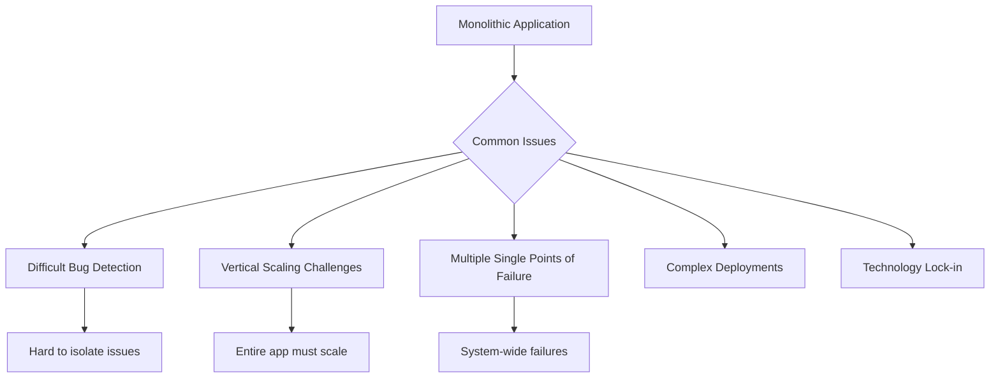

# Microservices Guidelines

## Overview

**Microservices architecture breaks down applications into small, independent services that can be developed, deployed, and scaled independently.** This guide presents proven patterns and best practices derived from Netflix's experience in building and operating one of the world's largest microservices architectures.

## Migration Motivation

### Problems with Monolithic Architecture



### Benefits of Microservices

```javascript
// Example: Monolithic vs Microservices approach
class MonolithicEcommerce {
  constructor() {
    this.userService = new UserService();
    this.productService = new ProductService();
    this.orderService = new OrderService();
    this.paymentService = new PaymentService();
    this.inventoryService = new InventoryService();
  }
  
  // All services tightly coupled
  async processOrder(orderData) {
    // Single point of failure - if any service fails, entire operation fails
    const user = await this.userService.getUser(orderData.userId);
    const product = await this.productService.getProduct(orderData.productId);
    const inventory = await this.inventoryService.checkStock(orderData.productId);
    const payment = await this.paymentService.processPayment(orderData.payment);
    const order = await this.orderService.createOrder(orderData);
    
    return order;
  }
}

// Microservices approach
class MicroservicesEcommerce {
  constructor() {
    this.services = {
      user: new UserMicroservice(),
      product: new ProductMicroservice(),
      order: new OrderMicroservice(),
      payment: new PaymentMicroservice(),
      inventory: new InventoryMicroservice()
    };
  }
  
  async processOrder(orderData) {
    // Each service is independent and can fail gracefully
    try {
      const userResult = await this.services.user.getUser(orderData.userId);
      const productResult = await this.services.product.getProduct(orderData.productId);
      const inventoryResult = await this.services.inventory.reserveStock(orderData.productId);
      
      if (inventoryResult.success) {
        const paymentResult = await this.services.payment.processPayment(orderData.payment);
        
        if (paymentResult.success) {
          return await this.services.order.createOrder(orderData);
        } else {
          // Compensate - release reserved stock
          await this.services.inventory.releaseStock(orderData.productId);
          throw new Error('Payment failed');
        }
      } else {
        throw new Error('Insufficient inventory');
      }
    } catch (error) {
      // Graceful degradation and error handling
      return this.handleOrderFailure(error, orderData);
    }
  }
}
```

## Core Principles

### 1. Single Responsibility Principle

```javascript
// Bad: Service doing too much
class UserOrderPaymentService {
  async createUser(userData) { /* user logic */ }
  async processOrder(orderData) { /* order logic */ }
  async handlePayment(paymentData) { /* payment logic */ }
  async sendNotification(message) { /* notification logic */ }
}

// Good: Each service has single responsibility
class UserService {
  constructor() {
    this.database = new UserDatabase();
    this.eventBus = new EventBus();
  }
  
  async createUser(userData) {
    const user = await this.database.createUser(userData);
    
    // Publish event for other services
    await this.eventBus.publish('user.created', {
      userId: user.id,
      email: user.email,
      timestamp: Date.now()
    });
    
    return user;
  }
  
  async getUserById(userId) {
    return await this.database.getUserById(userId);
  }
  
  async updateUser(userId, updates) {
    const user = await this.database.updateUser(userId, updates);
    
    await this.eventBus.publish('user.updated', {
      userId: user.id,
      changes: updates,
      timestamp: Date.now()
    });
    
    return user;
  }
}

class OrderService {
  constructor() {
    this.database = new OrderDatabase();
    this.eventBus = new EventBus();
    this.userService = new UserServiceClient();
  }
  
  async createOrder(orderData) {
    // Validate user exists
    const user = await this.userService.getUser(orderData.userId);
    if (!user) {
      throw new Error('User not found');
    }
    
    const order = await this.database.createOrder(orderData);
    
    await this.eventBus.publish('order.created', {
      orderId: order.id,
      userId: order.userId,
      amount: order.total,
      timestamp: Date.now()
    });
    
    return order;
  }
}
```

### 2. Decentralized Data Management

```javascript
class MicroserviceDataPattern {
  // Each service owns its data
  constructor(serviceName) {
    this.serviceName = serviceName;
    this.database = this.createDedicatedDatabase();
    this.cache = this.createDedicatedCache();
  }
  
  createDedicatedDatabase() {
    // Each service has its own database
    return new Database({
      name: `${this.serviceName}_db`,
      schema: this.getServiceSchema(),
      isolation: 'DEDICATED'
    });
  }
  
  createDedicatedCache() {
    return new Redis({
      keyPrefix: `${this.serviceName}:`,
      db: this.getServiceCacheDB()
    });
  }
  
  // Data consistency through events
  async handleDataChange(entity, changeType) {
    // Update local data
    await this.database.save(entity);
    
    // Publish event for eventual consistency
    await this.publishDataChangeEvent(entity, changeType);
  }
  
  async publishDataChangeEvent(entity, changeType) {
    const event = {
      service: this.serviceName,
      entityType: entity.constructor.name,
      entityId: entity.id,
      changeType,
      data: entity,
      timestamp: Date.now(),
      version: entity.version
    };
    
    await this.eventBus.publish(`${this.serviceName}.${changeType}`, event);
  }
}

// Example: User service with dedicated data
class UserMicroservice extends MicroserviceDataPattern {
  constructor() {
    super('user');
  }
  
  getServiceSchema() {
    return {
      users: {
        id: 'UUID PRIMARY KEY',
        email: 'VARCHAR(255) UNIQUE',
        name: 'VARCHAR(255)',
        created_at: 'TIMESTAMP',
        version: 'INTEGER'
      },
      user_preferences: {
        user_id: 'UUID REFERENCES users(id)',
        preferences: 'JSONB'
      }
    };
  }
  
  async createUser(userData) {
    const user = await this.database.users.create(userData);
    await this.handleDataChange(user, 'created');
    return user;
  }
}
```

## Key Architectural Patterns

### 1. API Gateway Pattern

```javascript
class APIGateway {
  constructor() {
    this.routes = new Map();
    this.middleware = [];
    this.circuitBreakers = new Map();
    this.rateLimiters = new Map();
    this.loadBalancers = new Map();
  }
  
  // Register service routes
  registerService(serviceName, config) {
    this.routes.set(serviceName, config);
    this.circuitBreakers.set(serviceName, new CircuitBreaker(config.circuitBreaker));
    this.rateLimiters.set(serviceName, new RateLimiter(config.rateLimit));
    this.loadBalancers.set(serviceName, new LoadBalancer(config.instances));
  }
  
  // Simplified routing logic
  async handleRequest(request) {
    try {
      // Apply global middleware
      await this.applyMiddleware(request);
      
      // Route to appropriate service
      const service = this.identifyService(request.path);
      const serviceConfig = this.routes.get(service);
      
      if (!serviceConfig) {
        throw new Error('Service not found');
      }
      
      // Check rate limits
      await this.checkRateLimit(service, request);
      
      // Get healthy instance
      const instance = this.loadBalancers.get(service).getHealthyInstance();
      
      // Make request through circuit breaker
      const circuitBreaker = this.circuitBreakers.get(service);
      const response = await circuitBreaker.execute(() => 
        this.makeServiceRequest(instance, request)
      );
      
      return response;
    } catch (error) {
      return this.handleError(error, request);
    }
  }
  
  async makeServiceRequest(instance, request) {
    const timeout = 5000; // 5 second timeout
    
    const controller = new AbortController();
    const timeoutId = setTimeout(() => controller.abort(), timeout);
    
    try {
      const response = await fetch(`${instance.url}${request.path}`, {
        method: request.method,
        headers: {
          ...request.headers,
          'X-Request-ID': request.id,
          'X-Forwarded-For': request.ip
        },
        body: request.body,
        signal: controller.signal
      });
      
      clearTimeout(timeoutId);
      return response;
    } catch (error) {
      clearTimeout(timeoutId);
      throw error;
    }
  }
  
  identifyService(path) {
    // Extract service from path (e.g., /api/users/123 -> users)
    const pathSegments = path.split('/').filter(Boolean);
    return pathSegments[1]; // Assuming /api/{service}/...
  }
  
  async checkRateLimit(service, request) {
    const rateLimiter = this.rateLimiters.get(service);
    const allowed = await rateLimiter.isAllowed(request.ip);
    
    if (!allowed) {
      throw new Error('Rate limit exceeded');
    }
  }
}

// Circuit breaker implementation
class CircuitBreaker {
  constructor(options = {}) {
    this.failureThreshold = options.failureThreshold || 5;
    this.recoveryTimeout = options.recoveryTimeout || 60000;
    this.monitoringPeriod = options.monitoringPeriod || 10000;
    
    this.state = 'CLOSED'; // CLOSED, OPEN, HALF_OPEN
    this.failures = 0;
    this.lastFailureTime = null;
    this.successCount = 0;
  }
  
  async execute(operation) {
    if (this.state === 'OPEN') {
      if (Date.now() - this.lastFailureTime > this.recoveryTimeout) {
        this.state = 'HALF_OPEN';
        this.successCount = 0;
      } else {
        throw new Error('Circuit breaker is OPEN');
      }
    }
    
    try {
      const result = await operation();
      this.onSuccess();
      return result;
    } catch (error) {
      this.onFailure();
      throw error;
    }
  }
  
  onSuccess() {
    this.failures = 0;
    
    if (this.state === 'HALF_OPEN') {
      this.successCount++;
      if (this.successCount >= 3) {
        this.state = 'CLOSED';
      }
    }
  }
  
  onFailure() {
    this.failures++;
    this.lastFailureTime = Date.now();
    
    if (this.failures >= this.failureThreshold) {
      this.state = 'OPEN';
    }
  }
}
```

### 2. Service Discovery Pattern

```javascript
class ServiceRegistry {
  constructor() {
    this.services = new Map(); // serviceName -> instances[]
    this.healthChecks = new Map();
    this.lastHeartbeat = new Map();
    
    this.startHealthCheckMonitoring();
  }
  
  // Service registration
  async registerService(serviceName, instance) {
    const serviceKey = serviceName;
    
    if (!this.services.has(serviceKey)) {
      this.services.set(serviceKey, new Set());
    }
    
    const instanceInfo = {
      id: instance.id,
      host: instance.host,
      port: instance.port,
      healthCheckUrl: `http://${instance.host}:${instance.port}/health`,
      metadata: instance.metadata || {},
      registeredAt: Date.now(),
      status: 'UP'
    };
    
    this.services.get(serviceKey).add(instanceInfo);
    this.lastHeartbeat.set(instance.id, Date.now());
    
    console.log(`Service registered: ${serviceName} at ${instance.host}:${instance.port}`);
    
    return instanceInfo;
  }
  
  // Service deregistration
  async deregisterService(serviceName, instanceId) {
    const serviceKey = serviceName;
    
    if (this.services.has(serviceKey)) {
      const instances = this.services.get(serviceKey);
      
      for (const instance of instances) {
        if (instance.id === instanceId) {
          instances.delete(instance);
          this.lastHeartbeat.delete(instanceId);
          console.log(`Service deregistered: ${serviceName} instance ${instanceId}`);
          break;
        }
      }
      
      if (instances.size === 0) {
        this.services.delete(serviceKey);
      }
    }
  }
  
  // Service discovery
  async discoverService(serviceName) {
    const instances = this.services.get(serviceName);
    
    if (!instances || instances.size === 0) {
      throw new Error(`No instances found for service: ${serviceName}`);
    }
    
    // Return only healthy instances
    const healthyInstances = Array.from(instances)
      .filter(instance => instance.status === 'UP');
    
    if (healthyInstances.length === 0) {
      throw new Error(`No healthy instances found for service: ${serviceName}`);
    }
    
    return healthyInstances;
  }
  
  // Heartbeat mechanism
  async heartbeat(instanceId) {
    this.lastHeartbeat.set(instanceId, Date.now());
  }
  
  // Health check monitoring
  startHealthCheckMonitoring() {
    setInterval(async () => {
      for (const [serviceName, instances] of this.services) {
        for (const instance of instances) {
          await this.checkInstanceHealth(instance);
        }
      }
    }, 30000); // Check every 30 seconds
    
    // Check for missed heartbeats
    setInterval(() => {
      this.checkHeartbeats();
    }, 60000); // Check every minute
  }
  
  async checkInstanceHealth(instance) {
    try {
      const response = await fetch(instance.healthCheckUrl, {
        timeout: 5000
      });
      
      if (response.ok) {
        instance.status = 'UP';
        instance.lastHealthCheck = Date.now();
      } else {
        instance.status = 'DOWN';
      }
    } catch (error) {
      instance.status = 'DOWN';
      instance.lastError = error.message;
    }
  }
  
  checkHeartbeats() {
    const now = Date.now();
    const timeout = 180000; // 3 minutes
    
    for (const [instanceId, lastHeartbeat] of this.lastHeartbeat) {
      if (now - lastHeartbeat > timeout) {
        // Remove stale instance
        this.removeStaleInstance(instanceId);
      }
    }
  }
  
  removeStaleInstance(instanceId) {
    for (const [serviceName, instances] of this.services) {
      for (const instance of instances) {
        if (instance.id === instanceId) {
          instances.delete(instance);
          this.lastHeartbeat.delete(instanceId);
          console.log(`Removed stale instance: ${serviceName} instance ${instanceId}`);
          return;
        }
      }
    }
  }
  
  // Service discovery client
  async getServiceInstances(serviceName, loadBalancingStrategy = 'round-robin') {
    const instances = await this.discoverService(serviceName);
    
    switch (loadBalancingStrategy) {
      case 'round-robin':
        return this.roundRobinSelection(instances);
      case 'random':
        return instances[Math.floor(Math.random() * instances.length)];
      case 'least-connections':
        return this.leastConnectionsSelection(instances);
      default:
        return instances[0];
    }
  }
  
  roundRobinSelection(instances) {
    // Simple round-robin implementation
    const serviceKey = instances[0].serviceName;
    
    if (!this.roundRobinCounters) {
      this.roundRobinCounters = new Map();
    }
    
    const counter = this.roundRobinCounters.get(serviceKey) || 0;
    const selectedInstance = instances[counter % instances.length];
    
    this.roundRobinCounters.set(serviceKey, counter + 1);
    
    return selectedInstance;
  }
}

// Service client with automatic discovery
class ServiceClient {
  constructor(serviceName, serviceRegistry) {
    this.serviceName = serviceName;
    this.serviceRegistry = serviceRegistry;
    this.circuitBreaker = new CircuitBreaker();
  }
  
  async makeRequest(path, options = {}) {
    const instance = await this.serviceRegistry.getServiceInstances(this.serviceName);
    const url = `http://${instance.host}:${instance.port}${path}`;
    
    return await this.circuitBreaker.execute(async () => {
      const response = await fetch(url, {
        ...options,
        headers: {
          'Content-Type': 'application/json',
          ...options.headers
        }
      });
      
      if (!response.ok) {
        throw new Error(`HTTP ${response.status}: ${response.statusText}`);
      }
      
      return response.json();
    });
  }
}
```

### 3. Event-Driven Architecture

```javascript
class EventDrivenMicroservice {
  constructor(serviceName) {
    this.serviceName = serviceName;
    this.eventBus = new EventBus();
    this.eventHandlers = new Map();
    this.outboxPattern = new OutboxPattern();
    
    this.setupEventHandlers();
  }
  
  setupEventHandlers() {
    // Subscribe to relevant events
    this.eventBus.subscribe(`${this.serviceName}.*`, this.handleEvent.bind(this));
  }
  
  async handleEvent(event) {
    const handler = this.eventHandlers.get(event.type);
    
    if (handler) {
      try {
        await handler(event);
        await this.acknowledgeEvent(event);
      } catch (error) {
        await this.handleEventError(event, error);
      }
    }
  }
  
  // Saga pattern for distributed transactions
  async startSaga(sagaType, data) {
    const sagaId = this.generateSagaId();
    
    const saga = {
      id: sagaId,
      type: sagaType,
      state: 'STARTED',
      data,
      steps: this.getSagaSteps(sagaType),
      currentStep: 0,
      compensations: [],
      createdAt: Date.now()
    };
    
    await this.saveSaga(saga);
    await this.executeNextSagaStep(saga);
    
    return sagaId;
  }
  
  async executeNextSagaStep(saga) {
    if (saga.currentStep >= saga.steps.length) {
      saga.state = 'COMPLETED';
      await this.saveSaga(saga);
      return;
    }
    
    const step = saga.steps[saga.currentStep];
    
    try {
      const event = {
        type: step.eventType,
        sagaId: saga.id,
        data: {
          ...saga.data,
          step: step.name
        },
        timestamp: Date.now()
      };
      
      await this.publishEvent(event);
      saga.currentStep++;
      await this.saveSaga(saga);
    } catch (error) {
      await this.compensateSaga(saga, error);
    }
  }
  
  async compensateSaga(saga, error) {
    saga.state = 'COMPENSATING';
    saga.error = error.message;
    
    // Execute compensations in reverse order
    for (let i = saga.compensations.length - 1; i >= 0; i--) {
      const compensation = saga.compensations[i];
      
      try {
        await this.executeCompensation(compensation);
      } catch (compensationError) {
        console.error('Compensation failed:', compensationError);
      }
    }
    
    saga.state = 'COMPENSATED';
    await this.saveSaga(saga);
  }
  
  // Outbox pattern for reliable event publishing
  async publishEventWithOutbox(event) {
    const transaction = await this.database.beginTransaction();
    
    try {
      // Save business data and event in same transaction
      await this.performBusinessOperation(event.data, transaction);
      await this.outboxPattern.addEvent(event, transaction);
      
      await transaction.commit();
      
      // Publish event asynchronously
      await this.outboxPattern.publishPendingEvents();
    } catch (error) {
      await transaction.rollback();
      throw error;
    }
  }
}

class OutboxPattern {
  constructor() {
    this.outboxTable = 'event_outbox';
    this.eventBus = new EventBus();
    
    this.startEventPublisher();
  }
  
  async addEvent(event, transaction) {
    const outboxRecord = {
      id: this.generateId(),
      event_type: event.type,
      event_data: JSON.stringify(event),
      created_at: new Date(),
      published: false
    };
    
    await transaction.query(
      `INSERT INTO ${this.outboxTable} (id, event_type, event_data, created_at, published) 
       VALUES (?, ?, ?, ?, ?)`,
      [outboxRecord.id, outboxRecord.event_type, outboxRecord.event_data, 
       outboxRecord.created_at, outboxRecord.published]
    );
  }
  
  async publishPendingEvents() {
    const pendingEvents = await this.database.query(
      `SELECT * FROM ${this.outboxTable} WHERE published = false ORDER BY created_at`
    );
    
    for (const record of pendingEvents) {
      try {
        const event = JSON.parse(record.event_data);
        await this.eventBus.publish(event.type, event);
        
        await this.markEventAsPublished(record.id);
      } catch (error) {
        console.error('Failed to publish event:', error);
      }
    }
  }
  
  async markEventAsPublished(eventId) {
    await this.database.query(
      `UPDATE ${this.outboxTable} SET published = true WHERE id = ?`,
      [eventId]
    );
  }
  
  startEventPublisher() {
    // Periodically publish pending events
    setInterval(async () => {
      await this.publishPendingEvents();
    }, 5000); // Every 5 seconds
  }
}
```

## Best Practices

### 1. Service Communication

```javascript
class ServiceCommunicationBestPractices {
  constructor() {
    this.retryPolicy = new ExponentialBackoffRetry();
    this.timeoutPolicy = new TimeoutPolicy();
    this.bulkheadPattern = new BulkheadPattern();
  }
  
  // Implement retry with exponential backoff
  async callServiceWithRetry(serviceCall, maxRetries = 3) {
    let attempt = 0;
    
    while (attempt < maxRetries) {
      try {
        return await this.timeoutPolicy.execute(serviceCall);
      } catch (error) {
        attempt++;
        
        if (attempt >= maxRetries) {
          throw error;
        }
        
        if (this.isRetryableError(error)) {
          const delay = this.retryPolicy.calculateDelay(attempt);
          await this.sleep(delay);
        } else {
          throw error;
        }
      }
    }
  }
  
  isRetryableError(error) {
    // Retry on network errors, timeouts, and 5xx status codes
    return error.code === 'ECONNRESET' ||
           error.code === 'ETIMEDOUT' ||
           (error.status >= 500 && error.status < 600);
  }
  
  // Implement bulkhead pattern for resource isolation
  async callServiceWithBulkhead(serviceName, operation) {
    const bulkhead = this.bulkheadPattern.getBulkhead(serviceName);
    
    return await bulkhead.execute(operation);
  }
  
  // Implement timeout with fallback
  async callServiceWithFallback(primaryCall, fallbackCall, timeout = 5000) {
    try {
      return await this.timeoutPolicy.execute(primaryCall, timeout);
    } catch (error) {
      console.warn('Primary service call failed, using fallback:', error.message);
      return await fallbackCall();
    }
  }
  
  sleep(ms) {
    return new Promise(resolve => setTimeout(resolve, ms));
  }
}

class ExponentialBackoffRetry {
  calculateDelay(attempt, baseDelay = 1000, maxDelay = 30000) {
    const delay = baseDelay * Math.pow(2, attempt - 1);
    const jitter = Math.random() * 0.1 * delay; // Add jitter
    
    return Math.min(delay + jitter, maxDelay);
  }
}

class BulkheadPattern {
  constructor() {
    this.bulkheads = new Map();
  }
  
  getBulkhead(serviceName, maxConcurrency = 10) {
    if (!this.bulkheads.has(serviceName)) {
      this.bulkheads.set(serviceName, new Semaphore(maxConcurrency));
    }
    
    return this.bulkheads.get(serviceName);
  }
}

class Semaphore {
  constructor(maxConcurrency) {
    this.maxConcurrency = maxConcurrency;
    this.currentConcurrency = 0;
    this.waitQueue = [];
  }
  
  async execute(operation) {
    await this.acquire();
    
    try {
      return await operation();
    } finally {
      this.release();
    }
  }
  
  async acquire() {
    if (this.currentConcurrency < this.maxConcurrency) {
      this.currentConcurrency++;
      return;
    }
    
    return new Promise((resolve) => {
      this.waitQueue.push(resolve);
    });
  }
  
  release() {
    this.currentConcurrency--;
    
    if (this.waitQueue.length > 0) {
      const resolve = this.waitQueue.shift();
      this.currentConcurrency++;
      resolve();
    }
  }
}
```

### 2. Data Consistency Patterns

```javascript
class DataConsistencyPatterns {
  constructor() {
    this.sagaOrchestrator = new SagaOrchestrator();
    this.eventSourcing = new EventSourcing();
    this.cqrs = new CQRS();
  }
  
  // Saga pattern for distributed transactions
  async executeDistributedTransaction(transactionType, data) {
    const saga = await this.sagaOrchestrator.startSaga(transactionType, data);
    
    return new Promise((resolve, reject) => {
      saga.onComplete = resolve;
      saga.onFailed = reject;
    });
  }
  
  // Event sourcing for audit trail and eventual consistency
  async applyEventSourcing(aggregateId, events) {
    for (const event of events) {
      await this.eventSourcing.appendEvent(aggregateId, event);
      await this.publishDomainEvent(event);
    }
    
    return await this.eventSourcing.getAggregate(aggregateId);
  }
  
  // CQRS for read/write separation
  async handleCommand(command) {
    // Validate command
    await this.validateCommand(command);
    
    // Generate events
    const events = await this.processCommand(command);
    
    // Apply events to write model
    await this.applyEventsToWriteModel(events);
    
    // Update read models asynchronously
    await this.updateReadModels(events);
    
    return { success: true, events };
  }
  
  async processQuery(query) {
    // Route to appropriate read model
    const readModel = this.cqrs.getReadModel(query.type);
    return await readModel.execute(query);
  }
}

class SagaOrchestrator {
  constructor() {
    this.activeSagas = new Map();
    this.sagaDefinitions = new Map();
    
    this.defineSagas();
  }
  
  defineSagas() {
    // Order processing saga
    this.sagaDefinitions.set('order_processing', {
      steps: [
        { service: 'inventory', action: 'reserve', compensation: 'release' },
        { service: 'payment', action: 'charge', compensation: 'refund' },
        { service: 'shipping', action: 'create', compensation: 'cancel' },
        { service: 'order', action: 'confirm', compensation: 'cancel' }
      ]
    });
  }
  
  async startSaga(sagaType, data) {
    const definition = this.sagaDefinitions.get(sagaType);
    if (!definition) {
      throw new Error(`Unknown saga type: ${sagaType}`);
    }
    
    const saga = {
      id: this.generateSagaId(),
      type: sagaType,
      data,
      steps: definition.steps,
      currentStep: 0,
      status: 'ACTIVE',
      completedSteps: [],
      createdAt: Date.now()
    };
    
    this.activeSagas.set(saga.id, saga);
    await this.executeNextStep(saga);
    
    return saga;
  }
  
  async executeNextStep(saga) {
    if (saga.currentStep >= saga.steps.length) {
      saga.status = 'COMPLETED';
      saga.completedAt = Date.now();
      return;
    }
    
    const step = saga.steps[saga.currentStep];
    
    try {
      const result = await this.callService(step.service, step.action, saga.data);
      
      saga.completedSteps.push({
        step: saga.currentStep,
        service: step.service,
        action: step.action,
        result,
        completedAt: Date.now()
      });
      
      saga.currentStep++;
      await this.executeNextStep(saga);
    } catch (error) {
      await this.compensateSaga(saga, error);
    }
  }
  
  async compensateSaga(saga, error) {
    saga.status = 'COMPENSATING';
    saga.error = error.message;
    
    // Execute compensations in reverse order
    for (let i = saga.completedSteps.length - 1; i >= 0; i--) {
      const completedStep = saga.completedSteps[i];
      const stepDefinition = saga.steps[completedStep.step];
      
      if (stepDefinition.compensation) {
        try {
          await this.callService(
            stepDefinition.service,
            stepDefinition.compensation,
            { ...saga.data, originalResult: completedStep.result }
          );
        } catch (compensationError) {
          console.error('Compensation failed:', compensationError);
        }
      }
    }
    
    saga.status = 'COMPENSATED';
    saga.compensatedAt = Date.now();
  }
  
  async callService(serviceName, action, data) {
    // Implementation would make actual service calls
    const serviceClient = this.getServiceClient(serviceName);
    return await serviceClient.call(action, data);
  }
}
```

### 3. Monitoring and Observability

```javascript
class MicroservicesObservability {
  constructor() {
    this.metricsCollector = new MetricsCollector();
    this.distributedTracing = new DistributedTracing();
    this.logAggregator = new LogAggregator();
    this.alertManager = new AlertManager();
  }
  
  // Distributed tracing
  async traceServiceCall(serviceName, operation, context) {
    const span = this.distributedTracing.startSpan(operation, context);
    
    try {
      span.setTag('service.name', serviceName);
      span.setTag('operation', operation);
      
      const result = await this.executeOperation(operation, context);
      
      span.setTag('success', true);
      return result;
    } catch (error) {
      span.setTag('success', false);
      span.setTag('error', error.message);
      throw error;
    } finally {
      span.finish();
    }
  }
  
  // Metrics collection
  recordMetrics(serviceName, operation, duration, success) {
    this.metricsCollector.increment(`${serviceName}.${operation}.calls`);
    this.metricsCollector.histogram(`${serviceName}.${operation}.duration`, duration);
    
    if (success) {
      this.metricsCollector.increment(`${serviceName}.${operation}.success`);
    } else {
      this.metricsCollector.increment(`${serviceName}.${operation}.errors`);
    }
  }
  
  // Health checks
  async performHealthCheck(serviceName) {
    const healthCheck = {
      service: serviceName,
      timestamp: Date.now(),
      status: 'UP',
      checks: {}
    };
    
    try {
      // Database connectivity
      healthCheck.checks.database = await this.checkDatabase();
      
      // External dependencies
      healthCheck.checks.dependencies = await this.checkDependencies();
      
      // Resource usage
      healthCheck.checks.resources = await this.checkResources();
      
      // Circuit breaker status
      healthCheck.checks.circuitBreakers = await this.checkCircuitBreakers();
      
      const allHealthy = Object.values(healthCheck.checks)
        .every(check => check.status === 'UP');
      
      healthCheck.status = allHealthy ? 'UP' : 'DOWN';
    } catch (error) {
      healthCheck.status = 'DOWN';
      healthCheck.error = error.message;
    }
    
    return healthCheck;
  }
  
  // Log correlation
  createCorrelatedLogger(correlationId, serviceName) {
    return {
      info: (message, data) => {
        this.logAggregator.log('INFO', {
          correlationId,
          service: serviceName,
          message,
          data,
          timestamp: Date.now()
        });
      },
      error: (message, error) => {
        this.logAggregator.log('ERROR', {
          correlationId,
          service: serviceName,
          message,
          error: error.stack,
          timestamp: Date.now()
        });
      },
      warn: (message, data) => {
        this.logAggregator.log('WARN', {
          correlationId,
          service: serviceName,
          message,
          data,
          timestamp: Date.now()
        });
      }
    };
  }
  
  // Alerting
  setupAlerts(serviceName) {
    // Error rate alert
    this.alertManager.createAlert({
      name: `${serviceName}_high_error_rate`,
      condition: `rate(${serviceName}.errors[5m]) > 0.05`,
      threshold: 0.05,
      description: `Error rate is above 5% for ${serviceName}`
    });
    
    // Response time alert
    this.alertManager.createAlert({
      name: `${serviceName}_high_latency`,
      condition: `histogram_quantile(0.95, ${serviceName}.duration) > 1000`,
      threshold: 1000,
      description: `95th percentile response time is above 1 second for ${serviceName}`
    });
    
    // Service availability alert
    this.alertManager.createAlert({
      name: `${serviceName}_service_down`,
      condition: `up{service="${serviceName}"} == 0`,
      threshold: 0,
      description: `${serviceName} is down`
    });
  }
}

class DistributedTracing {
  constructor() {
    this.activeSpans = new Map();
    this.traceContexts = new Map();
  }
  
  startSpan(operationName, parentContext = null) {
    const span = {
      traceId: parentContext?.traceId || this.generateTraceId(),
      spanId: this.generateSpanId(),
      parentSpanId: parentContext?.spanId || null,
      operationName,
      startTime: Date.now(),
      tags: {},
      logs: []
    };
    
    this.activeSpans.set(span.spanId, span);
    
    return {
      setTag: (key, value) => {
        span.tags[key] = value;
      },
      log: (message, data) => {
        span.logs.push({
          timestamp: Date.now(),
          message,
          data
        });
      },
      finish: () => {
        span.endTime = Date.now();
        span.duration = span.endTime - span.startTime;
        this.finishSpan(span);
      },
      getContext: () => ({
        traceId: span.traceId,
        spanId: span.spanId
      })
    };
  }
  
  finishSpan(span) {
    this.activeSpans.delete(span.spanId);
    
    // Send to tracing backend (Jaeger, Zipkin, etc.)
    this.sendToTracingBackend(span);
  }
  
  generateTraceId() {
    return Math.random().toString(36).substr(2, 16);
  }
  
  generateSpanId() {
    return Math.random().toString(36).substr(2, 8);
  }
}
```

## Deployment and Operations

### 1. Container Orchestration

```javascript
// Kubernetes deployment configuration
const microserviceDeployment = {
  apiVersion: 'apps/v1',
  kind: 'Deployment',
  metadata: {
    name: 'user-service',
    labels: {
      app: 'user-service',
      version: 'v1.0.0'
    }
  },
  spec: {
    replicas: 3,
    selector: {
      matchLabels: {
        app: 'user-service'
      }
    },
    template: {
      metadata: {
        labels: {
          app: 'user-service',
          version: 'v1.0.0'
        }
      },
      spec: {
        containers: [{
          name: 'user-service',
          image: 'myregistry/user-service:v1.0.0',
          ports: [{
            containerPort: 8080
          }],
          env: [
            { name: 'DATABASE_URL', valueFrom: { secretKeyRef: { name: 'db-secret', key: 'url' } } },
            { name: 'SERVICE_NAME', value: 'user-service' },
            { name: 'SERVICE_VERSION', value: 'v1.0.0' }
          ],
          resources: {
            requests: {
              memory: '256Mi',
              cpu: '250m'
            },
            limits: {
              memory: '512Mi',
              cpu: '500m'
            }
          },
          livenessProbe: {
            httpGet: {
              path: '/health',
              port: 8080
            },
            initialDelaySeconds: 30,
            periodSeconds: 10
          },
          readinessProbe: {
            httpGet: {
              path: '/ready',
              port: 8080
            },
            initialDelaySeconds: 5,
            periodSeconds: 5
          }
        }]
      }
    }
  }
};

// Service configuration
const microserviceService = {
  apiVersion: 'v1',
  kind: 'Service',
  metadata: {
    name: 'user-service'
  },
  spec: {
    selector: {
      app: 'user-service'
    },
    ports: [{
      port: 80,
      targetPort: 8080
    }],
    type: 'ClusterIP'
  }
};
```

### 2. Blue-Green Deployment

```javascript
class BlueGreenDeployment {
  constructor() {
    this.currentEnvironment = 'blue';
    this.kubernetesClient = new KubernetesClient();
    this.loadBalancer = new LoadBalancer();
  }
  
  async deployNewVersion(serviceName, newVersion) {
    const targetEnvironment = this.currentEnvironment === 'blue' ? 'green' : 'blue';
    
    try {
      // Step 1: Deploy to target environment
      await this.deployToEnvironment(serviceName, newVersion, targetEnvironment);
      
      // Step 2: Run health checks
      await this.runHealthChecks(serviceName, targetEnvironment);
      
      // Step 3: Run smoke tests
      await this.runSmokeTests(serviceName, targetEnvironment);
      
      // Step 4: Switch traffic gradually
      await this.switchTraffic(serviceName, targetEnvironment);
      
      // Step 5: Monitor for issues
      const monitoringResult = await this.monitorDeployment(serviceName, targetEnvironment);
      
      if (monitoringResult.success) {
        // Step 6: Complete the switch
        await this.completeSwitch(serviceName, targetEnvironment);
        this.currentEnvironment = targetEnvironment;
        
        // Step 7: Cleanup old version
        await this.cleanupOldVersion(serviceName, this.getOtherEnvironment(targetEnvironment));
      } else {
        // Rollback if issues detected
        await this.rollback(serviceName, this.currentEnvironment);
        throw new Error('Deployment failed, rolled back');
      }
      
      return { success: true, environment: targetEnvironment };
    } catch (error) {
      await this.rollback(serviceName, this.currentEnvironment);
      throw error;
    }
  }
  
  async deployToEnvironment(serviceName, version, environment) {
    const deployment = {
      ...microserviceDeployment,
      metadata: {
        ...microserviceDeployment.metadata,
        name: `${serviceName}-${environment}`
      },
      spec: {
        ...microserviceDeployment.spec,
        template: {
          ...microserviceDeployment.spec.template,
          spec: {
            ...microserviceDeployment.spec.template.spec,
            containers: [{
              ...microserviceDeployment.spec.template.spec.containers[0],
              image: `myregistry/${serviceName}:${version}`
            }]
          }
        }
      }
    };
    
    await this.kubernetesClient.apply(deployment);
    await this.waitForDeploymentReady(serviceName, environment);
  }
  
  async switchTraffic(serviceName, targetEnvironment, percentage = 100) {
    // Gradual traffic switch
    const steps = [10, 25, 50, 75, 100];
    
    for (const step of steps) {
      if (step > percentage) break;
      
      await this.loadBalancer.updateTrafficSplit(serviceName, {
        [this.currentEnvironment]: 100 - step,
        [targetEnvironment]: step
      });
      
      // Wait and monitor
      await this.sleep(30000); // 30 seconds
      
      const healthCheck = await this.checkEnvironmentHealth(serviceName, targetEnvironment);
      if (!healthCheck.healthy) {
        throw new Error(`Health check failed at ${step}% traffic`);
      }
    }
  }
  
  async monitorDeployment(serviceName, environment, duration = 300000) { // 5 minutes
    const startTime = Date.now();
    const checks = [];
    
    while (Date.now() - startTime < duration) {
      const healthCheck = await this.checkEnvironmentHealth(serviceName, environment);
      checks.push(healthCheck);
      
      // Check error rate
      const errorRate = await this.getErrorRate(serviceName, environment);
      if (errorRate > 0.05) { // 5% error rate threshold
        return { success: false, reason: 'High error rate detected' };
      }
      
      // Check response times
      const avgResponseTime = await this.getAverageResponseTime(serviceName, environment);
      if (avgResponseTime > 2000) { // 2 second threshold
        return { success: false, reason: 'High response times detected' };
      }
      
      await this.sleep(10000); // Check every 10 seconds
    }
    
    const healthyChecks = checks.filter(check => check.healthy).length;
    const healthPercentage = healthyChecks / checks.length;
    
    return {
      success: healthPercentage > 0.95, // 95% health threshold
      healthPercentage,
      totalChecks: checks.length
    };
  }
}
```

## Key Takeaways

1. **Gradual Migration**: Move from monolith to microservices incrementally
2. **Service Boundaries**: Define clear service boundaries based on business capabilities
3. **Data Ownership**: Each service should own its data and schema
4. **Communication Patterns**: Use async messaging where possible, sync for immediate consistency needs
5. **Resilience**: Implement circuit breakers, retries, and timeouts
6. **Observability**: Comprehensive monitoring, logging, and tracing
7. **Deployment Automation**: Use container orchestration and automated deployment pipelines
8. **Team Structure**: Align team structures with service boundaries (Conway's Law)

Microservices architecture enables scalability and agility but requires careful planning, robust tooling, and strong operational practices to succeed at scale.