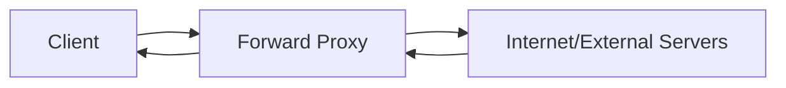
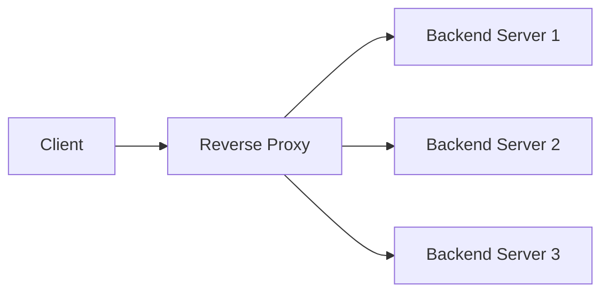

# Proxy vs Reverse Proxy

## Overview

A **proxy** is fundamentally "an entity that has the authority to act on behalf of another." In the context of networking and system design, proxies serve as intermediaries that can enhance security, performance, and functionality. Understanding the distinction between forward proxies and reverse proxies is crucial for system architecture decisions.

## Forward Proxy (Traditional Proxy)

### Definition and Function

A **forward proxy** sits between clients and the internet, intercepting and forwarding requests on behalf of clients. The proxy acts as an intermediary, making requests to external servers as if it were the client.



### How Forward Proxies Work

```javascript
// Simplified forward proxy flow
class ForwardProxy {
  async handleRequest(clientRequest) {
    // 1. Receive request from client
    const request = this.parseRequest(clientRequest);
    
    // 2. Apply policies (filtering, auth, etc.)
    if (!this.isAllowed(request)) {
      return this.blockRequest();
    }
    
    // 3. Forward request to destination server
    const response = await this.forwardToDestination(request);
    
    // 4. Cache response if applicable
    if (this.shouldCache(response)) {
      await this.cacheResponse(request, response);
    }
    
    // 5. Return response to client
    return this.sendToClient(response);
  }
}
```

### Key Benefits

1. **Privacy and Anonymity**
   - Masks client IP addresses from external servers
   - Provides user anonymity for web browsing

2. **Access Control**
   - Enforces organizational internet usage policies
   - Blocks access to specific websites or content categories

3. **Security Filtering**
   - Scans traffic for malware and threats
   - Implements content filtering and data loss prevention

4. **Performance Optimization**
   - Caches frequently requested content
   - Reduces bandwidth usage through compression

### Use Cases

#### Corporate Networks

```javascript
// Corporate proxy configuration
const corporateProxyConfig = {
  policies: {
    blockedSites: ['social-media.com', 'gaming-sites.com'],
    allowedHours: { start: '09:00', end: '17:00' },
    bandwidthLimits: { maxSpeed: '10Mbps' }
  },
  security: {
    malwareScanning: true,
    contentFiltering: true,
    dataLossPrevention: true
  },
  caching: {
    enabled: true,
    size: '10GB',
    ttl: '24h'
  }
};
```

#### Geographic Restrictions Bypass

```javascript
// VPN/Proxy for geo-restriction bypass
const geoProxyConfig = {
  exitNodes: [
    { country: 'US', region: 'East' },
    { country: 'UK', region: 'London' },
    { country: 'Germany', region: 'Frankfurt' }
  ],
  encryption: 'AES-256',
  protocols: ['OpenVPN', 'WireGuard']
};
```

## Reverse Proxy

### Definition and Function

A **reverse proxy** sits in front of backend servers, regulating incoming network traffic from clients. It intercepts client requests and forwards them to appropriate backend servers, acting on behalf of the servers rather than the clients.



### How Reverse Proxies Work

```javascript
// Simplified reverse proxy implementation
class ReverseProxy {
  constructor() {
    this.backendServers = [
      { id: 'server1', url: 'http://10.0.1.10:8080', healthy: true },
      { id: 'server2', url: 'http://10.0.1.11:8080', healthy: true },
      { id: 'server3', url: 'http://10.0.1.12:8080', healthy: true }
    ];
  }
  
  async handleRequest(clientRequest) {
    // 1. Receive request from client
    const request = this.parseRequest(clientRequest);
    
    // 2. Check cache first
    const cachedResponse = await this.checkCache(request);
    if (cachedResponse) {
      return cachedResponse;
    }
    
    // 3. Select backend server (load balancing)
    const selectedServer = this.selectBackendServer();
    
    // 4. Forward request to backend
    const response = await this.forwardToBackend(selectedServer, request);
    
    // 5. Cache response if applicable
    if (this.shouldCache(response)) {
      await this.cacheResponse(request, response);
    }
    
    // 6. Return response to client
    return response;
  }
  
  selectBackendServer() {
    // Round-robin load balancing
    const healthyServers = this.backendServers.filter(s => s.healthy);
    return healthyServers[Math.floor(Math.random() * healthyServers.length)];
  }
}
```

### Key Benefits

1. **Enhanced Security**
   - Hides backend server details from clients
   - Acts as a shield against direct attacks
   - Centralizes security policies

2. **Load Balancing**
   - Distributes incoming requests across multiple servers
   - Prevents server overload and improves availability

3. **Caching**
   - Caches static content for faster delivery
   - Reduces backend server load

4. **SSL Termination**
   - Handles SSL encryption/decryption
   - Reduces computational load on backend servers

5. **Web Application Firewall (WAF)**
   - Filters malicious requests
   - Protects against common web attacks

### Popular Reverse Proxy Solutions

#### Nginx Configuration

```nginx
# Nginx reverse proxy configuration
server {
    listen 80;
    server_name example.com;
    
    # Load balancing upstream servers
    upstream backend {
        server 10.0.1.10:8080 weight=3;
        server 10.0.1.11:8080 weight=2;
        server 10.0.1.12:8080 weight=1;
        server 10.0.1.13:8080 backup;
    }
    
    location / {
        proxy_pass http://backend;
        proxy_set_header Host $host;
        proxy_set_header X-Real-IP $remote_addr;
        proxy_set_header X-Forwarded-For $proxy_add_x_forwarded_for;
        proxy_set_header X-Forwarded-Proto $scheme;
        
        # Caching configuration
        proxy_cache my_cache;
        proxy_cache_valid 200 1h;
        proxy_cache_bypass $http_pragma;
    }
    
    # Static content caching
    location ~* \.(jpg|jpeg|png|gif|ico|css|js)$ {
        expires 1y;
        add_header Cache-Control "public, immutable";
        proxy_pass http://backend;
    }
}
```

#### HAProxy Configuration

```haproxy
# HAProxy reverse proxy configuration
global
    daemon
    maxconn 4096

defaults
    mode http
    timeout connect 5000ms
    timeout client 50000ms
    timeout server 50000ms

frontend web_frontend
    bind *:80
    bind *:443 ssl crt /path/to/certificate.pem
    redirect scheme https if !{ ssl_fc }
    default_backend web_servers

backend web_servers
    balance roundrobin
    option httpchk GET /health
    server web1 10.0.1.10:8080 check
    server web2 10.0.1.11:8080 check
    server web3 10.0.1.12:8080 check
```

#### Apache HTTP Server Configuration

```apache
# Apache reverse proxy configuration
<VirtualHost *:80>
    ServerName example.com
    
    ProxyPreserveHost On
    ProxyRequests Off
    
    # Load balancing
    ProxyPass /app/ balancer://mycluster/
    ProxyPassReverse /app/ balancer://mycluster/
    
    <Proxy balancer://mycluster>
        BalancerMember http://10.0.1.10:8080
        BalancerMember http://10.0.1.11:8080
        BalancerMember http://10.0.1.12:8080
        ProxySet lbmethod=byrequests
    </Proxy>
</VirtualHost>
```

## Load Balancing Algorithms

### Round Robin

```javascript
class RoundRobinBalancer {
  constructor(servers) {
    this.servers = servers;
    this.currentIndex = 0;
  }
  
  selectServer() {
    const server = this.servers[this.currentIndex];
    this.currentIndex = (this.currentIndex + 1) % this.servers.length;
    return server;
  }
}
```

### Weighted Round Robin

```javascript
class WeightedRoundRobinBalancer {
  constructor(servers) {
    this.servers = servers; // [{ url, weight }, ...]
    this.currentWeights = servers.map(s => 0);
  }
  
  selectServer() {
    let totalWeight = this.servers.reduce((sum, s) => sum + s.weight, 0);
    let maxWeightIndex = 0;
    
    for (let i = 0; i < this.servers.length; i++) {
      this.currentWeights[i] += this.servers[i].weight;
      
      if (this.currentWeights[i] > this.currentWeights[maxWeightIndex]) {
        maxWeightIndex = i;
      }
    }
    
    this.currentWeights[maxWeightIndex] -= totalWeight;
    return this.servers[maxWeightIndex];
  }
}
```

### Least Connections

```javascript
class LeastConnectionsBalancer {
  constructor(servers) {
    this.servers = servers.map(server => ({
      ...server,
      activeConnections: 0
    }));
  }
  
  selectServer() {
    return this.servers.reduce((min, server) => 
      server.activeConnections < min.activeConnections ? server : min
    );
  }
  
  incrementConnections(server) {
    server.activeConnections++;
  }
  
  decrementConnections(server) {
    server.activeConnections--;
  }
}
```

## Caching Strategies

### Cache Configuration

```javascript
const cacheConfig = {
  staticContent: {
    patterns: ['*.js', '*.css', '*.png', '*.jpg'],
    ttl: '1 year',
    headers: ['Cache-Control: public, max-age=31536000']
  },
  dynamicContent: {
    patterns: ['/api/data'],
    ttl: '5 minutes',
    headers: ['Cache-Control: public, max-age=300']
  },
  noCacheContent: {
    patterns: ['/api/user/*', '/login', '/checkout'],
    headers: ['Cache-Control: no-cache, no-store, must-revalidate']
  }
};
```

### Cache Invalidation

```javascript
class CacheManager {
  async invalidateCache(patterns) {
    for (const pattern of patterns) {
      await this.clearCacheByPattern(pattern);
    }
    
    // Notify other cache instances
    await this.broadcastInvalidation(patterns);
  }
  
  async smartCaching(request, response) {
    const cacheKey = this.generateCacheKey(request);
    
    // Check cache first
    const cached = await this.getFromCache(cacheKey);
    if (cached && !this.isExpired(cached)) {
      return cached;
    }
    
    // Generate new response
    const freshResponse = await this.generateResponse(request);
    
    // Cache based on content type and headers
    if (this.shouldCache(freshResponse)) {
      await this.setInCache(cacheKey, freshResponse);
    }
    
    return freshResponse;
  }
}
```

## Security Features

### Web Application Firewall (WAF)

```javascript
class WAFMiddleware {
  constructor() {
    this.rules = [
      { pattern: /(\<script\>.*\<\/script\>)/i, type: 'XSS' },
      { pattern: /(union|select|insert|drop|delete)/i, type: 'SQL_INJECTION' },
      { pattern: /\.\.\//g, type: 'PATH_TRAVERSAL' }
    ];
  }
  
  async checkRequest(request) {
    const suspiciousContent = [
      request.url,
      request.body,
      ...Object.values(request.headers)
    ].join(' ');
    
    for (const rule of this.rules) {
      if (rule.pattern.test(suspiciousContent)) {
        await this.logThreat(request, rule.type);
        return { blocked: true, reason: rule.type };
      }
    }
    
    return { blocked: false };
  }
}
```

### DDoS Protection

```javascript
class DDoSProtection {
  constructor() {
    this.requestCounts = new Map();
    this.blacklist = new Set();
  }
  
  async checkRateLimit(clientIP) {
    const now = Date.now();
    const windowStart = now - 60000; // 1 minute window
    
    if (!this.requestCounts.has(clientIP)) {
      this.requestCounts.set(clientIP, []);
    }
    
    const requests = this.requestCounts.get(clientIP);
    
    // Remove old requests
    const recentRequests = requests.filter(time => time > windowStart);
    this.requestCounts.set(clientIP, recentRequests);
    
    // Check rate limit
    if (recentRequests.length > 100) { // 100 requests per minute
      this.blacklist.add(clientIP);
      return { blocked: true, reason: 'RATE_LIMIT_EXCEEDED' };
    }
    
    recentRequests.push(now);
    return { blocked: false };
  }
}
```

## Real-World Examples

### Cloudflare as Reverse Proxy

```javascript
// Cloudflare Workers example
addEventListener('fetch', event => {
  event.respondWith(handleRequest(event.request));
});

async function handleRequest(request) {
  // DDoS protection and filtering
  const clientIP = request.headers.get('CF-Connecting-IP');
  
  // Global caching
  const cache = caches.default;
  const cacheKey = new Request(request.url, request);
  const response = await cache.match(cacheKey);
  
  if (response) {
    return response;
  }
  
  // Forward to origin server
  const originResponse = await fetch(request);
  
  // Cache response
  if (originResponse.status === 200) {
    const responseToCache = originResponse.clone();
    event.waitUntil(cache.put(cacheKey, responseToCache));
  }
  
  return originResponse;
}
```

### API Gateway Pattern

```javascript
class APIGateway {
  constructor() {
    this.services = {
      'user': 'http://user-service:8080',
      'order': 'http://order-service:8080',
      'payment': 'http://payment-service:8080'
    };
  }
  
  async routeRequest(request) {
    const path = new URL(request.url).pathname;
    const service = this.extractService(path);
    
    if (!this.services[service]) {
      return new Response('Service not found', { status: 404 });
    }
    
    // Authentication and authorization
    const authResult = await this.authenticate(request);
    if (!authResult.valid) {
      return new Response('Unauthorized', { status: 401 });
    }
    
    // Rate limiting
    const rateLimitResult = await this.checkRateLimit(authResult.userId);
    if (rateLimitResult.exceeded) {
      return new Response('Rate limit exceeded', { status: 429 });
    }
    
    // Forward to microservice
    const serviceUrl = this.services[service];
    const serviceRequest = new Request(serviceUrl + path, request);
    
    return await fetch(serviceRequest);
  }
}
```

## Key Differences Summary

| Aspect | Forward Proxy | Reverse Proxy |
|--------|---------------|---------------|
| **Position** | Between clients and internet | Between internet and servers |
| **Acts on behalf of** | Clients | Servers |
| **Primary use** | Client privacy, access control | Load balancing, security |
| **Visibility to client** | Client configures proxy | Transparent to client |
| **Caching focus** | Internet content for clients | Server responses for clients |
| **Security role** | Protects client identity | Protects server infrastructure |

## Implementation Considerations

### Performance Optimization

```javascript
const performanceConfig = {
  connectionPooling: {
    maxConnections: 100,
    keepAlive: true,
    timeout: 30000
  },
  compression: {
    enabled: true,
    algorithms: ['gzip', 'brotli'],
    minSize: 1024
  },
  httpVersion: 'HTTP/2',
  bufferSizes: {
    read: '64KB',
    write: '64KB'
  }
};
```

### Health Checking

```javascript
class HealthChecker {
  constructor(servers) {
    this.servers = servers;
    this.healthStatus = new Map();
  }
  
  async startHealthChecks() {
    setInterval(async () => {
      for (const server of this.servers) {
        try {
          const response = await fetch(`${server.url}/health`, {
            method: 'GET',
            timeout: 5000
          });
          
          this.healthStatus.set(server.id, response.ok);
        } catch (error) {
          this.healthStatus.set(server.id, false);
        }
      }
    }, 10000); // Check every 10 seconds
  }
  
  getHealthyServers() {
    return this.servers.filter(server => 
      this.healthStatus.get(server.id) !== false
    );
  }
}
```

## Best Practices

### Configuration Management

1. **Monitoring and Logging**: Implement comprehensive logging and monitoring
2. **Health Checks**: Regular health checks for backend servers
3. **Graceful Degradation**: Handle server failures gracefully
4. **Security Updates**: Keep proxy software updated
5. **Performance Tuning**: Regular performance optimization

### Scalability Considerations

```javascript
const scalabilityConfig = {
  horizontalScaling: {
    minInstances: 2,
    maxInstances: 10,
    scaleUpThreshold: '80% CPU',
    scaleDownThreshold: '30% CPU'
  },
  loadBalancing: {
    algorithm: 'least_connections',
    healthCheckInterval: '10s',
    failoverTimeout: '30s'
  }
};
```

## Key Takeaways

1. **Forward Proxies**: Act on behalf of clients, providing privacy, access control, and caching
2. **Reverse Proxies**: Act on behalf of servers, providing load balancing, security, and performance optimization
3. **Use Cases**: Choose based on whether you need client-side or server-side proxy functionality
4. **Security**: Both types provide security benefits but in different directions
5. **Performance**: Both can improve performance through caching and optimization
6. **Implementation**: Modern solutions often combine both proxy types for comprehensive coverage

Understanding the distinction between forward and reverse proxies is essential for designing robust, secure, and performant distributed systems.