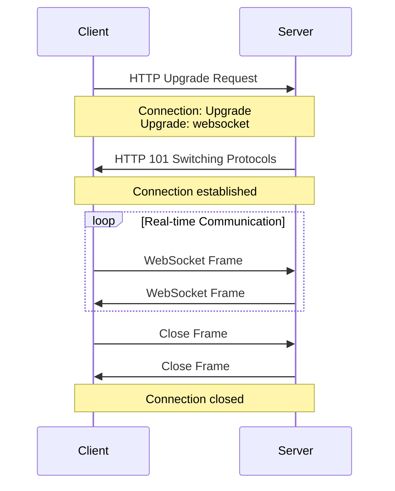

# WebSockets

## Overview

**WebSockets are a communication protocol used to build real-time features by establishing a two-way connection between a client and a server.** Unlike traditional HTTP, WebSockets enable full-duplex, bidirectional communication over a single TCP connection, making them ideal for applications requiring real-time updates.

## Core Concepts

### WebSocket Protocol



### Handshake Process

```javascript
// Client-side handshake headers
const handshakeHeaders = {
  'Connection': 'Upgrade',
  'Upgrade': 'websocket',
  'Sec-WebSocket-Version': '13',
  'Sec-WebSocket-Key': 'base64-encoded-key',
  'Sec-WebSocket-Protocol': 'chat, superchat' // Optional subprotocols
};

// Server response
const serverResponse = {
  status: '101 Switching Protocols',
  headers: {
    'Upgrade': 'websocket',
    'Connection': 'Upgrade',
    'Sec-WebSocket-Accept': 'calculated-accept-key',
    'Sec-WebSocket-Protocol': 'chat' // Chosen subprotocol
  }
};
```

### Frame Structure

```javascript
class WebSocketFrame {
  constructor(opcode, payload, fin = true, masked = false) {
    this.fin = fin;           // Final fragment flag
    this.rsv1 = false;        // Reserved bit 1
    this.rsv2 = false;        // Reserved bit 2
    this.rsv3 = false;        // Reserved bit 3
    this.opcode = opcode;     // Frame type
    this.masked = masked;     // Masking flag
    this.payload = payload;   // Actual data
    this.maskingKey = masked ? this.generateMaskingKey() : null;
  }
  
  // Opcode constants
  static OPCODES = {
    CONTINUATION: 0x0,
    TEXT: 0x1,
    BINARY: 0x2,
    CLOSE: 0x8,
    PING: 0x9,
    PONG: 0xa
  };
  
  generateMaskingKey() {
    return new Uint8Array(4).map(() => Math.floor(Math.random() * 256));
  }
  
  encode() {
    // Implementation of frame encoding
    const payloadLength = this.payload.length;
    let frame = new Uint8Array(2 + this.getExtendedLengthBytes() + 
                              (this.masked ? 4 : 0) + payloadLength);
    
    // Set FIN and opcode
    frame[0] = (this.fin ? 0x80 : 0) | this.opcode;
    
    // Set mask and payload length
    frame[1] = (this.masked ? 0x80 : 0) | (payloadLength < 126 ? payloadLength : 
               payloadLength < 65536 ? 126 : 127);
    
    return frame;
  }
  
  getExtendedLengthBytes() {
    if (this.payload.length < 126) return 0;
    if (this.payload.length < 65536) return 2;
    return 8;
  }
}
```

## Implementation Examples

### Basic WebSocket Server (Node.js)

```javascript
const WebSocket = require('ws');
const http = require('http');

class WebSocketServer {
  constructor(port = 8080) {
    this.port = port;
    this.clients = new Set();
    this.rooms = new Map();
    this.setupServer();
  }
  
  setupServer() {
    // Create HTTP server
    this.server = http.createServer();
    
    // Create WebSocket server
    this.wss = new WebSocket.Server({ 
      server: this.server,
      perMessageDeflate: {
        zlibDeflateOptions: {
          level: 3
        }
      }
    });
    
    this.wss.on('connection', this.handleConnection.bind(this));
    
    this.server.listen(this.port, () => {
      console.log(`WebSocket server running on port ${this.port}`);
    });
  }
  
  handleConnection(ws, request) {
    console.log('New WebSocket connection');
    
    // Add client to active connections
    this.clients.add(ws);
    
    // Setup client event handlers
    ws.on('message', (data) => this.handleMessage(ws, data));
    ws.on('close', () => this.handleDisconnection(ws));
    ws.on('error', (error) => this.handleError(ws, error));
    ws.on('ping', () => ws.pong());
    
    // Send welcome message
    this.sendMessage(ws, {
      type: 'welcome',
      message: 'Connected to WebSocket server',
      clientId: this.generateClientId(),
      timestamp: Date.now()
    });
    
    // Setup heartbeat
    this.setupHeartbeat(ws);
  }
  
  handleMessage(ws, data) {
    try {
      const message = JSON.parse(data.toString());
      
      switch (message.type) {
        case 'join_room':
          this.joinRoom(ws, message.room);
          break;
        case 'leave_room':
          this.leaveRoom(ws, message.room);
          break;
        case 'chat_message':
          this.handleChatMessage(ws, message);
          break;
        case 'broadcast':
          this.broadcastMessage(message.data, ws);
          break;
        case 'ping':
          this.sendMessage(ws, { type: 'pong', timestamp: Date.now() });
          break;
        default:
          this.sendMessage(ws, { 
            type: 'error', 
            message: 'Unknown message type' 
          });
      }
    } catch (error) {
      this.sendMessage(ws, { 
        type: 'error', 
        message: 'Invalid message format' 
      });
    }
  }
  
  handleDisconnection(ws) {
    console.log('Client disconnected');
    
    // Remove from all rooms
    for (const [roomName, clients] of this.rooms) {
      clients.delete(ws);
      if (clients.size === 0) {
        this.rooms.delete(roomName);
      }
    }
    
    // Remove from active clients
    this.clients.delete(ws);
    
    // Clear heartbeat
    if (ws.heartbeatInterval) {
      clearInterval(ws.heartbeatInterval);
    }
  }
  
  handleError(ws, error) {
    console.error('WebSocket error:', error);
    this.sendMessage(ws, { 
      type: 'error', 
      message: error.message 
    });
  }
  
  setupHeartbeat(ws) {
    ws.isAlive = true;
    
    // Send ping every 30 seconds
    ws.heartbeatInterval = setInterval(() => {
      if (!ws.isAlive) {
        ws.terminate();
        return;
      }
      
      ws.isAlive = false;
      ws.ping();
    }, 30000);
    
    // Reset alive status on pong
    ws.on('pong', () => {
      ws.isAlive = true;
    });
  }
  
  joinRoom(ws, roomName) {
    if (!this.rooms.has(roomName)) {
      this.rooms.set(roomName, new Set());
    }
    
    this.rooms.get(roomName).add(ws);
    ws.currentRoom = roomName;
    
    this.sendMessage(ws, {
      type: 'room_joined',
      room: roomName,
      memberCount: this.rooms.get(roomName).size
    });
    
    // Notify other room members
    this.broadcastToRoom(roomName, {
      type: 'member_joined',
      room: roomName,
      memberCount: this.rooms.get(roomName).size
    }, ws);
  }
  
  leaveRoom(ws, roomName) {
    if (this.rooms.has(roomName)) {
      this.rooms.get(roomName).delete(ws);
      
      if (this.rooms.get(roomName).size === 0) {
        this.rooms.delete(roomName);
      } else {
        // Notify remaining members
        this.broadcastToRoom(roomName, {
          type: 'member_left',
          room: roomName,
          memberCount: this.rooms.get(roomName).size
        });
      }
    }
    
    ws.currentRoom = null;
  }
  
  handleChatMessage(ws, message) {
    const chatMessage = {
      type: 'chat_message',
      room: message.room,
      message: message.message,
      sender: message.sender || 'Anonymous',
      timestamp: Date.now()
    };
    
    if (message.room) {
      this.broadcastToRoom(message.room, chatMessage);
    } else {
      this.broadcastMessage(chatMessage);
    }
  }
  
  sendMessage(ws, message) {
    if (ws.readyState === WebSocket.OPEN) {
      ws.send(JSON.stringify(message));
    }
  }
  
  broadcastMessage(message, excludeClient = null) {
    const messageStr = JSON.stringify(message);
    
    this.clients.forEach(client => {
      if (client !== excludeClient && client.readyState === WebSocket.OPEN) {
        client.send(messageStr);
      }
    });
  }
  
  broadcastToRoom(roomName, message, excludeClient = null) {
    if (!this.rooms.has(roomName)) return;
    
    const messageStr = JSON.stringify(message);
    
    this.rooms.get(roomName).forEach(client => {
      if (client !== excludeClient && client.readyState === WebSocket.OPEN) {
        client.send(messageStr);
      }
    });
  }
  
  generateClientId() {
    return `client_${Date.now()}_${Math.random().toString(36).substr(2, 9)}`;
  }
  
  getStats() {
    return {
      connectedClients: this.clients.size,
      activeRooms: this.rooms.size,
      roomDetails: Array.from(this.rooms.entries()).map(([name, clients]) => ({
        name,
        memberCount: clients.size
      }))
    };
  }
}

// Usage
const wsServer = new WebSocketServer(8080);
```

### WebSocket Client Implementation

```javascript
class WebSocketClient {
  constructor(url, options = {}) {
    this.url = url;
    this.options = {
      reconnectInterval: 5000,
      maxReconnectAttempts: 5,
      heartbeatInterval: 30000,
      ...options
    };
    
    this.reconnectAttempts = 0;
    this.messageQueue = [];
    this.eventHandlers = new Map();
    this.isConnected = false;
    
    this.connect();
  }
  
  connect() {
    try {
      this.ws = new WebSocket(this.url);
      this.setupEventHandlers();
    } catch (error) {
      console.error('WebSocket connection error:', error);
      this.scheduleReconnect();
    }
  }
  
  setupEventHandlers() {
    this.ws.onopen = (event) => {
      console.log('WebSocket connected');
      this.isConnected = true;
      this.reconnectAttempts = 0;
      
      // Send queued messages
      this.flushMessageQueue();
      
      // Start heartbeat
      this.startHeartbeat();
      
      this.emit('open', event);
    };
    
    this.ws.onmessage = (event) => {
      try {
        const message = JSON.parse(event.data);
        this.handleMessage(message);
      } catch (error) {
        console.error('Message parsing error:', error);
      }
    };
    
    this.ws.onclose = (event) => {
      console.log('WebSocket disconnected:', event.code, event.reason);
      this.isConnected = false;
      this.stopHeartbeat();
      
      this.emit('close', event);
      
      // Auto-reconnect unless explicitly closed
      if (event.code !== 1000) {
        this.scheduleReconnect();
      }
    };
    
    this.ws.onerror = (error) => {
      console.error('WebSocket error:', error);
      this.emit('error', error);
    };
  }
  
  handleMessage(message) {
    switch (message.type) {
      case 'welcome':
        this.clientId = message.clientId;
        break;
      case 'pong':
        this.lastPongTime = Date.now();
        break;
      case 'error':
        console.error('Server error:', message.message);
        break;
      default:
        this.emit('message', message);
    }
  }
  
  send(message) {
    const messageStr = JSON.stringify(message);
    
    if (this.isConnected && this.ws.readyState === WebSocket.OPEN) {
      this.ws.send(messageStr);
    } else {
      // Queue message for when connection is restored
      this.messageQueue.push(messageStr);
    }
  }
  
  sendMessage(type, data = {}) {
    this.send({
      type,
      ...data,
      timestamp: Date.now(),
      clientId: this.clientId
    });
  }
  
  joinRoom(roomName) {
    this.sendMessage('join_room', { room: roomName });
  }
  
  leaveRoom(roomName) {
    this.sendMessage('leave_room', { room: roomName });
  }
  
  sendChatMessage(message, room = null) {
    this.sendMessage('chat_message', { 
      message, 
      room,
      sender: this.options.username 
    });
  }
  
  flushMessageQueue() {
    while (this.messageQueue.length > 0 && this.isConnected) {
      const message = this.messageQueue.shift();
      this.ws.send(message);
    }
  }
  
  startHeartbeat() {
    this.heartbeatTimer = setInterval(() => {
      if (this.isConnected) {
        this.sendMessage('ping');
        
        // Check if we received pong recently
        const timeSinceLastPong = Date.now() - (this.lastPongTime || Date.now());
        if (timeSinceLastPong > this.options.heartbeatInterval * 2) {
          console.warn('Heartbeat timeout, reconnecting...');
          this.reconnect();
        }
      }
    }, this.options.heartbeatInterval);
  }
  
  stopHeartbeat() {
    if (this.heartbeatTimer) {
      clearInterval(this.heartbeatTimer);
      this.heartbeatTimer = null;
    }
  }
  
  scheduleReconnect() {
    if (this.reconnectAttempts >= this.options.maxReconnectAttempts) {
      console.error('Max reconnection attempts reached');
      this.emit('maxReconnectAttemptsReached');
      return;
    }
    
    this.reconnectAttempts++;
    const delay = this.options.reconnectInterval * Math.pow(2, this.reconnectAttempts - 1);
    
    console.log(`Reconnecting in ${delay}ms (attempt ${this.reconnectAttempts})`);
    
    setTimeout(() => {
      this.connect();
    }, delay);
  }
  
  reconnect() {
    this.close();
    this.reconnectAttempts = 0;
    this.connect();
  }
  
  on(event, handler) {
    if (!this.eventHandlers.has(event)) {
      this.eventHandlers.set(event, new Set());
    }
    this.eventHandlers.get(event).add(handler);
  }
  
  off(event, handler) {
    if (this.eventHandlers.has(event)) {
      this.eventHandlers.get(event).delete(handler);
    }
  }
  
  emit(event, data) {
    if (this.eventHandlers.has(event)) {
      this.eventHandlers.get(event).forEach(handler => {
        try {
          handler(data);
        } catch (error) {
          console.error('Event handler error:', error);
        }
      });
    }
  }
  
  close(code = 1000, reason = 'Client closing') {
    this.stopHeartbeat();
    if (this.ws) {
      this.ws.close(code, reason);
    }
  }
  
  getConnectionState() {
    return {
      connected: this.isConnected,
      readyState: this.ws ? this.ws.readyState : WebSocket.CLOSED,
      reconnectAttempts: this.reconnectAttempts,
      clientId: this.clientId,
      queuedMessages: this.messageQueue.length
    };
  }
}

// Usage
const client = new WebSocketClient('ws://localhost:8080', {
  username: 'Alice',
  reconnectInterval: 3000,
  maxReconnectAttempts: 10
});

client.on('open', () => {
  console.log('Connected to server');
  client.joinRoom('general');
});

client.on('message', (message) => {
  console.log('Received:', message);
});

client.on('close', () => {
  console.log('Connection closed');
});
```

## Advanced Use Cases

### 1. Real-time Collaborative Editor

```javascript
class CollaborativeEditor {
  constructor(wsClient) {
    this.wsClient = wsClient;
    this.document = '';
    this.version = 0;
    this.pendingOperations = [];
    this.setupEventHandlers();
  }
  
  setupEventHandlers() {
    this.wsClient.on('message', (message) => {
      switch (message.type) {
        case 'document_state':
          this.handleDocumentState(message);
          break;
        case 'operation':
          this.handleOperation(message);
          break;
        case 'operation_ack':
          this.handleOperationAck(message);
          break;
      }
    });
  }
  
  // Operational Transformation for collaborative editing
  insertText(position, text) {
    const operation = {
      type: 'insert',
      position,
      text,
      version: this.version,
      clientId: this.wsClient.clientId
    };
    
    this.applyOperation(operation);
    this.sendOperation(operation);
  }
  
  deleteText(position, length) {
    const operation = {
      type: 'delete',
      position,
      length,
      version: this.version,
      clientId: this.wsClient.clientId
    };
    
    this.applyOperation(operation);
    this.sendOperation(operation);
  }
  
  applyOperation(operation) {
    switch (operation.type) {
      case 'insert':
        this.document = 
          this.document.slice(0, operation.position) +
          operation.text +
          this.document.slice(operation.position);
        break;
      case 'delete':
        this.document =
          this.document.slice(0, operation.position) +
          this.document.slice(operation.position + operation.length);
        break;
    }
    
    this.version++;
    this.onDocumentChange();
  }
  
  sendOperation(operation) {
    this.pendingOperations.push(operation);
    
    this.wsClient.sendMessage('operation', {
      operation,
      documentId: this.documentId
    });
  }
  
  handleOperation(message) {
    const { operation } = message;
    
    // Transform operation against pending operations
    const transformedOperation = this.transformOperation(
      operation, 
      this.pendingOperations
    );
    
    this.applyOperation(transformedOperation);
  }
  
  handleOperationAck(message) {
    const { operationId } = message;
    this.pendingOperations = this.pendingOperations.filter(
      op => op.id !== operationId
    );
  }
  
  transformOperation(operation, pendingOps) {
    // Simplified operational transformation
    let transformedOp = { ...operation };
    
    for (const pendingOp of pendingOps) {
      if (pendingOp.type === 'insert' && 
          transformedOp.position >= pendingOp.position) {
        transformedOp.position += pendingOp.text.length;
      } else if (pendingOp.type === 'delete' && 
                 transformedOp.position > pendingOp.position) {
        transformedOp.position -= pendingOp.length;
      }
    }
    
    return transformedOp;
  }
  
  onDocumentChange() {
    // Update UI
    console.log('Document updated:', this.document);
  }
}
```

### 2. Real-time Gaming Framework

```javascript
class GameServer {
  constructor(wsServer) {
    this.wsServer = wsServer;
    this.games = new Map();
    this.players = new Map();
    this.tickRate = 60; // 60 FPS
    this.setupEventHandlers();
    this.startGameLoop();
  }
  
  setupEventHandlers() {
    this.wsServer.on('connection', (ws) => {
      ws.on('message', (data) => {
        const message = JSON.parse(data);
        this.handleGameMessage(ws, message);
      });
    });
  }
  
  handleGameMessage(ws, message) {
    switch (message.type) {
      case 'join_game':
        this.joinGame(ws, message.gameId, message.playerData);
        break;
      case 'leave_game':
        this.leaveGame(ws, message.gameId);
        break;
      case 'player_input':
        this.handlePlayerInput(ws, message);
        break;
      case 'game_action':
        this.handleGameAction(ws, message);
        break;
    }
  }
  
  createGame(gameId, gameType, options = {}) {
    const game = {
      id: gameId,
      type: gameType,
      state: 'waiting',
      players: new Map(),
      gameState: this.initializeGameState(gameType),
      lastUpdate: Date.now(),
      options
    };
    
    this.games.set(gameId, game);
    return game;
  }
  
  joinGame(ws, gameId, playerData) {
    let game = this.games.get(gameId);
    
    if (!game) {
      game = this.createGame(gameId, 'default');
    }
    
    const player = {
      id: this.generatePlayerId(),
      ws,
      data: playerData,
      lastInputTime: Date.now(),
      position: { x: 0, y: 0 },
      velocity: { x: 0, y: 0 }
    };
    
    game.players.set(player.id, player);
    this.players.set(ws, { gameId, playerId: player.id });
    
    // Send game state to new player
    this.sendToPlayer(ws, {
      type: 'game_joined',
      gameId,
      playerId: player.id,
      gameState: game.gameState
    });
    
    // Notify other players
    this.broadcastToGame(gameId, {
      type: 'player_joined',
      playerId: player.id,
      playerData
    }, ws);
  }
  
  handlePlayerInput(ws, message) {
    const playerInfo = this.players.get(ws);
    if (!playerInfo) return;
    
    const game = this.games.get(playerInfo.gameId);
    const player = game.players.get(playerInfo.playerId);
    
    // Process input with client-side prediction
    const input = {
      ...message.input,
      timestamp: Date.now(),
      sequence: message.sequence
    };
    
    this.processPlayerInput(player, input);
    
    // Send authoritative state back
    this.sendToPlayer(ws, {
      type: 'input_ack',
      sequence: message.sequence,
      serverTime: Date.now(),
      position: player.position,
      velocity: player.velocity
    });
  }
  
  processPlayerInput(player, input) {
    // Simple movement processing
    const speed = 100; // pixels per second
    const deltaTime = (Date.now() - player.lastInputTime) / 1000;
    
    if (input.left) player.velocity.x = -speed;
    else if (input.right) player.velocity.x = speed;
    else player.velocity.x = 0;
    
    if (input.up) player.velocity.y = -speed;
    else if (input.down) player.velocity.y = speed;
    else player.velocity.y = 0;
    
    // Update position
    player.position.x += player.velocity.x * deltaTime;
    player.position.y += player.velocity.y * deltaTime;
    
    player.lastInputTime = Date.now();
  }
  
  startGameLoop() {
    const targetFrameTime = 1000 / this.tickRate;
    
    const gameLoop = () => {
      const startTime = Date.now();
      
      // Update all games
      for (const game of this.games.values()) {
        this.updateGame(game);
      }
      
      // Send game state updates
      this.sendGameStateUpdates();
      
      // Schedule next frame
      const frameTime = Date.now() - startTime;
      const nextFrameDelay = Math.max(0, targetFrameTime - frameTime);
      
      setTimeout(gameLoop, nextFrameDelay);
    };
    
    gameLoop();
  }
  
  updateGame(game) {
    const now = Date.now();
    const deltaTime = (now - game.lastUpdate) / 1000;
    
    // Update game physics
    for (const player of game.players.values()) {
      // Apply movement, collision detection, etc.
      this.updatePlayerPhysics(player, deltaTime);
    }
    
    // Update game state
    this.updateGameLogic(game, deltaTime);
    
    game.lastUpdate = now;
  }
  
  sendGameStateUpdates() {
    for (const game of this.games.values()) {
      const gameState = this.serializeGameState(game);
      
      this.broadcastToGame(game.id, {
        type: 'game_state_update',
        state: gameState,
        timestamp: Date.now()
      });
    }
  }
  
  sendToPlayer(ws, message) {
    if (ws.readyState === WebSocket.OPEN) {
      ws.send(JSON.stringify(message));
    }
  }
  
  broadcastToGame(gameId, message, excludeWs = null) {
    const game = this.games.get(gameId);
    if (!game) return;
    
    const messageStr = JSON.stringify(message);
    
    for (const player of game.players.values()) {
      if (player.ws !== excludeWs && 
          player.ws.readyState === WebSocket.OPEN) {
        player.ws.send(messageStr);
      }
    }
  }
  
  generatePlayerId() {
    return `player_${Date.now()}_${Math.random().toString(36).substr(2, 9)}`;
  }
}
```

### 3. Real-time Trading System

```javascript
class TradingWebSocketServer {
  constructor(wsServer) {
    this.wsServer = wsServer;
    this.subscriptions = new Map(); // symbol -> Set of clients
    this.marketData = new Map();
    this.orderBook = new Map();
    this.rateLimiter = new Map(); // client -> rate limit data
    
    this.setupEventHandlers();
    this.startMarketDataFeed();
  }
  
  setupEventHandlers() {
    this.wsServer.on('connection', (ws) => {
      this.initializeClient(ws);
      
      ws.on('message', (data) => {
        if (this.checkRateLimit(ws)) {
          const message = JSON.parse(data);
          this.handleTradingMessage(ws, message);
        } else {
          this.sendError(ws, 'Rate limit exceeded');
        }
      });
      
      ws.on('close', () => {
        this.handleClientDisconnect(ws);
      });
    });
  }
  
  initializeClient(ws) {
    ws.subscriptions = new Set();
    ws.authenticated = false;
    ws.userId = null;
    
    // Initialize rate limiting
    this.rateLimiter.set(ws, {
      requests: 0,
      resetTime: Date.now() + 60000, // 1 minute window
      maxRequests: 100
    });
  }
  
  checkRateLimit(ws) {
    const rateLimit = this.rateLimiter.get(ws);
    const now = Date.now();
    
    if (now > rateLimit.resetTime) {
      rateLimit.requests = 0;
      rateLimit.resetTime = now + 60000;
    }
    
    if (rateLimit.requests >= rateLimit.maxRequests) {
      return false;
    }
    
    rateLimit.requests++;
    return true;
  }
  
  handleTradingMessage(ws, message) {
    switch (message.type) {
      case 'authenticate':
        this.handleAuthentication(ws, message);
        break;
      case 'subscribe':
        this.handleSubscription(ws, message);
        break;
      case 'unsubscribe':
        this.handleUnsubscription(ws, message);
        break;
      case 'place_order':
        this.handlePlaceOrder(ws, message);
        break;
      case 'cancel_order':
        this.handleCancelOrder(ws, message);
        break;
      case 'get_orderbook':
        this.handleGetOrderBook(ws, message);
        break;
    }
  }
  
  handleAuthentication(ws, message) {
    // Simulate authentication
    const { token } = message;
    
    if (this.validateToken(token)) {
      ws.authenticated = true;
      ws.userId = this.extractUserIdFromToken(token);
      
      this.sendMessage(ws, {
        type: 'authentication_success',
        userId: ws.userId,
        permissions: ['trade', 'market_data']
      });
    } else {
      this.sendError(ws, 'Authentication failed');
    }
  }
  
  handleSubscription(ws, message) {
    const { symbols, dataTypes } = message;
    
    symbols.forEach(symbol => {
      if (!this.subscriptions.has(symbol)) {
        this.subscriptions.set(symbol, new Set());
      }
      
      this.subscriptions.get(symbol).add(ws);
      ws.subscriptions.add(symbol);
      
      // Send current market data
      if (this.marketData.has(symbol)) {
        this.sendMessage(ws, {
          type: 'market_data',
          symbol,
          data: this.marketData.get(symbol)
        });
      }
      
      // Send current order book if requested
      if (dataTypes.includes('orderbook') && this.orderBook.has(symbol)) {
        this.sendMessage(ws, {
          type: 'orderbook',
          symbol,
          data: this.orderBook.get(symbol)
        });
      }
    });
    
    this.sendMessage(ws, {
      type: 'subscription_success',
      symbols,
      subscribedCount: ws.subscriptions.size
    });
  }
  
  handlePlaceOrder(ws, message) {
    if (!ws.authenticated) {
      this.sendError(ws, 'Authentication required');
      return;
    }
    
    const order = {
      id: this.generateOrderId(),
      userId: ws.userId,
      symbol: message.symbol,
      side: message.side, // 'buy' or 'sell'
      quantity: message.quantity,
      price: message.price,
      type: message.orderType, // 'market', 'limit'
      timestamp: Date.now(),
      status: 'pending'
    };
    
    // Validate order
    if (this.validateOrder(order)) {
      // Add to order book
      this.addToOrderBook(order);
      
      // Try to match order
      const trades = this.matchOrder(order);
      
      // Send order confirmation
      this.sendMessage(ws, {
        type: 'order_placed',
        order: {
          id: order.id,
          status: order.status,
          filledQuantity: order.filledQuantity || 0,
          averagePrice: order.averagePrice || null
        }
      });
      
      // Broadcast trades
      trades.forEach(trade => this.broadcastTrade(trade));
      
      // Update order book
      this.broadcastOrderBookUpdate(order.symbol);
    } else {
      this.sendError(ws, 'Invalid order parameters');
    }
  }
  
  matchOrder(order) {
    const trades = [];
    const orderBook = this.orderBook.get(order.symbol);
    
    if (!orderBook) return trades;
    
    const oppositeOrders = order.side === 'buy' ? 
      orderBook.sells : orderBook.buys;
    
    // Simple matching logic
    for (const oppositeOrder of oppositeOrders) {
      if (this.canMatch(order, oppositeOrder)) {
        const trade = this.executeTrade(order, oppositeOrder);
        trades.push(trade);
        
        if (order.filledQuantity >= order.quantity) {
          order.status = 'filled';
          break;
        }
      }
    }
    
    return trades;
  }
  
  startMarketDataFeed() {
    // Simulate market data updates
    setInterval(() => {
      const symbols = ['BTCUSD', 'ETHUSD', 'ADAUSD'];
      
      symbols.forEach(symbol => {
        const marketData = this.generateMarketData(symbol);
        this.marketData.set(symbol, marketData);
        
        // Broadcast to subscribers
        this.broadcastMarketData(symbol, marketData);
      });
    }, 1000); // Update every second
  }
  
  generateMarketData(symbol) {
    const existing = this.marketData.get(symbol) || { price: 50000 };
    const change = (Math.random() - 0.5) * 100; // Random price movement
    
    return {
      symbol,
      price: Math.max(0, existing.price + change),
      bid: existing.price + change - 1,
      ask: existing.price + change + 1,
      volume: Math.floor(Math.random() * 1000),
      timestamp: Date.now()
    };
  }
  
  broadcastMarketData(symbol, data) {
    const subscribers = this.subscriptions.get(symbol);
    if (!subscribers) return;
    
    const message = JSON.stringify({
      type: 'market_data',
      symbol,
      data
    });
    
    subscribers.forEach(ws => {
      if (ws.readyState === WebSocket.OPEN) {
        ws.send(message);
      }
    });
  }
  
  sendMessage(ws, message) {
    if (ws.readyState === WebSocket.OPEN) {
      ws.send(JSON.stringify(message));
    }
  }
  
  sendError(ws, errorMessage) {
    this.sendMessage(ws, {
      type: 'error',
      message: errorMessage,
      timestamp: Date.now()
    });
  }
}
```

## Performance Optimization

### 1. Connection Pooling and Load Balancing

```javascript
class WebSocketLoadBalancer {
  constructor(servers) {
    this.servers = servers;
    this.currentIndex = 0;
    this.healthChecks = new Map();
    this.connectionCounts = new Map();
    
    this.initializeHealthChecks();
  }
  
  getNextServer() {
    // Round-robin with health checking
    const availableServers = this.servers.filter(server => 
      this.healthChecks.get(server.id) === true
    );
    
    if (availableServers.length === 0) {
      throw new Error('No healthy servers available');
    }
    
    // Find server with least connections
    return availableServers.reduce((least, current) => {
      const leastConnections = this.connectionCounts.get(least.id) || 0;
      const currentConnections = this.connectionCounts.get(current.id) || 0;
      
      return currentConnections < leastConnections ? current : least;
    });
  }
  
  initializeHealthChecks() {
    this.servers.forEach(server => {
      this.healthChecks.set(server.id, true);
      this.connectionCounts.set(server.id, 0);
      
      // Periodic health check
      setInterval(() => {
        this.checkServerHealth(server);
      }, 30000);
    });
  }
  
  async checkServerHealth(server) {
    try {
      // Implement health check (ping, http request, etc.)
      const response = await fetch(`http://${server.host}:${server.port}/health`);
      this.healthChecks.set(server.id, response.ok);
    } catch (error) {
      this.healthChecks.set(server.id, false);
    }
  }
  
  recordConnection(serverId) {
    const count = this.connectionCounts.get(serverId) || 0;
    this.connectionCounts.set(serverId, count + 1);
  }
  
  recordDisconnection(serverId) {
    const count = this.connectionCounts.get(serverId) || 0;
    this.connectionCounts.set(serverId, Math.max(0, count - 1));
  }
}
```

### 2. Message Compression and Batching

```javascript
class OptimizedWebSocketServer {
  constructor(options = {}) {
    this.options = {
      enableCompression: true,
      batchMessages: true,
      batchInterval: 16, // ~60fps
      compressionThreshold: 1024, // Compress messages larger than 1KB
      ...options
    };
    
    this.messageBatches = new Map(); // client -> messages[]
    this.setupBatching();
  }
  
  setupBatching() {
    if (this.options.batchMessages) {
      setInterval(() => {
        this.flushMessageBatches();
      }, this.options.batchInterval);
    }
  }
  
  sendMessage(ws, message, priority = 'normal') {
    if (this.options.batchMessages && priority !== 'immediate') {
      this.addToBatch(ws, message);
    } else {
      this.sendImmediately(ws, message);
    }
  }
  
  addToBatch(ws, message) {
    if (!this.messageBatches.has(ws)) {
      this.messageBatches.set(ws, []);
    }
    
    this.messageBatches.get(ws).push(message);
  }
  
  flushMessageBatches() {
    for (const [ws, messages] of this.messageBatches) {
      if (messages.length > 0 && ws.readyState === WebSocket.OPEN) {
        const batchMessage = {
          type: 'batch',
          messages,
          timestamp: Date.now()
        };
        
        this.sendImmediately(ws, batchMessage);
        messages.length = 0; // Clear batch
      }
    }
  }
  
  sendImmediately(ws, message) {
    const messageStr = JSON.stringify(message);
    
    if (this.options.enableCompression && 
        messageStr.length > this.options.compressionThreshold) {
      this.sendCompressed(ws, messageStr);
    } else {
      ws.send(messageStr);
    }
  }
  
  async sendCompressed(ws, messageStr) {
    // Implement compression (gzip, deflate, etc.)
    const compressed = await this.compress(messageStr);
    
    // Send with compression flag
    ws.send(JSON.stringify({
      compressed: true,
      data: compressed.toString('base64')
    }));
  }
  
  async compress(data) {
    // Simplified compression example
    return Buffer.from(data, 'utf8');
  }
}
```

## Security Considerations

### 1. Authentication and Authorization

```javascript
class SecureWebSocketServer {
  constructor() {
    this.authenticatedClients = new Map();
    this.rateLimiters = new Map();
    this.suspiciousActivity = new Map();
  }
  
  async authenticateConnection(ws, token) {
    try {
      const payload = await this.verifyToken(token);
      
      ws.userId = payload.userId;
      ws.permissions = payload.permissions;
      ws.authenticated = true;
      
      this.authenticatedClients.set(ws.userId, ws);
      
      return { success: true, user: payload };
    } catch (error) {
      this.recordSuspiciousActivity(ws, 'invalid_token');
      return { success: false, error: error.message };
    }
  }
  
  authorizeAction(ws, action, resource) {
    if (!ws.authenticated) {
      return false;
    }
    
    // Check permissions
    const requiredPermission = this.getRequiredPermission(action, resource);
    return ws.permissions.includes(requiredPermission);
  }
  
  validateMessage(ws, message) {
    // Input validation
    if (!message || typeof message !== 'object') {
      this.recordSuspiciousActivity(ws, 'invalid_message_format');
      return false;
    }
    
    // Size limits
    const messageSize = JSON.stringify(message).length;
    if (messageSize > 65536) { // 64KB limit
      this.recordSuspiciousActivity(ws, 'message_too_large');
      return false;
    }
    
    // Rate limiting
    if (!this.checkRateLimit(ws)) {
      this.recordSuspiciousActivity(ws, 'rate_limit_exceeded');
      return false;
    }
    
    return true;
  }
  
  recordSuspiciousActivity(ws, activityType) {
    const clientId = ws.userId || ws.remoteAddress;
    
    if (!this.suspiciousActivity.has(clientId)) {
      this.suspiciousActivity.set(clientId, []);
    }
    
    this.suspiciousActivity.get(clientId).push({
      type: activityType,
      timestamp: Date.now(),
      clientInfo: {
        userAgent: ws.userAgent,
        remoteAddress: ws.remoteAddress
      }
    });
    
    // Check for patterns that warrant blocking
    this.analyzeSecurityThreat(clientId);
  }
  
  analyzeSecurityThreat(clientId) {
    const activities = this.suspiciousActivity.get(clientId);
    const recentActivities = activities.filter(
      activity => Date.now() - activity.timestamp < 300000 // 5 minutes
    );
    
    if (recentActivities.length > 10) {
      // Temporary ban
      this.banClient(clientId, 3600000); // 1 hour
    }
  }
}
```

## Key Takeaways

1. **Real-time Communication**: WebSockets enable true bidirectional, real-time communication
2. **Connection Management**: Implement proper connection lifecycle management with heartbeats
3. **Error Handling**: Plan for network failures, reconnection, and message delivery guarantees
4. **Performance**: Use message batching, compression, and efficient serialization
5. **Security**: Implement authentication, authorization, input validation, and rate limiting
6. **Scalability**: Consider load balancing, connection pooling, and horizontal scaling
7. **Monitoring**: Track connection metrics, message throughput, and error rates

WebSockets are essential for building modern real-time applications, providing the foundation for collaborative tools, live updates, and interactive experiences.